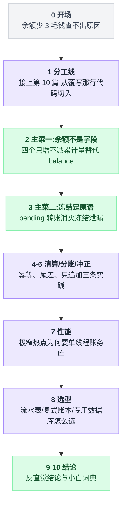
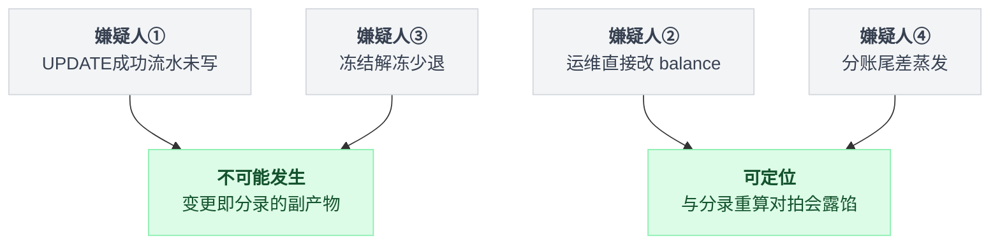
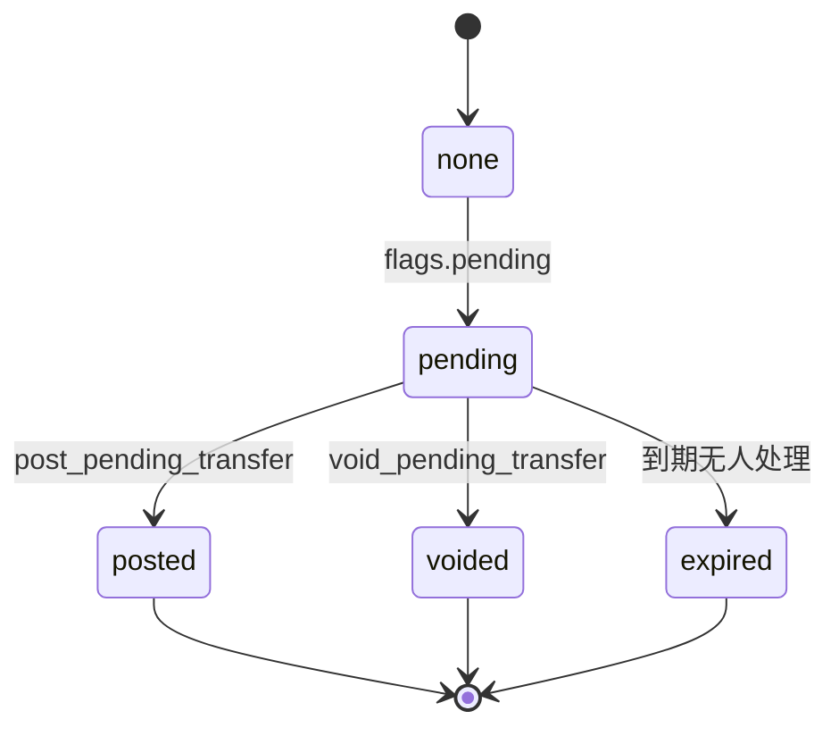
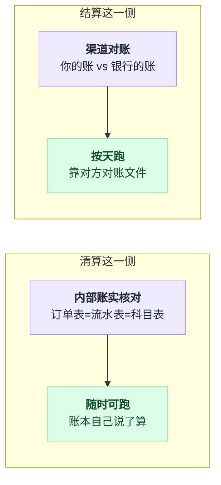
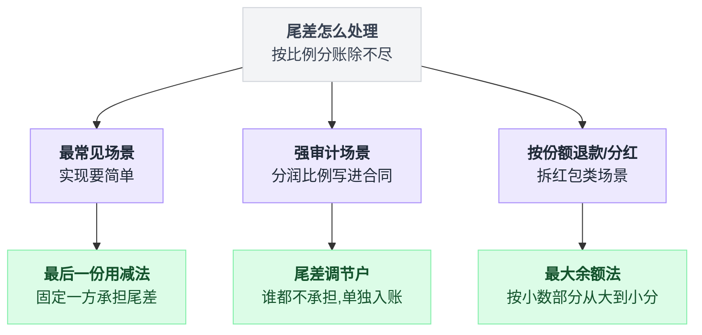
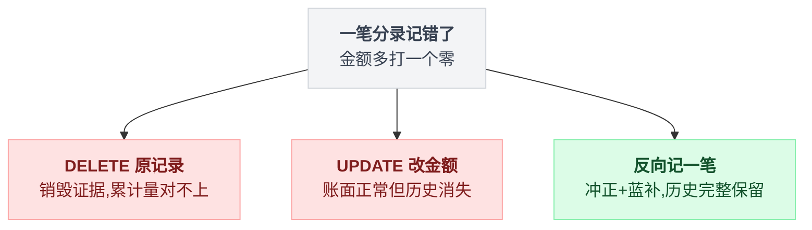
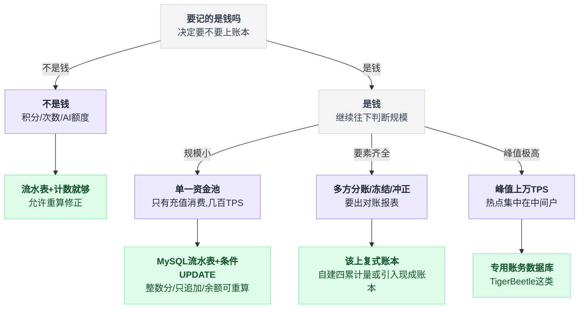
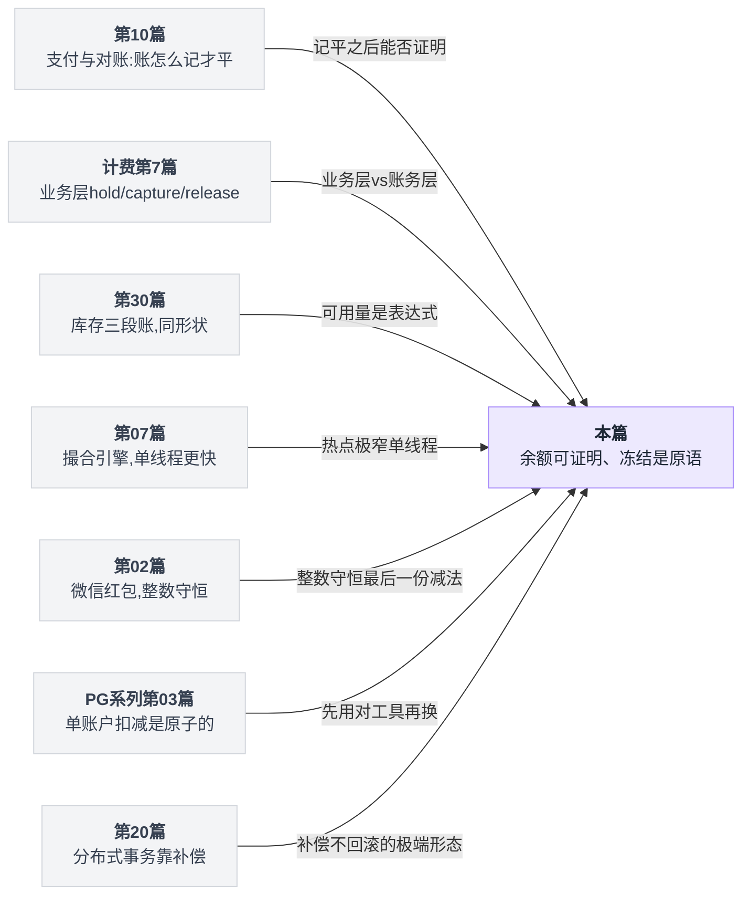

# 《账户体系与复式记账》余额那个数字，其实不该存在（小白版）

> 一句话结论：**正经账务系统里，余额既不是"存出来"的也不是"算出来"的——存的是四个只增不减的累计量，余额是它们的差。** TigerBeetle 的 Account 结构里压根没有 `balance` 字段，只有 `debits_posted` / `credits_posted` / `debits_pending` / `credits_pending`。用一个可变的 balance 字段做账，等于在系统上线第一天就主动放弃了对账能力。
>
> 还有第二条：**"冻结/解冻"不该用业务表加定时任务实现，它是账务层的原语**——冻结泄漏这种故障，只在"冻结是个业务字段"的架构里存在。
>
> 难度：★★★★★（本辑天花板）
>
> 写作时间：2026-08-05。文中 star 数与最后提交时间为当日实测；TigerBeetle / Formance 的结构与接口细节基于公开仓库源码，其余未经一手核实的说法在文中已就地标注。

**阅读前提**：本篇是[第 10 篇《支付与对账》](./10-支付与对账.md)的直接续集。

那篇的 10.3 节已经讲完了复式记账的**入门三件事**——借贷平衡、"一笔交易的所有分录之和必须为 0"、`SELECT SUM(balance_cent) FROM account` 必须等于 0，以及整数存钱、流水只追加。**本篇一律不复读这些**，第 1 节只用半页做一次一句话复习。

然后从第 10 篇代码里那一行 `UPDATE account SET balance_cent = balance_cent + %s` 开始往下拆：为什么工业级账本连这一行都不写。

分工线是——**第 10 篇讲"账怎么记才平"，本篇讲"账记平了之后，你还能不能证明它平"**。

---

## 目录

- [0. 开场：用户余额少了 3 毛钱](#0-开场用户余额少了-3-毛钱)
- [1. 分工线：第 10 篇讲到哪，本篇从哪开始](#1-分工线第-10-篇讲到哪本篇从哪开始)
- [2. 余额不该是一个字段（本篇主菜之一）](#2-余额不该是一个字段本篇主菜之一)
- [3. 冻结与解冻是账务原语（本篇主菜之二）](#3-冻结与解冻是账务原语本篇主菜之二)
- [4. 清算与结算：一字之差，一个同步一个异步](#4-清算与结算一字之差一个同步一个异步)
- [5. 分账：一笔支付拆给四个人，尾差归谁](#5-分账一笔支付拆给四个人尾差归谁)
- [6. 冲正与红冲：为什么不能 UPDATE](#6-冲正与红冲为什么不能-update)
- [7. 性能：为什么有人要用 Zig 重写一个数据库](#7-性能为什么有人要用-zig-重写一个数据库)
- [8. 选型：什么时候该上专用账本](#8-选型什么时候该上专用账本)
- [9. 反直觉结论](#9-反直觉结论)
- [10. 一句话总结、小白词典、和前几篇的对照](#10-一句话总结小白词典和前几篇的对照)

---

全文十节大致这样递进：



## 0. 开场：用户余额少了 3 毛钱

### 0.1 工单原文

客服转过来一句话，没有截图，没有复现步骤：**"用户 8123 说他余额少了 3 毛钱。"**

你打开数据库，`SELECT balance_cent FROM user_account WHERE user_id = 8123` 返回 `1237`。12.37 元，用户说应该是 12.67，差 30 分。

你去翻流水表，47 条记录，写个脚本把 `direction * amount_cent` 全加起来 = 1267。

```
  流水累加：1267    账户表余额：1237    差额：30   ← 用户是对的
```

好，确认了。**然后呢？**

### 0.2 三毛钱有四个嫌疑人，而你一个都指认不了

| 嫌疑人 | 它的故事 |
|---|---|
| ① | 某次扣费，UPDATE 成功了，INSERT 流水失败了 |
| ② | 三个月前那次数据修复，运维直接 `UPDATE user_account SET balance_cent = 1237 WHERE user_id = 8123` |
| ③ | 冻结解冻少退了：冻结 500 分，实扣 470 分，release 那步退了 470 |
| ④ | 某笔分账按 6% 算除不尽，尾差 30 分蒸发在一次 `round()` 里 |

四个嫌疑人。你手上有什么证据？`balance_cent = 1237` 这一个数字。

**这个数字什么都不肯说。** 它不知道自己是什么时候变成 1237 的，不知道上一次是多少，不知道是谁改的，更不知道自己"应该"是多少。

它只是一个被反复覆盖写的格子。

### 0.3 覆写销毁证据

这是本篇全部内容的起点，一张图讲完：

```
   ①  一个 balance 字段（覆写）        ②  只增不减的累计量（追加）
   第 1 次    │  1000  │              │1000│
   第 2 次    │  1500  │ ← 1000 没了   │1000│ 500│
   第 3 次    │  1237  │ ← 1500 也没了 │1000│ 500│-263│
   "第 2 次写入之后余额是多少？"
   ① 答不出来，格子被覆盖了。   ② 1500，而且任意时点都能算。
   "有没有人绕过流水直接改过这个数？"
   ① 答不出来，改完和正常写入一模一样。 ② 能查，累计量和流水对拍不上就是有人动过手。
```

第 10 篇 10.2 节其实已经用另一句话说过同一件事：**不信任"当前状态"，只信任"所有变更事件"。**

那篇的做法是"账户表存 balance，同时流水表带 `balance_after` 做校验"——这是一个折中：既保留了可变字段，又靠冗余的历史来兜底。

本篇要问的是：**既然真正可信的是历史，那个可变字段还要它干什么？**

### 0.4 本篇路线图

| 你遇到的症状 | 谁来解 | 第几节 |
|---|---|---|
| 余额对不上，但查不出是哪一笔坏的 | 四个只增不减的累计量替代 balance 字段 | 第 2 节（主菜一） |
| 冻结的钱没退回来，定时任务漏扫了 | 两阶段转账 + `expires_at` 派生索引 | 第 3 节（主菜二） |
| 渠道回调重复了，商户被打了两次款 | 强制幂等键 + 回传是否命中 | 第 4 节 |
| 四方分账除不尽，那几分钱去哪了 | 尾差三种处理法，最后一份用减法 | 第 5 节 |
| 记错了一笔，想 UPDATE 改回来 | 只能反向记一笔 | 第 6 节 |
| 峰值上万 TPS，全撞在同一个中间户上 | 单线程 + 批量 + 全内存 | 第 7 节 |
| 该自建还是该上开源账本 | 决策树 + 一条 star 陷阱 | 第 8 节 |

---

## 1. 分工线：第 10 篇讲到哪，本篇从哪开始

一句话复习[第 10 篇 10.3 节](./10-支付与对账.md)：**钱不会凭空产生也不会凭空消失，所以每笔交易至少记两条分录，一条记"从哪来"一条记"到哪去"，一笔交易所有分录的金额加起来必须等于 0；全系统所有账户余额之和也必须等于 0。**

外部资金入口挂一个虚拟账户（比如"支付宝备付金账户"），让它去背负数。这些内容那篇已经讲透，本篇不再展开一个字。

分工线画出来是这样：

```
     第 10 篇 10.3 节讲完的               本篇从这里开始
   ─────────────────────────          ─────────────────────────
    借贷平衡是什么              →      那为什么 TigerBeetle 连 balance 字段都不要
    分录之和必须为 0            →      四个只增不减的累计量怎么替代它
    整数存钱、流水只追加         →      冻结/解冻凭什么是账务层原语而不是业务表
    （那篇没讲）                →      清算 vs 结算、分账尾差、冲正红冲、专用账本选型
```

具体到代码。第 10 篇 `post_transaction()` 那段实现里有这么一行：`UPDATE account SET balance_cent = balance_cent + %s WHERE account_id = %s ...`。

**这一行就是本篇要拆掉的东西。** 它是一个覆写操作，而覆写操作销毁证据。

拆掉之后拿什么替代？TigerBeetle（Zig 写的专用账务数据库，16,728 star / 最后提交 2026-08-04，2026-08-05 实测）给了一个极端到近乎冒犯的答案：**它的 Account 结构里根本没有 `balance` 这个字段。**

下一节把它的结构摊开看。

---

## 2. 余额不该是一个字段（本篇主菜之一）

### 2.1 摊开 TigerBeetle 的 Account

`src/state_machine.zig` 里定义的 Account 是一个固定 128 字节的结构体。把和资金有关的部分挑出来：

```
   ┌──────────────────────────────────────────────────────────┐
   │  Account（128 字节）                                      │
   ├──────────────────────────────────────────────────────────┤
   │   id                                                     │
   │   debits_pending    ★   借方待定累计（已冻结，未落地）    │
   │   debits_posted     ★   借方已落地累计                   │
   │   credits_pending   ★   贷方待定累计                     │
   │   credits_posted    ★   贷方已落地累计                   │
   │   user_data_128/64/32  业务自定义    ledger  账簿号       │
   │   code  账户类型   flags  行为开关   timestamp  统一时间戳│
   ├──────────────────────────────────────────────────────────┤
   │  ✗ 没有 balance   ✗ 没有 frozen_balance   ✗ 没有 available│
   └──────────────────────────────────────────────────────────┘
```

那余额怎么来？**减出来。** 而且方向取决于这个账户是借方科目还是贷方科目：

```
   贷方账户（如"用户余额户"，在平台账上是一笔负债）
       可用余额 = credits_posted - debits_posted - debits_pending
                    收进来的       已付出去的      已冻结还没付的
   借方账户（如"平台备付金户"）
       可用余额 = debits_posted - credits_posted - credits_pending
```

注意 `- debits_pending` 那一项：**冻结的钱不从任何地方"扣掉"，它只是在计算可用余额时被减去。** 这一点第 3 节展开。

⚠️ 顺手记一个反直觉的点：为什么"用户余额"在平台账上是**负债**而不是资产？

因为那笔钱在法律上仍然是用户的，平台随时要还。所以用户充值 100 元，平台的资产（银行存款）+100，负债（应付用户款）也 +100，等式两边同增。

这就是为什么第 10 篇那张"平衡的账户体系"图里，用户余额账户是正数、备付金账户是负数——**符号方向不是随便定的，是会计恒等式定的**。

### 2.2 同一串交易，两种模型的落库结果

光看结构不够直观。拿三笔最普通的动作，逐帧对比。

场景：用户注册后充值 100 元 → 下单冻结 30 元 → 订单完成，实扣 30 元。

```
   模型①  balance + frozen 两个字段        模型②  四个只增不减的累计量
   ──────────────────────────────        ──────────────────────────────────
   帧1 充值 100                           credits_posted 10000  debits_posted 0
       balance = 10000  frozen = 0        debits_pending     0
                                          可用 = 10000-0-0 = 10000 ✓
   帧2 冻结 30                            credits_posted 10000  debits_posted 0
       balance = 7000 ← 覆写              debits_pending  3000 ← 只增
       frozen  = 3000 ← 覆写              可用 = 10000-0-3000 = 7000 ✓
   帧3 实扣 30                            credits_posted 10000
       balance = 7000                     debits_posted   3000 ← 只增
       frozen  = 0    ← 覆写              debits_pending     0 ← 待定转已定
                                          可用 = 10000-3000-0 = 7000 ✓
   ──────────────────────────────        ──────────────────────────────────
   剩下两个数，5 次覆写，                 四个数写了 3 次全是加法；
   5 个旧值全部蒸发                       那笔 pending transfer 仍完整躺在表里
```

**两个模型算出来的可用余额一模一样，都是 7000。** 差别在于：

| | 模型①（balance 字段） | 模型②（四个累计量） |
|---|---|---|
| 帧 3 时你知道什么 | 现在是 7000 | 现在是 7000，**而且**它是"进来 10000、出去 3000"来的 |
| 能回答"帧 2 时余额多少"吗 | 不能 | 能 |
| 有人手工改过数据能发现吗 | 不能 | 能（累计量必须单调不减，且必须与分录对拍） |
| 累计流入是多少 | 不知道 | `credits_posted` 直接就是 |

第三行是全篇最值钱的一句：**累计量是单调的，而单调量的任何一次非法修改都会留下痕迹。**

一个 balance 字段可以被改成任何值而不留任何异常；一个 `credits_posted` 字段被人改小了，它和 Transfer 流水的对拍立刻炸掉。

### 2.3 回到第 0 节的三毛钱

用模型②重新审一遍那四个嫌疑人：

```
   ① UPDATE 成了流水没写 → 不可能。累计量的变更就是分录本身的副产物，
                            不是第二次写入。
   ② 运维直接改了 balance → 会被抓到。按 Transfer 重算累计量与账户表对拍，
                            被改过的账户立刻跳出来，还能定位从哪个 ts 起开始偏。
   ③ 冻结解冻少退 30 分   → 不可能。post 一笔 pending 时 pending 部分整笔清零，
                            "退多少"不是应用算出来的（第 3 节）。
   ④ 分账尾差蒸发         → 会被抓到。分录之和不为 0 的交易写不进去（第 5 节）。
```

把四个嫌疑人按结果分类：



**两个变成不可能，两个变成可定位。**

这就是"可对账、可审计"的具体含义——不是多了一份报表，是多了一批**在结构上无法发生的故障**。

### 2.4 三样好处，逐个落到具体查询上

**（1）可重放：任意时点的余额**

```
   def 时点余额(账户, t):
       行 = 该账户累计量序列里 ts <= t 的最后一行     # 单调 → 二分直接命中
       return 行.credits_posted - 行.debits_posted
```

单调是这段代码成立的全部理由：**"截止某时点的累计值"良定义**，所以二分才有意义。

```
   ts      事件       credits_posted   debits_posted
   08-01   充值 100          10000              0
   08-03   消费 30           10000           3000
   08-07   充值 50           15000           3000
   08-09   消费 12           15000           4200
   问："8 月 5 日日终余额？" → 取 ts <= 08-05 的最后一行（08-03）
                              → 10000 - 3000 = 7000
   成立的全部理由是累计量单调："截止某时点的累计值"良定义，二分直接命中。
   存增量 → 得从头加一遍（O(n)）；存可变 balance → 连"截止某时点"这个概念都没有。
```

**（2）可对账：一个全局不变量，随时能跑**

第 10 篇给了两条 SQL（`SUM(balance)=0` 和"每笔交易分录之和为 0"）。四累计量模型下多出来第三条，而且更强：

```sql
-- 对拍：账户表上的累计量，必须等于从分录重算出来的累计量
SELECT a.id, a.debits_posted, SUM(t.amount) AS recomputed
  FROM account a LEFT JOIN transfer t
    ON t.debit_account_id = a.id AND t.status = 'posted'
 GROUP BY a.id, a.debits_posted
HAVING a.debits_posted <> COALESCE(SUM(t.amount), 0);
-- 必须返回空集。返回非空 = 有人绕过了记账路径动了数据
```

注意这条和第 10 篇那两条的分工：**那两条查的是"钱守恒了吗"，这一条查的是"状态和历史一致吗"。**

前者能抓住"记账逻辑写错了"，后者能抓住"有人从旁边捅进来了"。两类故障完全不同，两条校验缺一不可。

**（3）可审计：能回答"为什么"**

审计要的从来不是"余额是多少"，是"这个余额是怎么来的"。四个累计量本身就是四个业务口径的答案：

| 这个数 | 谁在要它 |
|---|---|
| `credits_posted` | 财务：累计收入 |
| `debits_posted` | 财务：累计支出 |
| `debits_pending` | 风控：在途敞口 |
| 它们的差 | 只有前端要的那个显示值 |

**用户看到的那个数，是四个数里最不重要的一个。**

用一个 balance 字段做账，等于把四拨人要的东西压成了一个数，然后指望他们各自从流水里再刨回去。

### 2.5 代价：读放大，以及它怎么被抵消

要诚实。这个模型不是白拿的。

```
   廉价  读当前余额 = 四个字段两次减法，和读一个 balance 字段没差别。
   昂贵  读历史余额、出日终报表、做时点对账。一个活跃三年的商户账户
         可能有几百万条分录，"算出 6 月 30 日 24:00 的余额" = 扫到那个时点为止。
         月末结账日几十万个账户同时要这个数 —— 集中爆发式的读放大。
   解法  快照 + 增量。每日 00:00 为每个账户 INSERT 一行 snapshot
         (account_id, biz_date, debits_posted, credits_posted, last_ts)
         查 08-15 日终  → 直接命中那行快照，O(1)
         查 08-15 14:30 → 快照 + 当天到 14:30 的增量，只扫一天的量
         ★ 快照本身也只 INSERT 不 UPDATE，所以快照错了也能被重算打脸
```

写成代码就两行分支：

```
   def 带快照的时点余额(账户, t):
       s = 该账户 biz_date <= t 的最近一行 snapshot      # O(1)
       if t 正好是日终:  return s.credits_posted - s.debits_posted
       return (s.credits_posted - s.debits_posted)
              + 从 s.last_ts 到 t 之间那些分录的增量      # 最多扫一天
```

读放大没有消失，只是被压回了"一天的量"。

TigerBeetle 自己也提供了这条路：账户可以打开一个"记录余额历史"的开关，之后可以查询该账户的历史余额序列（该 flag 与查询接口的具体命名以官方文档为准）。

💡 这里和[第 18 篇《排行榜与计数系统》](./18-排行榜与计数系统.md)是同一道题的两个答案。

那篇的计数器可以直接存一个数，因为**计数错了重算一遍就行，没人会因为点赞数少了 3 个开工单**。账务不行，账务的每一分钱都要能追溯到出处，所以宁可承担读放大也要保住历史。

**同样是"存结果还是存过程"，判据是错误的代价，不是性能。**

### 2.6 第二个独立佐证：Formance 把 volumes 和 balances 分成了两个 endpoint

TigerBeetle 一家这么干，可能是它自己的偏好。再看一个技术栈完全不同的项目：formancehq/ledger（Go，1,329 star / 最后提交 2026-08-05，2026-08-05 实测），面向企业分账清结算的开源账本。

它的 `openapi.yaml` 里，账户数据的读取被拆成了泾渭分明的两类：

```
   ┌─ volumes ─────────────────────────────────┐
   │  每账户每资产的 input / output 两个累计值   │ ← 「事实」，只增不减
   └───────────────────┬───────────────────────┘
                       │  balance = input - output
   ┌─ balances ────────▼───────────────────────┐
   │  getBalances            单账户/按维度的余额 │ ← 「视图」
   │  getBalancesAggregated  按表达式聚合的余额  │
   └───────────────────────────────────────────┘
```

**两个独立的接口，就是在 API 契约上宣告：balance 是从 volumes 派生的，不是一等公民。**

而且 `getBalancesAggregated` 的存在还多说了一句——余额不但是算出来的，还可以按任意维度重新算（按 asset 聚、按账户前缀聚、按元数据聚）。一个存死的 balance 字段做不到这件事，因为它只有一种聚合口径：它自己。

**两个技术栈毫无关系的项目，独立做出了同一个选择**——这比任何一家自己的设计说明都更有说服力。

---

## 3. 冻结与解冻是账务原语（本篇主菜之二）

### 3.1 你现在多半是这么做冻结的

```
   users 表加一列 frozen_balance
     冻结  balance -= X;  frozen_balance += X;  INSERT freeze_record(...)
     捕获  frozen_balance -= X;  balance += (X - 实扣);  UPDATE 状态 = captured
     释放  frozen_balance -= X;  balance += X;           UPDATE 状态 = released
   ＋ 一个定时任务，每分钟扫 freeze_record，把超过 N 分钟还没结论的自动释放
```

这套写法本身没错，[计费系列第 7 篇《批量生图的预冻结三段式》](../2026-07_一分钱都不能丢_高并发计费系统解剖/7_实战案例四_批量生图的预冻结三段式.md)把它拆得很细：hold → capture → release 三段、固定单号保幂等、以及整整一节（7.7）在讲**冻结泄漏**——钱被冻住了但那个 capture/release 永远没来，用户的余额就这么被吊着，那一节给出了三层防线来防它。

现在换个角度问：**为什么会有"冻结泄漏"这种故障？**

因为在上面这套结构里，`frozen_balance` 里的钱**没有归属**。它既不属于付方也不属于收方，它属于一个叫"冻结"的中间态，而这个中间态的推进完全依赖应用代码去调用 capture 或 release。应用代码不调用，它就永远吊着。

定时任务是给这个结构打的补丁——**而补丁本身也可能挂，也可能漏扫，也可能因为一次发版停跑两小时。**

### 3.2 TigerBeetle 的做法：冻结是一笔转账，不是一个字段

在 TigerBeetle 里，Transfer 也是固定 128 字节的结构，关键字段：

```
   Transfer（128 字节）
     id / debit_account_id / credit_account_id / amount（整数，无小数）
     pending_id  ★  指向被 post/void 的那笔 pending
     timeout     ★  超时秒数（字段名以官方文档为准）
     flags       ★  pending / post_pending_transfer / void_pending_transfer / …
     ledger / code / user_data_* / timestamp
```

冻结的全过程：

```
   ① 冻结 30 元   Transfer{ flags.pending, amount = 3000, timeout = 900 }
        付方 debits_pending += 3000    收方 credits_pending += 3000
        派生索引 expires_at = timestamp + timeout      ← 关键，见 3.4
        ★ debits_posted / credits_posted 纹丝不动：钱没被扣走，只是被占住了
   ② 二选一，且只能选一次
     ②a 捕获（实扣 28 元）Transfer{ flags.post_pending_transfer,
                                   pending_id = T1, amount = 2800 }
          付方 debits_pending -= 3000 ← 整笔清零，不是减 2800
               debits_posted  += 2800
          收方 credits_pending -= 3000 / credits_posted += 2800
          差额 200 分自动回到可用余额，不需要应用算一遍
     ②b 作废  Transfer{ flags.void_pending_transfer, pending_id = T1 }
          付方 debits_pending -= 3000   收方 credits_pending -= 3000
          （posted 两项完全没动过，等于什么都没发生）
   ③ 900 秒后 ②a ②b 都没来
        → 状态机自己把 T1 置为 expired，效果等同于 ②b，零应用代码参与
```

②a 那一步是全节的机关，单独写成伪代码看得更清楚：

```
   on post_pending(pending_id = T, amount = a):    # a 可以小于 T.amount
       付方.debits_pending  -= T.amount            # 整笔清零，而不是减 a
       付方.debits_posted   += a
       收方.credits_pending -= T.amount
       收方.credits_posted  += a
       # 差额 T.amount - a 不需要任何人去"退"：
       # 它从来没被扣走过，只是不再出现在可用余额的减项里
```

对照 3.1 那套写法，看第 ②a 步的差别：

```
   业务表写法                        账务原语写法
   ────────────────                 ────────────────
   frozen_balance -= 3000           debits_pending -= 3000
   balance += (3000 - 2800)         debits_posted  += 2800
        ↑                                ↑
   "退多少"是应用算出来的            "退多少"是状态机的必然结果
   算错了 = 第 0 节的嫌疑人③         算错的可能性不存在
```

### 3.3 状态机：三个终态，天然幂等

`TransferPendingStatus` 这个枚举把整件事收束成五个值：

```
   TransferPendingStatus
     none ─────▶ 普通转账，直接落地，与 pending 无关
       │ flags.pending
       ▼           post_pending_transfer     ┌────────┐
   ┌────────┐ ──────────────────────────────▶│ posted │ 终态
   │pending │      void_pending_transfer     ├────────┤
   └───┬─┬──┘ ─────────────────────────────▶ │ voided │ 终态
       │ │        到达 expires_at（无人干预） ├────────┤
       │ └──────────────────────────────────▶│ expired│ 终态
       │                                     └────────┘
   三个终态一旦到达不可再迁移。重复 post 同一笔 pending → 被拒
   （返回明确错误码，不是静默成功，更不是重复扣款）。
```

三个终态画成状态机：



**这就是幂等，而且是结构上的幂等，不是靠一张幂等表拦出来的。**

第 10 篇讲幂等表、计费系列讲固定单号，那些是在业务层重建这个保证；这里它是数据模型的直接推论：一个已经 posted 的 pending transfer，从定义上就不可能再被 post 一次。

### 3.4 `expires_at`：让超时由存储层驱动

这是本节最值得单独拎出来的一条。

`expires_at` 不是用户写进去的字段——用户写的是 `timeout`（相对秒数），`expires_at = timestamp + timeout` 是**派生**出来的，并且被建成了一个二级索引（在 TigerBeetle 的 LSM 存储结构里，每类对象及其索引组成一个 groove）。

有了这个索引之后，状态机每次推进时间只做一件事：

```
   每次时间推进到 now:
       for t in 按 expires_at 索引取(expires_at <= now 且仍 pending):
           t 置为 expired
           付方.debits_pending  -= t.amount
           收方.credits_pending -= t.amount        # 批量归位
```

```
   状态机每次推进时间，做一件事：
     按 expires_at 索引取出所有 expires_at <= now 且仍 pending 的转账，
     批量置为 expired，对应账户的 *_pending 累计量批量归位。
   这是「索引范围扫描」，不是「全表扫描找过期的」——
   代价与「过期了多少笔」成正比，与「一共有多少笔」无关。
```

和业务表加定时任务对比：

| | 业务表 + 定时任务 | 账务层原语 |
|---|---|---|
| 超时怎么发现 | 应用每分钟扫 `freeze_record` | 存储层按 `expires_at` 索引取 |
| 扫描代价 | 与冻结单总量相关（要加索引、要分页） | 与到期数量相关 |
| 定时任务停了会怎样 | **钱一直冻着**，就是冻结泄漏 | 不适用，没有定时任务 |
| 扫到了但处理失败 | 下一轮重试，中间用户看到的余额是错的 | 状态迁移和余额计算是同一次原子操作 |
| 幂等 | 自己写（固定单号 + 状态 CAS） | 终态不可迁移，天然幂等 |
| 崩溃恢复 | 任务重启后补扫，可能重复处理 | 复制状态机重放，结果确定 |
| 你要写多少代码 | 一张表 + 三个方法 + 一个 job + 一套告警 | 一个 `timeout` 字段 |

最后一行是重点：**这不是"账务数据库比较高级"，是同一件事被挪到了正确的层。**

超时判定本质上是一个"按时间范围取数据"的问题，而按范围取数据正是存储层最擅长的事。放在应用层做，你就得自己重新发明索引、分页、重试和幂等。

💡 这条和[第 03 篇《延迟任务与时间轮》](./03-延迟任务与时间轮.md)的关系值得说清楚。

第 03 篇解决的是"到点了要**主动做一件事**"（发短信、关订单）——那必须有一个真的会响的闹钟。而这里的"过期"不需要主动做任何事，**它只需要在被读的时候是对的**。

凡是"过期只影响读结果、不触发副作用"的场景，都不需要闹钟，只需要一个带时间的索引。第 30 篇的软预留也是这个判据（下面 3.6 节），三篇合起来就是一条完整的判定规则。

### 3.5 跨篇对照①：计费系列第 7 篇，同一个问题的两个位置

| | [计费第 7 篇](../2026-07_一分钱都不能丢_高并发计费系统解剖/7_实战案例四_批量生图的预冻结三段式.md)（业务层） | TigerBeetle（账务层） |
|---|---|---|
| 冻结存在哪 | `users.frozen_balance` 字段 + 冻结单表 | 一笔带 `flags.pending` 的 Transfer |
| 三段叫什么 | hold / capture / release | pending / post_pending / void_pending |
| 谁推进状态 | 应用代码 | 应用代码或状态机（超时） |
| 超时靠什么 | 定时任务扫冻结单 | `expires_at` 派生索引 |
| 幂等靠什么 | 固定单号 + 状态 CAS（第 7.6 节） | 终态不可迁移 |
| 冻结泄漏 | **整整一节（7.7）在讲三层防线** | 该故障类型不存在 |
| 差额退回 | 应用算 `X - 实扣` 再写回 balance | 状态机自动，应用不参与 |

看起来是账务层全赢。但要说句公道话：**计费第 7 篇的那套写法在它的场景里是对的选择**。

那个系统的资金模型是单一资金池、一种货币、没有多方分账，为了一个 hold/capture/release 去引入一个专用账务数据库，运维成本远大于收益（判据见第 8 节）。

所以这里要带走的不是"你该换 TigerBeetle"，而是：**当你在业务层写冻结时，你要知道自己在手工重建一套账务原语，因此第 7.7 节那三层防线是必选项，不是可选项。**

### 3.6 跨篇对照②：库存的三段账是同一个形状

这个对照是本篇最漂亮的一处。[第 30 篇《购物车与库存三段账》](./30-购物车与库存三段账.md)拆的是 Saleor 的库存模型，完全独立的领域、完全不同的代码库，结论撞了个正着：

```
        库存（第 30 篇）                    账务（本篇）
   ─────────────────────────         ─────────────────────────
    Stock.quantity  总量，只随入库增   credits_posted   累计流入，只增
    Allocation 明细表  已占用          debits_posted    累计流出，已落地
    Reservation 表  软预留             debits_pending   已冻结
      带 reserved_until                  带 expires_at
      过期行不删也不影响正确性            到期由状态机置 expired
   ─────────────────────────         ─────────────────────────
    可售量 = 一个查询表达式            可用余额 = 四个数的差
    annotate_available_quantity()      credits_posted
      = quantity                         - debits_posted
        - SUM(未完成的 Allocation)        - debits_pending
        - SUM(未过期的 Reservation)
```

两个领域各自独立演化，得出了同一条结论，而且是同一句话：

> **"可用量"不是一个字段，是一个表达式；"释放"不是一个动作，是一次过期。**

第 30 篇 3.2 节给的判据是"这个到期事件需要触发副作用吗？不需要就不用闹钟"，本篇 3.4 节的判据一模一样——**两篇独立到达同一个结论，这件事本身就是这个结论足够可靠的证据。**

⚠️ 但有一处不能类比：库存过期行"不删也不影响正确性"，是因为读侧过滤掉了它们；账务的 `debits_pending` 是一个累计量，**必须真的被状态机减掉**，否则可用余额算出来永远偏小。

所以库存可以完全躺平等着读侧过滤，账务不行——这也是为什么 TigerBeetle 要把 `expires_at` 做成状态机主动推进的索引，而不是一个读时过滤条件。

---

## 4. 清算与结算：一字之差，一个同步一个异步

### 4.1 两个词的分界线

中文这两个词长得太像，很多团队内部沟通时混着用，然后在事故复盘会上发现大家说的根本不是一件事。

| | 清算 clearing | 结算 settlement |
|---|---|---|
| 在做什么 | 算清楚「谁欠谁多少」，记账动作 | 钱真的从一个法人账户挪到另一个，资金动作 |
| 时效 | 同步，毫秒级 | 异步，T+1 / T+N |
| 谁说了算 | 在你的账本里发生，你说了算 | 在银行/支付渠道那边发生，银行说了算 |
| 失败了是什么 | 事务回滚 | 一张需要人处理的失败单 |

一条真实的时间轴：

```
   10:23:01.418  账本记 3 条分录：用户 -10000 / 商户 +9400 / 平台 +600
                 ▲ 清算完成。用户余额、商户余额此刻已经全部正确
   10:23:01.903  App 显示「支付成功」
        ⋮        （中间隔了 12 小时和一个你控制不了的外部系统）
   次日 02:00    平台向银行发起批量代付，1 万 7 千笔
   次日 11:40    银行回单：16,997 笔成功，3 笔失败（收款账户已销户）
                 ▲ 结算完成（部分失败）
   次日 11:41    对这 3 笔在账本上记反向分录，商户余额退回
```

**这条时间轴里最容易被误解的一点：10:23 那一刻商户账上确实多了 94 元，但商户的银行卡里一分钱都没多。**

账本上的"商户余额"是一个负债科目——平台欠商户 94 元。它变成商户银行卡里的钱，要等次日 02:00 那批代付。

所以第 10 篇讲的三层对账在这里对上号了：**内部账实核对（订单表 = 资金流水表 = 会计科目表）属于清算这一侧，随时可跑；渠道对账（你的账 = 银行的账）属于结算那一侧，按天跑、靠对方的对账文件。**

两者查的不是同一批数据，也抓不到同一类问题。两侧各自的核对方式并排画出来更清楚：



### 4.2 所以账本必须幂等，而且必须说出"这次是重放"

结算是异步的，异步意味着**重复是常态而不是异常**：渠道回调重发（对方超时了但其实成功了）、批量代付文件被重新上传、运营在后台点了两次"重新结算"、你自己的重试逻辑。

Formance 的做法是把幂等提到 API 契约层：**请求带 `Idempotency-Key` 头，如果这个 key 之前用过，直接返回上次的结果，并在响应里带一个 `Idempotency-Hit` 头告诉你"这次是重放"。**

```
   on 请求(key, 内容):
       旧 = 幂等表.get(key)
       if 旧:
           return 旧.结果, 头 Idempotency-Hit: true     # ★ 第二半在这里
       结果 = 记一笔账(内容)
       幂等表[key] = 结果
       return 结果
```

第二半才是重点。对比一下：

```
   只保证幂等                          幂等 + 回传命中
   ─────────────────────────         ─────────────────────────
   请求 Idempotency-Key: K-77        请求 Idempotency-Key: K-77
   响应 200 OK {"id":4821}           响应 200 OK  Idempotency-Hit: true
                                          {"id":4821}
   调用方不知道这是首次还是重放       调用方明确知道：这次是补发的
   → 照常发「已到账」推送             → 不再发推送
   → 照常记运营流水                   → 不再触发风控
   → 照常触发风控评分                 → 只更新自己这边的「已确认」标记
   重放 3 次 = 商户收到 3 条推送
```

**幂等保证的是"账不会被重复记"，`Idempotency-Hit` 保证的是"副作用不会被重复触发"。**

前者是账本的责任，后者是调用方的责任，而调用方要尽这个责任，必须由账本告诉它真相。只回 200 不说明来路的幂等接口，只做了一半。

💡 顺带划清一个常被混淆的边界：幂等键防的是**先后两次**（第一次已经写完了，第二次带着同一个 key 来），它防不了**同时两次**（两个请求携带同一个 key 在同一毫秒到达，都查不到已有记录，都往下走）。

后者要靠数据库唯一约束兜底，或者在进程内做请求合并——[计费系列 singleflight 番外](../2026-07_一分钱都不能丢_高并发计费系统解剖/17_番外_singleflight入门教程.md)讲的就是后一种手艺。

**唯一约束是最后防线，singleflight 是省掉无谓开销的优化，两者都不能替代对方。**

### 4.3 exporters / pipelines：账本永远不主动发钱

Formance 的另一组能力叫 exporters 和 pipelines：把账本里那条不可变的分录流，持续导出到外部系统去（消息队列、数仓、下游服务）。这个设计背后是一条硬架构原则：

```
   ┌──────────┐  写分录  ┌──────────────┐ pipeline ┌────────────┐
   │ 业务系统  │ ───────▶│    账本       │ ────────▶│  代付网关   │
   └──────────┘  只追加  │ 只记不可变分录 │   导出   │  真的发钱   │
                         └──────────────┘          └──────┬─────┘
                                 ▲   再记一笔分录          │ 银行回单
                                 └───────────────────────┘
                                  （成功记确认，失败记冲正）
   注意箭头方向：账本只被写，从不主动调用外部。
```

为什么必须这样？因为**账本一旦有了"发钱"这个能力，它就有了失败**。而账本的核心价值就是"写进去的东西永远不会变"。

一个会调外部 HTTP 的账本，迟早要面对"分录写了但钱没发出去，要不要回滚这条分录"这个问题——而正确答案永远是"不回滚，再记一笔"（第 6 节）。既然如此，不如从一开始就把发钱这件事挪出去。

这也是 [第 20 篇《分布式事务的真相》](./20-分布式事务的真相.md)那套逻辑在资金领域的具体形态：**跨系统的一致性不靠回滚，靠补偿。**

账本天生只支持补偿（追加反向分录），不支持回滚（删改历史）——它在数据模型层面就把错误的那条路堵死了。

---

## 5. 分账：一笔支付拆给四个人，尾差归谁

### 5.1 干净的那一天

用户付 100 元，平台技术服务费 6%，渠道手续费 0.6%，推广分佣 3%，剩下归商家。

```
   订单金额 10000 分            分录（五条，加起来为 0）：
     平台技术服务费 6.0%  →  600     用户余额户    -10000
     渠道手续费     0.6%  →   60     平台收入户      +600
     推广分佣       3.0%  →  300     渠道手续费户     +60
     商家实收             → 9040     推广账户        +300
     ─────────────────────────       商家待结算户   +9040
                合计 = 10000 ✓       ─────────────────────
                                     合计              0 ✓
```

漂亮。然后来了个 88.88 元的订单。

### 5.2 尾差是怎么冒出来的

```
   订单金额 8888 分
     8888 × 6.0%  = 533.28   → 533        8888 × 3.0%  = 266.64   → 267
     8888 × 0.6%  =  53.328  →  53        8888 × 90.4% = 8034.75  → 8035
     ─────────────────────────────────────────────────────────────────
     四份合计 = 533 + 53 + 267 + 8035 = 8888   ✓ 这次凑巧对上了
   问题在于它「对」是巧合。四份各自独立地乘一次、再各自 round 一次，
   总和落在 8887 / 8888 / 8889 都有可能——没有任何东西约束它。
   而"分录之和必须为 0"是硬约束，差一分钱这笔账根本写不进去。
```

**根子在于：只要有两份或以上是各自独立乘出来的，总和就不受任何约束。**

### 5.3 三种尾差处理法

| 做法 | 规则 | 谁承担尾差 | 适用场景 |
|---|---|---|---|
| **最后一份用减法** | 前 N-1 份按规则取整，最后一份 = 总额 - 已分 | 固定由某一方（通常是商家或平台） | 最常见，实现最简单 |
| **尾差调节户** | 每份都独立取整，差额记进一个专门的"尾差调节"账户 | 谁都不承担，账上多一个户 | 强审计场景、各方分润比例都写进合同的场景 |
| **最大余额法** | 先全部地板除，剩下的 N 分钱按小数部分从大到小依次分配 | 按"谁更接近多一分"分配 | 按份额退款、分红、拆红包 |

三种做法怎么选，画成判定：



**唯一不可以做的：让分录之和不等于总额。**

尾差可以给任何人，可以进调节户，可以按公平性分配，但不能蒸发——一旦蒸发，第 10 篇那条 `SUM(balance) = 0` 就炸了，而它是整个资金系统最后的健康检查。

代码上就一个要点：

```python
def split(total_cent: int, rates: list[Fraction]) -> list[int]:
    """rates 是前 N-1 方的比例，最后一方拿剩下的"""
    parts = [total_cent * r.numerator // r.denominator   # ★ 整数先乘后除，地板取整
             for r in rates]
    parts.append(total_cent - sum(parts))                # ★ 最后一份用减法
    assert sum(parts) == total_cent                      # ★ 恒成立，不是碰运气
    return parts
split(8888, [Fraction(6,100), Fraction(6,1000), Fraction(3,100)])
# → [533, 53, 266, 8036]      533+53+266+8036 = 8888
```

三个细节，每一个都能单独制造一个线上事故：

1. **`total * num // den` 而不是 `int(total * 0.06)`**。后者走浮点，而浮点在金额上会给你惊喜——[第 02 篇《微信红包》](./02-微信红包.md)专门拆过这件事：`0.1 + 0.2 != 0.3` 不是段子，是每年都有人踩的坑。全程整数分（或整数厘），一次浮点都不要出现。
2. **最后一份用减法**。这一行就是"金额守恒"的全部实现。
3. **`assert` 留在生产代码里**。这不是调试代码，这是账本的守门员。宁可抛异常让这笔单子失败，也不要写进一笔不平的账。

💡 和第 02 篇的对照很有意思：**红包是"随机拆但总和必须守恒"，分账是"按比例拆但总和必须守恒"。**

两道题的解法是同一句——**先把总额钉死，最后一份用减法算出来。** 第 02 篇的二倍均值法在每一步都要保证"剩下的还够分"，本篇的分账在每一步都要保证"加起来还等于总额"，本质上是同一个不变量的两种表述。

### 5.4 退款时分账怎么退

这才是分账真正难的地方——用户退了 50 元（部分退款），四方各退多少？

| 情形 | 平台服务费 | 渠道手续费 | 推广分佣 | 商家 |
|---|---|---|---|---|
| 全额退款 | 全退 | **通常不退**（渠道已经收了） | 视合同，多数全退 | 全退 |
| 部分退款 | 按退款比例退 | 通常不退 | 按比例退 | 差额兜底 |
| 退款后再分账 | 对剩余部分重算 | 已发生的不动 | 重算 | 差额兜底 |

看第二列：**渠道手续费不退，意味着退款时四方的钱加起来比原来少一块。**

那少的这块只能从某一方出——通常是平台或商家承担。这笔"承担"必须是一条**明确的分录**，而不是靠"退款金额稍微少算一点"糊过去：

```
   原分账  用户 -10000  平台 +600  渠道 +60  推广 +300  商家 +9040
   退 50 元（渠道费不退，平台承担）：
       用户 +5000   平台 -300   渠道 0   推广 -150   商家 -4520
       平台  -30    ← ★ 平台额外承担的那部分渠道费，单独一条分录
       ──────────────────────────────────────────────────
       合计    0 ✓    把它并进"平台 -330"账也是平的，但半年后
                      财务问起来，没人答得出那 30 分是什么。
```

**分录的价值不只是让账平，是让账"能被解释"。**

能合并的分录不要随便合并——多一条分录的存储成本，远低于一次说不清楚的成本。

---

## 6. 冲正与红冲：为什么不能 UPDATE

### 6.1 三个冲动，两个是错的

一笔分录记错了：金额应该是 10 元，记成了 100 元，已经落库了。

```
   ① DELETE FROM entries WHERE id = 4821
      → 审计上等于销毁证据。账户上的累计量也不会自己变回去，对拍立刻炸。
   ② UPDATE entries SET amount = 1000 WHERE id = 4821
      → 同上，而且更隐蔽：账面一切正常，但"这笔当初记的是 100"这个事实
        永远消失了。对方已经按 100 出过对账单的话，死结。
   ③ 再记一笔方向相反的                          ← 唯一正确
```

三个冲动画成一张图，两错一对：



### 6.2 正确的做法长这样

```
   时间 ──────────────────────────────────────────▶
   T1  14:02  用户 -10000  商家 +10000   （错的，多记了一个零）
   T2  16:47  用户 +10000  商家 -10000   （冲正：T1 的镜像，reverts_id = T1）
   T3  16:47  用户  -1000  商家  +1000   （蓝补：重记一笔正确的）
   ──────────────────────────────────────────────
   净效果 = 用户 -1000 ✓
   账面留下三笔，谁在什么时候改的、改之前是什么样，一目了然。
   14:02 到 16:47 之间打印的任何一份对账单，都能在账本里被完整复现。
```

最后那句是关键。如果用 UPDATE 改了 T1，15:30 打印的那份对账单就和账本永远对不上了，而**你没有任何办法证明当时那份是对的还是错的**。

追加式的冲正保住了这个能力。

### 6.3 中文语境里的四个词，一次分清

| 词 | 英文 | 含义 | 用在什么时候 |
|---|---|---|---|
| **冲正** | reversal | 把一笔错账整笔反向抵消 | 通用说法，覆盖下面几种 |
| **红冲** | —— | 会计术语，用红字（负数）记一笔冲销原凭证 | 通常指同一会计期间内的冲销 |
| **蓝补** | —— | 红冲之后再用蓝字补记正确的那一笔 | 就是上图的 T3 |
| **调账** | adjustment | 不冲原分录，直接记一笔差额 | 少用——账是平了，但因果关系丢了 |

**"红冲蓝补"是一个词组，说的就是上图 T2 + T3 这一对动作**——只做 T2 叫冲销，T2 + T3 才叫红冲蓝补。

最后一行的"调账"值得单独提一句：直接记一笔 `用户 +9000` 也能把账调平，一条分录搞定比两条省事，但半年后有人问"这 9000 是什么"，答案只能是"当初记错了"——**记错了多少、原来是多少、什么时候错的，全都不在账上**。

红冲蓝补两条分录多花的那点存储，买的就是这三个问题的答案。

### 6.4 Formance 的 reversals，以及一个设计题

Formance 提供了 revert 一笔已有 transaction 的能力：生成一笔方向完全相反的新 transaction，并在原 transaction 上留下"已被冲正"的标记。

这个标记不是装饰，它挡的是一个非常真实的事故：

```
   如果允许同一笔被冲正两次：
      T1  用户 -10000  商家 +10000
      T2  用户 +10000  商家 -10000   （冲正 T1）
      T3  用户 +10000  商家 -10000   （又冲正了一次 T1）
      ───────────────────────────────
      净效果 = 用户 +10000，钱凭空多出来一万分。
      而且每一笔单独看都是平的 —— SUM = 0 这条校验抓不住它。
```

所以约束必须写在账本里，长这样：

```
   on revert(tx):
       if tx.已被冲正:  拒绝            # 硬约束，不指望调用方自觉
       新单 = 生成一笔与 tx 方向完全相反的 transaction
       tx.已被冲正 = true
       return 新单                      # 新单自己也是一笔正常 transaction
```

"一笔 transaction 最多只能被冲正一次"必须是账本层面的硬约束，不能指望调用方自觉。

这在实现上就是幂等的另一种形态：**幂等键防的是同一个请求重复提交，冲正标记防的是同一个目标被重复冲正。**

顺带一个设计题：**冲正的冲正，允许吗？** 也就是"我不该冲的，冲错了"。

业界通行的做法是——不提供"取消冲正"这种操作，而是对冲正单本身再记一笔反向分录（它自己就是一笔正常的 transaction，当然可以被冲正）。这样历史上留下四笔，而不是"某一笔被撤销了"。

**账本永远只增长，这一条没有例外。**

### 6.5 这一节和第 2 节其实是同一条原则

```
   余额不该是一个字段  ┐
                      ├──▶  只增不减  ──▶  历史完整  ──▶  可审计
   修正只能反向记一笔  ┘
```

**第 2 节说的是"状态不要覆写"，第 6 节说的是"历史不要覆写"，同一条原则在两个位置的应用。**

第 10 篇 10.2 节那句"不信任当前状态，只信任所有变更事件"说的也是这个；[第 07 篇《股票撮合引擎》](./07-股票撮合引擎.md)的事件溯源说的还是这个。

一个系统只要认真执行"只追加"，很多故障类型会自己消失——不是被防住了，是在结构上无法发生。

---

## 7. 性能：为什么有人要用 Zig 重写一个数据库

### 7.1 账务负载的画像，和普通 OLTP 完全不一样

| | 普通 OLTP（电商、社交、内容） | 账务 |
|---|---|---|
| 读写比 | 读多写少（读写比常见 10:1 以上） | 以写为主，读可以走从库/快照 |
| 热点 | 热点分散（几百万个商品/用户） | ★ 极窄热点（几十个中间户） |
| 一致性 | 可以最终一致 | 必须严格串行 + 强一致 |
| 丢数据 | 丢一条日志无所谓 | ★ 一条都不能丢 |
| 行大小 | 行数据大（几百字节到几 KB） | ★ 行数据极小（128 字节） |
| 查询 | 查询形态多变，需要 SQL | 查询形态固定，不需要 SQL |

三条星号里最要命的是"极窄热点"这一条。

### 7.2 极窄热点：所有并发都撞在同一行上

一笔支付涉及三到五个账户，其中用户账户是分散的，但**中间户是集中的**：

```
              10 万笔/秒的支付请求
        │      │      │      │      │
        ▼      ▼      ▼      ▼      ▼
     用户账户    ← 分散在几千万行上，无所谓
        ▼      ▼      ▼      ▼      ▼
   ┌────────────────────────────────────────┐
   │  平台备付金户（一行）  渠道清算户（一行）│ ← 10 万 TPS 全撞这几行
   │  平台收入户（一行）                      │
   └────────────────────────────────────────┘
   在通用数据库里，这一行会经历什么？
   BEGIN                （一次网络往返）
   UPDATE 备付金户 ...   （一次往返，此刻拿到行锁）
   INSERT 分录 × 3       （若干次往返，锁一直握着）
   COMMIT               （一次往返 + 一次 WAL fsync）→ 锁释放
   ─ 算笔账（量级估算，非 benchmark）───────────────────────
     单行吞吐上限 ≈ 1 / 锁持有时间
     锁持有时间   ≈ 事务内剩余语句的往返 + 提交 ≈ 0.5 ms（同机房、乐观）
     → 这一行的上限 ≈ 2000 TPS
     真实数字取决于部署形态。重点是这个上限的「形状」：
     它由「锁握了多久」决定，不由「你有多少 CPU」决定。
```

**加机器、加 CPU、加内存，对这个上限没有任何帮助。**

你要么缩短锁持有时间（把事务做短、把语句合并、别在事务里调 RPC——[计费系列第 3 篇](../2026-07_一分钱都不能丢_高并发计费系统解剖/3_数据库层的魔法_行锁与单条UPDATE的原子性.md)和 [PG 系列第 03 篇](../2026-08_从真实项目学PostgreSQL/03-原子扣减余额.md)讲的全是这件事），要么换一种根本不用行锁的架构。

### 7.3 TigerBeetle 的四个选择

TigerBeetle 选的是后者，而且选得很彻底：

```
   ① 固定 128 字节的 Account / Transfer
      无 schema、无 SQL 解析、无查询优化器；一笔转账 = 几次定长结构体读写
   ② 批处理：一条消息塞进几千笔（具体上限以官方文档为准）
      网络往返和 fsync 的成本被摊薄到每笔几乎为零。★ 这一条直接干掉了 7.2
      那个「1 / 锁持有时间」的上限：锁的概念消失了，取而代之的是
      「一批一批地串行执行」
   ③ 单线程状态机 + 复制
      所有转账在一个线程里按确定顺序执行；多副本靠共识协议复制同一个操作日志，
      每个副本重放出完全相同的状态
   ④ 自己管 IO 和内存
      启动时静态分配，运行期不做动态内存分配 → 没有 GC 停顿、没有 malloc 抖动，
      延迟分布可预测。这也是选 Zig 而不是 Go / Java 的直接原因
```

第 ②、③ 条合起来才是关键：**批处理让串行不再是瓶颈。**

一批一万笔一起进来，在内存里串行处理一万次定长结构体运算，成本可能还不如一次网络往返。

### 7.4 为什么单线程反而更快：回到第 07 篇

这个形状你在本系列见过一次了。[第 07 篇《股票撮合引擎》](./07-股票撮合引擎.md)的核心结论是：撮合引擎是单线程的，而且**正因为单线程才快**。

| | 撮合引擎（第 07 篇） | 账务数据库（本篇） |
|---|---|---|
| 热点是什么 | 同一个标的的订单簿 | 少数几个中间户 |
| 并发有用吗 | 没用，所有订单都要撞同一个簿 | 没用，所有转账都要撞同几个户 |
| 并发的成本 | 锁竞争 + 缓存行争抢 | 行锁排队 + MVCC 版本链 |
| 答案 | 单线程 + 全内存 + 批量输入 | 单线程 + 全内存 + 批量输入 |
| 可靠性靠什么 | 输入日志重放 | 复制状态机重放 |
| 扩展性靠什么 | 按标的分片 | 按账簿（ledger）分片 |

**共同的判据一句话：当热点极窄时，并发控制的成本会超过并行带来的收益。**

这时候正确的方向不是"怎么让并发更高效"，是"取消并发"。

⚠️ 但别把这条结论乱用。它成立的前提是"热点极窄且单次操作极轻"。

如果你的每笔操作要跑一段复杂业务逻辑、要调外部服务，串行就是灾难。撮合和记账刚好都符合"操作极轻"这个前提——一次撮合是几次比较，一笔记账是几次加法。

### 7.5 LSM groove：只讲到这个层次，再往下我没读透

TigerBeetle 的存储层用的是 LSM 树。它把每一类对象（Account、Transfer）连同它们的二级索引组织成一个单元，代码里叫 groove——3.4 节说的那个 `expires_at` 索引就是其中之一。

这样"按某个字段范围查"这类需求，在存储层是一等公民而不是应用层的补丁。

**再往下的层级合并策略、manifest 结构、压缩调度，本文没有一手读透（Zig 代码阅读成本较高），以官方仓库为准。** 这一节的结论只依赖到"存储层为派生字段建了索引"这个层次，不依赖更细的实现。

---

## 8. 选型：什么时候该上专用账本

### 8.1 先说一条陷阱：这个方向不能按 star 挑

把这个领域的开源项目按 star 排一下（全部为 2026-08-05 实测）：

| 仓库 | star | 最后提交 | 语言 | 它到底解决什么问题 |
|---|---|---|---|---|
| firefly-iii/firefly-iii | **24,233** | 2026-08-05 | PHP | **个人**记账。一个人的钱包，多币种、预算、报表 |
| tigerbeetle/tigerbeetle | 16,728 | 2026-08-04 | Zig | 高吞吐**账务数据库**，本篇的主标本 |
| beancount/beancount | 5,872 | **2026-05-18** | Python | 纯文本复式记账，个人/小团队 |
| simonmichael/hledger | 4,611 | 2026-08-05 | Haskell | 纯文本复式记账，比 beancount 活跃 |
| apache/fineract | 2,353 | 2026-08-05 | Java | 核心银行系统：科目、计提、金融产品 |
| formancehq/ledger | **1,329** | 2026-08-05 | Go | **企业分账清结算账本**，本篇的第二标本 |

看第一行和最后一行：**24,233 比 1,329，差 18 倍。而工程难度是反过来的。**

```
                  个人记账              分账清结算
   使用者基数     ████████████████████  █
   工程难度       █                     ████████████████████
   star 数        ████████████████████  █
```

原因一点都不神秘：**star 数衡量的是"多少人需要它"，不是"它有多难"。**

个人记账的人口基数比做清结算的团队大三四个数量级，而且个人用户 star 的门槛极低（看到一篇推荐文就点了）。

⚠️ 所以在这个方向做技术调研，**按 star 排序会把最像玩具的排在最前面**。判据要换成三条：

1. **它的账户模型里有没有 pending 态？** 没有 = 它不处理冻结，只是个流水记录器。
2. **它的 API 里有没有强制幂等？** 没有 = 它没打算被外部系统重试调用。
3. **它是否区分清算和结算？** 不区分 = 它假设记账即到账，那是个人记账的假设。

这三条一问，24,233 star 那个和 1,329 star 那个的差距立刻显形。

> 诚实说明（本篇的事实边界）：本篇的源码级结论只覆盖 tigerbeetle 和 formancehq/ledger 两个仓库。firefly-iii、hledger、fineract 的**内部模块路径与实现细节本文未一手核实**，表格里只写了它们的定位，没有引用任何具体的类名、方法名或文件路径。beancount 的"最后提交 2026-05-18"已核实，即近三个月未更新，选型时需注意。

### 8.2 决策树

```
   你要记的是「钱」吗？
   ├─ 不是（积分、次数、会员天数、AI 额度）
   │    → 一张流水表 + 一个计数就够，别上账本。这类量允许"重算修正"，
   │      而账本的全部成本都花在"不许修正"上。
   │      （整数存储、只追加这两条仍建议照做，成本几乎为零）
   └─ 是钱
      ├─ 单一资金池 + 只有充值消费两种动作 + 峰值几百 TPS
      │    → 一张 MySQL/PG 流水表 + 条件 UPDATE 就够（写法见 PG 系列第 03 篇、
      │      计费系列第 3 篇）。但至少守住：整数分、只追加、余额可重算。
      ├─ 有多方分账 / 有冻结 / 有退款和冲正 / 要出对账报表
      │    → 该上复式账本。a) 自建 entries 表 + 四累计量（清单见 8.3）；
      │      b) 引入 formancehq/ledger 这类。判据是分账方数 × 币种数：
      │      两方一币种自建划算，多方多币种多账簿别自己造。
      └─ 峰值上万 TPS，且热点集中在少数中间户
           → 才轮到 TigerBeetle 这类专用账务数据库。代价：它不是 SQL 数据库，
             报表查询要另想办法，运维监控备份全是新的一套。没到这个量级就上它，
             是拿运维复杂度换用不上的性能。
```

换成判定树看得更直接：



### 8.3 自建的最小可用清单

⚠️ 如果你走 8.2 里的 (a) 路线，下面这八条是底线，少任何一条，第 0 节那种工单迟早会来：

1. **金额一律整数最小单位**（分，或涉及汇率时用厘/微）。代码里出现 `float` / `double` / `NUMBER` 存金额，直接拒绝合并。
2. **entries 表只允许 INSERT**。在数据库账号层面把应用账号的 UPDATE / DELETE 权限收掉——靠 code review 拦不住半年后的一个紧急修数脚本。
3. **每笔交易一个 transaction_id，同一 transaction 的分录之和必须为 0**。写入前校验（第 10 篇那段 `validate()`），加一个定时对拍。
4. **账户上存四个累计量，不存 balance**。真要为了查询方便冗余一个 balance 字段，就把它当缓存对待：定期用累计量刷新它，并且对拍。
5. **冻结用一条带 pending 状态的分录表示，带过期时间**。不要新开一个 `frozen_balance` 字段。
6. **幂等键在 API 层强制要求，且响应里回传是否命中**（第 4.2 节）。
7. **修正只能反向记账**，冲正单带 `reverts_id`，并且约束"一笔最多被冲正一次"。
8. **每日切快照**，日终余额从快照读，不从头重放（第 2.5 节）。

第 2 条最容易被跳过，也最容易出事。

**"只追加"如果只是一条团队约定，它的有效期就是到下一次线上故障的凌晨三点。** 让数据库替你守住它。

---

## 9. 反直觉结论

**（1）余额字段越"准"，系统越不可信。** 因为"准不准"你根本没法证明——一个可变的 balance 字段，被正常业务改和被人手工改，在数据上长得一模一样。**可证明的余额一定是算出来的。**

依据：TigerBeetle 的 Account 结构里没有 balance 字段（`src/state_machine.zig`），Formance 把 volumes 和 balances 分成两组接口（`openapi.yaml` 的 `getBalances` / `getBalancesAggregated`）。两个技术栈完全无关的项目，独立做出了同一个选择。

**（2）"冻结泄漏"不是一个需要修的 bug，是一个可以被消灭的故障类型。** 计费系列第 7.7 节用整整一节讲三层防线来防它；而在两阶段转账模型里它不存在——pending 转账带 `expires_at`，到期由状态机推进，没有定时任务可以漏扫，因为根本没有定时任务。

**能被防住的故障，往往说明架构在错的层上解决问题。**

**（3）只回 200 的幂等接口，只做了一半。** 幂等保证"账不会重复记"，但调用方还要决定"要不要重复触发下游副作用"。

Formance 回传 `Idempotency-Hit` 就是为了这一半。没有这个头，商户会收到三条到账推送——账是对的，体验是错的。

**（4）账务系统的正确答案是单线程。** 依据是 TigerBeetle 的整体架构选择（单线程状态机 + 批处理 + 静态内存分配 + 复制状态机），以及第 07 篇撮合引擎的同款结论。

**判据是"热点宽度"**：热点越窄，并发控制的成本越接近甚至超过并行的收益。这条不能推广到热点分散的场景。

**（5）这个方向不能按 star 数选型，而且反差大到 18 倍。** firefly-iii 24,233 star（个人记账）对 formancehq/ledger 1,329 star（企业分账清结算），2026-08-05 实测。

star 数衡量的是需求人口，不是工程难度。换成"有没有 pending 态 / 有没有强制幂等 / 分不分清算结算"三个问题去问，排序会完全翻过来。

**（6）多记一条分录，几乎总是对的。** 第 5.4 节那笔"平台额外承担 30 分渠道费"，并进"平台 -330"账也是平的，但半年后没人答得出那 30 分是什么。

**分录的价值不只是让账平，是让账能被解释。** 存储是全系统最便宜的东西，说不清楚是最贵的。

---

## 10. 一句话总结、小白词典、和前几篇的对照

### 一句话总结

> **账务系统的地基不是"把余额算对"，是"把余额算对这件事本身可被证明"——所以余额不存成字段而是四个只增不减累计量的差，冻结不做成字段而是一笔带过期时间的 pending 转账，改错不用 UPDATE 而是反向再记一笔。这三条落地之后，你不是把 bug 修掉了，是让一整类故障在结构上无法发生；而它的代价（读放大）用快照就能抵消，真正贵的从来是"说不清楚"。**

### 小白词典

| 词 | 一句人话 |
|---|---|
| **debits_posted / credits_posted** | 一个账户一辈子出过、进过多少钱的累计数，只增不减 |
| **debits_pending / credits_pending** | 已经被冻结占住、但还没落地的部分，同样只增不减 |
| **可用余额** | 不是一个字段，是上面四个数的差；用户看到的那个数，是四个数里最不重要的一个 |
| **volumes** | Formance 的说法：一个账户在某种资产上的流入流出累计；balance = input - output |
| **两阶段转账 / pending transfer** | 先占住不扣，再二选一：post（落地）或 void（作废）；谁都不来就超时 expired |
| **`expires_at`** | 从 `timestamp + timeout` 派生出来的索引，让"超时作废"由存储层驱动，不需要业务定时任务 |
| **清算 clearing** | 算清楚谁欠谁多少，记账动作，同步，毫秒级，在你的账本里发生 |
| **结算 settlement** | 钱真的从一个法人账户挪到另一个，异步，T+1，银行说了算 |
| **`Idempotency-Hit`** | 服务端在响应头里告诉你"这次是重放"，让你别重复触发推送、风控这类副作用 |
| **尾差** | 按比例分账除不尽剩下的那几分钱；可以给任何人、可以进调节户，就是不能蒸发 |
| **冲正 / 红冲蓝补** | 用一笔反向分录抵消错账，再补记正确的那一笔；永远不 UPDATE、不 DELETE 原分录 |
| **中间户 / 备付金户** | 资金过路用的虚拟账户；写热点全部集中在这几行上，是账务性能问题的根源 |

### 和前几篇的对照

七篇关联文档和本篇的关系画成一张图：



1. **vs [第 10 篇《支付与对账》](./10-支付与对账.md)**：同样讲复式记账，那篇讲"账怎么记才平"——借贷平衡、分录之和为 0、`SUM(balance)=0` 是最强健康检查；本篇讲"账记平了之后你还能不能证明它平"——把那篇代码里的 `UPDATE account SET balance_cent = ...` 换成四个只增不减的累计量。

   差别在于：那篇的校验能抓住"记账逻辑写错了"，本篇的对拍能抓住"有人从旁边捅进来了"，两类故障完全不同。

2. **vs [计费系列第 7 篇《预冻结三段式》](../2026-07_一分钱都不能丢_高并发计费系统解剖/7_实战案例四_批量生图的预冻结三段式.md)**：同样是 hold / capture / release，那篇在**业务层**实现（`frozen_balance` 字段 + 冻结单表 + 定时任务 + 三层防线防冻结泄漏），本篇在**账务层**实现（`flags.pending` + `expires_at` 派生索引）。

   差别在于：业务层实现必须自己重建幂等、超时、崩溃恢复，而账务层实现里这三样是数据模型的推论。公平地说，计费那篇的场景（单一资金池、无分账）用业务层实现是正确取舍——判据见本篇 8.2。

3. **vs [第 30 篇《购物车与库存三段账》](./30-购物车与库存三段账.md)**：形状完全一致的两篇。那边是 `quantity` / `Allocation` / `Reservation(reserved_until)`，这边是 `credits_posted` / `debits_posted` / `debits_pending(expires_at)`；那边的可售量是 `annotate_available_quantity()` 这个查询表达式，这边的可用余额是四个数的差。

   两个独立领域得出同一句话：**可用量不是字段是表达式，释放不是动作是过期。** 唯一的不同：库存过期行可以躺着不管靠读侧过滤，账务的 pending 累计量必须被状态机真正减掉。

4. **vs [第 07 篇《股票撮合引擎》](./07-股票撮合引擎.md)**：同样是"单线程反而更快"。那边所有订单撞同一个订单簿，这边所有转账撞同几个中间户——热点极窄时，并发控制的成本超过并行的收益。

   两边的答案都是单线程 + 全内存 + 批量输入 + 日志重放兜底，扩展性都靠分片（那边按标的，这边按 ledger）。差别在于撮合的输出是成交回报，账务的输出是不可变分录，后者还额外背着"永远可审计"这个约束。

5. **vs [第 02 篇《微信红包》](./02-微信红包.md)**：同样是"把一笔钱拆成几份且总和必须守恒"。那边是随机拆（二倍均值法），这边是按比例拆（分账）；那边每步保证"剩下的还够分"，这边每步保证"加起来还等于总额"。

   两边的落地写法是同一句：**全程整数分，最后一份用减法算出来，绝不用乘法。** 浮点数在这两篇里都是一等禁忌。

6. **vs [PG 系列第 03 篇《原子扣减余额》](../2026-08_从真实项目学PostgreSQL/03-原子扣减余额.md)**：那篇把"一条 `UPDATE ... WHERE balance >= X` 为什么是原子的"讲到了行锁层面，是**单账户扣减**的正确写法；本篇整个第 2 节在论证**那个 balance 字段本身该不该存在**。

   两篇不矛盾：8.2 的决策树里，单一资金池 + 几百 TPS 的场景，PG 那篇的写法就是最优解；到了多方分账 + 冻结 + 冲正 + 对账报表，才需要把 balance 拆成四个累计量。**先用对工具，再考虑换工具。**

7. **vs [第 20 篇《分布式事务的真相》](./20-分布式事务的真相.md)**：那篇的结论是跨系统一致性靠补偿不靠回滚。本篇第 4.3 节是它在资金领域的极端形态——账本在数据模型层面就**没有回滚这个能力**（只能追加），所以"发钱失败了要不要撤销那条分录"这个问题在架构上被消灭了，答案只能是"再记一笔反向的"。

   **限制能力，有时候就是在消灭错误选项。**
