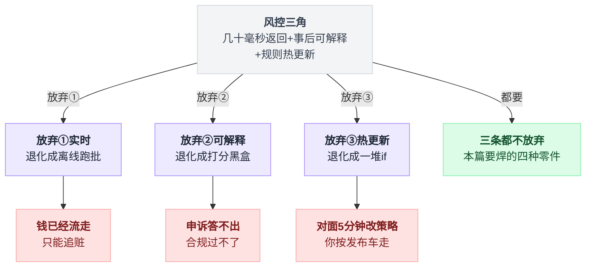
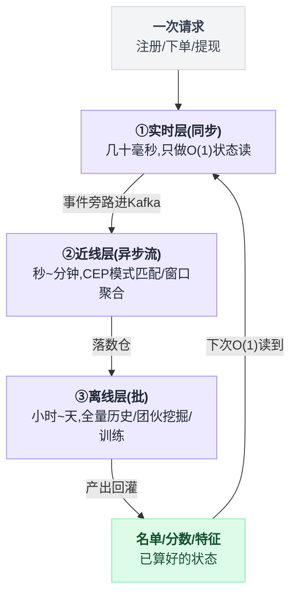
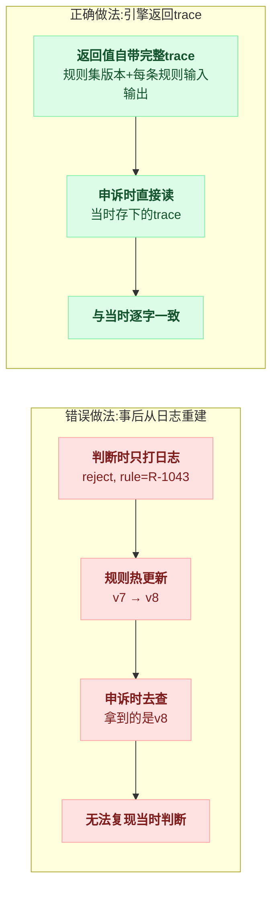
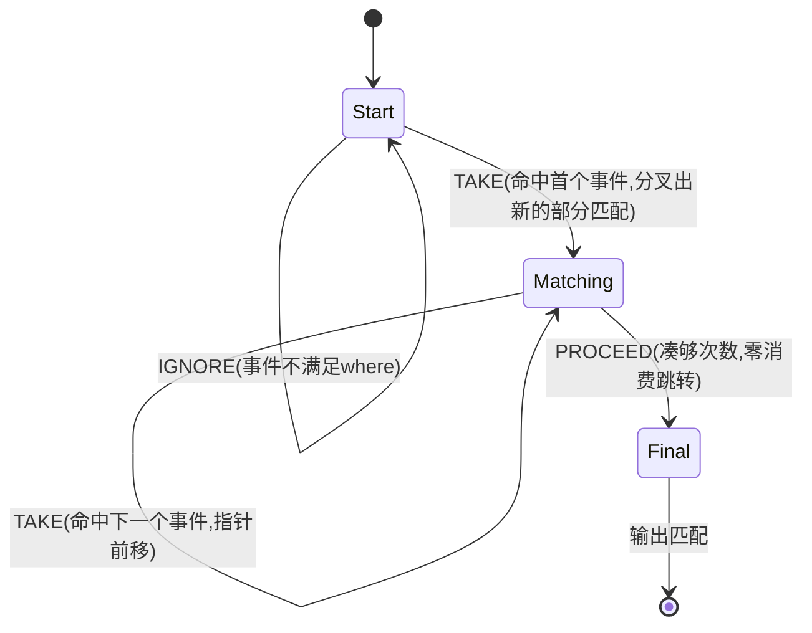
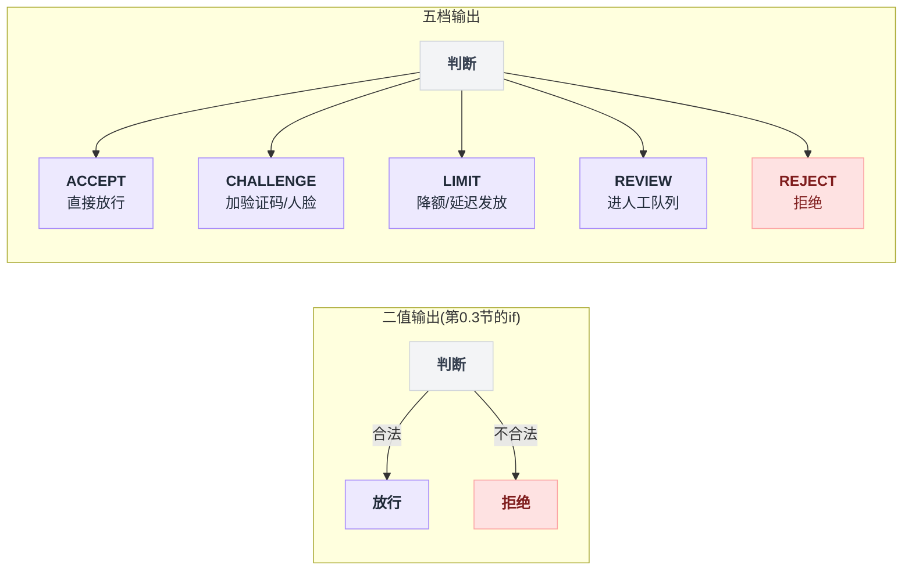
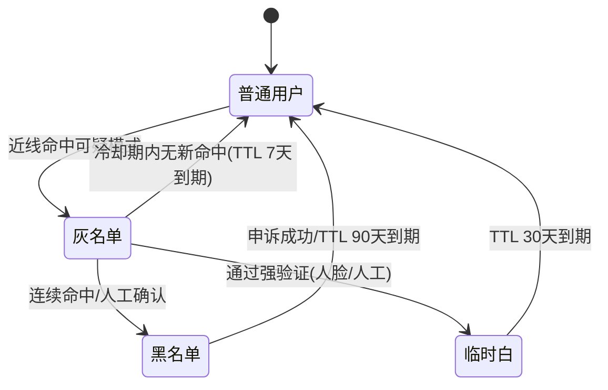
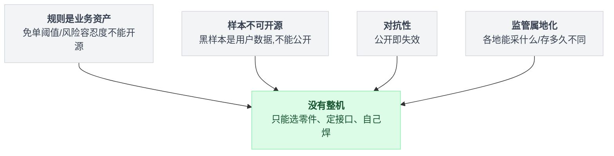

# 《风控与反薅羊毛》五十毫秒内做出判断，还要能事后解释（小白版）

> 一句话结论：**风控系统是攒出来的，不是下载来的**——开源世界给你的从来只有零件（CEP 引擎 / 表达式引擎 / 决策图 / 设备指纹），整机是各家自己焊的；曾经的中文标杆 wfh45678/radar 停在 2023-10-23。第二条：**实时风控最贵的不是算力，是状态**——几十毫秒的延迟预算，不是被规则的四则运算吃掉的，是被"这个设备过去 5 分钟注册过几次"这类状态的读写吃掉的。第三条：**可解释性必须是引擎的返回值，而不是从日志里捞出来的**。
>
> 难度：★★★★☆
>
> 写作时间：2026-08-05。文中 star 数与最后提交时间为当日实测；apache/flink 的 CEP 部分与 gorules/zen 的引擎入口为**已读源码**（文中给出文件路径）；QLExpress / LiteFlow / fingerprintjs 的内部路径**本次未核实**，只引用其仓库元数据与公开描述；Drools 主仓本次未能通过 API 检索到，**不作论据**。全文不提供任何未实测的 benchmark 数字，凡是推论一律就地标注。
>
> 读完你会懂：
> 1. 为什么这一篇没有"主标本"——以及"开源只有零件、没有整机"这件事本身为什么就是本篇最重要的结论
> 2. 几十毫秒返回、事后可解释、规则热更新，这三个约束为什么必须同时成立，任意放弃一条题目会退化成什么
> 3. 实时 / 近线 / 离线三层各自能看到多宽的数据窗口，一条具体的规则该被放进哪一层
> 4. gorules/zen 为什么把 trace 做成返回值结构体的字段，还专门为它做了 `Reference` 序列化模式——以及"事后从日志重建决策路径"为什么在规则热更新之后就废了
> 5. Flink CEP 的 `NFA.process()` 靠 IGNORE / TAKE / PROCEED 三种转移逐帧推进，SharedBuffer 怎么把分叉的部分匹配压回一份
> 6. 为什么超时告警靠 watermark 推进触发、而不是定时扫描，以及由此得到的一条冷推论：**攻击停了，收尾告警可能永远不来**（此为推论，本次未做实验验证）

---

## 目录

- [0. 开场：一场持续 40 分钟的薅羊毛](#0-开场一场持续-40-分钟的薅羊毛)
- [1. 先把题面摆清楚：三个约束同时成立](#1-先把题面摆清楚三个约束同时成立)
- [2. 三层架构：实时、近线、离线各能看到什么](#2-三层架构实时近线离线各能看到什么)
- [3. 规则表达式层：为什么不写 if-else](#3-规则表达式层为什么不写-if-else)
- [4. 决策图与可解释性（本篇主菜之一）](#4-决策图与可解释性本篇主菜之一)
- [5. CEP：把一句话变成一个模式（本篇主菜之二）](#5-cep把一句话变成一个模式本篇主菜之二)
- [6. 状态才是账单大头](#6-状态才是账单大头)
- [7. 设备指纹与名单体系](#7-设备指纹与名单体系)
- [8. 一个诚实的章节：这个方向没有整机](#8-一个诚实的章节这个方向没有整机)
- [9. 待验证清单](#9-待验证清单)
- [10. 反直觉结论](#10-反直觉结论)
- [11. 一句话总结、小白词典、和前几篇的对照](#11-一句话总结小白词典和前几篇的对照)

---

## 0. 开场：一场持续 40 分钟的薅羊毛

### 0.1 那一夜

运营上了一个再普通不过的拉新活动：

> 新用户注册即领 20 元无门槛券，全场通用，次日起 7 天有效。

预算池 50 万，按历史转化率算能撑一个月。活动 20:00 上线。

```
  20:00  活动上线，注册量正常，每分钟几十人
  22:14  注册曲线开始翘头，值班同学看了一眼，以为是活动生效了，高兴
  22:31  券中心告警：今日发券量超日常均值 20 倍
  22:33  群里第一句话："是不是活动太好了？"
  22:41  有人去查注册号段，发现全是连号的虚拟号
  22:48  临时下线活动开关（改配置 → 等发布 → 灰度 → 全量）
  22:54  开关真正生效，发券停止 ── 从 22:14 到 22:54，整整 40 分钟
```

第二天核对账目：这 40 分钟里发出去 **15 万张券，面值 300 万**。预算池 50 万，超支 6 倍——因为发券的预算校验只锁了"活动总预算"，而这个活动的券是先发后核销，发的时候只扣了发放额度，没扣真实预算（[第 24 篇《抽奖与营销预算控制》](./24-抽奖与营销预算控制.md)专门拆过这个坑，本篇不复读）。

### 0.2 算一笔账：对面的速率一点也不夸张

```
  300 万元 ÷ 20 元/张  =  15 万张券
  15 万张 ÷ 40 分钟    =  3750 张/分钟  ≈  62 张/秒

  62 张/秒 = 一台家用宽带的机器 + 一个接码平台，单线程 HTTP 就够
           = 你的 QPS 监控上一根不起眼的小凸起
```

注意最毒的一点：**62 QPS 打不垮任何东西**。限流器不会响（[第 04 篇《分布式限流器》](./04-分布式限流器.md)里的阈值通常按容量设，不是按"合理性"设），数据库压力曲线是平的，接口 P99 纹丝不动。**技术监控全绿，钱在流走。**

### 0.3 最朴素的做法，以及它死在哪

复盘会开完，你当天就在注册接口里加了几个 `if`：

```java
// RegisterService.java
if (blacklist.contains(req.ip()))            return reject("ip_black");
if (phonePrefix(req.phone()).isVirtual())    return reject("virtual_phone");
if (regCountByIp(req.ip(), 1, HOURS) > 10)   return reject("ip_too_many");
```

上线，当天有效。第二天对面换 IP 池，第三天对面用真实号段的接码，第四天对面把注册速率降到"每 IP 每小时 9 次"——刚好卡在你的阈值下面。

于是这套 `if` 的三个死法，一个不落地全来了：

```
  死法一：改不动
    发现新手法 → 改代码 → 提 MR → 评审 → 测试 → 排下一趟发布车
    最快的团队也要几小时，正常团队是"下个版本"；对面调策略：5 分钟

  死法二：看不见跨事件的模式
    单条注册请求本身完全合法：手机号真实、验证码正确、设备正常
    "同一设备 5 分钟注册 20 个账号"这句话不在任何一条请求里，
    它只存在于"多条请求之间"

  死法三：说不清
    复盘会上最难堪的那句话：
    ┃ "我们知道有问题，但说不清哪条规则拦住了、哪条没拦住。"
    日志里只有 reject("ip_too_many")，没有：
      · 当时这个用户身上其余 12 条规则各自算出了什么
      · 用的是哪个版本的阈值（阈值昨天刚被人调过）
      · 如果阈值是 5 而不是 10，会不会拦住
```

死法三最要命，因为它决定了你**永远无法学习**。风控是一门对抗的手艺，对抗的前提是复盘，复盘的前提是能重建当时的判断过程。说不清，就只能靠猜；靠猜，就只能一次次加更狠的规则，然后误伤真实用户。

### 0.4 本篇路线图

| 症状 | 谁来解 | 第几节 |
|---|---|---|
| 改不动：规则的生命周期是"天"，代码发布周期是"周" | 规则表达式 + 决策图 + 热更新 | 第 3、4 节 |
| 看不见跨事件模式："5 分钟内同一设备 20 次注册" | CEP（复杂事件处理） | 第 5 节 |
| 说不清：判断过程无法重建 | 引擎返回 trace，而不是从日志捞 | 第 4 节 |
| 都做到了，但 P99 飙到 800ms | 状态才是账单大头 | 第 6 节 |
| 换个设备就绕过 | 设备指纹 + 名单体系 | 第 7 节 |

⚠️ 先说清楚本篇最特殊的一点：**它没有单一主标本**。前面 40 篇里，每一篇背后都站着一两个能打开来读的开源项目（Discourse、Flink、Nacos……），本篇没有。第 8 节会用实测数据说明为什么。这不是选题失误——**"这件事没有整机可下载"本身就是本篇最重要的结论之一**，而且它直接决定了你在公司里该怎么做这件事：不要去找"一个风控开源项目"，要去找四种零件，然后自己焊。

---

## 1. 先把题面摆清楚：三个约束同时成立

风控这道题看起来很大，但真正让它难的只有三条约束，而且它们**必须同时成立**：

```
                  ① 几十毫秒内返回
               （挂在注册/下单/提现的同步
                 链路上，业务在等，不能拖）
                          ▲
                         ╱ ╲
                        ╱   ╲
                       ╱ 风控 ╲
                      ╱ 的三角  ╲
                     ▼───────────▼
       ② 事后能解释                 ③ 规则能热更新
   （哪条规则、什么值、           （对面 5 分钟改一次策略，
     哪个版本、拦没拦住）           你不能等下个版本）
```

把这个三角拆成"放弃哪一条会掉到哪一级"，形状比文字更直接：



**任意放弃一条，题目难度都掉一个量级。** 逐条论证：

**放弃 ①（不要求实时）** → 题目退化成一个离线跑批任务。夜里跑一遍全量数据，什么复杂模型、图算法、全表 join 都能用，第二天出一份可疑名单人工处理。这是"事后追赃"，技术上简单到可以用 SQL + 定时任务解决，[第 28 篇《分布式调度》](./28-分布式调度.md)就够用了。代价：券已经发出去了，钱已经流走了，你只能追。

**放弃 ②（不要求解释）** → 题目退化成一个二分类模型服务。喂特征、出个分、卡个阈值，一个模型推理接口搞定，工程上比规则引擎干净得多。代价有三块，每一块都真实存在：用户申诉时你答不出"为什么拦我"；运营要调策略时你只能说"重新训练"；很多业务（金融、支付）在合规上被要求给出**拒绝理由**，黑箱直接不合规。

**放弃 ③（不要求热更新）** → 题目退化成普通业务代码。写 `if` 就行，就是第 0.3 节的做法。代价：你的迭代周期是周，对面是分钟——这不是"慢一点"，这是根本不在一个对抗节奏上。

| 放弃哪条 | 题目退化成 | 谁能干 | 现实里为什么不行 |
|---|---|---|---|
| 放弃"实时" | 离线跑批 + 人工处置 | 一个定时任务 | 钱已经发出去了，只能追赃 |
| 放弃"可解释" | 一个模型打分接口 | 一个推理服务 | 申诉答不出、策略调不动、合规过不了 |
| 放弃"热更新" | 一堆 `if` | 任何后端 | 对面的迭代周期是分钟 |
| **一条都不放弃** | **本篇** | **四种零件自己焊** | —— |

顺手澄清一个常见误解：风控**不是**限流。[第 04 篇](./04-分布式限流器.md)的限流器也在入口拦请求，但它拦的是"太多了"，是无差别的、和身份无关的、不需要解释的——令牌桶不会告诉你"为什么是你被拦"，也没人问。风控拦的是"不对劲"，必须和身份绑定，必须解释，而且**被拦的那个请求，速率上完全正常**。第 0.2 节的 62 QPS 就是证据：限流器眼里它是良民。

---

## 2. 三层架构：实时、近线、离线各能看到什么

三个约束里最硬的是延迟。但不是所有规则都需要在几十毫秒内算完——**规则该放哪一层，取决于它需要看多宽的数据窗口**。

```
   ① 实时层（同步）  预算：几十毫秒   业务在等你的返回值
      能看到：本次请求的字段 + 能 O(1) 取到的、已算好的状态
      典型：名单命中、单请求校验、预聚合计数器比阈值
            │ 事件旁路进消息队列（Kafka）
            ▼
   ② 近线层（异步流）预算：秒 ~ 分钟   业务不等它
      能看到：滑动窗口内的事件序列、跨事件模式、跨账号关联
      典型：CEP 模式匹配、窗口聚合、实时图关联
            │ 落数仓
            ▼
   ③ 离线层（批）    预算：小时 ~ 天
      能看到：全量历史、全表 join、任意复杂度的算法
      典型：团伙挖掘、模型训练、名单回灌、规则效果回测
            │
            └──► 产出的名单/分数/特征，回灌给 ① 当"已算好的状态"
```

关键在最后那根回灌箭头：**实时层之所以能在几十毫秒内做出复杂判断，是因为复杂的部分早就被 ②③ 层算好了**。实时层干的事情本质上只有两件——取状态、比阈值。

三层之间不是单向流水线，是一个闭环：



一张对照表，把常见规则各自归位：

| 规则 | 需要的数据窗口 | 该放哪层 | 实时层怎么用它 |
|---|---|---|---|
| 手机号在黑名单里 | 单点查询 | ① 实时 | 直接查名单 |
| 收货地址与历史不符 | 本账号历史（已聚合） | ① 实时 | 读预聚合画像 |
| 本设备今日注册次数 > 5 | 计数器 | ① 实时 | Redis INCR + 比阈值 |
| **5 分钟内同一设备注册 20 个账号** | **5 分钟事件序列** | **② 近线（CEP）** | 命中后写灰名单，实时层下次读到 |
| 同一 WiFi 下 1 小时内 30 个新账号 | 1 小时窗口 + 分组 | ② 近线 | 同上 |
| 设备 30 天内关联过 500 个账号 | 30 天全量图 | ③ 离线 | 跑批产出黑名单，回灌 |
| 这批用户的收货地址聚成一个团伙 | 全量 + 聚类 | ③ 离线 | 产出团伙标签 |

再把实时层那"几十毫秒"拆开看看钱花在哪。**注意：下面是延迟预算的分配方案，不是实测 benchmark**（本篇不提供未实测的性能数字）：

```
   一次风控同步调用的 50ms 预算，大致这么分：

   反序列化 + 参数校验         ▉
   取状态（名单/计数器/画像）  ▉▉▉▉▉▉▉▉▉▉▉▉▉▉▉▉▉▉▉▉▉▉  ← 大头
   规则求值（表达式 + 决策图） ▉▉▉
   组装 trace + 返回          ▉▉
   异步落日志（不占同步预算）  ·

   为什么"取状态"是大头：一次判断要读十几到几十个特征，每个特征
   都是一次网络往返或状态后端读取；规则本身只是几十次比较和四则
   运算——CPU 上那点活儿可以忽略。
```

这就是本篇一句话结论的第二条：**最贵的不是算力，是状态**。第 6 节整节讲这件事。

💡 三层结构的形状你其实见过。[第 11 篇《推荐系统四级漏斗》](./11-推荐系统四级漏斗.md)也是"离线算好 → 在线取用"，[第 22 篇《搜索引擎倒排索引》](./22-搜索引擎倒排索引.md)更是把"离线建索引、在线查索引"做到了极致。区别在于：搜索的索引是给"查得快"用的，风控的回灌名单是给"判得准"用的，但工程形状是同一个——**在线路径上永远不做能提前做的事**。

---

## 3. 规则表达式层：为什么不写 if-else

### 3.1 一句话就够了：规则的生命周期是"天"，代码的发布周期是"周"

```
        规则的一生                      代码的一生
   ──────────────────────        ────────────────────────
   周一 10:00 发现新手法           周一       写完提 MR
   周一 10:20 阈值 10 改成 5       周二       评审 + 改
   周一 10:25 加一条"虚拟号段"     周三       测试环境验证
   周一 14:00 发现误伤，回滚       周四       赶上发布车
   周二 换写法 / 周三 微调         周五 灰度 10% / 下周一 全量
   ──────────────────────        ────────────────────────
   变更频率：一天几次              变更频率：一周一次

   把前者塞进后者 = 让一个每天改主意的人，走一条一周发一次车的流程。
```

所以规则必须从代码里**抽出来**，变成数据。变成数据之后，它就能像配置一样被推送、被回滚、被版本化。

### 3.2 抽出来之后长什么样

第 0.3 节那个 `if`，变成一行数据：

```
规则 ID   : R-1043            版本 : v7
表达式    : ipRegCount1h > threshold && !inWhitelist
参数      : { threshold: 10 }  命中动作 : REJECT
生效时间  : 2026-08-05 10:20:00
```

改阈值 = 改一行数据 + 推送；加一条规则 = 插一行数据。发布车？不用坐。

Java 生态里干这件事的老零件是 **alibaba/QLExpress**（5,607 star，最后提交 2026-07-05，2026-08-05 实测；**内部类名与路径本次未核实，以官方仓库为准**）——它的定位就是"在运行时把一段字符串当成表达式求值，并且能拿到你注入的上下文变量"。同生态里 **dromara/liteflow**（3,825 star，最后提交 2026-07-31，实测；**内部路径未核实**）走的是另一条路：组件编排 + DSL + 热部署，把"哪几个组件按什么顺序跑"也变成可热更的配置。

⚠️ 表达式引擎不是免费的，三个代价必须知道：

**没有编译期检查**——`ipRegCount1h` 打成 `ipRegCont1h`，编译器不管你，上线才炸，所以规则必须有"发布前试跑"（拿最近一小时真实流量重放一遍）；**性能不可预测**——表达式里不小心调了一个会查库的函数，一条规则就能吃掉整个延迟预算，规则能调什么函数必须白名单管理；**权限与审计**——能改规则的人等于能在生产改判断逻辑，谁改的、改前改后、何时生效，这套东西比规则引擎本身更容易被忽略。

### 3.3 热更新这件事，本质上是"规则怎么送到每个进程内存里"

这就是配置推送问题，和风控无关，是一个通用问题：规则源变了 → 推给所有实例 → 实例把内存里的规则表换掉。

```
   规则管理后台 ──①改规则──► 规则存储（DB / 配置中心）
                                    │ ②推送 or 长轮询
        ┌───────────────┬───────────┴───────────────┐
        ▼               ▼                           ▼
   ┌──────────┐   ┌──────────┐                ┌──────────┐
   │ 风控实例1 │   │ 风控实例2 │      ……        │ 风控实例N │
   │ 内存规则表 │  │ 内存规则表 │               │ 内存规则表 │
   └──────────┘   └──────────┘                └──────────┘
        ↑ 整表替换，不是逐条改

   为什么必须整表替换：逐条 update 会存在一个瞬间，
   新规则已生效、旧规则还没撤——这个瞬间的判断谁也解释不了。
```

**alibaba/Sentinel**（23,138 star，**最后提交 2026-05-27**，2026-08-05 实测——注意这个日期，写到这里时它已经三个多月没有新提交了，选型时要看当下）做限流规则的动态下发用的就是这个形状：规则来自可插拔的数据源，变更时推送到各实例，实例整体替换内存里的规则集合。**名单热更新与规则热更新是同一个机制**，你不需要为风控单独发明一套。

同样的道理在[第 25 篇《灰度发布与 AB 分流》](./25-灰度发布与AB分流.md)里也出现过：分流规则也是"改一行配置就要立刻生效"。区别在于，灰度分流改错了顶多用户看到不同版本，风控规则改错了是真金白银——所以风控这边必须多两样东西：**发布前重放试跑**和**一键回滚到上一版本**。

---

## 4. 决策图与可解释性（本篇主菜之一）

### 4.1 规则多了之后，"一堆表达式"就不够了

十条规则可以是一个列表，挨个跑一遍。八十条规则不行——它们之间有依赖、有分支、有短路：

```
   输入：一次注册
        ▼
   ┌─────────┐ 是
   │ 白名单？ │───► 直接放行（后面全跳过）
   └────┬────┘
        ▼ 否
   ┌─────────┐ 是
   │ 黑名单？ │───► 直接拒绝
   └────┬────┘
        ▼ 否
   设备维度规则组（8 条）  ‖  行为维度规则组（12 条）   ← 可并行
              └──────────┬──────────┘
                         ▼
              打分汇总 / 裁决 ──► ACCEPT / CHALLENGE / REJECT
```

这就是**决策图**：节点是判断或计算，边是流向，整张图本身也是数据（一份 JSON），可以被编辑、版本化、热更新。

本节的标本是 **gorules/zen**（1,868 star，最后提交 2026-08-04，2026-08-05 实测；Rust 写的开源业务规则引擎）。下面的细节全部来自**已读源码**，文件路径一并给出。

### 4.2 zen 把 trace 做成了返回值的字段

看引擎入口 `core/engine/src/engine.rs`：

```rust
pub struct EvaluationOptions {
    pub trace: bool,
    pub max_depth: u8,
}
// Default: { trace: false, max_depth: 10 }

pub async fn evaluate_with_opts<K>(
    &self, key: K, context: Variable, options: EvaluationOptions,
) -> Result<DecisionGraphResponse, Box<EvaluationError>>
```

再看返回值结构体 `core/engine/src/decision_graph/graph.rs`：

```rust
pub struct DecisionGraphResponse {
    pub performance: String,          // 本次求值耗时
    pub result: Variable,             // 判断结论
    #[serde(skip_serializing_if = "Option::is_none")]
    pub trace: Option<EvaluationTrace>,   // ← 决策路径，和结论并列
}
```

一句话读懂这段代码：**"结论"和"怎么得到这个结论"，是同一次调用的两个返回字段。** 不是日志，不是埋点，不是事后拼装——是返回值。

trace 的粒度是**每个节点一条记录**（`core/engine/src/decision_graph/walker.rs` 里构造）：

```rust
DecisionGraphTrace {
    id,                 // 节点 id
    name,               // 节点名
    input,              // 进这个节点时的输入
    output,             // 出这个节点时的输出
    order,              // 执行顺序
    performance,        // 这个节点花了多久
    trace_data,         // 节点特有的细节，
                        // 例如 switch 节点会记下哪些分支条件为真
}
```

对照第 0.3 节那句"说不清哪条规则拦住了、哪条没拦住"——这个结构体逐字回答了它：哪个节点（id/name）、看到了什么（input）、算出了什么（output）、第几个跑的（order）、花了多久（performance）、内部细节（trace_data）。

### 4.3 为 trace 专门做了四种序列化模式

同一个文件里还有这个（`core/engine/src/engine.rs`）：

```rust
pub enum EvaluationTraceKind {
    #[default] None, Default, String, Reference, ReferenceString,
}

impl EvaluationTraceKind {
    pub fn serialize_trace(&self, trace: &Variable) -> Value {
        match self {
            Self::None      => Value::Null,
            Self::Default   => serde_json::to_value(&trace)...,
            Self::String    => Value::String(serde_json::to_string(&trace)...),
            Self::Reference => serde_json::to_value(&trace.serialize_ref())...,
            Self::ReferenceString =>
                Value::String(serde_json::to_string(&trace.serialize_ref())...),
        }
    }
}   // 枚举变体名与分支逻辑与源码一致，此处只把 EvaluationTraceKind:: 缩成 Self::
```

这五个枚举值值得盯一会儿。`None` 是不要 trace；`Default` 是老老实实序列化成 JSON 值；`String` 是序列化成一个字符串（方便直接塞进日志字段或消息体）；而 `Reference` / `ReferenceString` 走的是 `serialize_ref()` ——**按引用序列化**。

为什么要有引用模式？因为 trace 里的 `input` / `output` 大量重复：一个节点的输出就是下一个节点的输入，八十个节点跑下来，同一份上下文会被重复序列化几十遍。全量序列化的开销可能比规则求值本身还大。

```
   Default 模式                        Reference 模式
   node1.output = {大对象}              node1.output = {大对象}
   node2.input  = {大对象}    ──►       node2.input  = →ref#1
   node2.output = {大对象}              node2.output = {大对象}
   node3.input  = {大对象}              node3.input  = →ref#2
   序列化开销 ∝ 节点数 × 对象大小        重复部分只出现一次
```

**一个引擎肯为某个特性专门做四种序列化模式，说明这个特性是一等公民，不是附赠品。** 这是本节最想让你记住的一句话——你自己攒风控引擎时，trace 也应该享受这个待遇。

顺带看 `max_depth: u8 = 10`：决策图的节点可以再去调用另一张决策图，所以求值是可以嵌套的，`max_depth` 是嵌套深度上限——防环、防栈爆，也顺便防住"规则改着改着改出一个自引用"这种运营事故。

### 4.4 为什么"事后从日志重建"这条路是死的

很多团队的做法是：判断的时候正常返回结论，同时打一堆日志；出事了再去 ELK 里把日志捞出来拼决策路径。这条路在**规则不变**的世界里勉强能走，但风控世界里规则一天改好几次。

```
   事后重建（错误做法）                 引擎返回（正确做法）
  ──────────────────────            ──────────────────────────
   10:15 用户 A 被拒绝                10:15 用户 A 被拒绝，返回值里
         日志：reject, rule=R-1043         带着完整 trace：规则集 v7、
   10:20 策略同学把该规则阈值改成 5          R-1043: 12>10 命中、R-1044:
         （规则集 v7 → v8）                 false、其余 78 条的输入输出
   14:00 用户 A 申诉，你去查            14:00 用户 A 申诉
         拿到的是 v8，重放结论可能不同        直接读当时存下的 trace
   ✗ 无法复现当时的判断                ✓ 与当时逐字一致
```

两条路径并排放在一起，分岔点看得更清楚：



问题的根子不在日志缺字段，在于**日志记的是"发生了什么"，而重建需要的是"当时的规则长什么样"**。规则一热更新，用于重建的那份"当时"就消失了。你可以给规则集做全量版本快照来补救，但那等于要保存每一个版本的完整规则集，并且保证任何时候都能拿 vN 精确重放——工程量远大于"让引擎把 trace 一起返回"。

所以本篇一句话结论的第三条要写死：**可解释性必须是引擎的返回值，而不是从日志里捞出来的。** 落到实践上是三条硬要求：① 引擎返回值里必须有 trace（哪怕默认关闭、按采样打开）；② trace 里必须带**规则集版本号**，没有版本号的 trace 只解释了一半；③ trace 按"决策"归档而不是按"日志行"堆放（一次决策一条记录，能按用户/订单 ID 直接查出来）。

💡 这里有个值得点破的巧合：本节的 trace 和[第 26 篇《全链路追踪》](./26-全链路追踪.md)的 trace 是同一个英文词，但含义正交。**第 26 篇的 trace 回答"慢在哪一跳"，本篇的 trace 回答"为什么是这个结论"**；前者可以采样丢弃（第 26 篇论证过观测数据天生可丢），后者在被申诉、被审计的场景里**不能丢**——它是业务证据，不是观测数据。两者的存储策略因此完全相反：一个是"丢 99%"，一个是"至少对高风险决策做到 100% 留存"。同名不同命。

---

## 5. CEP：把一句话变成一个模式（本篇主菜之二）

### 5.1 那句最关键的话，不在任何一条请求里

回到第 0.3 节的死法二。"5 分钟内同一设备注册 20 个账号"这句话，你没法在单次请求里判断——每一条请求单独看都合法。

朴素做法是拿 Redis 做计数器：`INCR device:{id}:reg` 加过期。这确实能解决**计数**类的问题，也确实是实时层的主力（第 2 节那张表里好几行都是这么干的）。但计数器解决不了带**顺序和形态**的模式：

```
   计数器答得了：一个数字        计数器答不了：一个序列的形状
   · 5 分钟内注册了几次          · "注册→领券→立刻下单→秒退款"出现几次
   · 今天下单几笔                · 连续 3 次失败之后紧跟一次成功
                                · 领券后 10 秒无浏览就下单（人做不到）
```

这类"事件按某种形态排列"的判断，是 **CEP（Complex Event Processing，复杂事件处理）** 的地盘。本节标本是 **apache/flink**（26,245 star，最后提交 2026-08-05，2026-08-05 实测），源码路径 `flink-libraries/flink-cep/src/main/java/org/apache/flink/cep/nfa/NFA.java` 与 `.../cep/operator/CepOperator.java`——**本节所有代码细节均为已读源码**。

规则用模式描述，大意是这样（**Pattern API 的确切签名本次未核实，以官方文档为准**；本篇核实的是 NFA 与 operator 层）：

```
  keyBy(设备ID)
    Pattern.begin("reg").where(事件类型 == 注册).timesOrMore(20).within(5 分钟)
```

一句话变成一个模式对象，剩下的交给状态机。

### 5.2 NFA：三种转移，逐帧推演

`NFA.java` 类注释里写得很直白：这是一个非确定有限状态机（Non-deterministic finite automaton），CEP operator **给每个 key 各留一个 NFA**（keyed 流），每来一个事件就推一次内部状态机；实现"strongly based on"论文《Efficient Pattern Matching over Event Streams》（SASE，注释里给了论文链接）。

核心的私有方法是 `computeNextStates(...)`，它的 javadoc 把算法逐条列出来了，其中转移只有三种：

| 转移 | javadoc 原文的意思 | 人话 |
|---|---|---|
| `TAKE` | links in SharedBuffer **will point to the current event** | 这个事件我要了，往前走一格 |
| `IGNORE` | links in SharedBuffer **will still point to the previous event** | 这个事件不算数，原地待命（宽松连续时用） |
| `PROCEED` | 零消费转移；"peek to the next state if it has PROCEED path to a Final State" | 不吃事件，直接跳到下一个状态（ε 边） |

为了画得下，把"20 次"缩成"3 次"，事件流是 `注册A → 登录 → 注册B → 注册C`（都来自同一个设备，所以是同一个 key，同一个 NFA）：

```
  帧 0（初始）
    Start ●          ● = 一个 ComputationState（一条正在推进的部分匹配）
    部分匹配数：1

  帧 1：事件 e1 = 注册A
    Start ──TAKE(e1)──► reg[1]●
    Start ──IGNORE───► Start●   ← Start 永远保留（javadoc: "Handle the Start
                                   State, as it always have to remain"），因为
                                   新的一轮攻击随时可能从下一个事件开始
    部分匹配数：2

  帧 2：事件 e2 = 登录（不满足 where 条件）
    reg[1] ──IGNORE──► reg[1]●       ← 事件不要，指针仍指向 e1
    Start  ──IGNORE──► Start●
    部分匹配数：2      （SharedBuffer 里 e2 根本不会被 lock 住）

  帧 3：事件 e3 = 注册B
    reg[1] ──TAKE(e3)──► reg[2]●     ← 主线推进
    Start  ──TAKE(e3)──► reg[1]'●    ← 分叉！从 e3 开始的另一条部分匹配
    Start  ──IGNORE────► Start●
    部分匹配数：3      ← 注意这里开始膨胀

  帧 4：事件 e4 = 注册C
    reg[2] ──TAKE(e4)──► reg[3] ──PROCEED──► Final ✓  输出匹配 [e1,e3,e4]
    reg[1]'──TAKE(e4)──► reg[2]'●                     还差一个
    Start  ──TAKE(e4)──► reg[1]''●
    部分匹配数：3 + 1 个已完成
```

盯住帧 3 那个分叉：**一个事件可以同时让多条部分匹配前进**，这正是"非确定"三个字的含义。也正是从这里开始，状态会膨胀——这是第 6 节的伏笔。

把四帧的推演收进一张状态机里，三种转移各自去哪一目了然：



### 5.3 SharedBuffer：把分叉的中间态压回一份

帧 4 里有三条活着的部分匹配，它们的前缀高度重叠。如果每条各存一份事件列表：

```
  各存各的（朴素做法）              SharedBuffer（Flink 的做法）
  ──────────────────────          ──────────────────────────────
  匹配线1: [e1, e3, e4]            事件各存一份：e1  e3  e4
  匹配线2: [e3, e4]                每条线只存版本化指针链：
  匹配线3: [e4]                      线1: →e4 →e3 →e1
  存储 = 3 + 2 + 1 = 6 份事件        线2: →e4 →e3   线3: →e4
  模式长 L、活跃分叉 k：≈ O(k × L)   ≈ O(不同事件数) + O(指针)
```

`NFA.java` 的类注释原话是：属于部分匹配序列的事件保存在内部的 SharedBuffer 里，那是"a memory-optimized data-structure exactly for this purpose"（专为此目的优化内存的数据结构）。

事件什么时候能被删掉？注释里列了三种：匹配**成功输出**、被**丢弃**（含 NOT 模式）、**超时**。实现上靠引用计数——你能在源码里看到 `sharedBufferAccessor.releaseNode(...)`、`releaseEvent(...)`，其中 `releaseEvent` 就挂在 `EventWrapper.close()` 里（`try (EventWrapper eventWrapper = ...)`，处理完自动释放）。

**换句话说：SharedBuffer 是一个带引用计数的、版本化的事件 DAG。** 这个数据结构存在的唯一理由，就是"部分匹配会分叉，而分叉们共享前缀"。

### 5.4 超时靠 watermark 推进，不是定时扫描

模式里的 `within(5 分钟)` 怎么落地？很多人的第一直觉是"起个定时器/定时扫描过期的部分匹配"。**Flink 不是这么做的。**

`NFA.advanceTime(...)` 的 javadoc 第一句：

> "Prunes states assuming there will be **no events with timestamp lower** than the given one. It clears the sharedBuffer and also emits all timed out partial matches."

翻译：**"假设不会再有比这个时间更早的事件了"** ——然后据此剪枝，并把超时的部分匹配吐出来。这句"假设"就是 watermark 的定义。

谁来调它？`CepOperator.onEventTime(...)`，源码里连注释都编了号：

```java
// STEP 2  处理 <= 当前 watermark 的所有待处理事件
while (!sortedTimestamps.isEmpty()
        && sortedTimestamps.peek() <= timerService.currentWatermark()) {
    long timestamp = sortedTimestamps.poll();
    advanceTime(nfaState, timestamp);
    ... processEvent(nfaState, event, timestamp) ...
}

// STEP 3  推进到当前 watermark，让过期的模式被丢弃
advanceTime(nfaState, timerService.currentWatermark());
```

再往上一层，事件进来时是先**缓存**起来并注册一个 event-time 定时器（`registerEventTimeTimer(VoidNamespace.INSTANCE, timestamp)`），等 watermark 越过这个时间点，`onEventTime` 才被回调。

一张图说清整条链：

```
   事件到达 ─► 按 timestamp 塞进 elementQueueState（先不处理！）
              └─► registerEventTimeTimer(timestamp)
                            │
      watermark 推进 ───────┘
                            ▼
                      onEventTime()
                        ├─ STEP2: 按时间顺序喂给 NFA.process()
                        └─ STEP3: NFA.advanceTime(currentWatermark)
                              ├─ 超时的部分匹配 → timeoutResult
                              └─ SharedBuffer 释放对应节点

   ★ 整条链上没有任何"定时扫描"。推进它的只有一件事：watermark 变大；
     而 watermark 变大，通常来自"有新数据流过"。
```

### 5.5 一条冷推论：攻击停了，收尾告警可能永远不来

**⚠️ 以下这一整节是推论：此为推论，本次未做实验验证。** 读到这里请把它当成"值得你自己验一验的假设"，不要当成已确认的事实。

顺着 5.4 的机制往下推：

```
  22:41  对面还在打，事件源源不断 → watermark 稳步推进
         超时的部分匹配被正常吐出来 → 告警正常
  ─────────────────────────────────────────────────────────
  22:54  你关掉活动开关，对面收工，事件流断了
         此刻状态机里还躺着一批"差一点就凑够 20 次"的部分匹配，
         它们要靠 within(5 分钟) 超时才会被吐出来。但是——
         没有新事件 → watermark 不再推进
                    → onEventTime 不再被回调
                    → advanceTime 不被调用
                    → 那批部分匹配既不超时也不释放，就那么挂着

  ✗ 收尾的那批告警，可能永远不会触发（推论，未验证）
```

推论成立的前提是"watermark 由数据推进"。现实中可能打断它的因素至少有三个（**同样未验证**）：作业配置了 idleness 相关策略、上游别的分区仍在产生数据、或者作业用的是 processing time 而不是 event time（源码里 `onProcessingTime` 是另一条分支，它不看 watermark）。所以这条推论的准确表述是：**在纯 event-time、watermark 完全由数据驱动的配置下，事件流彻底静止会让超时匹配停止触发。**

为什么这条推论对风控特别难受？因为**攻击停止恰恰是攻击结束的标志**。你最需要那批收尾告警的时刻，正是事件流断掉的时刻。这个形状很像[第 28 篇《分布式调度》](./28-分布式调度.md)里那个"cron 不会向任何人报告我没跑"——**沉默的失败**，监控上一片祥和。

第 9 节给出验证它的最小实验设计。在验证之前，请不要把这条写进任何设计文档当结论。

💡 这条推论和[第 03 篇《订单超时关闭》](./03-延迟任务与时间轮.md)构成一对绝佳镜像。那篇里的闹钟靠**真实时钟**推进：时间轮的指针每 tick 走一格，哪怕系统里一个任务都没有，指针照走，到期的任务照样被叫醒。这一篇的闹钟靠**数据**推进：没有数据，时间就不流动。

```
   第 03 篇：时间轮                  本篇：CEP + watermark
  ─────────────────────           ─────────────────────────
   推进者：系统时钟 tick             推进者：流入的事件（watermark）
   系统空闲时：指针照走               流空闲时：时间停住
   优点：一定会响                    优点：重放历史数据结论一致
   缺点：重放历史会全部立刻过期        缺点：没有数据就没有时间
```

**"没有数据就没有时间"** ——这七个字是 event time 语义的全部代价，也是它全部的好处（正因为时间由数据定义，昨天的数据重放一遍，结论和昨天逐字相同）。

---

## 6. 状态才是账单大头

### 6.1 先把状态的规模摊开算

CEP 是 keyed 的：**每个 key 一个 NFA 状态**。风控里 key 通常是设备 ID、用户 ID、IP、手机号——基数动辄千万。

```
   活跃 key 数 × 每个 key 的状态大小 = 你要付的钱

   每个 key 的状态里装着什么（对照第 5 节）：
     NFAState：partialMatches（优先队列，元素是 ComputationState：
       当前状态名、版本、指针 ★ 帧 3 演示过它会分叉膨胀）+ completedMatches
     SharedBuffer：被 lock 住的事件本体 + 版本化指针链 + 引用计数

   放大器有三个：① 窗口越长，活着的部分匹配越多（5 分钟 vs 24 小时）；
   ② 模式越松（followedBy 而不是 next），分叉越多；③ key 基数越大，乘数越大
```

⚠️ 一个具体的运营事故形状：策略同学把某条规则的窗口从"5 分钟"改成"24 小时"，觉得只是"看得久一点"。实际后果是每个 key 里活着的部分匹配数上涨了两个数量级，作业内存吃满、checkpoint 变慢、最后反压到上游。**在 CEP 里，窗口长度是一个存储参数，不只是一个业务参数。**（此为机制推论，具体膨胀倍数取决于模式与数据分布，本篇不给未实测数字。）

### 6.2 状态后端的读写，才是延迟预算的真正消耗者

回看第 2 节那张预算图：取状态是大头。展开说：

```
   堆内状态后端                    RocksDB 类状态后端
  ────────────────────           ────────────────────────────────
   读 = 一次对象引用               读 = 查 memtable/SST + 可能读磁盘
   写 = 改个引用                        （有 page cache）+ 反序列化
                                  写 = 序列化 + 写 memtable
   代价：状态必须装得下内存         代价：每次访问都有序列化开销
   GC 压力随状态线性上涨            好处：状态可以远大于内存
```

方向性的结论只有一句（**具体倍数以官方文档与你自己的压测为准，本篇不编造 benchmark**）：**同一份逻辑，换到需要序列化的状态后端上，单次状态访问的成本会从"引用级"变成"序列化 + 可能的磁盘 IO"级。** 而实时风控一次判断要摸十几到几十个特征，这个乘数直接落在 P99 上。

由此得到风控工程里最实用的一条分工原则：

```
   实时层（同步，几十毫秒）：只做 O(1) 的状态读（名单命中、计数器比
     阈值），状态放在为"点查"优化的地方（内存 / Redis）
   ────────────────────────────────────────────────────────
   近线层（异步，秒级）：承担所有"大状态"（CEP 窗口、序列、图关联），
     业务不等它 → 可以慢、可以用磁盘状态后端，
     产出结论写回实时层能 O(1) 读到的地方

   把大状态推到不需要同步返回的那一层——第 2 节三层架构的全部理由。
```

### 6.3 别忘了状态的另外三张账单

内存只是第一张：

| 账单 | 内容 | 什么时候咬人 |
|---|---|---|
| 内存/磁盘 | 活跃状态本体 | 日常，随 key 基数与窗口长度增长 |
| checkpoint | 周期性把状态持久化 | 状态越大，checkpoint 越慢，越容易超时失败 |
| 恢复时间 | 作业重启要把状态读回来 | 事故时——**你最需要它快的时候它最慢** |
| 清理 | 过期 key 的状态怎么删 | 不清理就是无限增长；CEP 靠引用计数自动释放，自研计数器要自己设 TTL |

最后一行值得多说一句：CEP 的 `releaseNode` / `releaseEvent` 引用计数机制（第 5.3 节）本质上是**自动垃圾回收**。如果你自己用 Redis 攒窗口聚合，就必须自己回答"这个 key 什么时候能删"——忘了设 TTL 的计数器，是风控系统里最常见的内存泄漏。

💡 两处跨篇联想：[第 17 篇《Kafka 为什么快》](./17-Kafka为什么快.md)的答案是"顺序写 + page cache + 零拷贝"，RocksDB 这类 LSM 状态后端吃的是同一份红利——**写永远追加，读靠分层与缓存**，风控作业的状态后端能扛住高频写靠的正是这个物理事实；[第 22 篇《搜索引擎倒排索引》](./22-搜索引擎倒排索引.md)讲的是"把数据按查询方式重新组织一遍"，风控的状态也是同一件事——**你不是在存数据，你是在为"下一次判断要问的那个问题"预先组织答案**，"这个设备过去 5 分钟注册几次"就是一个被预先组织好的答案，代价是维护它的那份状态。

---

## 7. 设备指纹与名单体系

### 7.1 为什么需要设备维度

第 0.3 节的对抗史里，对面每次都在换：换 IP、换手机号、换账号。这些标识的共同点是**廉价**——IP 可以从代理池买，手机号可以从接码平台买。**设备**相对贵一些，所以"这些账号是不是同一台设备干的"这个问题很有价值。

浏览器端最有名的开源零件是 **fingerprintjs/fingerprintjs**（28,074 star，最后提交 2026-08-03，2026-08-05 实测；**本次未核实其内部文件路径与信号清单的具体实现**，下面只按其公开描述讲类别）。

它的思路是：浏览器没有稳定 ID，但浏览器会**暴露一堆环境差异**，把这些差异拼起来做 hash，就能得到一个在统计意义上区分度不错的标识。公开描述里提到的信号大致是这么几类（**类别层面的描述，具体实现未核实**）：

```
   屏幕与显示：分辨率、色深、像素比    系统与区域：时区、语言、平台
   硬件：逻辑核心数、内存量级         渲染差异：canvas / WebGL 绘制结果
   字体：已安装字体探测              音频：音频处理栈的细微数值差异
              └────► 拼接 + hash ────► visitorId（一串 ID）
```

### 7.2 关于稳定性：它是概率性标识，不是身份证

三个必须记住的事实：

1. **会漂**：浏览器升级、系统更新、装新字体、换显示器、开隐私模式——任何一项都可能让 hash 变化，所以"指纹变了"不能推出"换了设备"。
2. **会撞**：同型号同系统同版本的一批设备（公司统一采购的机器、同批次手机），指纹可能高度相似甚至相同，所以"指纹相同"也不能直接推出"同一台设备"。
3. **会被伪造**：反检测浏览器、指纹伪装插件是公开产业，攻击方在这条线上有专业工具。

所以设备指纹在风控里的正确用法是：**当成一个有噪声的强特征，而不是当成主键。** 具体表现为——用它做**聚合**（"这个指纹下面挂了 200 个账号"是很强的信号）可以；用它做**唯一封禁**（"封掉这个指纹"）要非常克制，因为撞库式误伤会打到无辜用户。

### 7.3 隐私边界：这一段必须讲清楚

设备指纹是一项**在多数司法辖区受监管的技术**。本篇的立场是：讲清约束，不讲绕过。

```
  目的限定  为"防欺诈/账号安全"采集与为"广告画像/跨站追踪"采集，
            法律上是两件事；前者在不少法域下空间更宽，但这个空间
            不会自动延伸到后者
  告知同意  隐私政策要写明采集什么、用于什么、留存多久；同意口径
            因法域而异（GDPR、《个人信息保护法》等各不相同）——
            这是法务问题，不是工程问题
  最小必要  风控要的是"是不是同一环境"，不是"这个人是谁"；
            能存 hash 不存原始信号，能存 30 天不存 3 年
  不复用    风控标识不应流向广告、推荐等其他用途——目的扩张是
            合规审查里最常被点名的问题
  可申诉    因设备信号被拒的用户要有申诉渠道，而你要答得出理由
            —— 又回到第 4 节的 trace
```

工程上的一条实操建议：**把原始信号和最终 ID 分开存储、分开授权**——判断链路只拿 ID，原始信号进受限存储且设短 TTL。具体到你所在的法域该怎么做请找法务确认，本节只负责让你知道"这里有边界"。

### 7.4 名单体系：黑、白、灰，以及过期与冷却

规则算完之后，结论要沉淀下来，这就是名单。三种名单的分工和常见错误：

| 名单 | 含义 | 动作 | 最常见的错误 |
|---|---|---|---|
| 白名单 | 确定可信（内部账号、大客户、已人工核实） | 直接放行，跳过后续 | 永不过期 → 白名单成了最大的漏洞 |
| 黑名单 | 确定恶意（人工确认、离线团伙挖掘产出） | 直接拒绝 | 加进去容易，出不来 → 误伤永久化 |
| 灰名单 | 可疑但不确定（近线层刚命中一个模式） | 提高验证强度、限额、进人工队列 | 干脆没有这一层 → 只会"放行 or 封杀" |

灰名单是这三者里最被低估的一个。**风控的输出不该是二值的**——这一点[第 33 篇《敏感词过滤与内容审核》](./33-敏感词过滤与内容审核.md)论证过（那边是 Discourse 的 8 种处置动作），风控这边同理：ACCEPT / CHALLENGE（加验证码、加人脸、加短信）/ LIMIT（降额、延迟发放）/ REJECT / REVIEW（进人工队列）。多出来的那几档，就是误伤率和拦截率之间的缓冲垫。



名单必须有生命周期，画成状态机：

```
     ┌────────┐
     │ 普通用户 │◄──────────────────────────┐
     └───┬────┘                            │ 冷却期内无新命中
         │ 近线命中可疑模式                  │ → 自动降级
         ▼      连续命中 / 人工确认          │
     ┌────────┐ ────────────────► ┌─────────┴┐
     │ 灰名单  │                   │  黑名单   │
     │ TTL 7天 │                   │ TTL 90天 │
     └───┬────┘                   └────┬─────┘
         │ 通过强验证（人脸/人工）        │ 申诉成功 / TTL 到期
         ▼                              ▼
     ┌─────────┐  ← 也要有 TTL！     ┌────────┐
     │ 临时白   │   "永久白名单"是漏洞 │ 普通用户 │
     │ TTL 30天│                    └────────┘
     └─────────┘
```

用状态机的写法把四个状态和触发条件摆在一起：



两个容易被忽略的细节：**冷却（cooldown）不等于过期（TTL）**——TTL 是"到点自动出来"，冷却是"这段时间内不再重复命中同一条规则"，没有冷却，一个持续行为会在几秒内产生几百条重复告警，把人工审核队列冲垮；**名单的写入也要留 trace**——"这个设备为什么在黑名单里"和"这次请求为什么被拒"是两个问题，前者的答案应该在写入名单的那一刻就存下来（哪条规则、哪次决策、哪个版本），否则 90 天后没人说得清。

---

## 8. 一个诚实的章节：这个方向没有整机

### 8.1 实测：找不到能当主标本的项目

本系列的规矩是"一手核实优先"，每篇都要有能打开来读的标本。本篇在这一步失败了，如实报告（2026-08-05 实测检索）：

- 按 star 排序检索 "risk control engine" / "风控" 这类关键词，**排在前面、题面最对口的那个项目只有 212 star**（此处不点名具体仓库，因为它的规模与活跃度都不足以支撑一篇源码拆解）；
- 中文社区曾经的实时风控标杆 **wfh45678/radar**，1,615 star，**最后提交 2023-10-23**——到本文写作时停更已近 3 年。它的架构描述仍有参考价值，但**不能作为源码结论的来源**，本篇只在架构层面提及它，不引用它的任何类名。

对比一下同系列其他篇：第 33 篇有 Discourse 和 sensitive-word 可以逐行读，第 28 篇有 quartz 和 XXL-Job，第 23 篇有一堆 Raft 实现。风控这个方向，**高星、活跃、且完整对口的项目，本次没有找到。**

### 8.2 有的只是零件

能读的都是"某一层"的零件。本篇实际用到的清单（star 与 pushed_at 均为 2026-08-05 实测）：

| 零件 | 仓库 | star | 最后提交 | 本篇怎么用 | 核实级别 |
|---|---|---|---|---|---|
| CEP 引擎 | apache/flink | 26,245 | 2026-08-05 | 第 5 节全部细节 | **已读源码**（NFA.java / CepOperator.java） |
| 决策图 | gorules/zen | 1,868 | 2026-08-04 | 第 4 节全部细节 | **已读源码**（engine.rs / graph.rs / walker.rs） |
| 表达式 | alibaba/QLExpress | 5,607 | 2026-07-05 | 第 3 节（只讲定位） | 仅元数据，**内部路径未核实** |
| 编排/热部署 | dromara/liteflow | 3,825 | 2026-07-31 | 第 3 节（只讲定位） | 仅元数据，**内部路径未核实** |
| 规则热下发 | alibaba/Sentinel | 23,138 | **2026-05-27** | 第 3.3 节（机制形状） | 元数据已核实；**注意提交时效** |
| 设备指纹 | fingerprintjs/fingerprintjs | 28,074 | 2026-08-03 | 第 7 节（只讲信号类别） | 仅元数据，**内部路径未核实** |
| 架构参考 | wfh45678/radar | 1,615 | **2023-10-23** | 仅作历史参考 | 已核实为**停更** |

另外说明一处检索失败：**Drools 的主仓库本次未能通过 API 检索到**，因此本篇**不把它作为任何论据**，也不引用它的任何数字或实现细节（读者若做选型请自行核实其当前状态）。

### 8.3 为什么这个方向注定没有整机

四个原因，每一个都足够硬：

```
   ① 规则本身是业务资产：开源引擎可以，开源规则不行——规则里写着
      你的免单阈值、风险容忍度、哪些渠道重点盯。这是核心机密。
   ② 样本不可开源：效果取决于样本（黑样本尤其稀缺），而样本是用户
      数据，既不能公开也不能共享。没有样本，引擎就是个空壳。
   ③ 对抗性：公开即失效。倒排索引公开了照样好用，Raft 公开了照样
      正确；风控规则公开了，第二天就被绕过。
      ★ 第 33 篇同款：敏感词库越公开，绕过手法越成熟。
   ④ 监管属地化：不同国家/行业对"能采什么、能存多久、拒绝要不要给
      理由"的要求完全不同，一套开源整机没法同时满足。
```

四个原因收敛到同一个结论：



结论：**不要指望 clone 一个仓库就有风控。你的工作是选零件、定接口、焊起来，然后把规则和样本这两块自己长出来。** 这正是本篇一句话结论的第一条。

### 8.4 那么本篇哪些结论是硬的，哪些是软的

本着"标注比正确更重要"的原则，把全篇分区标一遍：

```
  ✓ 源码结论（可以直接引用）
     · 第 4 节 zen：EvaluationOptions / DecisionGraphResponse /
       DecisionGraphTrace / EvaluationTraceKind 五种模式
     · 第 5 节 NFA：TAKE/IGNORE/PROCEED、SharedBuffer 定位、
       advanceTime 的 javadoc 原意、CepOperator.onEventTime 步骤
  ──────────────────────────────────────────────────────────────
  ○ 设计推演（合理，但没有单一项目为它背书）
     · 第 2 节三层架构与延迟预算分配
     · 第 6 节状态成本的量级分析与分工原则
     · 第 7 节名单状态机与冷却设计
  ──────────────────────────────────────────────────────────────
  ? 推论（未验证，第 9 节点名）
     · 第 5.5 节：事件停止 → watermark 不推进 → 超时匹配不触发
  ──────────────────────────────────────────────────────────────
  ✗ 本篇不作论据：Drools（检索失败）、QLExpress / LiteFlow /
     fingerprintjs 的内部实现细节、任何 benchmark 数字（一个都没给）
```

这种分区不是免责声明，是**让你知道哪些话可以拿去说服你的架构评审，哪些不能**。

---

## 9. 待验证清单

本篇留下四件事没做完，按重要性排序。第一条是欠得最多的那一条。

**① 【点名】第 5.5 节的 watermark 推论 —— 攻击停止后，超时匹配还会不会触发？** 这条推论从源码逻辑上看很顺，但**本次没有做实验验证**，所以全篇都标注为推论。建议你自己起一个最小 Flink 作业验一验，设计如下：

```
   实验设计（最小可复现）
   ──────────────────────────────────────────────────────────
   1. 单并行度（parallelism=1），避免多分区 watermark 对齐干扰
   2. 自定义 source：可控产生事件，随时能"停止发送"
   3. 事件时间语义 + 单调递增 watermark，★ 不要配 idleness
   4. 模式：begin("a").times(3).within(1 分钟)  ← 窗口调短好观察
   5. 注册 timeout 侧输出，超时的部分匹配走侧流打印
   步骤：t=0s 发 2 个事件（凑不满 3 个）→ t=1s 停止发送 → 等 5 分钟
   ──────────────────────────────────────────────────────────
   推论成立 ⇒ 一直没有输出
   推论不成立 ⇒ 到点就输出 → 回去看是谁在推 watermark
   补充：把第 3 步换成配了 idleness 的版本再跑一遍，看是否恢复触发
```

**② 表达式引擎的内部路径**：QLExpress 与 LiteFlow 的类名/包路径本次未核实。要引用它们的实现细节，需要先读源码。

**③ fingerprintjs 的信号清单**：第 7.1 节给的是类别层面的公开描述，没有对应到源码。要写"它到底采了哪些字段"，需要逐个核实。

**④ 状态成本的量级**：第 6 节只给了方向和形状，没有给数字。要给数字必须自己压测（不同状态后端、不同窗口长度、不同 key 基数），并且写清测试条件——本系列不接受来路不明的 benchmark。

---

## 10. 反直觉结论

**① 风控的开源生态里只有零件，没有整机——而且这不是暂时的。** 依据：2026-08-05 实测，按 star 排序检索最对口的项目只有 212 star，中文标杆 radar 停在 2023-10-23（第 8.1 节）。原因是结构性的：规则是商业机密、样本不可共享、**公开即失效**、监管属地化（第 8.3 节）。所以"找一个风控框架接进来"这个念头本身就是错的，正确的问题是"我需要哪四种零件"。

**② 最贵的不是算力，是状态。** 依据：一次判断要摸十几到几十个特征，规则本身只是几十次比较；而 CEP 是 keyed 状态，key 基数 × 窗口长度 × 分叉数三者相乘（第 6.1 节）。最反直觉的推论是：**把窗口从 5 分钟改成 24 小时，是一次存储容量变更，不是一次业务参数调整**。策略后台上那个看起来无害的下拉框，背后是两个数量级的内存。

**③ 可解释性必须是引擎的返回值。** 依据：gorules/zen 把 `trace` 放进 `DecisionGraphResponse` 里和 `result` 并列，逐节点记录 `{id, name, input, output, order, performance, trace_data}`，还专门做了 `Reference` / `ReferenceString` 两种模式来规避重复序列化开销（第 4.2、4.3 节，已读源码）。**一个引擎肯为某个特性做四种序列化模式，这个特性就是一等公民。** 反过来，"事后从日志重建"在规则热更新之后必然失效——因为重建需要的不是日志，是当时那份规则（第 4.4 节）。

**④ 超时告警靠数据推进，不靠时钟——所以攻击停止的那一刻，收尾告警可能永远不来。** 依据：`NFA.advanceTime` 的 javadoc 明说它的前提是"不会再有更早时间戳的事件"，调用它的是 `CepOperator.onEventTime`，而后者由 watermark 触发（第 5.4 节，已读源码）。**此为推论，本次未做实验验证**，第 9 节给了验证方案。它和[第 03 篇](./03-延迟任务与时间轮.md)的时间轮构成镜像：那边"系统再闲指针也照走"，这边"没有数据就没有时间"。

**⑤ 风控的输出是二值的，说明这套系统还年轻。** 依据：只有"放行 / 拒绝"两档时，你被迫在误伤和漏放之间二选一。加上 CHALLENGE、LIMIT、REVIEW 和灰名单之后，可疑但不确定的流量有地方去（第 7.4 节）。这和[第 33 篇](./33-敏感词过滤与内容审核.md)里 Discourse 提供多种处置动作是同一个道理——**处置动作的丰富度，决定了策略的表达能力上限**。

---

## 11. 一句话总结、小白词典、和前几篇的对照

### 一句话总结

> **风控是自己焊出来的四件套：表达式让规则活在"天"的节奏里，决策图把"为什么"变成返回值而不是日志，CEP 把"5 分钟内 20 次"这种跨事件的形状变成一台按事件推进的状态机，设备指纹与名单让结论沉淀下来；而这套东西的账单不写在 CPU 上，写在状态上——最后记住，在 event time 的世界里，没有数据就没有时间。**

### 小白词典

| 词 | 一句人话 |
|---|---|
| **薅羊毛** | 用批量账号/设备把营销活动的补贴规模化套走；单笔完全合法，量大才是问题 |
| **决策图** | 把几十条规则组织成一张有分支有短路的图，图本身也是一份可版本化的数据 |
| **trace（本篇义）** | 引擎返回的决策路径：每个节点看到了什么、算出了什么、第几个跑的——和第 26 篇的链路 trace 同名不同义 |
| **CEP** | 复杂事件处理：判断"多条事件按某种形态排列"，计数器只能数数，它能认形状 |
| **NFA** | 非确定有限状态机；一个事件可能同时推进多条部分匹配，所以会分叉 |
| **TAKE / IGNORE / PROCEED** | 状态机的三种转移：这个事件我要了 / 不算数原地待命 / 不吃事件直接跳 |
| **SharedBuffer** | 让分叉的部分匹配共享重叠前缀的事件存储，带版本指针和引用计数 |
| **watermark** | "不会再有比这更早的事件了"的承诺；event time 世界里，时间靠它推进，不靠时钟 |
| **keyed state** | 按 key 分片的状态；key 基数 × 每 key 状态大小 = 你的内存账单 |
| **设备指纹** | 把浏览器/设备暴露的环境差异拼成一个 ID；有噪声的强特征，不是身份证 |
| **灰名单** | 可疑但没坐实的中间档，配套提高验证强度或限额——没有它，系统只会放行和封杀 |
| **冷却（cooldown）** | 同一条规则在一段时间内不重复命中，防止一个持续行为刷爆人工队列 |

### 和前几篇的对照

1. **vs [第 04 篇《分布式限流器》](./04-分布式限流器.md)**：同样是在入口拦请求，限流拦的是"太多了"——无差别、和身份无关、不需要解释；风控拦的是"不对劲"——必须绑定身份、必须能解释，而且被拦的那个请求速率上完全正常。差别在于**限流器只需要一个计数器，风控需要一整套状态**；本篇第 0.2 节那 62 QPS 就是限流器完全看不见的攻击。

2. **vs [第 03 篇《订单超时关闭》](./03-延迟任务与时间轮.md)**：同样是"到点了要做点什么"，那边靠真实时钟推进——系统再闲指针照走，闹钟一定会响；这边靠 watermark 推进——事件流停了，时间就停了（第 5.5 节推论）。差别在于**时间的来源**：一个是物理时钟，一个是数据本身。代价与好处是同一枚硬币：event time 让历史数据重放的结论逐字一致，也让静止的流失去时间。

3. **vs [第 26 篇《全链路追踪》](./26-全链路追踪.md)**：同一个词 trace，两种用法。那边的 trace 回答"慢在哪一跳"，属于观测数据，天生可丢，SDK 队列满了就丢弃；本篇的 trace 回答"为什么是这个结论"，属于业务证据，被申诉和被审计时不能丢。差别在于**数据的价值落在哪**：观测数据的价值在统计意义上，决策证据的价值在每一条上——这条分界线第 26 篇自己也画过，只是站在了另一侧。

4. **vs [第 24 篇《抽奖与营销预算控制》](./24-抽奖与营销预算控制.md)**：同样是保护营销预算，那边解决的是"发放总量不能超"（预算池、概率精度、库存扣减），本篇解决的是"发给谁才对"。第 0 节的事故正是两者的接缝处：预算校验做了，但被薅的账号在校验眼里全是合法新用户。差别在于**一个管额度，一个管资格**——缺任何一个，另一个都守不住。

5. **vs [第 29 篇《优惠券与促销叠加》](./29-优惠券与促销叠加.md)**：同样面对"券被薅"，那边的防线在券自身的规则上（叠加限制、门槛、核销校验），是**静态的、写在券模板里的**；本篇的防线在行为上，是**动态的、随对抗每天变的**。差别在于生命周期：券规则做完活动就定型了，风控规则永远在改——这正是第 3 节"规则的生命周期是天"的由来。

6. **vs [第 33 篇《敏感词过滤与内容审核》](./33-敏感词过滤与内容审核.md)**：最像的一篇。同样是对抗性场景，同样是"公开即失效"，同样得出"输出不能是二值的"（那边是 Discourse 的 8 种 action，这边是 ACCEPT/CHALLENGE/LIMIT/REJECT/REVIEW），也同样必须有机审到人审的交接队列。差别在于战场位置：那边的主体工作在**匹配之前的归一化**，这边的主体工作在**判断之后的状态与解释**——一个防的是输入被伪装，一个防的是行为被复制。

7. **vs [第 17 篇《Kafka 为什么快》](./17-Kafka为什么快.md) / [第 22 篇《搜索引擎倒排索引》](./22-搜索引擎倒排索引.md)**：这两篇是本篇第 6 节的底层支撑。Kafka 那篇解释了状态后端为什么敢高频写（顺序写 + page cache），倒排那篇解释了为什么要把数据按"将要被问的问题"预先组织。风控的状态就是这两件事的合体：**为下一次判断预先组织答案，并用顺序写的方式维护它**。
