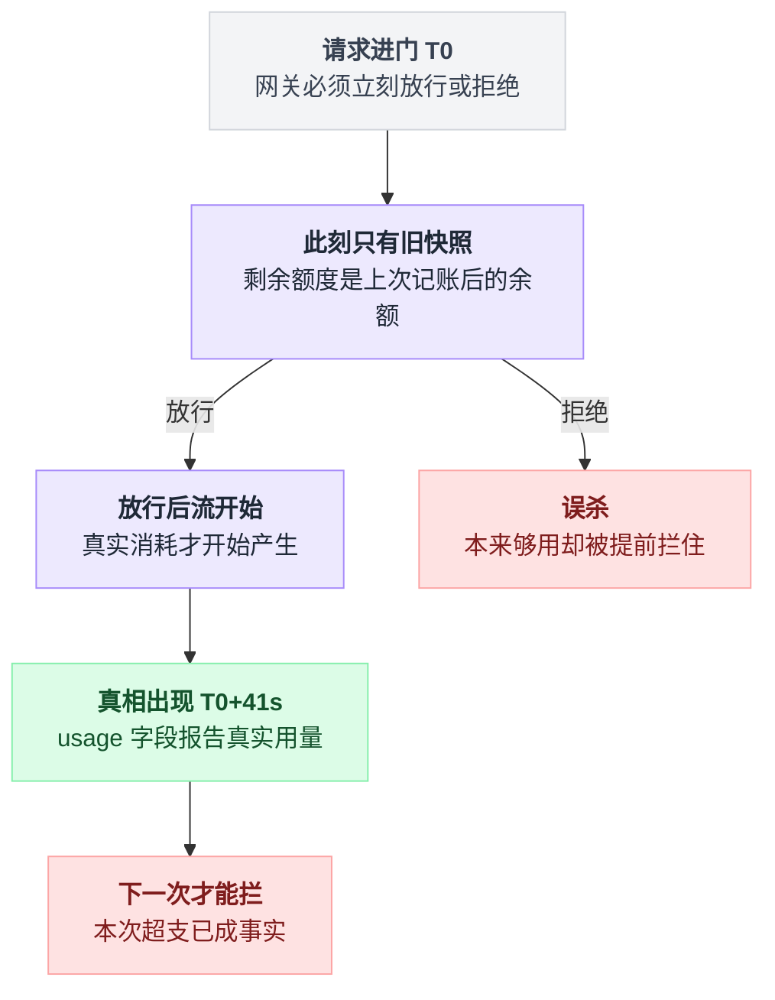
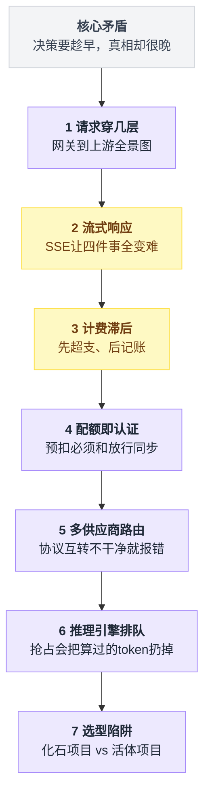
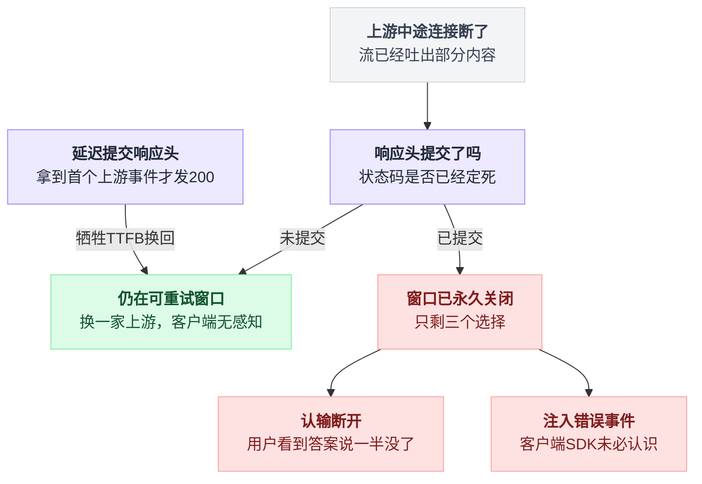
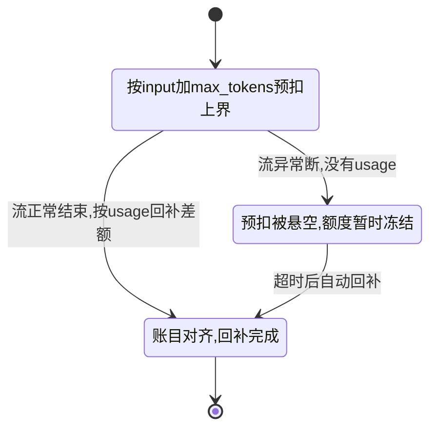
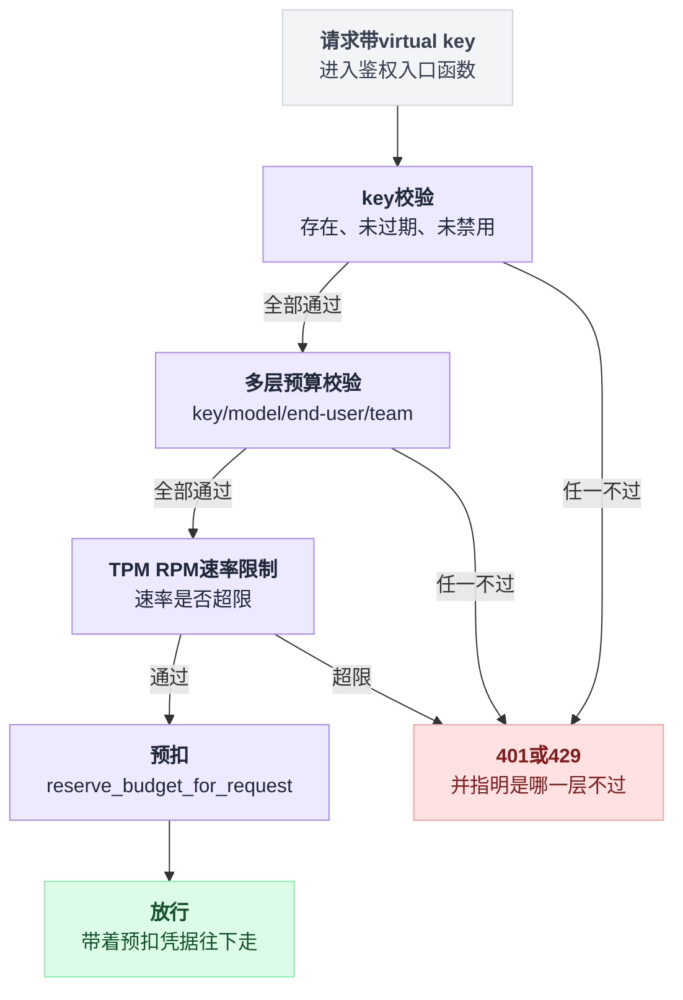
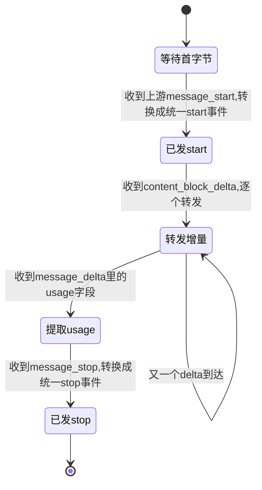
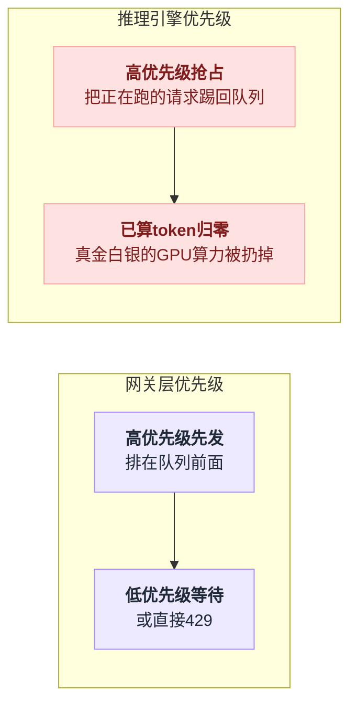

# 《AI 网关的高并发》token 配额，为什么注定拦不住第一次超支（小白版）

> 一句话结论：**token 配额在物理上不可能事前精确**——限流决策必须在**请求头阶段**做出，而 token 用量只有在**响应流结束后**才能从 `usage` 里累加。所以任何 LLM 网关的限流都是"**先超支、后记账、下一次才拦**"，必然被击穿一个请求的量级。第二条：**配额不是中间件，它是认证的一部分**——LiteLLM 把 virtual key 校验、多层预算、TPM/RPM 全塞进同一个入口，因为放行决策必须和扣费决策看到同一份快照。
>
> 难度：★★★★☆
>
> 写作时间：2026-08-05。文中 star 数与最后提交时间为当日实测；源码细节基于公开仓库，未经一手核实的说法在文中已标注。

---

## 目录

- [0. 开场：一个用户一次请求，把团队当月额度打穿了](#0-开场一个用户一次请求把团队当月额度打穿了)
- [1. 一次请求要穿过几层](#1-一次请求要穿过几层)
- [2. 流式响应：SSE 把每一层都变难了（本篇主菜之一）](#2-流式响应sse-把每一层都变难了本篇主菜之一)
- [3. token 计费为什么必然滞后（本篇主菜之二）](#3-token-计费为什么必然滞后本篇主菜之二)
- [4. 配额不是中间件，它是认证的一部分](#4-配额不是中间件它是认证的一部分)
- [5. 多供应商路由与故障转移](#5-多供应商路由与故障转移)
- [6. 再往下一层：推理引擎自己怎么排队](#6-再往下一层推理引擎自己怎么排队)
- [7. 一个必须讲的选型陷阱：化石与活体](#7-一个必须讲的选型陷阱化石与活体)
- [8. 反直觉结论](#8-反直觉结论)
- [9. 一句话总结、小白词典、和前几篇的对照](#9-一句话总结小白词典和前几篇的对照)

---

## 0. 开场：一个用户一次请求，把团队当月额度打穿了

### 0.1 需求长什么样

你在公司搭了一个内部 AI 网关。所有业务线不直接连大模型厂商，统一走你这一层，理由很正当：统一鉴权、统一审计、统一控成本。

产品需求就一句话：

> 每个团队每月有 token 额度，用超了就拦住，别让某个团队把公司的账单捅穿。

你听完觉得这不就是限流吗。[第 04 篇《分布式限流器》](./04-分布式限流器.md)整篇讲的就是这个：Redis 计数器、令牌桶、滑动窗口、Lua 脚本保原子。照抄一遍，一天写完。

### 0.2 最朴素的做法：Redis 计数器

```
# 伪代码，网关的请求入口
used = redis.get("quota:team:{team_id}:2026-08")
if used >= QUOTA:
    return 429                       # 拦住
resp = call_upstream(request)        # 放行
redis.incrby("quota:team:{team_id}:2026-08", resp.usage.total_tokens)
```

这段代码放在任何一篇讲限流的文章里都算标准答案。它在传统业务上也确实是标准答案。

差别在这张表里：

| | 传统业务限流 | AI 网关限流 |
|---|---|---|
| 限的是什么 | 次数 | token |
| 单次请求的成本 | 均匀的、事前可知的 | 事前不知道 |
| 请求进门那一刻，这个数是多少 | 已经确定了，就是 1 | **不存在** |

一次下单就是一次下单，一次查询就是一次查询——传统业务限的是次数，而次数在请求进门那一刻就定死了。

AI 网关限的不是次数，是 **token**。而 token 这个数字，在请求进门的那一刻**不存在**。

### 0.3 把这笔账算给你看

先建立一个量级感。假设这个团队当月额度是 1,000 万 token（下面所有数字都是为了说明量级的假设值，不是实测 benchmark）：

```
   传统限流：一次请求 = 1 个单位，事前已知，超支上界 = 1 次
   ────────────────────────────────────────────────────────
   AI 网关：一次请求 = ??? 个单位，事前不知道

   一个 agent 类应用的典型单轮：
     输入  整个代码仓库 + 工具定义 + 历史消息  180,000 token
     输出  一份完整重构方案                     12,000 token
     ────────────────────────────────────────────────────
     单轮                                     192,000 token

   额度 10,000,000  ÷  192,000  ≈  52 轮
```

**52 轮。** 一个用户开一个 agent 循环，让它自己读文件、自己调工具、自己迭代，跑一个下午就到了。

而 agent 循环最恶劣的一点是：**它每一轮都把前面所有轮的内容重新塞回上下文**。这件事[agent 系列第 1 篇《AI Agent 长上下文方案调研》](../2026-07_agent当前发展/1_aiagent长上下文方案调研.md)拆得很细，本篇不重复，你只要记住结论：**agent 的 token 消耗对轮数不是线性的，是超线性的**。

现在把这个量级和上面那段 Redis 代码放在一起看：

```
   T0      redis.get → used = 9,900,000 < 额度 10,000,000  →  ✓ 放行
           │  此刻你知道的：这个 team 还剩 100,000 token
           │  此刻你不知道的：这次请求会花掉 192,000
           ▼
   T0+41s  流结束，usage.total_tokens = 192,000
           redis.incrby(+192,000) → used = 10,092,000
           账面：超支 92,000 token，已经花掉了，追不回来。
           下一次请求才会被 429 拦住。
```

**这不是 bug。这是 HTTP 请求-响应模型和 LLM 计费模型之间的一条物理裂缝。** 你在 T0 时刻不可能知道 T0+41s 的数字，除非你不放行。

### 0.4 更糟的：并发把裂缝撑成豁口

上面只是一个请求。真实场景是这个团队有 30 个人同时在用：

```
   已用 9,900,000 / 10,000,000        剩余额度 100,000
        ├── 请求 1  T0.000  get→9,900,000 < 上限  ✓ 放行
        ├── 请求 2  T0.003  get→9,900,000 < 上限  ✓ 放行
        │   ……
        └── 请求 30 T0.240  get→9,900,000 < 上限  ✓ 放行
            （30 个都在同一个"记账真空期"里看到了同一个旧数字）

   40 秒后 30 条流陆续结束一起 incrby：
   used = 9,900,000 + 30 × 192,000 = 15,660,000
   预算 1,000 万，实际花了 1,566 万。超支 56%。
```

这里有个坑，而且是有经验的人最容易踩的那种：**这个洞不是"用 Lua 脚本把 get 和 incr 做成原子"能补上的。**

原子性解决的是"两个请求读到同一个旧值"，可这里 30 个请求读到的**本来就是同一个正确的旧值**——因为它们的消耗还没发生。你把 GET+INCRBY 写成一条 Lua 脚本、上分布式锁、换成 CAS，一个 token 都省不下来。

[第 04 篇](./04-分布式限流器.md)讨论的是"限流器自己怎么不成为瓶颈"——单机限流、Redis 集中式限流、令牌桶预分配，全在解决限流器的性能和精度。本篇要讨论的是更靠前的一件事：**限流器连自己在限什么都不知道。**

这条裂缝画成一张图会更直观——网关必须在决策点上动手，而真相要晚很久才出现：



### 0.5 本篇路线图

| 症状 | 根因 | 第几节 |
|---|---|---|
| 一个请求打穿额度 | 用量只有事后才知道 | 第 3 节（主菜二） |
| 超时了不敢重试、熔断器永远显示健康 | 响应是流，不是一个包 | 第 2 节（主菜一） |
| 配额中间件读到的余额是过期的 | 放行和扣费不在同一个快照里 | 第 4 节 |
| 换个供应商重试，结果 400 | 协议不互转，failover 就是换个域名报错 | 第 5 节 |
| 网关标了高优先级，还是排在后面 | 真正的队列在推理引擎里 | 第 6 节 |

把这张表往下拆到章节，全篇其实是同一条裂缝在七个环节里的展开：



---

## 1. 一次请求要穿过几层

在动手之前，先把一次请求的全程摆出来。这张图后面每一节都会回来指一遍。

```
  客户端
    │  POST /v1/chat/completions   {"model":"...","stream":true, messages:[...]}
    ▼
 ┌──────────────────────────────────────────────────────────────┐
 │  AI 网关                                                      │
 │  ① 鉴权     key 是真的吗？属于哪个 team？  ← 第 4 节：不能用 == │
 │  ② 配额     还有额度吗？   ← 第 3、4 节：只能看到旧快照         │
 │  ③ 路由     这个 model 名映射到哪个 channel？哪个上游？         │
 │  ④ 协议转换  OpenAI 格式 → 上游要的格式  ← 第 5 节：网关的本体   │
 │  ⑤ 上游调用  带上游 key 发出去                                 │
 │  ⑥ 流式回传  一边收 SSE 一边吐给客户端  ← 第 2 节：这里最难      │
 │  ⑦ 记账     流结束后从 usage 拿真实 token 数写回 Redis/DB      │
 │              ← 第 3 节：永远发生在客户端已经拿到内容之后         │
 └──────────────────────────────────────────────────────────────┘
    │
    ▼
  上游厂商 / 自建 vLLM 集群   ← 第 6 节：这里面还有一层队列
```

### 1.1 和第 26 篇追踪的形状对照

[第 26 篇《全链路追踪》](./26-全链路追踪.md)里，一次请求的 span 树是这个形状：入口 span 几十毫秒，里面挂着一串更短的 RPC span 和 SQL span，最深的那个可能 5 毫秒。整棵树在一次呼吸的时间里长完。

AI 网关的 span 树长这样：

```
   传统微服务的一次 trace              AI 网关的一次 trace
   ────────────────────────           ────────────────────────
   gateway        ████ 48ms           gateway     ██████████████ 41,300ms
   ├ auth         █    3ms            ├ auth           █     4ms
   ├ order-svc    ███ 31ms            ├ quota-check    █     2ms
   │ ├ SQL        █    6ms            ├ upstream-llm ████████ 41,180ms
   │ └ redis      ▏    1ms            │  ├ TTFB      ██         890ms
   └ mq-produce   ▏    2ms            │  └ streaming ███████ 40,290ms
                                      └ billing        █     6ms
                                        ↑ 客户端早在这之前就走了
   耗时均匀，最长一跳占三分之二        99.7% 在一跳里，而且那一跳
                                      内部你什么都看不到
```

两个直接后果：

1. **P99 延迟这个指标在这里几乎没有意义**。有意义的是 TTFB（首 token 时间）和 token 间隔——用户感知的"卡"是"字停了"，不是"总耗时长"。这和[第 06 篇《直播弹幕与广播》](./06-直播弹幕与广播.md)里长连接的观测口径是同一套思路：连接建立多久不重要，消息之间的间隔才重要。
2. **`billing` 那个 span 挂在整棵树的最后**，而客户端在它开始之前就已经拿到全部内容、关掉页面走人了。第 3 节整节都在讲这一个事实的后果。

---

## 2. 流式响应：SSE 把每一层都变难了（本篇主菜之一）

一句话地图：SSE 的事件边界和 TCP 的字节边界不对齐 → 必须挂一个跨回调存活的缓冲区 → 而且超时、重试、熔断这三件传统 HTTP 上的成熟工具，在流式下会全部失效。

只有 2.4 那三件事是**写错了不会报错**的，那一节最值钱。

### 2.1 先说清楚 SSE 长什么样

SSE（Server-Sent Events）是个朴素到极点的协议：`Content-Type: text/event-stream`，然后服务端不停往连接里写文本，**每个事件用一个空行（`\n\n`）结尾**，最后一个事件通常是 `data: [DONE]`。

```
data: {"choices":[{"delta":{"content":"分布"}}]}
                                                  ← 这个空行才是事件分隔符
data: {"choices":[{"delta":{"content":"式系统"}}]}

data: [DONE]
```

看起来简单得不值得单开一节。问题在于：**"每个事件用空行结尾"是应用层的约定，而网关拿到的是传输层的字节。这两者的边界完全不对齐。**

### 2.2 主菜第一刀：跨 chunk 的半个事件

Higress 的 ai-proxy 插件（`plugins/wasm-go/extensions/ai-proxy/main.go`，已读源码）有一个回调叫 `onStreamingResponseBody`。它的签名大意是这样：

```
onStreamingResponseBody(这一段字节, 是不是最后一段) -> 要转发给下游的字节
        ↑ 上游每到一段响应体，就调你一次
```

关键在于：**这一段字节的边界，是 TCP/HTTP chunk 的边界，和 SSE 事件的边界毫无关系。**

```
  上游真正想说的（3 个完整 SSE 事件）：
  ┌─────────────────────────────┬──────────────────────────────┬─────────────────┐
  │ data: {"delta":"分布"}\n\n   │ data: {"delta":"式系统"}\n\n  │ data: [DONE]\n\n │
  └─────────────────────────────┴──────────────────────────────┴─────────────────┘

  网关实际收到的（4 次 onStreamingResponseBody 回调）：
  ┌──────────────────┬────────────────────────────┬──────────────┬────────────┐
  │ data: {"delta":"分│布"}\n\ndata: {"delta":"式系 │统"}\n\ndata: │ [DONE]\n\n │
  └──────────────────┴────────────────────────────┴──────────────┴────────────┘
           ▲                       ▲                     ▲
    切在 UTF-8 多字节         切在 JSON 字符串中间   切在 "data:" 和值中间
    字符的中间
```

三处切口，每一处都能让"拿到 chunk 就 `json.Unmarshal` 一下"这种写法炸掉：

| 切口切在哪 | 你会拿到什么 |
|---|---|
| UTF-8 多字节字符中间 | 乱码字节 |
| JSON 字符串中间 | 反序列化失败 |
| `data:` 和值之间 | 连这是不是一个事件都判断不出来 |

反过来也成立：**一个 chunk 里可能有 5 个完整事件 + 半个**。所以不存在"一个 chunk 一个事件"这种简化假设。

### 2.3 正确的做法：一个跨回调存活的缓冲区

唯一的解法是在插件上下文里挂一个 buffer，**它的生命周期比单次回调长**：

```
  状态：buffer = ""（每个请求一份，跨 chunk 存活）

  ┌── 收到 chunk ────────────────────────────────────────┐
  │  1. buffer = buffer + chunk       ← 先接上上次的残尾  │
  │  2. 按 "\n\n" 切分 → 完整事件 event[0..n-1] + 残尾 tail│
  │  3. buffer = tail                 ← 残尾留到下一次    │
  │  4. 对每个完整事件：解析 / 改写 / 累加 usage           │
  │  5. 把改写后的完整事件拼起来返回给下游                 │
  │     （残尾一个字节都不能提前吐出去）                   │
  └──────────────────────────────────────────────────────┘

  endOfStream = true 时：buffer 里如果还剩东西，要么是上游没发完整，
  要么是没有结尾空行的最后一个事件 → 必须有明确处理，不能默默丢
```

第 3 步和第 5 步是全部难点：

- 第 3 步写错（把 tail 也当完整事件解析）→ 偶发解析失败；
- 第 5 步写错（把 tail 也转发出去）→ 下游收到半个 JSON，SDK 抛异常。

**两者都只在负载高、包被切得更碎的时候出现，测试环境永远复现不了。**

⚠️ 这类 bug 有一个共同特征：**它的触发概率和"上游一次写多少字节"有关，而这件事你完全控制不了**——取决于上游服务端的实现、中间有几层代理、MTU、TLS record 大小。

所以"我本地跑了一百次都没事"什么都不能证明。写这段代码时，**必须用人为切碎的字节流做测试**：把一个完整响应按 1 字节、3 字节、7 字节切开重放，能全过才算对。

### 2.4 主菜第二刀：超时、重试、熔断，在流式下全部失效

这一节比缓冲区更值钱，因为缓冲区写错了会报错，而下面这三件事写错了**不会报错**。

**超时：你到底在超时什么。** 传统 HTTP 超时是一个数：请求发出到响应完成，超过 N 秒算失败。

放到 LLM 上这个数你怎么填都错。一次长输出的真实时间线是「0s 发出 → 890ms 首 token → 41s 结束」：整体超时设 30s 会把正常请求自己掐死，设 300s 则上游真挂了连接要挂 5 分钟才释放。

正确的口径是三个不同的超时，分别对应三种不同的故障：

| 超时类型 | 盯的是 | 典型故障 |
|---|---|---|
| 连接/握手超时 | TCP + TLS 建立 | 上游域名解析炸了、网络不通 |
| **首字节超时（TTFB）** | 请求发出 → 第一个 SSE 事件 | 上游排队排爆了、模型没加载 |
| **事件间隔超时（idle）** | 上一个事件 → 下一个事件 | 上游中途卡死、连接半开 |

**整体超时在流式场景下应该取消，或者设成一个只用于兜底的大值。** 真正干活的是后两个，尤其是**事件间隔超时**——它是流式世界里"对端还活着吗"的唯一可靠信号。

这和[第 06 篇《直播弹幕与广播》](./06-直播弹幕与广播.md)里长连接的心跳是同一个道理：**在一条一直开着的连接上，"没有消息"和"对端死了"在字节层面长得一模一样，你必须自己定义一个"多久没动静就算死"。** 06 篇靠心跳包主动探活，SSE 里靠 token 本身当心跳——反正模型正常工作时会持续吐字。

**重试：流已经吐出去一半了，你重试什么。** 这是流式最狠的一刀。

```
   非流式（传统）                    流式
   ────────────────────             ──────────────────────────────
   T0  发请求                       T0       发请求
   T1  上游 500                     T1       上游 200 + headers
   T2  ✓ 换一台重试                          → 网关已把 200 转给客户端
   T3  客户端只看到一个结果          T2..T30  吐出 3,000 个 token
                                    T31      上游连接断了
                                    T32      ✗ 重试？客户端已经看到
                                               3,000 个 token 了
```

**HTTP 响应头一旦发给客户端，状态码就定死了，重试的窗口就永久关闭了。** 你现在只有三个选择，没有第四个：

| 选择 | 做法 | 代价 |
|---|---|---|
| 认输 | 断开连接，客户端自己处理 | 用户看到答案说到一半没了 |
| 注入错误事件 | 往流里写一个 `data: {"error":...}` | 客户端 SDK 未必认识这个格式 |
| **延迟提交响应头** | 拿到首个上游事件之前，先不给客户端发 200 | 牺牲 TTFB，换回"首字节前可重试" |

把这条判断画成一张图更直观：



第三种是唯一能真正做到重试的做法，而且它的边界非常清楚：**可重试的窗口 = 首字节到达之前**。

这个窗口有多长？就是上面那张图里的 890ms。**在这 890ms 内上游报错，你可以无损换一家重试；过了这 890ms，任何故障都是不可恢复的。**

💡 这和[流量系列 01 篇《快速失败与丢弃》](../2026-08_流量扛不住了怎么办_六种真实做法/01-秒杀抢票热点查询-快速失败与丢弃.md)是同一个思想的两面：那篇说"要失败就早点失败"，本篇给出了一个物理上被迫如此的例子——**在流式场景里，你连"晚点失败"这个选项都没有，超过首字节这条线，系统就丧失了处理失败的能力。**

**熔断：熔断器会告诉你上游 100% 健康。** 传统熔断器（Hystrix/Sentinel 那一类）统计的是**响应状态码和异常率**。流式下：

```
   熔断器看到的                      实际发生的
   ─────────────────                ────────────────────────────────
   200 OK  ✓                        流吐了 3 个 token 就断了
   200 OK  ✓                        流吐了 1 个 token 就断了
   200 OK  ✓                        流开头就是 data: {"error": ...}
   200 OK  ✓                        流正常
   ────────────────                ────────────────────────────────
   成功率 100%                       实际可用率 25%
   熔断器：一切正常，继续打            用户：这网关坏了
```

**因为状态码在流开始之前就已经写成 200 了。** 上游后面发生什么，熔断器一无所知。

所以 AI 网关的健康判定必须换指标，而且这些指标只能在流结束时才能算出来：

- 流是否走到了正常终止（收到 `[DONE]` 或上游的终止事件）；
- 流结束时有没有 `usage` 记录（这条第 3 节还会再提一次，它是个信号量极大的信号）；
- 输出 token 数是否异常偏低（大量 1~3 token 就结束的流 = 上游在软性拒绝）；
- 首字节时间的分布是否整体右移。

一句话：**流式系统的熔断器必须是"事后统计型"的，它永远落后于当前的故障至少一个请求周期。**

这个"落后一个周期"的形状，和第 3 节的配额是**同一个形状**——现在你应该开始感觉到，本篇所有的难点其实是同一个难点的不同投影。

---

## 3. token 计费为什么必然滞后（本篇主菜之二）

一句话地图：决策发生在请求头阶段 → 用量到流结束才出现 → 中间这段"记账真空期"就是超支的全部来源 → 你能做的只是给超支画一个上界。

3.3 那节讲 Redis key 的花括号，是全篇唯一一个纯 Redis 知识点，和主线关系最浅，赶时间可以跳。

### 3.1 Higress 是在哪一步做限流决策的

Higress 有个插件叫 `ai-token-ratelimit`（`plugins/wasm-go/extensions/ai-token-ratelimit/main.go`，已读源码）。它的结构简单到可以一句话说完：

```
  ┌────────────────────────────────────────────────────────────┐
  │  onHttpRequestHeaders  ← 请求头阶段，body 都还没读完         │
  │    查 Redis：这个 key 在当前时间窗口里，剩余 token 还够吗？   │
  │      够 → 放行      不够 → 直接 429，请求不会发给上游        │
  └────────────────────────────────────────────────────────────┘
                             │
                             ▼   （几十秒过去了）
  ┌────────────────────────────────────────────────────────────┐
  │  流结束                                                     │
  │    从响应里拿 usage → 把用掉的 token 数扣回 Redis           │
  │    ⚠️ 流结束了但压根没有 usage 记录 → 跳过，这一次不扣       │
  └────────────────────────────────────────────────────────────┘
```

在请求头阶段拦是**对的**——那是唯一能做到"不浪费上游算力"的位置：等到 body 解析完再拦，你已经读完了整个请求；等到响应回来再拦，上游的 GPU 已经烧完了。

但正因为它拦在请求头阶段，它做决策时**能看到的信息只有"上一次记账之后的余额"**。这就是那条物理裂缝，Higress 没有绕过它，**任何网关都绕不过它**。

### 3.2 那个"没有 usage 就跳过"的分支，是最诚实的一行代码

源码里有一条分支：流结束了，但没有 usage 记录，就跳过扣费。写成伪代码就一句：

```
on_stream_end(resp):
    if resp.usage is None:
        return                                  # 跳过，这一次一个 token 都不扣
    deduct(redis_key, resp.usage.total_tokens)
```

第一眼看像是防御性编程，想一层就知道它有多要命：

```
   请求 A  → 上游正常返回 usage  → 扣 192,000  → 账对上了
   请求 B  → 上游只吐了半截就断  → 没有 usage  → 扣 0
   请求 C  → 上游格式变了，usage 字段位置变了 → 解析不到 → 扣 0
   请求 D  → 客户端中途断开，网关没读到流尾 → 没有 usage → 扣 0

   B、C、D 三种情况：算力全烧了，账面一分没记。
```

**"没有 usage 就跳过"的另一面是"没有 usage 就白嫖"。** 而 B、C、D 三种情况在真实流量里的占比一点都不低——尤其是 D，用户点了"停止生成"就是 D。

这不是 Higress 写得不好。你换个写法试试：

| 换成这么写 | 后果 |
|---|---|
| 没有 usage 就按估算值扣 | 估算错了就是给用户乱记账 |
| 没有 usage 就按 `max_tokens` 扣 | 用户点一下停止就被扣满额 |

**这里没有正确答案，只有你愿意承担哪一边的误差。** 大多数实现选择了"少扣"，因为多扣会有客诉，少扣只是自己吃亏。

⚠️ 自查清单：如果你在做 AI 网关的成本核算，**先去查一下"网关记账的 token 总量"和"厂商账单上的 token 总量"差多少**。这两个数差 5% 以内算健康，差 20% 以上说明你的 usage 采集在某条路径上系统性漏了。

这是一次[第 10 篇《支付与对账》](./10-支付与对账.md)意义上的标准对账——只不过对的不是钱，是 token。

### 3.3 那把 Redis key，以及花括号

Higress 的 Redis key 长这样（已读源码）：

```
higress-token-ratelimit:{rule_name}:{limit_type}:{time_window}:{key_name}:{key_value}
                        └───────┘
                        这对花括号是 hash tag，不是占位符语法
```

我第一遍读错了，以为那对 `{}` 是模板占位符——毕竟后面 `{limit_type}`、`{time_window}` 看起来也像。**不是。** 只有第一对 `{}` 会真实地出现在最终 key 里，它是 Redis Cluster 的 **hash tag**。

**为什么必须有它。** Redis Cluster 把 keyspace 切成 16384 个槽（slot），每个 key 用 `CRC16(key) mod 16384` 算出自己属于哪个槽，槽再分配给不同节点。

**多 key 操作（MGET、Lua 脚本的多个 KEYS、事务）要求所有 key 落在同一个槽**，否则直接报错：

```
  (error) CROSSSLOT Keys in request don't hash to the same slot
```

限流器天生是多 key 操作——一条规则往往要同时读写"分钟窗口"和"小时窗口"两个计数器，或者一次性检查同一规则下的多个维度。所以：

```
  ❌ 没有 hash tag
  key A = higress-token-ratelimit:rule1:...:1m:apikey:sk-aaa
  key B = higress-token-ratelimit:rule1:...:1h:apikey:sk-aaa
          CRC16(整串) mod 16384 → slot 9421 / slot 312 → 节点 3 / 节点 1
  EVAL script 2 keyA keyB  →  CROSSSLOT，脚本根本跑不起来

  ✓ 有 hash tag
  key A = higress-token-ratelimit:{rule1}:...:1m:apikey:sk-aaa
  key B = higress-token-ratelimit:{rule1}:...:1h:apikey:sk-aaa
                                  └──┬──┘ CRC16 只算 "rule1"
                                     ▼  同一 slot、同一节点，EVAL 可原子执行 ✓
```

规则很简单：**如果 key 里有一对 `{}` 且中间非空，Redis 只对花括号内的内容做 CRC16。** 于是"同一条限流规则下的所有 key"被强制拉到同一个节点，Lua 脚本能原子地读改多个计数器。

**代价也要写出来。** hash tag 不是免费的。

规则 `rule1` 就算覆盖 10 万个 API key，这 10 万个计数器也全在同一个 Redis 节点上——**加节点扩不了这条规则的容量，这条规则的上限就是单节点上限。** 这就是[第 04 篇《分布式限流器》](./04-分布式限流器.md)反复讲的"限流器自己会成为瓶颈"在 Redis Cluster 上的具体形态。

所以 hash tag 的粒度要谨慎：用 `{rule_name}` 是一种权衡（同规则原子性优先），如果你的规则数很少而 key 数很多，就得考虑把 hash tag 换成更细的维度，代价是失去跨维度原子性。**没有两全，只有你先要哪个。**

### 3.4 先超支、后记账、下一次才拦——以及怎么控住它

前面所有分析汇成一句话：

> **你无法阻止超支发生，你只能控制超支的上界。**

超支上界的公式很朴素：

```
   最大超支量 ≈ 记账真空期内的并发请求数 × 单请求最大 token 数
                （你能压缩，但压不到 0）    （你能硬性封顶）

   例：并发 30 × 单请求上限 192,000 = 5,760,000 token
       如果强制 max_tokens ≤ 4,096 且输入截断到 32,000：
       并发 30 × 36,096 = 1,082,880 token   ← 降了 81%
```

四种工程手段，按有效性排序，先给张总览：

| # | 手段 | 打在公式的哪一项 | 主要代价 |
|---|---|---|---|
| ① | 硬上限（覆盖 `max_tokens` + 截断输入） | 第二项 | 改变了用户请求的语义 |
| ② | 保守预扣（三段账） | 第二项的不确定性 | 要跑 tokenizer，吃 CPU |
| ③ | 缩短记账真空期（边流边记账） | 真空期长度 | 精度下降，缓冲区逻辑更重 |
| ④ | 降低并发 | 第一项 | 用户会排队 |

**① 硬上限（最有效，也最不体面）。** 在网关层强制覆盖 `max_tokens`，并对输入长度做硬截断或直接拒绝。

这一招之所以最有效，是因为它直接乘在公式的第二项上。之所以不体面，是因为它改变了用户请求的语义——用户要 8000 token 的输出，你给了 4096，这必须在文档里说清楚，否则就是网关在悄悄篡改请求。

**② 保守预扣（三段账）。** 放行时先按"这次可能的最大消耗"预扣，流结束后按实际用量回补差额：

```
   请求进门   input token 数（这个可以事前算！）+ max_tokens
              = 32,000 + 4,096 = 36,096  → 预扣 36,096
   流结束     实际 usage = 32,000 + 812 = 32,812
              → 回补 36,096 - 32,812 = 3,284
   流异常断   没有 usage → 预扣的 36,096 需要兜底释放机制
              （超时后自动回补，否则额度会被"泄漏"掉）
```

同一件事写成伪代码，三条路径一眼看全：

```
放行时：
    reserve = count_input_tokens(req) + req.max_tokens
    used += reserve                        # 先按上界扣满
    记一条带 TTL 的预扣凭据

流正常结束：
    used -= (reserve - usage.total_tokens) # 回补多扣的差额

流异常断（没有 usage）：
    什么都做不了 → 等 TTL 到期
    TTL 到期：used -= reserve              # 兜底释放，否则额度永久泄漏
```

画成状态机看得更清楚：预扣从来不是终态，它必须走到回补或释放：



注意第一行括号里那句：**input token 数是唯一一个事前可精确知道的量**，因为请求体就在你手上，跑一遍 tokenizer 就有了。代价是网关要为每种模型维护 tokenizer，且要吃 CPU——这是个明确的权衡，不是白拿的。

这套"预扣 → 实扣 → 回补"的形状，[计费系列第 7 篇《批量生图的预冻结三段式》](../2026-07_一分钱都不能丢_高并发计费系统解剖/7_实战案例四_批量生图的预冻结三段式.md)整篇讲的就是它，本篇不重复推导。

同样的形状还出现在[第 30 篇《购物车与库存三段账》](./30-购物车与库存三段账.md)——那篇的结论"锁定/占用是带 TTL 的软预留，靠时间自然失效"在这里**一字不改地成立**：预扣的 token 也必须带 TTL，否则一次流中断就永久吃掉一块额度，而且这种泄漏是静默的、累积的、只有月底对账才会发现。

**③ 缩短记账真空期。** 真空期 = TTFB + 流持续时间。你缩不了模型的生成速度，但可以**边流边记账**：SSE 的每个 delta 事件都带着增量内容，在流进行中就按 delta 做粗粒度累加，而不是等最后读 usage。

代价是精度（一个 delta 可能含多个 token），而且会让第 2.3 节那个缓冲区逻辑更重。**折中做法是：普通请求等 usage，大额消耗者走边流边记账。**

**④ 降低并发（最后一招）。** 给单个 key/team 设并发上限。直接乘在公式第一项上，不改任何语义，代价是用户会排队。

📌 把这四条摆在一起看，会发现一个有意思的事：**它们没有一条是在"让配额更准"，全都是在"让配额不准的后果更小"。**

这就是这一节最该带走的东西——遇到一个物理上无法精确的问题，正确的动作不是继续追求精确，是给不精确画一个上界，然后确认这个上界你付得起。

---

## 4. 配额不是中间件，它是认证的一部分

一句话地图：拆成两个中间件 → 两次读可能落在两个快照上 → 一个请求的错判 = 十几万 token → 所以 LiteLLM 把预算和预扣全塞进鉴权函数。4.3 的缓存击穿和 4.4 的定长比较，都是这个"全塞进鉴权入口"的直接副产品。

### 4.1 你的第一直觉，和它为什么错

任何写过 Web 框架的人，看到"鉴权 + 配额"都会本能地拆成两个中间件：`AuthMiddleware`（验 key、查出 user_id）→ `QuotaMiddleware`（查余额、不够就 429）→ `Handler`。干净、职责单一、符合所有教科书。

它错在**这两个中间件各自去查了一次数据源，而它们查到的可能不是同一个快照**：

```
   T0.000  AuthMiddleware   从缓存读 key 记录 → {team: T1, 预算快照 V1}
   T0.001  （另一个请求刚好把 T1 的预算扣爆，DB 里已是 V2）
   T0.002  QuotaMiddleware  从缓存/DB 读预算 → 读到 V2？还是缓存里的 V1？
                            取决于两次读走的是不是同一条缓存路径

   最糟：Auth 读缓存命中 V1，Quota 读 DB 拿到 V2
   → 鉴权认为这个 key 有效且属于 T1，配额认为 T1 已经超了，
     两者对"这个 key 现在的状态"的判断来自两个不同的时刻。
```

在传统业务里这点偏差无所谓。

在 AI 网关里，第 3 节已经告诉你：**一个请求的错判 = 十几万 token。** 于是"两个中间件读到同一份快照"从一个洁癖问题变成了一个成本问题。

### 4.2 LiteLLM 的答案：全塞进一个鉴权入口

LiteLLM（`BerriAI/litellm`，55,599 star / pushed 2026-08-05，2026-08-05 实测）把这些全部放进了 `litellm/proxy/auth/user_api_key_auth.py`（已读源码）。

这个文件里能看到 `_run_centralized_common_checks`、`_virtual_key_max_budget_check`、`reserve_budget_for_request` 这些函数——注意它们的位置：**它们不在某个 `quota.py` 里，它们在 `auth` 目录的鉴权主流程里。**

一次请求要穿过的预算闸门：

```
     请求带着 virtual key 进来
                ▼
     ┌────────────────────────────────────────────────┐
     │  user_api_key_auth  —— 一个函数，一份快照        │
     │   ① key 存在吗、没过期吗、没被禁用吗              │
     │   ② virtual key 自己的 max_budget                │
     │   ③ 这个 key 对这个 model 的预算                 │
     │   ④ end-user 的预算   ⑤ team 的预算              │
     │   ⑥ soft budget —— 超了不拦，只告警               │
     │   ⑦ TPM / RPM 速率限制                           │
     │   ⑧ reserve_budget_for_request —— 预扣           │
     └────────────────────────────────────────────────┘
        全过 → 放行 + 带着预扣凭据往下走
        任一不过 → 401 / 429，并指明是哪一层不过
```

把这条闸门画成一张图：每一层都是与门，任一层不过就直接拒绝。



三个设计点值得抄。

**（1）多层预算是"与"关系，不是"或"关系。** 任何一层不过就拦。这意味着一个 end-user 就算自己额度充裕，team 爆了照样进不来。

层次越多越安全，但也意味着排查"为什么我被 429 了"必须能定位到具体是哪一层——所以错误信息里必须带层级，否则运维会疯。

**（2）soft budget 是个被低估的设计。** 它的语义是"超了不拦，只发告警"。

为什么需要它？因为第 3 节已经证明了硬拦一定会误伤——真实业务里最常见的诉求不是"卡死"，是"到 80% 的时候让我知道"。**硬预算保护公司，软预算保护用户体验，两者必须同时存在。**

**（3）`reserve_budget_for_request` 就是第 3.4 节的预扣，只不过它发生在鉴权函数内部。** 这一点是整节的题眼：**预扣必须和"决定放行"在同一个原子步骤里**，否则你就回到了 0.4 节那个 30 个请求同时看到旧余额的场景。放行和扣费如果分成两步，中间那条缝就是超支的入口。

一句话总结这一节：**"配额是中间件"这个直觉，来自"配额只是一个检查"这个前提。而在 AI 网关里配额不是检查，是一次带副作用的资源预留——预留必须和准入决策同时发生，所以它只能长在认证里。**

### 4.3 为什么这里会撞上缓存击穿

把预算校验塞进鉴权，意味着**每一个请求都要读一次 key 的预算记录**。这条记录当然要缓存，否则 DB 会被打死。于是经典问题来了：

```
   热门 virtual key 的预算缓存过期的那一瞬间
   ────────────────────────────────────────────────────────────
   T0.000  缓存 "budget:sk-xxx" 到期被清掉
   T0.001  请求 1   未命中 → 查 DB          ← 400 个请求
   T0.002  请求 2   未命中 → 查 DB             要的是同一个答案，
      ……                                      打了 400 次 DB
   T0.050  请求 400 未命中 → 查 DB          这就是 cache stampede

   singleflight 之后
   ────────────────────────────────────────────────────────────
   请求 1   ──▶ 我是第一个 ──▶ 查 DB ──▶ 回填缓存 ──┐
   请求 2   ──▶ 已经有人在查 ──▶ 挂起等待 ◀─────────┤
     ……                                            │  DB 查询：1 次
   请求 400 ──▶ 已经有人在查 ──▶ 挂起等待 ◀─────────┘
```

LiteLLM 在这条路径上有 cache stampede 的处理（已读源码）。原理、实现细节和几种典型踩坑，[计费系列第 17 篇番外《singleflight 入门教程》](../2026-07_一分钱都不能丢_高并发计费系统解剖/17_番外_singleflight入门教程.md)整篇讲透了，本篇不重复。

这里只补一句本场景特有的观察：**AI 网关是 singleflight 的教科书级适用场景，因为它的流量形状天生"少数 key + 高并发"。**

一个公司的 AI 网关可能只有几百个 virtual key，但每个 key 背后是成千上万的调用。传统 Web 应用的缓存击穿是"某个热点商品"这种偶发情况，AI 网关是**每个 key 都是热点**。所以这一层不做 singleflight，不是"可能会有问题"，是"上线就有问题"。

💡 顺手提一个联想：[第 15 篇《缓存三兄弟》](./15-缓存三兄弟与缓存一致性.md)把击穿、穿透、雪崩讲成了三个并列的问题。

在 AI 网关这个场景里你会发现它们的**优先级完全不同**——穿透（查不存在的 key）几乎不存在，因为 key 是你自己发的；雪崩可以靠随机 TTL 缓解；**只有击穿是结构性的、躲不掉的**，因为它由"key 少、并发高"这个业务形态直接决定。**同一套知识，在不同业务形态下的权重可以差一个数量级。**

### 4.4 `secrets.compare_digest`：凡是比较密钥的地方都不能用 `==`

LiteLLM 的鉴权路径里用了 `secrets.compare_digest`（已读源码）而不是 `==`。这是一条**跨篇复用的结论**，值得写透。

**时序攻击到底怎么攻。** `==` 比较两个字符串时，编译器和运行时都会做同一个优化：**发现第一个不同的字节就立刻返回 False**。这个优化是完全正确的，也是完全致命的。

```
   真实 key = "sk-a7f3d9e2b1c4..."
   攻击者试 = "sk-b........"     第 4 个字节就不同 → 比 4 次后返回
   攻击者试 = "sk-a7f3x......"   第 8 个字节才不同 → 比 8 次后返回
                        "返回得慢一点" = "我猜对的前缀更长" ↗

   于是：猜第 1 位 → 试 256 种挑响应最慢的 → 锁定；再猜第 2 位 → ……
   暴力破解（无侧信道）  256^n 次    ← n=32 时天文数字
   逐字节爆破（有侧信道）256 × n 次  ← n=32 时约 8,192 次
   从"宇宙热寂都试不完"降到"一个下午"。
```

有人会说：网络抖动的噪声远大于几个字节的比较耗时，这攻不动吧？

**能攻动。** 因为攻击者可以对同一个猜测发几万次请求做统计平均——噪声是随机的，会被平均掉；时序差是系统性的，不会。而且如果攻击者和你的服务在同一个机房/同一台宿主机上（云环境里这不罕见），噪声还会小一个量级。

**定长比较凭什么能防。** `secrets.compare_digest` 的核心是：**不管发现多少个字节不同，都把全部字节比完，并且用位运算把结果累积起来，最后一次性判断。**

```
   ==  的逻辑                        compare_digest 的逻辑
   ────────────────────              ──────────────────────────────
   for i in range(n):                result = 0
       if a[i] != b[i]:              for i in range(n):
           return False       ←提前      result |= a[i] ^ b[i]   ←不提前
   return True                       return result == 0

   耗时 ∝ 公共前缀长度  ← 泄漏          耗时 ∝ 总长度  ← 只泄漏长度
   （真实实现还会禁止编译器优化掉这个循环，Python 里由 C 层保证）
```

关键就是 `|=` 和 `^`：`a[i] ^ b[i]` 在两字节相同时是 0，不同时非 0；用 `|=` 累积后，只要有任何一位不同，最终 `result` 就非 0。**循环次数和内容无关，只和长度有关。**

⚠️ 两个必须知道的边界：

1. **长度不同时仍会泄漏长度信息**。所以最稳妥的写法是先对两边做哈希（哈希结果定长），再定长比较。
2. **它防的只是"比较"这一步**。如果你在比较之前先用 key 去查了一次数据库，而"key 不存在"和"key 存在但值不对"走的是不同耗时的代码路径，那你从数据库那一层又把时序泄漏回去了。**防时序攻击要看整条路径，不是换一个函数就完事。**

**这条结论的适用范围（这才是重点）。** 不只是 API key。**凡是拿用户提供的值和一个"秘密"做相等比较的地方，全部适用**：

| 场景 | 错误写法 | 正确写法 |
|---|---|---|
| API key / virtual key | `key == stored_key` | Python `secrets.compare_digest` |
| HMAC 签名校验（webhook） | `sig == expected_sig` | Go `hmac.Equal` |
| CSRF token / ticket | `token == session_token` | Java `MessageDigest.isEqual` |
| 密码重置链接里的 token | `t == db_token` | Node `crypto.timingSafeEqual` |
| 短信验证码 | `code == cached_code` | 同上（并且必须限次数） |
| 内部服务间的共享密钥 | `secret == cfg.Secret` | Go `subtle.ConstantTimeCompare` |

📌 一条可以直接写进 code review checklist 的规则：**在代码里搜 `==`，凡是右边那个变量的名字里有 key / token / secret / sig / signature / ticket / code 的，全部标出来重看一遍。**

这条规则的性价比高得离谱——它是纯机械的、可以让工具做的，而它防住的是一类能直接丢掉全部密钥的漏洞。

---

## 5. 多供应商路由与故障转移

一句话地图：先看 Higress 用几十行做的最小故障转移，再看 new-api 怎么把 30 多家供应商装进工厂，最后落到一句反直觉的话——真正定义一个 AI 网关的不是路由，是协议转换。

### 5.1 Higress 的 `OnRequestFailed`：最小可用的故障转移

Higress ai-proxy 里有个 `OnRequestFailed` 回调（已读源码），它做的事非常朴素：**多 key 轮换 + 连续失败计数 + 成功即重置**。

机制写成伪代码就三行有效逻辑：

```
每个 key 各带一个连续失败计数器 fail[key]

发请求(key):
    if 成功:
        fail[key] = 0          # 成功即归零，不是慢慢减一
    else:
        fail[key] += 1
        if fail[key] >= 阈值:
            把 key 踢出轮换     # 后续请求直接跳过它
        换下一个 key 重试
```

跑起来是这个样子：

```
   一个 provider 配了 3 个上游 key：K1 K2 K3，各带一个连续失败计数器

   帧 1   用 K1 → 429（上游限流）   K1.fail = 1  → 这次请求换 K2 重试
   帧 2   用 K2 → 200              K2.fail = 0
   帧 3   用 K1 → 429              K1.fail = 2
   帧 4   用 K1 → 429              K1.fail = 3 → 到阈值，K1 踢出轮换
   帧 N   K1 恢复后某次成功         K1.fail = 0 → 立刻回到正常轮换
                                   ↑ 是"成功即归零"，不是"慢慢减一"
```

拿它和一个完整的熔断器（半开状态、滑动窗口、错误率阈值、指数退避）比：

| | Higress 的做法 | 完整熔断器 |
|---|---|---|
| 状态 | 一个整数计数器 | 三态状态机 + 滑动窗口 |
| 恢复 | 成功即归零 | 半开态试探 + 退避 |
| 抖动敏感度 | 高（偶发成功就完全恢复） | 低 |
| 代码量 | 几十行 | 几百行 + 一堆配置 |

**"成功即重置"是这里最值得单独说的一处。** 它意味着一个 key 只要偶尔成功一次，之前累积的失败就一笔勾销——从熔断理论看这是"过于乐观"的，会在上游半死不活时反复把流量打回去。

但对 AI 网关来说，这个乐观是**合理的**：上游厂商的 429 通常是**短窗口限流**，几秒后就恢复；用悲观的退避策略反而会让本来能用的 key 长时间闲置，而 key 是花钱买的配额。

📌 这是一个很好的"够用就好"样本：**故障转移的复杂度应该匹配故障的性质。** 上游故障如果是短暂限流，简单计数器就够；如果是节点真的挂了，才需要完整熔断。上来就套 Hystrix 那一套，是在解一个你没有的问题。（顺带回扣第 2.4 节：在流式场景下，那套完整熔断器的统计口径本来就是失效的。）

### 5.2 new-api 的适配器工厂：30+ 供应商

`QuantumNous/new-api`（44,400 star / pushed 2026-08-05，2026-08-05 实测）的 `relay/` 目录里有个 `relay_adaptor.go`，核心是一个 `GetAdaptor(apiType)` 工厂函数，按 API 类型返回对应供应商的适配器；`channel/` 目录下是三十多个供应商各自的实现（**目录与文件路径已核实，函数内部实现未逐行核实**）。

同一个文件里还有一个单独的 `GetTaskAdaptor`，专门处理**异步任务类通道**（视频/音乐生成那一类，如 Kling / Vidu / Sora / Suno）。

为什么异步任务要单开一套？因为它的生命周期形状完全不同：

```
   同步对话通道                     异步任务通道
   ──────────────────────          ─────────────────────────────
   POST /chat/completions          POST /submit → 返回 task_id
     │ 一条连接从头开到尾            │ 连接立刻断开
     │ 流式吐 token                  ▼
     ▼                             客户端轮询 /fetch/{task_id} 或等回调
   流结束 → usage → 记账              ▼  几十秒~几分钟后
                                   任务完成 → 出结果 → 记账
   计费点：一次请求内               计费点：跨多次请求，失败了还要不要退？
```

**一个 `Adaptor` 接口硬套两种形状，一定会长出一堆 `if isAsyncTask` 分支。**

new-api 选择在工厂这一层就分岔，是对的：接口抽象的边界应该画在**生命周期形状**的分界上，不是画在"都是调用外部 API"这种表面相似性上。

⚠️ 事实纪律：new-api 的**计费与配额具体实现本次未核实**（只核实了 `relay/` 目录的存在与结构），所以本篇不描述它怎么扣费、怎么做配额。同理，LiteLLM `router.py` 里的路由与 fallback 逻辑**本次未核实**，第 5.1 节的故障转移分析全部基于 Higress 的 `OnRequestFailed`，不要把它当成 LiteLLM 的行为。

### 5.3 落点：协议转换比路由更能定义一个 AI 网关

现在把 5.1 和 5.2 拼起来，得到本节最重要的一句话：

> **failover 的前提是请求/响应格式可以无损互转。做不到无损互转，"故障转移"就只是换个域名报错。**

想象一下：主力上游挂了，网关自动 failover 到用另一家 API 格式的备用供应商。于是：

```
   客户端发的是 OpenAI 格式
     { "messages":[...], "tools":[...], "tool_choice":"auto", ... }
                            │
                      failover 到 Claude
                            ▼
   Claude 要的是
     { "system": "...",     ← 顶层字段，不是 messages 里的一条
       "messages": [...],
       "tools": [...],      ← tool 定义的 schema 不同
       "max_tokens": N }    ← 必填！OpenAI 里可选

   转不干净 → 400 Bad Request
   → 用户看到的不是"降级了"，是"网关坏了"
```

Higress 的 ai-proxy 有 Claude ↔ OpenAI 的双向转换（已读源码）。真正难的不是把字段搬一搬，是那些**语义不对齐**的地方：

| 维度 | 不对齐点 | 转换的代价 |
|---|---|---|
| system 消息 | 一边是 messages 里的一条，一边是顶层字段 | 可无损转 |
| `max_tokens` | 一边可选，一边必填 | 得凭空造一个默认值 |
| 工具调用 | `tool_calls` vs `tool_use`，结构与 id 规则不同 | 可转，但多轮对话里 id 要一路对应上 |
| 停止原因 | 枚举值不是一一对应 | 有损，某些原因只能映射到"其他" |
| **流式事件类型** | 一边是同构的 chunk，一边是 `message_start`/`content_block_delta`/`message_delta` 等多种事件 | **要写一台状态机** |
| **usage 的位置** | 一边在特定事件里给增量，一边要显式开启才在最后一个 chunk 给 | **直接决定第 3 节能不能记账** |

"流式事件类型"这一行提到的那台状态机，形状大致是这样：



最后两行是重点。

**流式事件类型不对齐**，意味着第 2.3 节那个缓冲区里不能只做"切分 + 转发"，还得做一台把 A 家事件序列翻译成 B 家事件序列的状态机——因为一边是"一种 chunk 类型走到底"，另一边是"用不同事件类型标记内容块的开始、增量、结束"。

这台状态机是有内部状态的（当前在第几个 content block、当前 block 是文本还是工具调用），它必须和缓冲区共存于同一个请求上下文里。

**usage 位置不对齐**，直接把第 3 节和第 5 节焊在了一起：如果协议转换那一层没把上游的 usage 正确提取出来映射到统一格式，第 3 节那个"没有 usage 就跳过扣费"的分支就会被触发——**协议转换写得不干净，最终表现为账记不上。**

这两件事表面上八竿子打不着，实际是同一条链路上的上下游。

所以，判断一个 AI 网关成不成熟，别看它支持多少家供应商（那只是个列表），看两件事：

1. **它的协议转换覆盖到流式了吗**，还是只转非流式请求；
2. **它能不能从每一家上游都稳定拿到 usage**，包括流式、包括工具调用、包括中途断流。

💡 这条"抽象能统一成功，统一不了失败"的规律，[第 35 篇《消息推送与厂商通道》](./35-消息推送与厂商通道.md)在推送领域给出了几乎一模一样的结论：通道抽象能把请求统一成一个 `Send(msg)`，但 APNs 和 FCM 的**失败语义**统一不了，错误分类那一层几乎必然漏水。

本篇是同一条规律在 AI 网关的版本，而且更严重一点——**推送那边漏水的是重试策略，这边漏水的是账。**

---

## 6. 再往下一层：推理引擎自己怎么排队

前五节都在网关层。现在往下钻一层：如果你的上游不是厂商 API 而是自建的 vLLM 集群，那么请求离开网关之后，会进入**另一个完全独立的调度器**。

一句话地图：两个队列 → 调度单位是"每一步若干 token"而不是"一个请求" → 资源不够就抢占，而抢占会把算过的 token 全部扔掉 → 于是网关层的"优先级"和这里的"优先级"根本不是一回事。

### 6.1 vLLM v1 scheduler 的两个队列

`vllm-project/vllm`（88,243 star / pushed 2026-08-05，2026-08-05 实测）的 `vllm/v1/core/sched/scheduler.py`（已读源码）里，核心结构简单得可以画在一张图上：

```
   ┌────────────┐ ──── 有资源就调进来 ───▶┌────────────┐
   │  waiting   │ ◀─── 资源不够被抢占 ────│  running   │
   └────────────┘                        └─────┬──────┘
                        每一步（step）给 running 里的请求各推进若干
                        token，总量受 token_budget 约束  ▼

   传统请求队列（线程池）            vLLM 的调度
   ────────────────────────        ─────────────────────────────
   一个请求 → 占一个 worker         step 1: A 推进 512，B 推进 128，
   跑完 → 释放 → 下一个进来                 C 刚进来先算 prefill
   = 一个不可分割的占用             step 2: 重新组批，D 可中途加入
                                   = 一连串可被打断的推进
```

一步（step）里发生的事，写成伪代码：

```
每一步 step：
    budget = token_budget                 # 这一步总共能算多少 token
    for req in running:
        分给 req 若干 token，budget 相应减少
    只要还有 budget 且资源够：
        从 waiting 里按策略（FCFS 或 priority）挑请求调进 running
    if KV cache 不够：
        preempt(按策略选中的 running 请求)  # 见 6.2
```

两个和网关直觉完全不同的地方：

**（1）调度单位是"每一步若干 token"，不是"一个请求"。** 每一步（step）有一个 `token_budget`——这一步总共能算多少 token；调度器在这个预算里决定给 running 队列中的哪些请求各推进多少。

这就是所谓 continuous batching：**新请求不用等整批跑完才能加入**，它是 LLM 服务吞吐的主要来源之一。

**（2）调度策略有 FCFS 和 priority 两种。** FCFS 先来先服务；priority 模式下，调度器按优先级决定谁先进 running、谁在资源不足时被牺牲。

### 6.2 抢占：把已经算过的 token 扔掉

这里是本节的题眼。

LLM 推理的每个正在进行的请求都占着一块 **KV cache**（可以粗略理解成"这个请求已经算出来的中间结果"）。KV cache 是有限的显存。当它不够用时，调度器要抢占（preempt）——把某个正在跑的请求踢回 waiting 队列。

踢回去的时候，被抢占请求的 `num_computed_tokens` 被**归零**（已读源码）：

```
preempt(x):
    running.remove(x); waiting.push(x)
    释放 x 占的 KV cache
    x.num_computed_tokens = 0        # 归零，之前算出来的全部作废
```

放到时间轴上看：

```
   帧 1  请求 X 已算完 60,000 token 的 prefill，正在生成
         num_computed_tokens = 60,000，占着一大块 KV cache
   帧 2  一批更高优先级的请求进来，KV cache 不够了
         调度器：抢占优先级最低的那个 → 选中 X
   帧 3  X 被踢回 waiting，KV cache 释放
         X.num_computed_tokens = 0   ← 归零
         那 60,000 token 的计算结果  ████████████████  丢弃
   帧 4  资源腾出来了，X 重新被调度 → 从 0 开始重新算那 60,000 token
```

**代价不是延迟，是算力的直接浪费。** 那 60,000 token 的 prefill 计算，GPU 是真的算过了，电是真的烧了，然后结果被扔了，还要再算一遍。

（注：vLLM 有 prefix caching 之类的机制可能让重算命中缓存，从而不必真的全部重算——**此为推论，本次未实测验证，也不在已核实的源码范围内**。这里只陈述已核实的部分：抢占时 `num_computed_tokens` 归零。）

### 6.3 落点：网关的"优先级"和这里的优先级不是一回事

现在把两层放在一起：

```
  ┌────────────────────────────────────────────────────────────┐
  │ 网关层的"优先级"                                             │
  │   高优先级排在队列前面先发给上游，低优先级等着 / 被 429       │
  │   代价：低优先级的人多等一会儿；已发出去的请求不受影响         │
  └────────────────────────────────────────────────────────────┘
                               ▼
  ┌────────────────────────────────────────────────────────────┐
  │ 推理引擎的"优先级"                                           │
  │   高优先级可以把已经在跑的低优先级请求踢回队列                │
  │   被踢的请求 num_computed_tokens 归零，之前全白算             │
  │   代价：真金白银的 GPU 算力，算了又扔                        │
  └────────────────────────────────────────────────────────────┘
   同一个词，两种东西：上面是"谁先排"，下面是"谁被牺牲"。
```

并排画一次看得更直接：



这个差别有一个非常实际的运维后果：**如果你在网关层给某类流量标了高优先级，但底层 vLLM 跑的是 FCFS，那你的优先级到上游就消失了。**

反过来，如果底层开了 priority 策略而你在网关层疯狂给流量打高优先级标签，你可能在制造大量的抢占——**吞吐不升反降，因为一部分算力花在了重算上，而监控上你只会看到"GPU 利用率很高"。**

💡 三处回接：

- [第 07 篇《股票撮合引擎》](./07-股票撮合引擎.md)里的优先队列是"价格优先、时间优先"，一个订单在队列里排队**不消耗任何计算**，撤单也不浪费什么。vLLM 的队列里排的是**已经消耗了算力的半成品**——同样是优先队列，一边排队免费，一边排队昂贵。**队列里的元素有没有"沉没成本"，会彻底改变调度策略的设计。**
- [流量系列 03 篇《丢弃与采样》](../2026-08_流量扛不住了怎么办_六种真实做法/03-IoT设备上报行情推送-丢弃与采样.md)讲过载时要果断丢弃。vLLM 的抢占是"丢弃"的一个变种，但它丢的不是**待处理的输入**，是**已完成的中间结果**。这是最贵的一种丢弃——丢在了投入之后。
- [流量系列 00 篇《队列不会创造产能》](../2026-08_流量扛不住了怎么办_六种真实做法/00-接口超时把队列调大反而OOM-队列不会创造产能.md)在这里有个变本加厉的版本：**队列不但不创造产能，在有抢占的系统里，队列还会销毁产能。**

📌 最终结论：**网关层能做的调度，上限就是"决定谁先发出去"。真正决定用户体验的排队发生在推理引擎里，那一层的调度策略你必须知道，否则网关上所有的优先级配置都是安慰剂。**

---

## 7. 一个必须讲的选型陷阱：化石与活体

这一节和技术无关，和"你选了哪个仓库"有关，而它造成的损失比前面任何一个技术问题都大。

### 7.1 两个 36k 和 44k

```
   songquanpeng/one-api            QuantumNous/new-api
   ──────────────────────         ──────────────────────
   ★ 36,204                        ★ 44,400
   最后提交 2026-01-09              最后提交 2026-08-05  ← 就是今天
        化石                             活体

   （2026-08-05 实测。one-api 的 star 数当日两次独立抓取分别为
     36,204 / 36,205，属正常漂移；停更日期两次一致。）
```

如果你只看 star，这两个是同一量级的项目，甚至老的那个还更"经典"、中文教程更多。但它已经 7 个月没有提交了，而它的分支 new-api，star 数已经反超原项目、当日仍在提交。

对普通业务组件，7 个月不提交也许还能忍。

**对 AI 网关，7 个月等于一个地质纪元**：这段时间里上游厂商会发新模型、改 API 版本、调整流式事件结构、上线新的 usage 字段。一个停更的 AI 网关，**它的"支持 30 家供应商"是一个 7 个月前的快照**。

### 7.2 判断"活体还是化石"的三条

| 信号 | 怎么看 | 为什么它比 star 靠谱 |
|---|---|---|
| `pushed_at` | 最后一次提交时间 | star 只增不减，是**历史累计**；pushed_at 是**当前状态** |
| star 增速 | 最近半年涨了多少 | 存量 star 反映的是过去的声誉 |
| 分支的 star 是否反超 | 社区已经用脚投票了 | 分支反超原项目是极强的信号 |

**star 数是一个累计量，它永远不会下降。** 这意味着一个项目死掉之后，它的 star 数会一直挂在那里，像一块化石上的花纹——好看，而且完全不代表这个生物还活着。

**评估开源项目时，star 用来筛掉太冷门的，`pushed_at` 用来筛掉已经死掉的。前者定下限，后者定生死。**

### 7.3 地址写错就是硬伤

本篇涉及的两个项目都迁移过（2026-08-05 实测）：

| 你记忆里 / 老文章里的地址 | 现在的真实地址 |
|---|---|
| `alibaba/higress` | **`higress-group/higress`** |
| `Calcium-Ion/new-api` | **`QuantumNous/new-api`** |

旧链接通常还能跳转，但仓库的规范名已经变了。写文档、写 go.mod、写 CI 配置时用旧名，短期没事，长期是雷。

### 7.4 本篇标本一览

| 仓库 | star | pushed_at | 语言 | 本篇用到的部分 |
|---|---|---|---|---|
| vllm-project/vllm | 88,243 | 2026-08-05 | Python | 第 6 节调度器 |
| BerriAI/litellm | 55,599 | 2026-08-05 | Python | 第 4 节鉴权与预算 |
| QuantumNous/new-api | 44,400 | 2026-08-05 | Go | 第 5 节适配器工厂 |
| songquanpeng/one-api | 36,204 | **2026-01-09** | Go | 第 7 节反面教材 |
| Portkey-AI/gateway | 12,647 | 2026-05-25 | TS | 路由 + guardrails（本篇未展开） |
| higress-group/higress | 9,027 | 2026-08-04 | Go | 第 2、3、5 节 |
| envoyproxy/ai-gateway | 1,900 | 2026-08-04 | Go | Envoy 之上的方案（本篇未展开） |

（全部为 2026-08-05 实测。源码细节的核实级别见各节标注。）

---

## 8. 反直觉结论

**① 把 GET 和 INCRBY 写成原子的 Lua 脚本，一个 token 都省不下来。** 依据：第 0.4 节的推演。并发请求读到的是同一个**正确**的旧值，它们的消耗尚未发生。原子性解决的是"读到脏数据"，这里没有脏数据，只有"数据还不存在"。**这是本篇最容易骗过一个有经验的工程师的地方**——限流场景下"上 Lua 保原子"是条件反射，而在这里它是无效动作。

**② 熔断器在流式场景下会稳定报告"上游 100% 健康"，哪怕实际可用率只有 25%。** 依据：第 2.4 节。HTTP 状态码在流开始之前就已经写成 200，之后所有的故障都发生在 body 里。任何基于状态码统计的健康判定，在 SSE 上都是失明的。

**③ 配额校验做成独立中间件是错的，它必须长在鉴权函数里。** 依据：LiteLLM `litellm/proxy/auth/user_api_key_auth.py`（已读源码）把多层预算和 `reserve_budget_for_request` 全部放在鉴权主流程内。原因不是代码组织偏好，是**预扣必须和准入决策原子发生**——拆成两步，中间那条缝就是超支的入口。

**④ Redis key 里的那对花括号不是模板占位符，少了它 Lua 脚本会直接 CROSSSLOT 报错；但加了它，这条规则就再也无法横向扩容。** 依据：Higress `ai-token-ratelimit` 的 key 设计（已读源码）+ Redis Cluster 的 slot 规则。hash tag 用一致性换扩展性，**它是一个权衡，不是一个最佳实践**。

**⑤ 推理引擎里的"优先级"会把已经算完的 token 扔掉重算——代价不是延迟，是算力。** 依据：vLLM `vllm/v1/core/sched/scheduler.py`（已读源码），抢占时 `num_computed_tokens` 归零。所以网关层无脑给流量打高优先级标签，可能让集群总吞吐**下降**，而监控上表现为 GPU 利用率很高。**"利用率高"和"在干有用的活"是两件事。**

---

## 9. 一句话总结、小白词典、和前几篇的对照

### 一句话总结

> **AI 网关的全部难点，都是同一条裂缝的不同投影：决策必须在请求头阶段做出，而真相要到响应流结束才出现——所以配额必然先超支后记账，熔断器必然落后一个请求周期，重试窗口必然在首字节处关闭。你能做的不是消灭这条裂缝，是给它画一个上界（并发 × max_tokens），确认这个上界你付得起，然后把预扣和放行焊死在同一次原子操作里。**

### 小白词典

| 词 | 一句人话 |
|---|---|
| **token** | 模型眼里的最小文本单位，计费和限流都按它算；一次请求要花多少，事前不知道 |
| **SSE** | Server-Sent Events，服务端不停往一条 HTTP 连接里写文本，每个事件用一个空行结尾 |
| **记账真空期** | 从"放行"到"拿到 usage"之间的那几十秒，这期间所有请求看到的都是同一个旧余额 |
| **usage** | 响应里报告本次实际消耗 token 数的字段；它只在流结束时出现，拿不到就记不上账 |
| **TTFB** | 首字节时间，从发出请求到收到第一个 token；流式场景真正该盯的延迟指标 |
| **hash tag** | Redis key 里的一对 `{}`，让 CRC16 只算括号内的内容，把多个 key 拉到同一个槽；少了它多 key 操作会报 CROSSSLOT |
| **cache stampede** | 缓存击穿：热点 key 一过期，成百上千个请求同时打 DB 要同一个答案；解法是 singleflight |
| **时序攻击** | 通过测量响应耗时反推密钥前缀，把暴力破解从 `256^n` 降到 `256×n`；靠定长比较（`compare_digest`）防 |
| **soft budget** | 超了不拦只告警的软预算，用来在硬拦之前给人一个反应窗口 |
| **continuous batching** | 推理引擎每一步都重新组批，新请求不必等整批跑完就能加入 |
| **抢占（preempt）** | KV cache 不够时把正在跑的请求踢回队列，已算的 token 归零重来 |

### 和前几篇的对照

1. **vs [第 04 篇《分布式限流器》](./04-分布式限流器.md)**：同样是限流。那篇解决的是"限流器自己怎么不成为瓶颈"——单机/集中式、令牌桶、Lua 原子性，全在提升限流器的**性能与精度**。本篇的问题在它上游一层：**限流器连自己在限什么都不知道**。那篇的所有优化在这里依然有效，但一个都救不了第 0.4 节那 56% 的超支——因为超支不是精度问题，是信息在时间上不可得。**限流器再准，也不能限一个还不存在的数字。**

2. **vs [第 06 篇《直播弹幕与广播》](./06-直播弹幕与广播.md)**：同样是长连接、同样是持续往下推数据。那篇的连接上跑的是**广播**——一条消息发给一万个人，所以核心矛盾是扇出和写放大。本篇的连接上跑的是**独占的、有状态的、还在计费的一次生成**——一条流只服务一个人，所以核心矛盾变成了"这条流中途断了怎么办"。共享的知识只有一条：**在长连接上，"没消息"和"对端死了"长得一模一样，你必须自己定义 idle 超时。** 06 篇用心跳包，本篇用 token 本身当心跳。

3. **vs [第 07 篇《股票撮合引擎》](./07-股票撮合引擎.md)**：同样是优先队列。撮合队列里排的是订单，**排队本身不消耗任何计算**，撤单几乎零成本。vLLM 队列里排的是**已经烧过 GPU 的半成品**，被抢占就意味着算过的 token 归零重来。差别在**队列元素有没有沉没成本**——有了它，"高优先级插队"从一个免费操作变成了一个会摧毁产能的操作，整个调度策略的设计前提都得推翻重来。

4. **vs [第 26 篇《全链路追踪》](./26-全链路追踪.md)**：同样是"事后才知道真相"。那篇的尾采样是**主动选择**事后决定——先收集完整条链路，看到结局再决定留不留，代价是收集端要扛全量。本篇的事后记账是**被迫**的——不是我们想等到最后，是 usage 在最后才出现。**一个是设计上选的延迟决策，一个是物理上被迫的延迟决策。** 而两者最终撞上了同一堵墙：决策点和信息点分离时，中间那段窗口里发生的一切，你只能承受。

5. **vs [第 30 篇《购物车与库存三段账》](./30-购物车与库存三段账.md)**：同样是"预留一份还没真正消耗的资源"。那篇的结论是"锁定/占用是带 TTL 的软预留，靠时间自然失效，根本不存在归还库存的定时任务"——这个结论在本篇的 token 预扣上**一字不改地成立**。区别在确定性：库存预留的量是**确定的**（下单 2 件就预留 2 件），token 预扣的量是**猜的**（按 max_tokens 猜上界），所以本篇比那篇多一步"回补差额"，也多一类那篇没有的故障——**猜得太保守，用户会被自己没花的额度挡在门外。**

6. **vs [第 35 篇《消息推送与厂商通道》](./35-消息推送与厂商通道.md)**：同样是"一个网关对接 N 家外部厂商"，同样撞上了"抽象能统一成功，统一不了失败"。那篇漏水的是**错误分类**——APNs 和 FCM 的失败语义对不齐，导致重试策略必然有一边是错的。本篇漏水的是**账**——usage 字段在各家的位置和触发条件不同，转换层稍有疏漏就落进"没有 usage 就跳过扣费"那个分支。**推送漏水的后果是多发一条通知，AI 网关漏水的后果是一次几十万 token 白送。**

### 第三辑的一条主线（收官）

这是第三辑（29~42）的最后一篇。回头看这十四篇，会发现它们撞上的是同一堵墙的不同侧面：

```
  ① 框架不是答案 —— 你以为该上框架的地方，成熟系统普遍用了更笨的东西
     29 促销没有一个用规则引擎，全是有序计算器管道
     31 Spring Statemachine 已进 spring-attic 归档
     32 全部高星标本没有一个用闭包表
     42 不存在"配额中间件"，它被塞进了认证函数里
  ──────────────────────────────────────────────────────────────────
  ② 成熟系统选"有界的不精确"，不选"无界的精确" —— 追求完整就被写爆
     30 库存软预留靠 TTL 自然失效，不追求精确归还
     33 Discourse 主动给词表设 2000 上限，不追求全召回
     34 Mastodon 硬编码 MAX_ITEMS = 800，允许不完整
     42 承认必然超支，转而给超支画上界
  ──────────────────────────────────────────────────────────────────
  ③ 抽象能统一成功，统一不了失败 —— 漏水永远漏在没人写测试的错误路径
     35 通道抽象统一了 Send()，统一不了 APNs / FCM 的错误语义
     42 协议转换统一了请求格式，统一不了 usage 的位置和时机
  ──────────────────────────────────────────────────────────────────
  ④ 仓库会迁移、会归档、会死，而 star 数不会告诉你
     31 spring-statemachine 已归档 · 37 camunda C7 已归档
     42 one-api 36,204 star 停更 7 个月，分支已反超
     ── star 是累计量只增不减；pushed_at 才是生命体征
```

而如果把整个系列（01~42）压成一句，第三辑给出的版本是这样的：

> **前 28 篇教你怎么把一件事做对；第三辑这十四篇，大多在教你怎么在"做不对"这个前提下，把损失框在一个你付得起的范围里。**

本篇是这条主线最极端的样本——因为它连"理论上能做对"都不成立。

**token 配额在物理上不可能事前精确**，这不是实现问题、不是并发问题、不是选型问题，是请求-响应模型和 LLM 计费模型之间的一条裂缝。承认它，量化它，给它画一个上界——**这就是这一辑，也是整个系列，最想让你带走的那个动作。**
