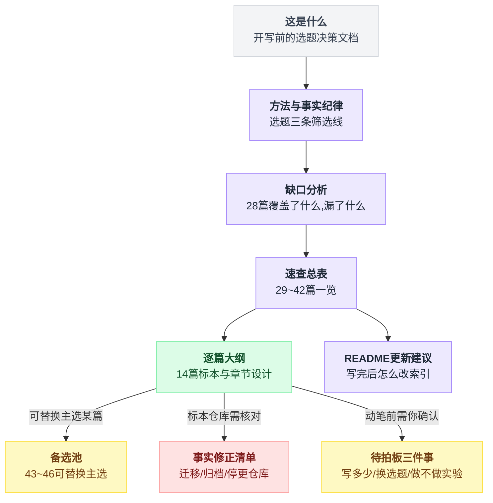
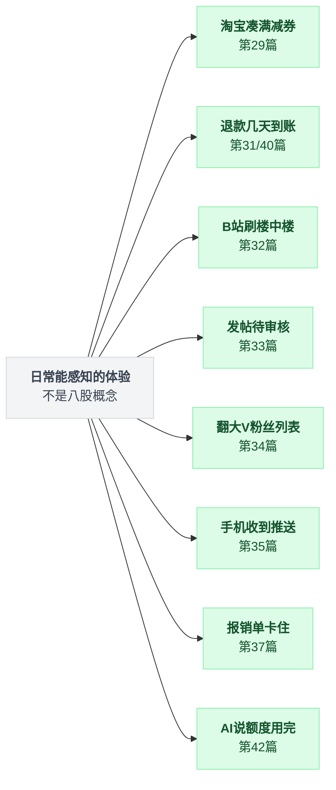
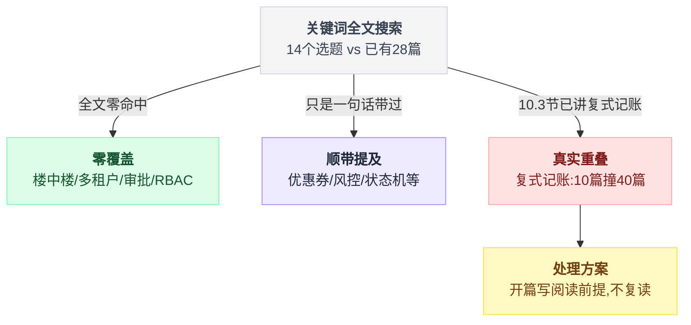

# 第三辑 · 选题清单与逐篇大纲（规划稿，待确认后开写）

> 调研时间：**2026-08-05**。文中所有 star 数、最后提交时间（`pushed_at`）均为当日通过 GitHub API 实测；标注"未核实"的条目只核实了仓库元数据，具体类名/路径需在动笔时再定位。
>
> 本篇不是正文，是**开写之前的选题决策文档**。任务有三个：
> **（1）说清已有 28 篇漏了什么；（2）给出第三辑 14 篇的选题、一句话结论草案、标本项目、章节大纲；（3）把调研中发现的"仓库已迁移/已归档"清单单列出来——这批事实会直接影响正文的正确性。**

---

## 目录

- [0. 方法与事实纪律](#0-方法与事实纪律)
- [1. 缺口分析：28 篇覆盖了什么，漏了什么](#1-缺口分析28-篇覆盖了什么漏了什么)
- [2. 第三辑速查总表（29~42）](#2-第三辑速查总表2942)
- [3. 逐篇大纲](#3-逐篇大纲)
- [4. 备选池（43~46，可替换主选）](#4-备选池4346可替换主选)
- [5. 高优先级事实修正清单：这些仓库已经不是你记得的样子了](#5-高优先级事实修正清单这些仓库已经不是你记得的样子了)
- [6. README 更新建议](#6-readme-更新建议)

---

这份文档有 7 个部分外加一个附录，先给一张导航图，按需跳转：



---

## 0. 方法与事实纪律

### 0.1 选题是怎么定的

三条筛选线，缺一条就降级到备选池。

**第一条：和已有 28 篇不重复。** 不是"标题不重复"，是"核心机制不重复"。比如"短链接系统"被砍了，因为第 12 篇已经把发号器和生日悖论讲透，再开一篇只能重复。

**第二条：有可拆解的活标本。** GitHub 上存在高星、且近期仍在提交的开源项目，能读到具体的类和方法。没有活标本的方向（电影院选座、亿级关注关系）要么降级，要么在正文里明确标注"本篇结论来自架构描述而非源码实测"。

**第三条：有反直觉结论。** 这是本系列的体裁要求。一篇文档如果只能得出"用 Redis 缓存一下"这种结论，它不值得写。下面每一篇都附了 2~4 条已经找到依据的反直觉点。

### 0.2 一条必须写进工作流的取数教训

这条是调研中间踩出来的，先说结论：**`https://api.github.com/repos/OWNER/REPO` 在本次环境下返回的是陈旧快照**，而 `https://api.github.com/search/repositories?q=repo:OWNER/REPO` 返回当日实时数据。

两个例子：

| 仓库 | `/repos/` 端点返回 | `search` 端点返回（真实） |
|---|---|---|
| keycloak/keycloak | 34,555 star / pushed 2026-05-25 | **36,013 star / pushed 2026-08-05** |
| YunaiV/ruoyi-vue-pro | 38,162 star / pushed 2026-07-07 | **38,524 star / pushed 2026-07-31** |

差了 1,458 star 和两个多月。

本系列第 13、14 篇都是"star 数当日实测"体裁，**如果当时用的是 `/repos/` 端点，数字可能是错的**。

建议后续统一走 search 端点，并且一次最多用 5 个 `user:` 限定符——超过会 422。

### 0.3 事实分级

下文每条数据按三级标注：

| 级别 | 含义 |
|---|---|
| **已读源码** | 通过 `raw.githubusercontent.com` 实际读取了文件内容 |
| **路径已核实** | 确认文件/目录存在（HTTP 200 或 contents API），未读内容 |
| **未核实** | 只核实了仓库 star/日期，类名与路径是推测，动笔前必须再查 |

---

## 1. 缺口分析：28 篇覆盖了什么，漏了什么

### 1.1 已有覆盖的地图

```
   第一辑 01~12（业务场景）        番外 13~14          第二辑 15~28（底层设施）
  ┌────────────────────────┐   ┌──────────┐   ┌──────────────────────────┐
  │ 12306 / 红包 / 时间轮    │   │ 雪花算法  │   │ 缓存三兄弟 / 分布式锁      │
  │ 限流 / Feed / 弹幕      │   │ 分库分表  │   │ Kafka / 排行榜 / 已读回执  │
  │ 撮合 / 派单 / IM        │   └──────────┘   │ 分布式事务 / LBS / 倒排    │
  │ 支付对账 / 推荐 / 小而美 │                  │ Raft / 抽奖 / 灰度 / 追踪  │
  └────────────────────────┘                  │ 秒传去重 / 分布式调度      │
                                              └──────────────────────────┘
```

**一句话概括这 28 篇的共同底色**：它们几乎全是"**C 端高并发**"题——很多人同时抢一个东西、很多人同时看一个东西、很多消息同时要送到。

### 1.2 漏掉的三大块

```
   ① 交易链路的"下半场"          ② 内容与社交的"治理面"       ③ B 端/中台的整个世界
  ─────────────────────      ─────────────────────      ─────────────────────
   券怎么叠 / 库存三段账          评论树怎么存               权限怎么落到行
   订单状态怎么跃迁              敏感词怎么防绕过             审批流怎么改版
   退款售后的逆向流程            关注关系怎么翻页             配置怎么秒级回滚
   钱在账上怎么记（复式记账）      推送怎么走厂商通道           租户怎么隔离

   秒杀讲的是"抢到"，              前 28 篇讲"送达"，          前 28 篇一篇没碰
   这块讲的是"抢到之后"            这块讲"送达之后的治理"        （这是最大的空白）
```

外加一块**时间维度的新东西**：AI 应用的高并发（流式响应、token 计费、多供应商路由）。这一块 2024 年之前根本不存在，现在已经有 4 万 star 级别的活标本了。

### 1.3 为什么这些是"业务场景类"而不是"八股类"

用户明确要求重心放业务场景。上面这三块每一块都能落到具体的产品体验上——

- 你在淘宝凑满减券 → 第 29 篇
- 你退款之后钱多久到账 → 第 31、40 篇
- 你在 B 站刷楼中楼 → 第 32 篇
- 你发帖被打回"待审核" → 第 33 篇
- 你点开某个大 V 的粉丝列表往下翻 → 第 34 篇
- 你手机收到 App 推送 → 第 35 篇
- 你提交的报销单卡在某个人那里 → 第 37 篇
- 你用的 AI 应用突然说"额度用完了" → 第 42 篇

这八个场景和篇号的对应关系摆成一张图更直观：



八股知识不是被砍掉了，而是**藏在场景里讲**：第 36 篇会把 RBAC 五张表讲透，第 39 篇会把索引最左前缀讲透，第 41 篇会把 Flink CEP 的状态后端讲透。

### 1.4 重叠自查：我把 14 个选题的关键词在已有 28 篇里全文搜了一遍

结果分三类，处理方式各不相同：



**（1）零覆盖，可以放心写**

`楼中楼`、`多租户`、`审批`、`RBAC` 在已有 28 篇里**一次都没出现过**。这四个方向是干净的空白。

**（2）只是顺带提及，不构成重叠**

| 关键词 | 出现处 | 实际语境 | 判断 |
|---|---|---|---|
| 优惠券 | 第 24 篇 16 次、第 26 篇 15 次 | 24 篇里它只是**奖品的一种**（"掷出 501~3500 → 优惠券"）；26 篇里它只是**调用链上的一个服务名**（"库存 → 优惠券 → 支付"） | 第 29 篇的"叠加顺序 / 互斥 / 封顶 / 核销"完全没被碰过 ✅ |
| 风控 | 分散在 9 篇共 28 次 | 全部是"这里还要过风控"这类一句话带过 | 第 41 篇安全 ✅ |
| 状态机 | 分散在 10 篇共 66 次 | 主要是第 10 篇把"状态机"列为资金三件套之一、第 20 篇讲 Saga 时提到 | 第 31 篇的"多张正交图 / 版本化变更集 / 框架坟场"是新的 ✅ |
| 配置中心 | 5 篇共 13 次 | 第 25 篇灰度那篇明确埋了"秒级回滚的秘密在配置中心"这个钩子 | 第 38 篇是**接钩子**，不是重复 ✅ |
| 粉丝列表 | 第 05、19 篇共 8 次 | 讲的是推拉选型时的大 V 问题 | 第 34 篇讲的是**关系存储与游标翻页**，角度不同 ✅ |

**（3）一处真实的部分重叠，必须处理**

**第 10 篇《支付与对账》已经有一整节 10.3 讲复式记账**（"所有分录之和必须为 0"、`SUM(balance)=0`、术语表里已收录"复式记账"和"分录"两个词条），共出现 10 次。

这直接撞上第 40 篇。处理方案照抄第 21 篇 LBS 对第 08 篇派单的做法——**开篇明确写"阅读前提"，不复读，只接着往下挖**：

```
   第 10 篇 10.3 节已经讲完的          第 40 篇从这里开始
  ────────────────────────        ────────────────────────
   借贷平衡是什么                   → 那为什么 TigerBeetle 连 balance 字段都不要
   分录之和必须为 0                 → 四个只增不减的累计量怎么替代它
   整数存钱、流水只追加              → 冻结/解冻凭什么是账务层原语而不是业务表
   （没讲）                        → 清算 vs 结算、分账尾差、冲正红冲、专用账本选型
```

也就是说：**第 40 篇的第 1 节要写得很短**，半页，指回第 10 篇，把篇幅全部留给第 2 节之后。

如果拍板砍到 10 篇，第 40 篇因为这层重叠，是主选里最有理由被降级的一篇——但它的一句话结论（"余额不该是一个字段"）也是全辑最锋利的一条，取舍留给你。

---

## 2. 第三辑速查总表（29~42）

| # | 标题 | 一句话结论（草案） | 难度 | 主标本 |
|---|---|---|---|---|
| 29 | 优惠券与促销叠加 | 主流开源电商里**没有一个用规则引擎算促销**，全是"有序计算器管道 + 优先级整数" | ★★★☆☆ | yudao / Shopware / Sylius |
| 30 | 购物车与库存三段账 | "锁定库存"在成熟系统里是**带 TTL 的软预留，靠时间自然失效**，没有释放库存的定时任务 | ★★★☆☆ | Saleor / Vendure / Shopware |
| 31 | 订单状态机与逆向流程 | 订单不是一个状态机，是**多张正交状态图的投影**；而 Spring 官方的状态机框架已被归档 | ★★★★☆ | Sylius / Medusa / yudao |
| 32 | 评论区与楼中楼 | 47.6k star 的 Discourse **至今用 offset 分页**；没有一个高星项目用闭包表 | ★★★☆☆ | Discourse / Lemmy / Coral |
| 33 | 敏感词过滤与内容审核 | 敏感词组件的主体代码**不是匹配算法，是归一化**——绕过永远发生在进入自动机之前 | ★★★☆☆ | houbb / Discourse |
| 34 | 关注关系与粉丝列表 | 粉丝列表的游标**必须是关系表 id 而不是用户 id**；推模式的 feed 是有界的，且允许不完整 | ★★★★☆ | Mastodon / Misskey |
| 35 | 消息推送与厂商通道 | 同一个推送网关里，**APNs 和 FCM 的重试语义是不一致的**——通道抽象能统一请求，统一不了失败 | ★★★★☆ | gorush / OpenIM / ntfy |
| 36 | 权限：从 RBAC 到数据行权限 | "RBAC 升级 ABAC"在 Casbin 里不是重构，**是改一行 matcher 字符串**；四层权限里只有数据行权限没法用注解 | ★★★☆☆ | apache/casbin / yudao |
| 37 | 审批流与工作流引擎 | "驳回到任意节点"**在 BPMN 标准里根本不存在**——这正是改了流程图老单子会炸的根因 | ★★★★☆ | Flowable / yudao-bpm |
| 38 | 配置中心与秒级回滚 | Nacos/Apollo 的"推送"**都是假推送**，本质是长轮询；而回滚能秒级，恰恰因为它根本没在回滚 | ★★★☆☆ | Nacos / Apollo |
| 39 | 多租户 SaaS 数据隔离 | 共享表模式的头号风险**不是越权，是索引**；而独立库模式一定先死在连接池上 | ★★★★☆ | MyBatis-Plus / Citus / supavisor |
| 40 | 账户体系与复式记账 | 正经账务系统里余额**既不是存出来也不是算出来的**——存的是四个只增不减的累计量，余额是它们的差 | ★★★★★ | TigerBeetle / Formance |
| 41 | 风控与反薅羊毛 | 风控系统**是攒出来的，不是下载来的**；而实时风控最贵的不是算力，是状态 | ★★★★☆ | Flink CEP / zen / QLExpress |
| 42 | AI 网关的高并发 | token 配额在物理上**不可能事前精确**——限流永远是"先超支、后记账、下一次才拦" | ★★★★☆ | Higress / LiteLLM / new-api |

**分组建议**（写作顺序与 README 分组）：

```
  交易链路下半场         内容与社交治理面        B 端中台            资金与新场景
  ───────────────      ───────────────      ───────────────    ───────────────
   29 优惠券             32 评论楼中楼          36 权限            40 复式记账
   30 购物车库存          33 敏感词审核          37 审批流          41 风控
   31 订单状态机          34 关注关系            38 配置中心        42 AI 网关
                        35 消息推送            39 多租户
```

---

## 3. 逐篇大纲

---

### 29 ｜《优惠券与促销叠加》三张券叠一单，谁先算谁后算

**一句话结论**

1. 主流开源电商里没有一个用规则引擎算促销——**全是"有序计算器管道 + 一串优先级整数"**。
2. 叠加的真正难点从来不是判断条件成不成立，是**排序、互斥图、全局封顶**这三件事。
3. 至于"核销幂等"，线上代码里它通常并不幂等：重复核销是抛异常，真正的幂等由上游订单号承担。

**难度**：★★★☆☆

**标本**

| 仓库 | star | pushed_at | 语言 | 关键路径 | 核实级别 |
|---|---|---|---|---|---|
| YunaiV/ruoyi-vue-pro | 38,524 | 2026-07-31 | Java | `yudao-module-trade/.../service/price/calculator/TradePriceCalculator.java`、`TradeCouponPriceCalculator.java`；`yudao-module-promotion/.../service/coupon/CouponServiceImpl.java` | 路径已核实 |
| shopware/shopware | 3,399 | 2026-08-05 | PHP | `src/Core/Checkout/Promotion/Cart/PromotionCalculator.php`（`buildExclusions` / `getMaxDiscountValue` / `limitDiscountResult`） | 路径已核实 |
| Sylius/Sylius | 8,509 | 2026-08-05 | PHP | `src/Sylius/Component/Promotion/Processor/PromotionProcessor.php`、`Checker/Eligibility/PromotionCouponUsageLimitEligibilityChecker.php` | 路径已核实 |
| saleor/saleor | 23,181 | 2026-08-05 | Python | `saleor/discount/utils/voucher.py`、`promotion.py` | 路径已核实 |
| macrozheng/mall | 84,506 | **2026-05-14** | Java | `mall-portal/.../OmsPromotionServiceImpl.java` | 路径已核实，**注意近 3 个月未更新** |

**章节大纲**

0. 开场：一单三张券，客服说少减了 8 块钱
   - 满 300 减 50 + 品类券 9 折 + 会员日全场 95 折，三种算法顺序 → 三个价格
   - 把三种顺序的结果都算出来给读者看，差价一目了然
1. 先把题目切开：条件、顺序、互斥、封顶
   - 大多数人只想到"条件判断"，而那是最简单的一环
2. 阶梯一：if-else 到有序管道
   - 拆 yudao 的常量定序：`ORDER_SECKILL=8 → DISCOUNT=10 → REWARD=20 → COUPON=30 → POINT_USE=40 → DELIVERY=50 → POINT_GIVE=999`
   - 每个计算器 `@Order(...)` 注册进 Spring；源码注释直接引用了有赞的公开文档
3. 阶梯二：互斥图与全局封顶（本篇主菜）

   Shopware `PromotionCalculator::calculate()` 就三步：

   ```
   calculate():
       1. sort by priority        // 谁先算
       2. buildExclusions()       // 互斥图：谁把谁挤掉
       3. limitDiscountResult()   // 全局封顶：别把总价算成负数
   ```

   - 为什么必须有全局封顶：叠加算到最后总价变负数是真实会发生的
   - 相关方法还有 `getMaxDiscountValue`
4. "最优券组合"是个 NP 问题——以及为什么没人真的去解它
   - 背包问题的形状；工程上的三个妥协：限制券数量、贪心、预计算
5. 券库存：又一个秒杀

   ```
   n = updateTakeCount(...)        // 条件更新 take_count 计数器
   if n == 0: throw COUPON_TEMPLATE_NOT_ENOUGH
   ```

   - 和第 15 篇缓存、秒杀系列的 Lua 扣减对照
6. 核销幂等的真相

   ```
   useCoupon(id):
       n = updateByIdAndStatus(id, UNUSED, USED)   // CAS
       if n == 0: throw
   ```

   第二次调用直接抛异常——**这不是幂等，是拒绝**。

   - 退款回退时的一个细节：退还时可能券已过期，回写 `EXPIRE` 而不是 `UNUSED`
7. 一个架构启发：Sylius 把促销计数挂在订单状态机回调上
   - `sylius_increment_promotions_usages` 挂在 `create` 的 after，`decrement` 挂在 `cancel`——下单服务对促销零感知
   - 这条直接引出第 31 篇
8. 反直觉结论 + 小白词典 + 对照表

**交叉引用**：券库存 → 秒杀系列 + 第 15 篇；促销计数挂状态机 → 第 31 篇；防羊毛 → 第 41 篇；预算守恒 → 第 24 篇抽奖。

**待核实**：macrozheng/mall 的 `CartPromotionItem` 具体字段；QLExpress/LiteFlow 在国内电商促销中的实际使用比例（目前只有"活动条件配置侧"这一条推测）。

---

### 30 ｜《购物车与库存三段账》"已锁定"的库存，是谁在什么时候还回来的

**一句话结论**

1. **"锁定/占用"在成熟系统里是带 TTL 的软预留，靠时间自然失效——根本不存在一个"归还库存"的定时任务。**
2. 更反直觉的是：可售量往往不是一个字段，而是一个查询表达式；库存表上那个 `quantity_allocated` 只是冗余缓存。
3. 购物车压根不存价格，价格是每次读取时重算的副产物——所以"价格变了怎么办"这个问题在架构上是不存在的。

**难度**：★★★☆☆

**标本**

| 仓库 | star | pushed_at | 语言 | 关键路径 | 核实级别 |
|---|---|---|---|---|---|
| saleor/saleor | 23,181 | 2026-08-05 | Python | `saleor/warehouse/models.py`（`Stock` / `Allocation` / `Reservation`）、`saleor/warehouse/reservations.py` | 路径已核实 |
| vendurehq/vendure | 8,296 | 2026-08-05 | TypeScript | `packages/core/src/config/order/stock-allocation-strategy.ts` | 路径已核实 |
| shopware/shopware | 3,399 | 2026-08-05 | PHP | `src/Core/Checkout/Cart/Processor.php` | 路径已核实 |
| medusajs/medusa | 35,586 | 2026-08-05 | TypeScript | `packages/modules/inventory/src/models/reservation-item.ts` | 路径已核实 |
| YunaiV/ruoyi-vue-pro | 38,524 | 2026-07-31 | Java | `yudao-module-trade/.../service/cart/CartServiceImpl.java` | 路径已核实 |

**章节大纲**

0. 开场：加购物车的那一刻，库存动了没有
   - 三个候选答案（加购扣 / 下单扣 / 支付扣），每个都有真实系统在用
1. 三段账：可售、占用、锁定，到底是三个字段还是三张表
   - Saleor 的答案：`Stock.quantity` + 冗余列 `quantity_allocated` + `Allocation` 明细表 + `Reservation` 表（带 `reserved_until`）
   - `annotate_available_quantity()` 用的是对 Allocation 的子查询 Sum，**不是那个冗余列**——为什么留着它
2. 软预留：没有归还，只有过期（本篇主菜）

   ```
   预留(sku, 用户):
       行 = Reservation.find(sku, 用户)
       if 行存在: 行.reserved_until = now + N 分钟   // 已有行直接续期
       else:      新建(reserved_until = now + N 分钟)

   可售量(sku):
       Stock.quantity
       - Allocation 子查询求和
       - Reservation where reserved_until > now()   // 过期行不用删，也不影响正确性
   ```

   实现见 `reserve_stocks_and_preorders()`，过滤条件是 `reservations__reserved_until__gt=now()`。

   - 和第 03 篇时间轮的对照：**这里根本不需要闹钟**
3. 扣减时机不该是常量，该是状态机迁移的函数
   - Vendure 的 `StockAllocationStrategy.shouldAllocateStock(ctx, fromState, toState, order)`
   - 引出第 31 篇
4. 购物车不存价格
   - Shopware 的 `Cart\Processor` 处理器链每次全量重算；yudao 的 `TradePriceServiceImpl` 同理
   - 推论：失效商品、价格变动、券过期都不需要巡检任务
5. 多店铺购物车的存储：Redis Hash vs 数据库行
   - 勾选状态的多端同步，为什么它比价格还烦
6. 超卖的最后一道防线在哪
   - 回接秒杀系列：软预留防不住超卖，防超卖的还是那句条件 UPDATE
7. 反直觉结论 + 小白词典 + 对照表

**交叉引用**：条件 UPDATE 防超卖 → 秒杀系列第 7 篇 + PG 系列第 03 篇；不需要定时任务 → 第 03 篇（对照）；状态机 → 第 31 篇。

**待核实**：nageoffer/congomall 的购物车聚合类路径（模块级已核实，类级未核实）；yudao 购物车是否落 Redis。

---

### 31 ｜《订单状态机与逆向流程》正向五个状态好写，退款才是屎山之源

**一句话结论**

1. **订单不是一个状态机，是多张正交状态图的投影**——Sylius 的订单主图只有 4 个状态，复杂度全在另外 5 张图里。
2. 成熟系统里的退货/换货/理赔**不是订单状态的新分支，是订单的版本化变更集**，可以整体回滚。
3. 至于"上个状态机框架"：Spring 官方的 Spring Statemachine 已经被移进 `spring-attic` 归档了，主流做法退回到"枚举 + SQL 条件更新"。

**难度**：★★★★☆

**标本**

| 仓库 | star | pushed_at | 语言 | 关键路径 | 核实级别 |
|---|---|---|---|---|---|
| Sylius/Sylius | 8,509 | 2026-08-05 | PHP | `Resources/config/app/state_machine/sylius_order.yml` 等 6 个 yml；`OrderCheckoutTransitions.php` | 6 个文件全部已核实 |
| medusajs/medusa | 35,586 | 2026-08-05 | TS | `packages/modules/order/src/services/order-module-service.ts`（`createOrderChange` / `previewOrderChange` / `revertLastVersion`） | 路径已核实 |
| vendurehq/vendure | 8,296 | 2026-08-05 | TS | `packages/core/src/service/helpers/order-state-machine/order-state-machine.ts` | 路径已核实 |
| YunaiV/ruoyi-vue-pro | 38,524 | 2026-07-31 | Java | `TradeOrderUpdateServiceImpl.java`、`AfterSaleServiceImpl.java` | 路径已核实 |
| spring-attic/spring-statemachine | 1,664 | 2026-07-05 | Java | **archived = true** | 已核实为归档 |
| hekailiang/squirrel | 2,254 | **2024-06-04** | Java | 停更两年 | 已核实 |
| statelyai/xstate | 29,966 | 2026-08-04 | TS | 前端侧的对照组 | 已核实 |

**章节大纲**

0. 开场：一张"已取消但已发货"的订单
   - 真实事故形态：并发跃迁把状态跳过了中间态
1. 先看最朴素的写法：一个 status 字段 + 一堆 if
   - 它能撑到什么时候：正向 5 状态没问题，加上退款立刻爆炸
   - 数一数真实电商的状态数量（含逆向）
2. 阶梯一：正交状态图（本篇主菜）

   Sylius 的 6 张图：order / order_checkout / order_payment / order_shipping / payment / shipment。主图仅 4 态：`cart` / `new` / `cancelled` / `fulfilled`。

   `create` 事件的 after 回调按 priority 负数排序，串起来是这样：

   ```
   on create (after):
       -800  发货图迁移
       -700  支付图迁移
       -600  建 payment
       -500  建 shipment
       -400  hold 库存
       -300  促销计数 +1
       -200  存地址
       -100  固化商品名快照

   on cancel:  上面这串的镜像
   ```

   **对称性本身就是正确性的证据**。
3. 阶梯二：逆向流程做成版本化变更集
   - Medusa 的 `OrderChange`：return / claim / exchange 全部建模为它的子类型
   - `previewOrderChange`（预览不落库）→ 确认 → `revertLastVersion` 整体回滚
   - 和"给订单加一个 REFUNDING 状态"的做法对比：后者的状态数是乘法增长
4. 状态集可插拔：Vendure 的做法
   - 硬编码的只有 `'Created' | 'Draft' | 'AddingItems' | 'Cancelled'`，其余由 `defaultOrderProcess` 注入
5. 防并发跃迁的第一道防线：`WHERE status = ?`

   ```
   UPDATE order SET status = 新 WHERE id = ? AND status = 期望
   if 影响行数 == 0: 视为失败
   ```

   yudao 全线走 `updateByIdAndStatus(id, expected, new)`。

   为什么这里不需要分布式锁——回接第 16 篇的结论：最终裁判是被保护的资源本身。
6. 状态机框架的坟场
   - Spring Statemachine 已归档、squirrel 停更两年、django-fsm 2025-10 停更
   - 前端的 xstate 反而活得很好（29,966 star / 2026-08-04）——为什么前后端的结论相反
7. 状态变更的审计与追溯：一张 order_status_log 能省多少事故
8. 反直觉结论 + 小白词典 + 对照表

**交叉引用**：`WHERE status=?` → 第 16 篇分布式锁、PG 系列第 03 篇；库存 hold → 第 30 篇；促销计数 → 第 29 篇；补偿与逆向 → 第 20 篇分布式事务、第 10 篇支付对账。

**待核实**：Flowable/Seata 在逆向流程中的实际角色；yudao 售后的完整状态枚举。

---

### 32 ｜《评论区与楼中楼》十万条评论的树，怎么翻页才不塌

**一句话结论**

1. **"深分页必须换游标"这条铁律，在帖内评论场景根本不成立**——47.6k star 的 Discourse 至今用 `offset + limit`，因为单帖评论数有天然上界，而"跳到第 N 楼"用的是业务序号而不是分页参数。
2. 本次调研的全部高星标本，**没有一个用闭包表**。
3. "无限楼中楼"在存储层普遍是"根 + 平铺"两层，无限嵌套只是 UI 的幻觉。

**难度**：★★★☆☆

**标本**

| 仓库 | star | pushed_at | 语言 | 关键路径 | 核实级别 |
|---|---|---|---|---|---|
| discourse/discourse | 47,596 | 2026-08-05 | Ruby | `lib/topic_view.rb`（`CHUNK_SIZE=20`、`filter_posts_paged`、`filter_posts_near`） | 已读源码 |
| LemmyNet/lemmy | 14,540 | 2026-08-05 | Rust | `crates/db_schema/src/source/comment.rs`（`path: Ltree`、`hot_rank`、`controversy_rank`） | 已读源码 |
| NodeBB/NodeBB | 15,176 | 2026-08-05 | JS | `src/topics/posts.js`（`tid:<tid>:posts` zset、`pid:<pid>:replies`） | 已读源码 |
| coralproject/talk | 1,994 | 2026-07-07 | TS | `models/comment/comment.ts`（`ancestorIDs: string[]`）、`cursorGetterFactory` | 已读源码 |
| ArtalkJS/Artalk | 2,311 | 2026-08-01 | Go | `internal/entity/comment.go`（`Rid` + `RootID`） | 已读源码 |
| lobsters/lobsters | 4,814 | 2026-08-03 | Ruby | `app/models/story.rb`（`calculated_hotness`、`HOTNESS_WINDOW = 60*60*22`） | 已读源码 |

**章节大纲**

0. 开场：一条爆款微博下面 8 万条评论
   - "查看更多回复"点第 40 次的时候发生了什么
1. 树的四种存法，四个标本各占一种（本篇主菜）
   - **路径枚举 / ltree**：Lemmy 的 `path`（形如 `0.24.27`，祖先 id 点连接、以自身 id 结尾），子树查询用 ltree 的 `<@`
   - **祖先数组**：Coral 的 `ancestorIDs: string[]` + `getDepth()`，向上取父链用数组 slice
   - **邻接表 + 冗余根**：Artalk 的 `Rid`（父）+ `RootID`（根）
   - **外挂有序集合**：NodeBB 的 `tid:<tid>:posts` zset，回复单独存 `pid:<pid>:replies`
   - 闭包表：**没有一个标本在用**——写放大在"写多、树浅、几乎不重挂父节点"的负载下是纯亏损
2. 分页：offset 到底什么时候才真的不行
   - Discourse 的 `filter_posts_paged` 就是 `offset(min).limit(@limit)`，`CHUNK_SIZE = 20`
   - `filter_posts_near(post_number)`：跳楼用的是业务序号，前 1/4 后 3/4 的取数窗口
   - Coral 的 cursor connection 对照：什么时候必须换
   - 结论：**真正的游标是业务序号，不是分页参数**
3. 热评排序：公式好写，可索引性难
   - Lobsters 的 hotness：`log10(max(|score+1| + comment_points, 1)) * sign + tag_modifier + author_bonus + created_at / HOTNESS_WINDOW`，存成负数以便 `ORDER BY ASC` 顺着索引扫
   - Lemmy 把 `hot_rank` / `controversy_rank` 落成表列并 `#[serde(skip)]` 不下发
   - Wilson 置信区间讲原理，然后说清它为什么在工程上常常用不了
4. 楼中楼的降级艺术
   - Artalk 的 `RootID`、NodeBB 的 replies 摘要（头像 + 计数）
   - 无限嵌套是 UI 幻觉
5. 计数与折叠：`IsCollapsed` / `IsPending` / `IsPinned` 这三个 flag 各解决什么产品问题
6. 评论区的写风暴：热点帖的计数怎么扛（回接第 18 篇）
7. 反直觉结论 + 小白词典 + 对照表

**交叉引用**：计数 → 第 18 篇排行榜与计数；热点写 → 第 15 篇缓存；索引形状决定 WHERE 怎么写 → PG 系列第 08 篇。

**待核实**：waline 的模块路径（未核实）；bbs-go 是否值得作为中文标本补入。

---

### 33 ｜《敏感词过滤与内容审核》真正的战场在自动机之前

**一句话结论**

1. **敏感词组件的主体代码不是匹配算法，是归一化**——houbb/sensitive-word 的核心是六个 `ignoreXxx` 开关和一整条 format 链，DFA 只是最后一步。**绕过永远发生在进入自动机之前。**
2. 另一条更扎心的：Discourse 主动给词表设了 `MAX_WORDS_PER_ACTION = 2000` 的上限——词越多召回越高是错觉，误伤率和运营成本随词表线性上升。

**难度**：★★★☆☆

**标本**

| 仓库 | star | pushed_at | 语言 | 关键路径 | 核实级别 |
|---|---|---|---|---|---|
| houbb/sensitive-word | 5,969 | **2026-03-23** | Java | `bs/SensitiveWordBs.java`（`ignoreCase/ignoreWidth/ignoreNumStyle/ignoreChineseStyle/ignoreEnglishStyle/ignoreRepeat`；三条链 `IWordFormatCombine`/`IWordCheckCombine`/`IWordAllowDenyCombine`） | 已读源码，**注意近 4 个月未更新** |
| discourse/discourse | 47,596 | 2026-08-05 | Ruby | `app/models/watched_word.rb`（8 种 action、`MAX_WORDS_PER_ACTION=2000`）、`app/models/reviewable.rb`（`add_score`、认领锁） | 已读源码 |
| BurntSushi/aho-corasick | 1,274 | 2026-08-03 | Rust | AC 自动机基准实现（NFA/DFA 双后端） | 未核实路径 |
| toolgood/ToolGood.Words | 5,176 | **2025-12-04** | 多语言 | 声称含拼音/繁简/全半角处理，**raw 路径连续 404，目录结构未确认** | **未核实** |
| fwwdn/sensitive-stop-words | 1,672 | 2026-03-10 | — | 纯词库 | 已核实 |
| unitaryai/detoxify | 1,283 | 2026-07-06 | Python | 机审模型对照组 | 未核实路径 |
| meta-llama/PurpleLlama | 4,331 | 2026-07-27 | Python | Llama Guard，LLM 审核对照组 | 未核实路径 |

**章节大纲**

0. 开场：一个用零宽字符躲过审核的评论
   - 把绕过手法先摆一排：拼音、谐音、火星文、全半角、emoji、零宽字符、重复字、中间插标点
1. 算法这一关其实早就解决了
   - Trie → DFA → AC 自动机，三步讲完，配可运行的小 demo
   - 复杂度是 O(文本长度)，和词表大小无关——所以它不是瓶颈
2. 真正的主体：归一化链（本篇主菜）

   houbb 的三链结构摆开就是一条流水线：

   ```
   判定(文本):
       文本 = format 链(文本)       // 归一化，主体在这里
       命中 = check  链(文本)       // DFA / AC 自动机到这一步才登场
       return allow/deny 链(命中)   // 裁决
   ```

   - 六个 `ignoreXxx` 开关逐个拆：为什么"忽略重复字"是最危险的一个（误伤"哈哈哈"）
   - `enableNumCheck` / `numCheckLen`：数字长度阈值判手机号/QQ 号
   - 一条工程规律：**每加一条归一化规则，误伤率也在涨**
3. 词表：稀缺的是数据和运营，不是代码
   - 纯词表仓库 1,672 / 1,423 star，算法库 5,969 / 5,176 star——同一个量级
   - Discourse 的 `MAX_WORDS_PER_ACTION = 2000`：有人在真实论坛上试出来的量级
4. 从"拦不拦"到"怎么处置"：Discourse 的 8 种 action
   - `block(1) / censor(2) / require_approval(3) / flag(4) / replace(5) / tag(6) / silence(7) / link(8)`
   - 这 8 个天然就是"先审后发 vs 先发后审"的开关矩阵
5. 机审 → 人审的交接：Reviewable 队列
   - score 累加 = 类型加权 × 举报者历史准确率 × take-action 倍率
   - `include_claimed_by_others` 认领锁：防止两个审核员看同一条
   - **成熟机审的输出是优先级分数，不是通过/拒绝**
6. LLM 进场之后：Llama Guard / Detoxify 改变了什么、没改变什么
   - 成本与延迟：不可能对每条评论都过一次大模型
   - 分层：DFA 兜底 + 模型抽检 + 人审托底
7. 反直觉结论 + 小白词典 + 对照表

**交叉引用**：分层漏斗 → 第 11 篇推荐系统四级漏斗（同一个形状）；有界队列泄洪 → 流量系列。

**待核实**：**ToolGood.Words 的目录结构必须先确认**（本次 raw 路径全 404）；houbb 近 4 个月未更新，需在文中标注时效。

---

### 34 ｜《关注关系与粉丝列表》一亿粉丝的大 V，列表怎么往下翻

**一句话结论**

1. **粉丝列表的游标必须是关系表的 id，不是用户 id**——业务排序键是"关注发生的顺序"，不是"用户注册的顺序"，用错了会在大量新增关注时漏读重读。
2. 推模式的 feed 是**有界的、而且允许不完整**：Mastodon 硬编码 `MAX_ITEMS = 800`，对久未发帖的被关注者直接跳过回填。追求完整性的那一刻，大 V 就把系统写爆了。

**难度**：★★★★☆

**标本**

| 仓库 | star | pushed_at | 语言 | 关键路径 | 核实级别 |
|---|---|---|---|---|---|
| mastodon/mastodon | 50,168 | 2026-08-05 | Ruby | `app/models/concerns/account/interactions.rb`；`api/v1/accounts/follower_accounts_controller.rb`（`paginate_by_max_id`）；`app/lib/feed_manager.rb`（`MAX_ITEMS=800`、`REBLOG_FALLOFF=80`）；`app/services/fan_out_on_write_service.rb` | 已读源码 |
| misskey-dev/misskey | 11,273 | 2026-08-05 | TS | `packages/backend/src/core/UserFollowingService.ts`（计数增减、`userFollowingsCache.refresh()`、follow_requests） | 已读源码 |
| rocboss/paopao-ce | 4,498 | 2026-08-03 | Go | `internal/dao/jinzhu/user.go`（`MyFollowIds()`、`IsMyFollow()` 返回 map） | 已读源码 |
| twitter/the-algorithm | 73,518 | **2025-09-08** | Scala | FRS / GraphJet / real-graph / SimClusters / TwHIN | 模块名已核实，**已近一年未更新且不可运行** |
| gorse-io/gorse | 9,778 | 2026-08-02 | Go | `logics/user_to_user.go`（好友推荐 U2U） | 文件存在性已核实 |

**章节大纲**

0. 开场：点开某个千万粉大 V 的粉丝列表，往下翻
   - 翻到第 50 页开始重复、开始跳过——这不是 bug 演示，是真实产品里能观察到的
1. 关系存储的最小模型
   - 双向冗余 vs 单表双索引；Mastodon 的 active/passive relationships
   - 为什么"关注"和"被关注"往往是两条不同的读路径
2. 游标：这一节值一整篇（本篇主菜）

   Mastodon 的 `paginate_by_max_id`，游标取自 `active_relationships.first.id`——**关系表主键**：

   ```
   本页 = 关注关系.where(id < max_id).order(id desc).limit(n)
   下一页的 max_id = 本页最后一行关系的 id      // 关系表主键，不是 user_id
   ```

   - 用 user_id 做游标的失败推演：同一时刻大量新增关注 → 漏读/重读
   - Link 头与 `insert_pagination_headers`
   - 回接第 32 篇：那边说"offset 也能用"，这边说"必须换游标"——差别在哪（有界 vs 无界、稳定序 vs 变动序）
3. 计数与关系判断是两条通路
   - Mastodon 的 `interactions.rb` 里**一处 counter cache 都没有**，关系判断全走 `exists?`
   - Misskey 在 `UserFollowingService` 里显式增减 `followingCount` / `followersCount` 并刷缓存；账号迁移（`movedToUri`）时跳过计数
   - 结论：`followers_count` 是展示字段，不是索引
4. 列表页的 N+1：`IsMyFollow()` 返回 map
   - paopao-ce 的最小可读修复样例
5. 写扩散的边界：MAX_ITEMS = 800
   - `REBLOG_FALLOFF = 80` 转发去重窗口
   - 回填时用 `last_status_at` 与 feed 最旧项比较做早停
   - 和第 05 篇 Feed 流推拉结合的对照：第 05 篇讲"选推还是选拉"，本篇讲"选了推之后怎么止损"
6. 亿级关系的开源缺口（诚实章节）
   - Twitter FlockDB 已归档、微博/抖音关系服务闭源
   - twitter/the-algorithm 是唯一公开的工业级参考，但停在 2025-09-08 且不可运行——**本节的结论来自架构描述而非实测，全文标注**
7. 共同关注与好友推荐：gorse 的 U2U 相似度
8. 反直觉结论 + 小白词典 + 对照表

**交叉引用**：推拉选择 → 第 05 篇；分页对照 → 第 32 篇；计数 → 第 18 篇；相似度召回 → 第 11 篇。

**待核实**：bluesky-social/atproto 与 indigo 的 graph 服务路径（未核实）；gorse 文件内容未读。

---

### 35 ｜《消息推送与厂商通道》通道抽象能统一请求，统一不了失败

**一句话结论**

1. **同一个推送网关里，APNs 和 FCM 的重试语义是不一致的**——gorush 的 APNs 路径只对 5xx 重试（正确），FCM 路径把所有 token 级错误无差别塞进重试队列（对永久失效 token 是纯浪费）。这说明"统一推送抽象"在错误分类这一层几乎必然漏水。
2. **主流开源推送网关基本不做 Token 失效清理**——Token 生命周期管理必然是业务侧自建的，别指望网关。

**难度**：★★★★☆

**标本**

| 仓库 | star | pushed_at | 语言 | 关键路径 | 核实级别 |
|---|---|---|---|---|---|
| appleboy/gorush | 8,752 | 2026-07-25 | Go | `notify/notification_apns.go`（P12/PEM/P8、`MaxConcurrentIOSPushes` 信号量、HTTP/2 `ReadIdleTimeout`/`PingTimeout`=1s、仅 5xx 重试）；`notification_fcm.go`（`handleTokenResponses`）；`notification_hms.go`（华为） | 已读源码 |
| binwiederhier/ntfy | 33,040 | 2026-08-04 | Go | `server/server.go`（visitor 多维限流、`sendToFirebase()`）；`server/server_manager.go`（`execManager()`：过期 token 清理、消息剪枝、web push 订阅 prune） | 已读源码 |
| openimsdk/open-im-server | 16,559 | 2026-07-25 | Go | `internal/push/offlinepush/offlinepusher.go`（`OfflinePusher` 接口、`NewOfflinePusher()` 启动期单选厂商） | 已读源码 |
| novuhq/novu | 39,442 | 2026-08-05 | TS | 多渠道编排（workflow / 摘要 / 偏好） | 未核实路径 |
| gotify/server | 15,603 | 2026-08-02 | Go | 长连接推送对照组 | 未核实路径 |
| Finb/bark-server | 3,564 | 2026-07-07 | Go | `route_push.go`、`apns/` | 文件存在性已核实 |

**章节大纲**

0. 开场：为什么你的 App 在小米手机上收不到推送
   - 系统级推送 vs 应用自建长连接；国内厂商通道的现实
1. 先分清两条路：在线走长连接，离线走厂商通道
   - 和第 09 篇 IM 的分界：那篇讲"我方系统内怎么保证送达"，本篇讲"交给别人之后怎么办"
2. APNs 这一关：连接治理比并发度重要
   - P8 / P12 / PEM 三种凭证
   - `MaxConcurrentIOSPushes` channel 信号量
   - HTTP/2 `ReadIdleTimeout` / `PingTimeout` 压到 1 秒做主动探活——**并发数调大只会更快撞上半死连接**
3. 错误分类：本篇主菜

   同一个仓库里的两套语义，并排放就很刺眼：

   ```
   // APNs 路径
   if resp.StatusCode >= 500:  重试
   else:                       不重试

   // FCM 路径：handleTokenResponses
   for r in token 级响应:
       if r 失败:  一律进重试队列    // 不区分 UNREGISTERED 这种永久失效
   ```

   这就是通道抽象的漏水点。

   - 画一张"错误分类矩阵"：可重试 / 不可重试 / 应清理
4. Token 生命周期：网关不管，谁管
   - gorush 两边都没有回写清理设备表的逻辑
   - ntfy 的 `execManager()` 反而做了：过期 token、软删用户、过期附件、消息批量剪枝
   - **找频控和清理的标本要去看订阅型服务，不要看下发型网关**
5. 通道路由与降级：最大的开源缺口（诚实章节）
   - OpenIM 的 `NewOfflinePusher()` 是启动期读配置**单选**一个厂商，匹配不上返回 dummy 静默丢弃
   - "华为机走华为、小米机走小米、失败回落"是各家自研的部分，开源里没有
   - 本节给出应该长什么样的设计，并明确标注这是设计推演而非源码实测
6. 频控与去重：ntfy 的 visitor 多维限流（消息/邮件/电话/带宽）
   - 回接第 04 篇限流器
7. 亿级下发的账怎么算：批量、分片、优先级队列
   - 回接第 28 篇分布式调度的分片广播
8. 反直觉结论 + 小白词典 + 对照表

**交叉引用**：在线送达 → 第 09 篇；限流 → 第 04 篇；分片下发 → 第 28 篇；有界队列 → 流量系列第 02 篇。

**待核实**：novu / gotify 的具体路径；国内厂商（华为 HMS 之外的小米、OPPO、vivo）是否有可读的开源适配实现。

---

### 36 ｜《权限系统》从 RBAC 五张表到那条谁都躲不掉的数据行权限

**一句话结论**

1. **"RBAC 升级到 ABAC"在 Casbin 里不是重构，是改一行 matcher 字符串**——仓库里根本没有 `abac/` 目录。
2. 四层权限（菜单/按钮/接口/数据）里，前三层都是元数据比对，**唯独数据行权限必须在 SQL 语法树上动手**，这也是它在芋道里被做成独立 starter、并和多租户共用拦截器基类的原因。
3. 顺带一条：`casbin/casbin` 这个地址已经不存在了，仓库已捐给 Apache，现在叫 `apache/casbin`。

**难度**：★★★☆☆

**标本**

| 仓库 | star | pushed_at | 语言 | 关键路径 | 核实级别 |
|---|---|---|---|---|---|
| apache/casbin | 20,306 | 2026-08-04 | Go | `model/`、`rbac/`、`effector/`、`enforcer.go`、`enforcer_cached.go`、`enforcer_synced.go`、`transaction.go`；**无 `abac/` 目录** | 已读源码 |
| YunaiV/ruoyi-vue-pro | 38,524 | 2026-07-31 | Java | `yudao-framework/yudao-spring-boot-starter-biz-data-permission`（pom description = 「数据权限」） | pom 已核实 |
| jeecgboot/JeecgBoot | 47,286 | 2026-07-30 | Java | README 明确「按钮权限和数据权限」「行/列/表单字段级」 | 顶层已核实，类名未核实 |
| dromara/Sa-Token | 18,964 | 2026-07-31 | Java | `sa-token-core/.../stp/`（`StpLogic`、`StpInterface`） | 路径已核实 |
| openfga/openfga | 5,547 | 2026-08-05 | Go | Zanzibar 系对照 | 已核实 |
| ory/keto | 5,383 | 2026-08-03 | Go | Zanzibar 系对照 | 已核实 |
| Permify/permify | 5,930 | 2026-08-05 | Go | Zanzibar 系对照 | 已核实 |

**章节大纲**

0. 开场：产品说"他只能看自己部门的单"
   - 这一句需求，把前面所有权限设计全部推倒
1. 四层权限，先把地图画出来
   - 菜单 / 按钮 / 接口 / 数据 —— 前三层是"能不能进"，第四层是"能看到几行"
   - RBAC 五张表在这张图上的位置（讲透，这是最经典的八股）
2. Casbin：把权限做成一个函数
   - `Enforce(sub, obj, act)` 是函数调用，不是 HTTP 请求
   - `model.conf` 的 request/policy/matcher/effect 四段
   - **ABAC 只是 matcher 里访问 `r.sub.Age`——没有 `abac/` 目录这件事本身就是结论**
3. 角色继承是图查询
   - `rbac/` 的 RoleManager、`g(r.sub, p.sub)` 的可达性；`BuildRoleLinks`
   - 多层继承的深度陷阱
4. 权限缓存的坑（本篇主菜之一）
   - `CachedEnforcer` 默认**既无 TTL 也不跨进程**：`SetExpireTime` 必须显式调，`InvalidateCache` 只清本进程 map
   - 多实例必须挂 Watcher，否则 A 节点改策略、B 节点永远读旧值
   - 回接第 15 篇缓存一致性与第 38 篇配置中心
5. 数据行权限：SQL 改写（本篇主菜之二）
   - 芋道的 MyBatis 拦截器方案；和多租户拦截器共用基类
   - 部门树、上下级、自定义范围三种常见数据域
   - 漏网之鱼：报表直连、存储过程、原生 JDBC 的定时任务都不经过拦截器
6. Zanzibar 那条路：为什么论文很红、中文生态没落地
   - openfga 5,547 + keto 5,383 + permify 5,930，加起来不到 casbin 20,306 的一倍
   - 关系型权限适合什么场景（Google Docs 式共享），不适合什么
7. 认证不是授权：一句话划清边界（引出第 42 篇备选/登录篇）
8. 反直觉结论 + 小白词典 + 对照表

**交叉引用**：缓存失效 → 第 15 篇；配置热更新 → 第 38 篇；SQL 改写 → 第 39 篇（同一个拦截器基类）；索引 → PG 系列第 08 篇。

**待核实**：JeecgBoot 的数据权限具体类名；Sa-Token 的 `StpInterface` 在数据权限中的角色。

---

### 37 ｜《审批流与工作流引擎》流程图改了，跑到一半的单子怎么办

**一句话结论**

1. **"驳回到任意节点"在 BPMN 标准里根本不存在**——引擎没有 reject API，中文审批里的回退全是靠强行迁移执行流实现的；而这正是"改了流程图、老单子炸掉"的根因。
2. Camunda 7 已经归档，现役是 `camunda/camunda`。
3. **bpmn-js 的 star 比 flowable-engine 还高**——说明多数团队的痛点在"画"，不在"跑"。

**难度**：★★★★☆

**标本**

| 仓库 | star | pushed_at | 语言 | 关键路径 | 核实级别 |
|---|---|---|---|---|---|
| flowable/flowable-engine | 9,441 | 2026-08-03 | Java | `modules/flowable-engine/.../bpmn/behavior/ParallelMultiInstanceBehavior.java`（会签核心）；最新 8.0.0（2026-02-27） | 已读源码 |
| Activiti/Activiti | 10,541 | 2026-08-04 | Java | BPMN 引擎 | 未核实路径 |
| bpmn-io/bpmn-js | 9,625 | 2026-08-03 | JS | 前端建模器 | 未核实路径 |
| camunda/camunda（C8） | 4,233 | 2026-08-05 | Java | Zeebe 内核 | 已核实 |
| camunda/camunda-bpm-platform（C7） | 4,272 | **2025-11-04** | Java | **archived = true** | 已二次核实为归档 |
| YunaiV/ruoyi-vue-pro | 38,524 | 2026-07-31 | Java | `yudao-module-bpm`（pom 确认依赖 `flowable-spring-boot-starter-process`，同时依赖 data-permission 与 tenant 两个 starter） | pom 已核实 |
| dromara/warm-flow | 579 | 2026-07-20 | Java | 国产轻量引擎；**主战场在 Gitee，GitHub star 偏低** | 已核实 |

**章节大纲**

0. 开场：一张卡了三天的报销单
   - 审批人离职了 / 部门改了 / 流程图昨天刚改过——三种卡法
1. 先讲清 BPMN 到底在标准化什么
   - 流程定义（XML）vs 流程实例；definitionKey + version 不可变
   - 为什么"画图"和"跑图"是两个市场（bpmn-js 9,625 > flowable-engine 9,441）
2. 会签 / 或签 / 票签：同一个元素的三种表达式（本篇主菜之一）

   `ParallelMultiInstanceBehavior.internalLeave()` 的退出条件其实只有一句：

   ```
   if nrOfCompletedInstances >= nrOfInstances or isCompletionConditionSatisfied:
       走出这个多实例节点

   // 会签：走默认，全员完成
   // 或签：completionCondition = "nrOfCompletedInstances >= 1"
   // 票签：completionCondition = 一个比例表达式
   ```

   **只有两个旋钮**：`nrOfCompletedInstances` 与 `completionCondition`。
3. 加签 / 转办 / 委派：标准里有几个、没有几个
4. 驳回与回退：标准之外的江湖（本篇主菜之二）
   - BPMN 没有 reject；中文审批的回退 = 强行迁移执行流
   - 回退到"上一节点"、"任意节点"、"发起人"三种语义各自的实现代价
   - 数据一致性问题：回退之后已经产生的副作用（发过的通知、扣过的额度）谁负责回滚——引出第 31 篇
5. 版本变更：改了图，老单子怎么办
   - 实例持有 definitionId 而非 key，所以老实例继续走老图——**这是设计不是 bug**
   - 想让老实例跟进必须显式做实例迁移（具体 API **未核实**，动笔前需定位 migration 模块）
   - 决策表：什么时候该迁移、什么时候该让它跑完
6. 审批人是怎么算出来的：候选人表达式 × 数据权限
   - yudao 把 BPM 模块和 data-permission、tenant 两个 starter 绑在一起——审批人候选范围受数据权限约束
   - 回接第 36、39 篇
7. 前后端契约：`extensionElements` 里塞中文审批语义
8. 反直觉结论 + 小白词典 + 对照表

**交叉引用**：副作用回滚 → 第 31 篇、第 20 篇；候选人范围 → 第 36 篇；租户 → 第 39 篇。

**待核实**：Flowable 的实例迁移 API 类名；"回退"在 Flowable/Activiti 里社区通行的实现手法（需找到具体代码或官方文档背书，否则只能标注为第三方实践）。

---

### 38 ｜《配置中心与秒级回滚》所谓"推送"，其实是服务端把你的请求扣住不放

**一句话结论**

1. **Nacos 和 Apollo 的"配置推送"都是假推送，本质是服务端 hold 住请求的长轮询**——配置生效延迟的上界是一个长轮询周期，不是 TCP 推送延迟。
2. **回滚之所以能做到秒级，恰恰是因为它根本没在"回滚"**：Apollo 的 Release 是不可变记录，回滚 = 新发一条指向旧 Release 的消息，走的是和发布完全相同的链路，所以回滚耗时 ≡ 发布耗时。

**难度**：★★★☆☆

**标本**

| 仓库 | star | pushed_at | 语言 | 关键路径 | 核实级别 |
|---|---|---|---|---|---|
| alibaba/nacos | 33,235 | 2026-08-05 | Java | `config/.../service/LongPollingService.java`（`ClientLongPolling`、`DataChangeTask`、`allSubs`、`Long-Pulling-Timeout`）；版本 3.2.3 | 已读源码 |
| apolloconfig/apollo | 29,797 | 2026-08-02 | Java | `apollo-configservice/.../controller/NotificationControllerV2.java`（`DeferredResult` + `ReleaseMessageListener` + `APOLLO_RELEASE_TOPIC`） | 已读源码 |
| Unleash/unleash | 13,714 | 2026-08-05 | TS | 特性开关 | 未核实路径 |
| growthbook/growthbook | 8,097 | 2026-08-05 | TS | 开关 + AB 实验 | 未核实路径 |
| dromara/dynamic-tp | 4,800 | 2026-08-04 | Java | 基于配置中心的动态线程池 | 未核实路径 |
| flipt-io/flipt | 4,868 | 2026-08-05 | Go | 特性开关 | 未核实路径 |

**章节大纲**

0. 开场：第 25 篇结尾埋的那个坑
   - 灰度那篇说"秒级回滚的秘密不在发布系统，在配置中心"——本篇把它挖开
1. 从 `application.yml` 到配置中心：中间隔了几层
   - 重启生效 → 定时拉取 → 长轮询 → （不存在的）真推送
2. 长轮询到底怎么工作（本篇主菜）

   Nacos 那边：

   ```
   ClientLongPolling(请求):
       timeout = 请求头["Long-Pulling-Timeout"] - 500ms   // 提前 500ms 主动返回，避开客户端超时
       allSubs.add(本次订阅)
       用 AsyncContext 挂起                                // 不回，把请求扣住

   DataChangeTask(groupKey):
       for sub in allSubs:                                // 直接遍历
           if sub 订阅了 groupKey:
               allSubs.remove(sub)
               立即返回(sub)
   ```

   Apollo 那边：

   ```
   handleMessage(ReleaseMessage):                         // 监听 APOLLO_RELEASE_TOPIC
       for 批 in 分批(等待中的 DeferredResult,
                     每批 = releaseMessageNotificationBatch()):
           唤醒(批)                                        // 分批唤醒
   ```

   Apollo 的挂起用的是 `DeferredResultWrapper`，超时时长取 `bizConfig.longPollingTimeoutInMilli()`。

   - **惊群对比**：Apollo 分批 vs Nacos 直接遍历 allSubs——单 namespace 万级实例时表现明显不同
   - 为什么它们都不用 WebSocket
3. 回滚为什么是秒级
   - Release 不可变 + `APOLLO_RELEASE_TOPIC`：回滚 = 再发布一次
   - 推论：**回滚耗时 ≡ 发布耗时**，想让回滚更快只能让发布更快
4. 客户端本地快照兜底
   - 配置中心全挂时应用仍能用快照启动
   - 一条容灾预算结论：**配置中心的可用性要求低于注册中心**（注册中心挂了调用链直接断）
5. 动态配置真正的价值不在开关，在运行时参数
   - dynamic-tp 把线程池核心参数挂到 Nacos/Apollo 上
   - 可动态调的参数清单：线程池、限流阈值、超时、批大小、降级开关
   - 回接第 04 篇限流、流量系列
6. 配置的灰度与命名空间：和第 25 篇 AB 分流的关系
7. 一个真实的翻车姿势：配置项类型改了，老客户端解析炸了
8. 反直觉结论 + 小白词典 + 对照表

**交叉引用**：秒级回滚 → 第 25 篇（直接续集）；限流阈值热更新 → 第 04 篇；缓存一致性 → 第 15 篇；权限策略同步 Watcher → 第 36 篇。

**待核实**：Nacos/Apollo 客户端本地快照的具体文件路径（客户端代码已不在主仓顶层）。

---

### 39 ｜《多租户 SaaS 数据隔离》三种隔离模式，三种死法

**一句话结论**

1. **共享表 + 租户 ID 模式的头号风险不是越权，是索引**——`tenant_id` 一旦要做最左前缀，全部既有索引都要重建；越权反而是拦截器能兜住的。
2. **独立库模式一定先死在连接池上**，不是死在存储成本上：租户数 × 池大小 × 应用实例数是乘法关系。
3. **多租户隔离和数据行权限在实现层是同一个东西**——MyBatis-Plus 的 `TenantLineInnerInterceptor` 直接继承 `BaseMultiTableInnerInterceptor`，租户隔离只是"一条恒为真的行权限规则"。

**难度**：★★★★☆

**标本**

| 仓库 | star | pushed_at | 语言 | 关键路径 | 核实级别 |
|---|---|---|---|---|---|
| baomidou/mybatis-plus | 17,435 | 2026-08-03 | Java | `.../extension/plugins/inner/TenantLineInnerInterceptor.java`（继承 `BaseMultiTableInnerInterceptor`，重写 processSelect/Insert/Update/Delete） | 已读源码 |
| YunaiV/ruoyi-vue-pro | 38,524 | 2026-07-31 | Java | `yudao-framework/yudao-spring-boot-starter-biz-tenant` | pom 已核实 |
| citusdata/citus | 12,666 | 2026-08-05 | C | PG 分布式分片（数据库层路线） | 未核实路径 |
| supabase/supavisor | 2,249 | 2026-08-03 | Elixir | README 实测：单 16 核 64GB 节点 25 万 idle 连接、集群 100 万连接；每租户独立池 | README 已核实 |
| archtechx/tenancy | 4,381 | 2026-08-05 | PHP | Laravel 三种隔离模式对照极清晰 | 未核实路径 |
| baomidou/dynamic-datasource | 5,178 | **2026-04-28** | Java | 独立库/schema 模式核心组件，**近 3 个月无提交** | 已核实 |
| apache/shardingsphere | 20,771 | 2026-08-05 | Java | 顶层已重构为 `features/`/`kernel/`/`jdbc/`/`proxy/` | 顶层已核实 |

**章节大纲**

0. 开场：一个租户导出报表，把所有租户都拖慢了
1. 三种模式先摆开：独立库 / 独立 schema / 共享表 + 租户 ID
   - 一张对照表：隔离强度、成本、扩容方式、备份恢复、单租户定制、跨租户统计
2. 共享表模式：SQL 改写（本篇主菜之一）
   - `TenantLineInnerInterceptor` 对 **select/insert/update/delete 四类全量改写**，不只是 SELECT
   - 它继承 `BaseMultiTableInnerInterceptor`——和第 36 篇数据行权限是同一个基类
   - 忽略表白名单、多表 join 时租户条件加在哪张表上
3. 共享表的真正杀手：索引（本篇主菜之二）
   - `tenant_id` 加进最左前缀 → 既有索引全部要重建
   - 大租户与小租户的数据倾斜：统计信息失真 → 执行计划选错
   - 回接 PG 系列第 08 篇（B-tree 的形状决定 WHERE 怎么写）
4. 独立库模式：连接池的乘法

   ```
   总连接数 = 租户数 × 池大小 × 应用实例数     // 三个数相乘，不是相加
   ```

   - supavisor 存在的全部理由就是把池从数据库实例里挪出来
   - 回接 PG 系列第 10 篇（连接与超时）
5. 越权的真实入口：没走 ORM 的那条 SQL
   - 报表直连、存储过程、原生 JDBC 的定时任务
   - 一张自查清单
6. 中外路线相反：数据库层（Citus / PG RLS）vs 应用层 SQL 改写
   - 两条路线的失败模式完全不同：前者分片键选错，后者漏网 SQL
   - 回接第 14 篇分库分表
7. 租户维度和数据权限维度叠加时，谁优先
   - yudao 的 bpm 模块同时依赖 tenant 与 data-permission 两个 starter，这里有真实的优先级问题
8. 反直觉结论 + 小白词典 + 对照表

**交叉引用**：SQL 改写同基类 → 第 36 篇；索引形状 → PG 系列第 08 篇；连接池 → PG 系列第 10 篇；分片键 → 第 14 篇。

**待核实**：Citus / archtechx 的具体路径；PG RLS 在多租户下的性能实测（可作为可复现实验加进 labs/）。

---

### 40 ｜《账户体系与复式记账》余额那个数字，其实不该存在

**一句话结论**

1. **正经账务系统里，余额既不是"存出来"的也不是"算出来"的——存的是四个只增不减的累计量，余额是它们的差。** TigerBeetle 的 Account 结构里压根没有 `balance` 字段，只有 `debits_posted` / `credits_posted` / `debits_pending` / `credits_pending`。
2. 用一个可变 balance 字段做账，等于主动放弃了对账能力。
3. **"冻结/解冻"不该用业务表 + 定时任务实现，它是账务层的原语**。

**难度**：★★★★★

**标本**

| 仓库 | star | pushed_at | 语言 | 关键路径 | 核实级别 |
|---|---|---|---|---|---|
| tigerbeetle/tigerbeetle | 16,728 | 2026-08-04 | Zig | `src/state_machine.zig`（Account/Transfer 结构、四个累计量、`TransferPendingStatus{none,pending,posted,voided,expired}`、`expires_at` 派生索引、LSM groove） | 已读源码 |
| formancehq/ledger | 1,329 | 2026-08-05 | Go | `openapi.yaml`（postings / `getBalances` vs `getBalancesAggregated` / volumes / `Idempotency-Key` + `Idempotency-Hit` / reversals / bulk / exporters / pipelines） | 已读源码 |
| firefly-iii/firefly-iii | 24,233 | 2026-08-05 | PHP | 完整业务实现，最易读 | 未核实路径 |
| simonmichael/hledger | 4,611 | 2026-08-05 | Haskell | 纯文本复式记账（比 beancount 活跃） | 未核实路径 |
| beancount/beancount | 5,872 | **2026-05-18** | Python | 纯文本复式记账 | 已核实 |
| apache/fineract | 2,353 | 2026-08-05 | Java | 核心银行系统，含会计/计提/科目 | 未核实路径 |

**章节大纲**

0. 开场：一句"用户余额少了 3 毛钱"的工单
   - 计费系列拆过"怎么扣不出错"，本篇问的是另一个问题：**扣完之后，你还能证明它是对的吗**
1. 单式记账 vs 复式记账：一个五分钟就能讲懂的会计恒等式
   - 借 = 贷，资产 = 负债 + 所有者权益
   - 为什么"用户余额"在平台账上是一笔**负债**
2. 余额不该是一个字段（本篇主菜之一）

   TigerBeetle 的 Account 摆出来是这样：

   ```
   Account = {
       debits_posted,  credits_posted,     // 已过账的借 / 贷累计
       debits_pending, credits_pending     // 挂账中的借 / 贷累计
   }
   // 四个量只增不减；结构里没有 balance 字段
   balance = 这四个累计量之间的差            // 派生出来的，不落盘
   ```

   - Formance 把 volumes 与 balances 分成两个 endpoint（`getBalances` / `getBalancesAggregated`）
   - 只增不减的好处：任何时点的余额可重放、可对账、可审计
   - 代价：读放大，以及它怎么被物化视图/快照解决
3. 冻结/解冻是账务原语，不是业务表（本篇主菜之二）
   - `flags.pending` / `post_pending_transfer` / `void_pending_transfer` 两阶段转账状态机
   - `expires_at` 派生索引让超时过期由**存储层**驱动，不需要业务定时任务
   - 对照计费系列第 7 篇的"预冻结三段式"——同一个问题，一个在业务层做，一个在账务层做
   - 对照第 30 篇的软预留：库存也是这么干的
4. 清算 vs 结算：一字之差，一个同步一个异步
   - 所以账本必须幂等：Formance 强制 `Idempotency-Key` 并回传 `Idempotency-Hit`
   - exporters / pipelines：账本只负责不可变分录，资金外发是另一条链路
   - 回接第 10 篇支付对账
5. 分账：一笔支付拆给平台、商家、渠道、推广
   - 分录怎么写、尾差怎么处理（回接第 02 篇红包的金额守恒）
6. 冲正与红冲：为什么不能 UPDATE，只能反向记一笔
   - Formance 的 reversals
7. 性能：为什么 TigerBeetle 要用 Zig 重写一个数据库
   - 账务负载的特征：极窄的写热点 + 严格串行 + 不可丢
   - 回接第 07 篇撮合引擎（同样是"单线程反而更快"的形状）
8. 选型：什么时候该上专用账本，什么时候一张 MySQL 流水表就够
   - **一条选型陷阱**：这个方向 star 数和工程难度严重反相关——个人记账 firefly-iii 24,233 star，真正解决企业分账清结算的 formancehq/ledger 只有 1,329 star
9. 反直觉结论 + 小白词典 + 对照表

**交叉引用**：整个计费系列（尤其第 6、7 篇）；第 10 篇支付对账；第 02 篇金额精度；第 07 篇单线程；第 30 篇软预留；PG 系列第 03 篇原子扣减。

**待核实**：firefly-iii / fineract 的具体模块路径；TigerBeetle 的 LSM groove 细节（Zig 代码阅读成本高，需预留时间）。

---

### 41 ｜《风控与反薅羊毛》五十毫秒内做出判断，还要能事后解释

**一句话结论**

1. **风控系统是攒出来的，不是下载来的**——开源的从来只有零件（CEP / 表达式 / 决策图 / 设备指纹），整机是各家自己焊的；曾经的中文标杆 radar 停在 2023-10-23。
2. **实时风控最贵的不是算力，是状态**：几十毫秒的延迟预算不是被规则计算吃掉的，是被状态后端的读写吃掉的。
3. **可解释性必须是引擎的返回值，而不是从日志里捞出来的**。

**难度**：★★★★☆

**标本**（本篇是"四件套组装"式拆解，没有单一主标本，这一点要在开篇讲清）

| 仓库 | star | pushed_at | 语言 | 关键路径 | 核实级别 |
|---|---|---|---|---|---|
| apache/flink | 26,245 | 2026-08-05 | Java | `flink-libraries/flink-cep/.../cep/nfa/NFA.java`（`process` / `advanceTime` / `computeNextStates`、SharedBuffer） | 已读源码 |
| gorules/zen | 1,868 | 2026-08-04 | Rust | `core/engine/src/engine.rs`（`DecisionEngine::evaluate_with_opts`、`EvaluationOptions.trace`、`EvaluationTraceKind`） | 已读源码 |
| alibaba/QLExpress | 5,607 | 2026-07-05 | Java | 表达式动态求值 | 未核实路径 |
| fingerprintjs/fingerprintjs | 28,074 | 2026-08-03 | TS | 浏览器指纹信号采集与 hash | 未核实路径 |
| alibaba/Sentinel | 23,138 | **2026-05-27** | Java | 规则动态下发 ≈ 名单热更新 | 已核实 |
| dromara/liteflow | 3,825 | 2026-07-31 | Java | 组件编排 + DSL + 热部署 | 未核实路径 |
| wfh45678/radar | 1,615 | **2023-10-23** | Java | 中文实时风控标杆，**停更近 3 年，仅作架构参考** | 已核实为停更 |

**章节大纲**

0. 开场：一场持续 40 分钟的薅羊毛
   - 新用户注册领 20 元券 → 一夜之间发出去 300 万
   - 复盘时最难堪的一句话："我们知道有问题，但说不清哪条规则拦住了、哪条没拦住"
1. 先摆清楚题面：三个约束同时成立
   - 几十毫秒内返回、要能事后解释、规则要能热更新
   - 任意放弃一条，题目难度都掉一个量级
2. 三层架构：实时 / 近线 / 离线
   - 各自的延迟预算和能看到的数据窗口
   - 一张对照表：什么规则该放哪一层
3. 规则表达式层：QLExpress / LiteFlow
   - 为什么不用 if-else：规则的生命周期是"天"，代码的发布周期是"周"
4. 决策图与可解释性（本篇主菜之一）
   - zen 的 `EvaluationOptions{trace, max_depth}` 与 `EvaluationTraceKind::{None, Default, String, Reference, ReferenceString}`
   - **trace 是一等公民**，甚至为规避序列化开销专门做了 `Reference` 模式
   - 事后从日志重建决策路径：规则一热更新就无法复现——这是很多团队踩过的坑
5. CEP：把"5 分钟内同一设备注册 20 个账号"变成一个模式（本篇主菜之二）

   ```
   NFA.process(事件):           转移只有三种：IGNORE | TAKE | PROCEED
   NFA.advanceTime(watermark):  把已超时的部分匹配收口 → 触发超时匹配
   // SharedBuffer 负责压缩共享的部分匹配中间态
   ```

   注意超时匹配是靠 **watermark 推进**触发的，不是定时扫描。

   由此推出一条冷推论：

   ```
   攻击停止 → 没有新事件 → watermark 不推进 → 收尾告警可能永远不触发
   ```

   **此为推论，需在写作时用最小复现实验验证。**
6. 状态才是账单大头
   - keyed state 的存储成本；RocksDB 状态后端的读写在延迟预算里占多少
   - 回接第 17 篇 Kafka（顺序写）与第 22 篇（索引）
7. 设备指纹与名单体系
   - fingerprintjs 采集哪些信号、稳定性有多高、隐私边界在哪
   - 黑名单 / 白名单 / 灰名单的过期与冷却
8. 一个诚实的章节：开源缺口
   - 检索 "risk control engine"/"风控" 按 star 排序，最对口的项目只有 212 star；radar 停更近 3 年
   - 本篇因此是"组装式"拆解，架构结论明确标注为设计推演
9. 反直觉结论 + 小白词典 + 对照表

**交叉引用**：预算控制 → 第 24 篇抽奖；限流 → 第 04 篇；券防羊毛 → 第 29 篇；状态与存储 → 第 17 篇。

**待核实**：`advanceTime()` 那条推论**必须实验验证**（建议加进 labs/：一个最小 Flink CEP 作业，停止发送事件后观察超时模式是否触发）；QLExpress / LiteFlow / fingerprintjs 的具体路径。

---

### 42 ｜《AI 网关的高并发》token 配额，为什么注定拦不住第一次超支

**一句话结论**

1. **token 配额在物理上不可能事前精确**——限流决策在请求头阶段就要做出，而 token 用量只有在响应流结束后才能从 usage 里累加。所以任何 LLM 网关的限流都是"先超支、后记账、下一次才拦"，必然被击穿一个请求的量级。
2. **配额不是中间件，它是认证的一部分**——LiteLLM 把 virtual key 校验、多层预算、TPM/RPM 全塞进同一个入口，因为放行决策必须和扣费决策看到同一份快照。

**难度**：★★★★☆

**标本**

| 仓库 | star | pushed_at | 语言 | 关键路径 | 核实级别 |
|---|---|---|---|---|---|
| QuantumNous/new-api | 44,400 | 2026-08-05 | Go | `relay/`（`relay_adaptor.go` 的 `GetAdaptor`/`GetTaskAdaptor`、`claude_handler.go`、`responses_handler.go`、`channel/`） | 目录已核实。**注意：由 Calcium-Ion/new-api 迁移而来** |
| BerriAI/litellm | 55,599 | 2026-08-05 | Python | `litellm/proxy/auth/user_api_key_auth.py`（`_run_centralized_common_checks`、`_virtual_key_max_budget_check`、`reserve_budget_for_request`、`secrets.compare_digest`、cache stampede 处理） | 已读源码 |
| higress-group/higress | 9,027 | 2026-08-04 | Go | `plugins/wasm-go/extensions/ai-proxy/main.go`（`onStreamingResponseBody`、Claude↔OpenAI 互转、`OnRequestFailed` token 轮换）；`ai-token-ratelimit/main.go`（Redis key 与 hash tag） | 已读源码。**注意：由 alibaba/higress 迁移而来** |
| vllm-project/vllm | 88,243 | 2026-08-05 | Python | `vllm/v1/core/sched/scheduler.py`（`waiting`/`running` 队列、FCFS vs priority、抢占时 `num_computed_tokens` 归零、每步 `token_budget`） | 已读源码 |
| songquanpeng/one-api | 36,205 | **2026-01-09** | Go | **已停更**，被社区分支反超 | 已核实 |
| Portkey-AI/gateway | 12,647 | 2026-05-25 | TS | 路由 + guardrails | 已核实 |
| envoyproxy/ai-gateway | 1,900 | 2026-08-04 | Go | Envoy 之上的 AI 网关 | 已核实 |

**章节大纲**

0. 开场：一个用户一次请求，把团队当月额度打穿了
   - 长上下文 + 长输出，单次请求几十万 token 是常态
1. 先看一次请求要穿过几层
   - 鉴权 → 配额 → 路由 → 协议转换 → 上游 → 流式回传 → 记账
   - 和第 26 篇全链路追踪的形状对照
2. 流式响应：SSE 把每一层都变难了（本篇主菜之一）
   - Higress `onStreamingResponseBody` 的逐事件缓冲：跨 chunk 的半个事件怎么拼
   - 超时、重试、熔断在流式下全部失效——流已经吐出去一半了，怎么重试
   - 回接第 06 篇弹幕（长连接）与流量系列
3. token 计费为什么必然滞后（本篇主菜之二）

   把两个时刻并排放，问题一眼就看出来了：

   ```
   请求头阶段:  查 Redis 当前用量 → 超了 429，没超放行
                // 此刻根本不知道这次要花多少 token
   流结束之后:  从 usage 累加 token 写回 Redis
                if 流结束但无 usage 记录: 跳过           // 代码里真有这个分支
   ```

   决策发生在 `ai-token-ratelimit` 插件的请求头阶段。

   - Redis key 设计：`higress-token-ratelimit:{rule_name}:{limit_type}:{time_window}:{key_name}:{key_value}`，`{rule_name}` 作 hash tag 保证同槽
   - 结论：**先超支、后记账、下一次才拦**——以及工程上怎么把损失控制在可接受范围（预扣、保守估算、硬上限）
4. 配额是认证的一部分
   - LiteLLM 的多层预算：virtual key / per-model / end-user / team / soft budget
   - `reserve_budget_for_request` 的预扣逻辑
   - 为什么要在这里处理缓存击穿（cache stampede）——回接计费系列的 singleflight 番外
   - `secrets.compare_digest` 防时序攻击：**凡是比较密钥、ticket、签名的地方都不能用 `==`**
5. 多供应商路由与故障转移
   - Higress `OnRequestFailed` 的多 key 轮换 + 连续失败计数 + 成功即重置——最小可用的故障转移
   - new-api 的 `GetAdaptor(apiType)` 30+ 供应商适配器工厂；`GetTaskAdaptor` 单独处理异步任务通道（Kling/Vidu/Sora/Suno）
   - **协议转换比路由更能定义一个 AI 网关**：failover 的前提是请求/响应格式可无损互转，否则只是换个域名报错
6. 再往下一层：推理引擎自己怎么排队
   - vLLM v1 scheduler 的 `waiting` / `running` 队列、FCFS vs priority
   - KV cache 不足时抢占最低优先级请求，并把 `num_computed_tokens` **归零**退回队列
   - **网关层的"优先级"只是排队；真正的优先级会把已经算过的 token 扔掉重算**——代价不是延迟，是算力的直接浪费
   - 回接第 07 篇撮合引擎（单线程 + 优先队列）与流量系列（丢弃）
7. 一个必须讲的选型陷阱
   - one-api 36,205 star 停更于 2026-01-09；社区分支 QuantumNous/new-api 44,400 star 当日仍在提交
   - **star 数相近，一个是化石一个是活体**
8. 反直觉结论 + 小白词典 + 对照表

**交叉引用**：singleflight 缓存击穿 → 计费系列第 17 篇番外；限流 → 第 04 篇；流式与长连接 → 第 06 篇；优先队列 → 第 07 篇；追踪 → 第 26 篇；agent 系列（上下文工程）。

**待核实**：new-api 的计费与配额具体实现（本次只核实了 relay 目录）；LiteLLM `router.py` 的路由与 fallback 逻辑（未核实）。

---

## 4. 备选池（43~46，可替换主选）

这四篇质量不差，只是为了控制在 14 篇内被放到备选。如果想替换上面某一篇，从这里挑。

### 43 ｜《千万行数据导出》Excel 那 104 万行的天花板

**一句话结论**

1. **EasyExcel 已经不叫 EasyExcel，也不在阿里了**——`alibaba/easyexcel` 已归档（最后提交 2024-10-29），现役后继是 Apache 孵化中的 `apache/fesod`（6,140 star / 2026-08-04）。所有写"EasyExcel 最新版"的中文文章都已过期。
2. 千万行导出的第一约束根本不是内存，是 **xlsx 单 sheet 1,048,576 行**这个格式硬边界。

**要点**：excelize 把流式写单独放进 `stream.go`（20,829 star / 2026-08-05）是 API 设计上的诚实——流式写必须放弃随机访问；流式写只解决写入端 OOM，下载端才是真瓶颈，正解是异步任务 + 对象存储 + 预签名 URL；导出的难点在任务调度（xxl-job 分片广播），不在 Excel 库。
**交叉引用**：第 28 篇分片广播、流量系列。

### 44 ｜《登录、SSO 与踢下线》能踢下线的 JWT 就不是无状态的 JWT

**一句话结论**

1. **"JWT 无状态"和"能踢下线"只能选一个**——Sa-Token 即使在 JWT 模式下仍围绕 `StpLogic` + `SaTokenDao` 维护服务端 Session，踢人靠的是删服务端记录。所谓无状态的代价不是性能问题，是**你必须重新引入你想省掉的那个存储**。
2. **单点登出比单点登录难一个数量级**——登录只要一次重定向 + ticket 校验，登出要服务端向 N 个 client 发起反向调用并逐个校验签名。

**标本**

| 仓库 | star | pushed_at | 备注 |
|---|---|---|---|
| dromara/Sa-Token | 18,964 | 2026-07-31 | `SaSsoServerProcessor` 的 `ssoAuth`/`ssoDoLogin`/`ssoSignout`/`ssoPushS`，已读源码 |
| keycloak | 36,013 | 2026-08-05 | — |
| supertokens | 15,247 | — | — |
| casdoor | 14,126 | — | — |
| ory/hydra | 17,453 | — | — |

**交叉引用**：第 36 篇（认证 ≠ 授权）、第 39 篇。

### 45 ｜《文件直传与断点续传》预签名 URL 只签了"能不能传"

**一句话结论**

1. **预签名 URL 只签了"能不能传"，POST Policy 才签得住"能传什么"**——只发预签名 URL 而不用 POST Policy，等于把对象 key 和文件大小的控制权交给了客户端。
2. **"每个分片都回服务端签一次"正在被淘汰**，Uppy 已提供 `getCredentials` 路线，STS 临时凭证把几十上百次往返压成 1 次。

**标本**

| 仓库 | star | pushed_at | 备注 |
|---|---|---|---|
| transloadit/uppy | 30,904 | 2026-08-04 | `@uppy/aws-s3` 的 `#shouldUseMultipart()` 100MB 阈值、TaskQueue 6 并发，三条签名路线，已读源码 |
| minio/minio | 61,393 | **2026-04-24** | **活跃度不达标**；`cmd/postpolicyform.go` 已读源码 |
| tus/tusd | 3,839 | 2026-08-01 | — |

**交叉引用**：第 27 篇网盘秒传（同一条上传链路的另一半）。

### 46 ｜《座位与资源预订》连座、房态与超售

**一句话结论**

1. **"选座"在真实系统里是二维数组下标查询，不是图搜索或组合优化**——12306 的 `BitMapCheckSeat.checkChooseSeat()` 直接把座位字母映射成矩阵列下标。
2. 47k star 的 cal.com 里**根本没有座位表**：seat 是容量计数 + 参与人列表，冲突检测是时间区间重叠。

**标本**

- calcom/cal.diy（**原 calcom/cal.com，已改名**；**star 与 pushed_at 两次实测不一致：47,264 / 2026-08-05 与 45,112 / 2026-06-03，动笔前必须重测，见 5.6**）
- Qloapps/QloApps 14,204 / 2026-07-29（`HotelBookingDetail::ALLOTMENT_AUTO`）
- nageoffer/12306 3,691 / **2026-03-12**（**原 opengoofy/12306，已改名，近 5 个月无提交**）

**风险**：与第 01 篇 12306 重叠度较高，建议只在第 01 篇没讲够"连座/房态/超售"时才启用。

**诚实说明**：电影院选座方向缺少合适标本（最高星的对口项目仅 305 star 且 2024-07 停更）；酒店房态方向也极稀薄。

---

## 5. 高优先级事实修正清单：这些仓库已经不是你记得的样子了

这一节独立出来，因为**它会直接影响正文的正确性**，而且其中好几条是中文技术圈仍在大量引用的过期信息。全部为 2026-08-05 实测。

### 5.1 已迁移 / 已改名（写错地址就是硬伤）

| 你记忆里的地址 | 现在的真实地址 | 备注 |
|---|---|---|
| `casbin/casbin` | **`apache/casbin`** | 已捐给 Apache，当前 v3；中文资料几乎全是旧地址 |
| `alibaba/higress` | **`higress-group/higress`** | — |
| `Calcium-Ion/new-api` | **`QuantumNous/new-api`** | — |
| `calcom/cal.com` | **`calcom/cal.diy`** | — |
| `opengoofy/congomall` | **`nageoffer/congomall`** | — |
| `opengoofy/12306` | **`nageoffer/12306`** | — |
| `vendure-ecommerce/vendure` | **`vendurehq/vendure`** | — |
| `alibaba/easyexcel` | **`apache/fesod`**（后继项目） | 原仓库已归档 |

### 5.2 已归档（archived = true）

| 仓库 | star | 最后提交 | 影响 |
|---|---|---|---|
| spring-attic/spring-statemachine | 1,664 | 2026-07-05 | 第 31 篇的核心论据 |
| camunda/camunda-bpm-platform（C7） | 4,272 | 2025-11-04 | 第 37 篇的核心论据；现役是 `camunda/camunda` |
| alibaba/easyexcel | 33,688 | 2024-10-29 | 备选 43 的核心论据 |
| minio/minio | 61,393 | 2026-04-24 | 备选 45；活跃度不达标，可拆的活标本是 `minio/minio-go` |

### 5.3 事实上停更（未归档但长期无提交）

| 仓库 | star | 最后提交 | 距今 |
|---|---|---|---|
| songquanpeng/one-api | 36,204 | 2026-01-09 | ~7 个月 |
| wfh45678/radar | 1,615 | 2023-10-23 | ~2 年 10 个月 |
| hekailiang/squirrel | 2,254 | 2024-06-04 | ~2 年 2 个月 |
| SheetJS/sheetjs | 36,311 | 2024-04-18 | 已迁出 GitHub 到 git.sheetjs.com |
| exceljs/exceljs | 15,423 | 2025-01-21 | ~1 年 7 个月 |
| twitter/the-algorithm | 73,518 | 2025-09-08 | ~11 个月，且不可独立运行 |
| j-easy/easy-rules | 5,254 | 2024-05-29 | ~2 年 2 个月 |

### 5.4 需要在文中打时效标注的（3~5 个月无提交）

| 仓库 | star | 最后提交 |
|---|---|---|
| macrozheng/mall | 84,506 | 2026-05-14 |
| houbb/sensitive-word | 5,969 | 2026-03-23 |
| toolgood/ToolGood.Words | 5,176 | 2025-12-04 |
| baomidou/dynamic-datasource | 5,178 | 2026-04-28 |
| PowerJob/PowerJob | 7,778 | 2026-03-07 |
| nageoffer/12306 | 3,691 | 2026-03-12 |
| alibaba/Sentinel | 23,138 | 2026-05-27 |
| sideshow/apns2 | 3,186 | 2025-07-22 |

### 5.5 star 数容易被误引的

- **若依**：网上流传的"5 万 star"来自 **Gitee**。GitHub 上 `yangzongzhuan/RuoYi` 8,463、`yangzongzhuan/RuoYi-Vue` 3,163。本系列既然以 GitHub 为准，就不能写 5 万。
- **dromara/warm-flow**：GitHub 仅 579 star，主战场在 Gitee（Gitee 数据未核实）。
- **Drools**：主仓（`apache/incubator-kie-drools`）本次**未能通过 API 检索到**，标注为未核实，不建议采用。

### 5.6 二次核实结果（本清单自己的自查）

第 5.1~5.3 节里最要命的几条，我用第二次独立查询做了交叉验证。结果：

| 复核项 | 第一次 | 第二次 | 结论 |
|---|---|---|---|
| `casbin/casbin` 是否已迁移 | search 返回 422 | 直接访问 `github.com/casbin/casbin`，页面规范名显示为 **apache/casbin**，20.3k star | ✅ 确认。旧链接仍会跳转，但规范名已变，正文写地址必须用新的 |
| spring-statemachine archived | true | **true**，1,664 star | ✅ 确认 |
| camunda-bpm-platform archived | true / 4,269 | **true** / 4,272 / pushed 2025-11-04 | ✅ 确认（star 有正常漂移） |
| alibaba/easyexcel archived | true | **true** / 33,688 / pushed 2024-10-29 | ✅ 确认 |
| one-api 停更 | 36,205 / 2026-01-09 | 36,204 / **2026-01-09** | ✅ 确认 |
| apache/casbin 活跃 | 20,306 / 2026-08-04 | **20,306 / 2026-08-04** / archived=false | ✅ 完全一致 |
| **calcom/cal.diy** | 47,264 / 2026-08-05 | **45,112 / 2026-06-03** | ❌ **两次结果不一致，两个月和两千 star 的差** |

最后那一行值得单独说：**同一个 search 端点，两次查询给出了不同的 star 和 pushed_at**。

结合 0.2 节 `/repos/` 端点返回陈旧快照的发现，说明本环境到 GitHub 之间存在某种缓存层，而且它不只影响一个端点。

对本系列的直接影响：**"star 数当日实测"这条方法论要升级成"同一数字至少用两条独立路径核对一次"**。第 13、14 篇已发布的数字建议抽查复核一遍。

cal.diy 因为落在备选池，暂时不影响主选 14 篇。但正文里凡是把某个具体数字当作论据的地方，都必须先复核——比如"bpmn-js 比 flowable-engine star 还高"这种比较型结论，9,625 vs 9,441 只差 184，一次缓存抖动就能把它推翻。

---

## 6. README 更新建议

第三辑写完后，`2026-08_十二个经典场景全解` 的文档数会从 29 变成 43（00~42）。建议：

1. **文件夹名不用改**——"十二个经典场景全解"已经是个专有名，README 描述里说清有三辑即可。
2. **README 的系列表**里，这一行的"篇数"从 29 改成 43，一句话改为：
   > 12306、红包、撮合、派单……经典系统各拆一篇；第二辑拆缓存、锁、Kafka、Raft 等底层设施；第三辑拆交易下半场、内容治理、B 端中台与 AI 网关。小白版。
3. **文件夹小节的描述**加一段：
   > 第三辑（29~42）补的是前两辑的三块空白：交易链路的"下半场"（券怎么叠、库存三段账、退款逆向流程）、内容与社交的"治理面"（评论树、敏感词、关注关系、厂商推送），以及前 28 篇一篇没碰过的 B 端中台世界（权限、审批流、配置中心、多租户）。外加两篇新东西：复式记账，和 AI 网关的高并发。
4. **第 00 篇总览**需要同步更新：那篇开头写着"这是一套 **29 篇**文档的第 0 篇"，以及"15~28 是第二辑"的段落，都要改。第 00 篇里的"五个心法"章节建议新增一条第三辑提炼出的心法——候选是「**能算出来的量，就不要存成字段**」（贯穿第 30 篇可售量、第 34 篇计数、第 40 篇余额）。
5. **`labs/` 目录**建议为第 39 篇（PG RLS 多租户性能）和第 41 篇（Flink CEP watermark 不推进时超时是否触发）各加一个可复现实验——这两条目前都还是推论。

---

## 附：确认后我需要你拍板的三件事

1. **14 篇是否要全写，还是先砍到 10 篇**？如果砍，我的建议是先做 29、31、32、34、36、37、38、39、40、42 这十篇（覆盖四个分组且标本最硬），把 30、33、35、41 放到第四辑。
2. **备选池 43~46 是否要换掉主选里的某篇**？其中 43（EasyExcel 已归档）和 44（能踢下线的 JWT 不是无状态）这两条结论的"打脸密度"其实高于主选里的第 33 篇。
3. **第 41 篇那条 watermark 推论要不要真做实验**？做的话需要在 labs/ 起一个最小 Flink 作业，成本大约是半篇文档；不做的话正文里必须全程标注"未验证推论"。
