# DSH 流式 Markdown 渲染教程：从模型增量到 React 页面

一条客服回复正在生成：前面已经出现标题和调查步骤，后面还在输出 TypeScript 代码，接下来会出现图片、Mermaid、PlantUML、表格和公式。模型每次只返回一些文字，页面却需要不断形成正确的元素。这份教程沿着同一篇长文，观察每层收到什么、产生什么，以及哪些工作能够合并或缓存。

这条链路采用的核心方法是：**完整接收增量，逐条更新状态，合并界面发布，重解析未冻结尾部，复用稳定前缀，完成后统一校正全文语义。**

## 阅读导航

- [1. 阅读范围与源码版本](#1-阅读范围与源码版本)
- [2. 全链路地图：两段网络，多个内存处理层](#2-全链路地图两段网络多个内存处理层)
- [3. 贯穿教程的长文本与分片方案](#3-贯穿教程的长文本与分片方案)
- [4. 字节与 SSE：先确保收到完整事件](#4-字节与-sse先确保收到完整事件)
- [5. 模型适配：供应商事件变成 StreamChunk](#5-模型适配供应商事件变成-streamchunk)
- [6. Host：一个 chunk 同时用于实时显示、正文组装和记录](#6-host一个-chunk-同时用于实时显示正文组装和记录)
- [7. WebSocket 与 Session：排序、缺口、重连和正式收敛](#7-websocket-与-session排序缺口重连和正式收敛)
- [8. Assistant 状态：每条 delta 都累积，但还没有 Markdown AST](#8-assistant-状态每条-delta-都累积但还没有-markdown-ast)
- [9. 高频 delta：在哪里合并成一轮 Markdown 更新](#9-高频-delta在哪里合并成一轮-markdown-更新)
- [10. ChatSnapshot：消息节点组织与 Markdown 解析是两层](#10-chatsnapshot消息节点组织与-markdown-解析是两层)
- [11. React：从一个消息节点到 MarkdownText](#11-react从一个消息节点到-markdowntext)
- [12. 冻结机制：第三方解析 API 与自定义增量 API](#12-冻结机制第三方解析-api-与自定义增量-api)
- [13. 未闭合代码围栏：块级冻结之外，还有内容前缀缓存](#13-未闭合代码围栏块级冻结之外还有内容前缀缓存)
- [14. 从 AST 到 React 元素：冻结为什么还需要第二层缓存](#14-从-ast-到-react-元素冻结为什么还需要第二层缓存)
- [15. 长文本回放：冻结、图片和表格怎样一步步变化](#15-长文本回放冻结图片和表格怎样一步步变化)
- [16. 代码高亮：完整行、末行与语法状态](#16-代码高亮完整行末行与语法状态)
- [17. 图片、Mermaid 与 UML：识别语法不等于加载资源或绘图](#17-图片mermaid-与-uml识别语法不等于加载资源或绘图)
- [18. 完成阶段：正式消息、终止帧与全文语义](#18-完成阶段正式消息终止帧与全文语义)
- [19. 性能方法论：把频率、范围与复用分别优化](#19-性能方法论把频率范围与复用分别优化)
- [20. 迁移到 react-markdown：哪里能保留，哪里必须改](#20-迁移到-react-markdown哪里能保留哪里必须改)
- [21. 如何实际观察处理量](#21-如何实际观察处理量)
- [22. 常见追问与准确回答](#22-常见追问与准确回答)
- [附录 A：完整长文本 M](#附录-a完整长文本-m)
- [附录 B：最终顶层 AST 与绝对 key](#附录-b最终顶层-ast-与绝对-key)
- [附录 C：核心 API 与状态所有权](#附录-c核心-api-与状态所有权)
- [附录 D：源码阅读地图](#附录-d源码阅读地图)

## 1. 阅读范围与源码版本

这次讨论的输入从模型响应字节开始，输出到浏览器 DOM 为止。用户提交问题、模型请求上下文装配、工具执行策略属于相邻链路，不在这里展开。

源码基线为 DeepSeek Harness 提交 [`639ed015397290b3745d163aafe02ffee4aa3f84`](https://github.com/deepseek-ai/deepseek-harness/tree/639ed015397290b3745d163aafe02ffee4aa3f84)。核对日期为 2026-10-10。该提交的 UI primitives 包版本为 `0.2.0-rc.2`。

`anywhere-labs/dsh-desktop` 是桌面集成仓库；这里分析的模型适配、会话投影、Markdown 冻结和 React 正文组件，来自 Harness 核心。桌面不同发布通道可能装载不同核心版本，应以实际安装的核心版本为准。已有旧版教程基于 `47f9438`，不能把其中旧路径和事件协议直接拼进本教程。

以下示例分成三种：

| 示例类型 | 如何理解 |
|---|---|
| 源码行为 | 从固定提交读取的实际逻辑、字段、API 和调用关系 |
| 构造数据 | 用于解释协议的 ID、时间、序号与模型事件；不是生产抓包 |
| 教学伪代码与迁移方案 | 提炼逻辑或提出设计；不代表仓库已经提供这些 API |

长文本的 18 次追加已使用固定提交的 `IncrementalMarkdownParser` 回放，GFM、CJK 和数学扩展与源代码配置对应。本样例只使用标准远程 HTTPS 图片，回放未装载依赖 UI 文件分类组件的本地图片恢复适配器，该适配器不适用于本样例。回放验证的是 AST、偏移和冻结过程；桌面端网络、图片加载、DOM 性能和 GPU 绘制没有在这次研究中实测。

### 1.1 三个“块”必须分开

| 名称 | 谁定义 | 本例数量 | 示例 |
|---|---|---:|---|
| 增量片段 delta | 模型流式传输 | 18 个正文 delta | 半个段落、半行代码、半个图片地址 |
| 模型内容块 ContentBlock | LLM 协议 | 1 个 text 块 | 包含整篇 Markdown 的正文块，索引为 0 |
| Markdown 顶层块 | Markdown 解析器 | 最终 36 个 AST 顶层节点 | heading、paragraph、code、table、definition |

36 个 AST 节点包含引用定义和脚注定义，不等于 36 个可见 DOM 元素。一个段落又可以包含很多行内 AST 节点。

**18 个正文 delta 可以组成一个模型正文块，再形成几十个 Markdown 块。** 图片语法出现在正文里，不意味着 LLM 协议自动新增一个 `image` 内容块。

### 1.2 四种序号也必须分开

| 字段 | 所在层 | 含义 |
|---|---|---|
| `chunk.index` | 标准模型增量 | 对应第几个模型内容块；本例始终是 0 |
| `frame.index` | Assistant 实时帧 | 本次 attempt 的连续 chunk 位置，从 0 开始 |
| `revision` | Assistant 流 | 流式帧修订顺序；开始帧、终止帧也有 revision |
| `event.seq` | Session 事件 | 持久化事件序号，或用于前端排序的临时小数序号 |

JavaScript 文本偏移使用 UTF-16 字符串索引。它不等于 UTF-8 字节偏移，也不一定等于用户感知的字符数。本样例没有代理对字符，所以 `M.length` 为 3915；实际中文字符数量为 2565，UTF-8 字节数为 9443。

## 2. 全链路地图：两段网络，多个内存处理层

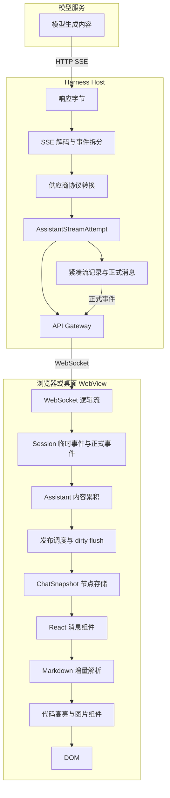

关键网络边界是：

```text
模型服务 --HTTP SSE--> Host
Host --WebSocket--> 浏览器或桌面 WebView
```

浏览器不是直接读取模型供应商 SSE。Host 使用 `eventsource-parser/stream` 不代表前端使用了原生 `new EventSource()`。

### 2.1 每层的输入、输出与优化

| 层 | 输入 | 输出 | 方法与优化 |
|---|---|---|---|
| 字节解码 | `Uint8Array` 等字节 | 文本片段 | 增量 UTF-8 解码，保留未完成字符 |
| SSE 拆分 | 文本片段 | 完整事件及 JSON | 保留未结束事件，处理心跳、活动监测 |
| 模型适配 | Messages API 事件 | `StreamChunk` | 统一正文、思考、工具参数和终止语义 |
| Host 累积 | `StreamChunk` | 实时帧、内容、紧凑记录 | 同一 chunk 快照用于多个消费者，压缩重复字段 |
| 客户端协调 | WebSocket 帧、基线、正式事件 | 会话事件 | 连续性校验、重连恢复、正式与临时内容协调 |
| Assistant 组装 | `assistant/live-chunk` | 当前完整正文块 | 逐 delta 累积，对应块更新，其他块引用复用 |
| 发布调度 | 多个 dirty 更新 | 一次快照发布 | 同一等待窗口只安排一个发布任务 |
| 快照组织 | 节点 upsert | 节点存储、顺序、索引 | 区分内容变化和结构变化，按 key 通知 |
| React 分发 | 消息节点 | `MarkdownText` 参数 | 稳定 key、节点级订阅、稳定辅助参数 |
| Markdown 解析 | 当前完整前缀 | frozen 与 tail AST | 重解析未冻结尾部，缓存稳定 AST |
| 元素生成 | frozen 与 tail AST | React 元素 | 缓存冻结区元素，重新生成尾部元素 |
| 代码高亮 | 当前代码 | token 行、元素 | 保留完整行与语法状态，更新末行，按需加载 |
| 图片展示 | 图片 AST 地址 | 图片组件 | 浏览器另行请求图片，懒加载、异步解码、失败回退 |
| 完成收敛 | 正式完整正文 | 最终 AST 与元素 | 全文数学、引用、脚注和文件语义处理 |

### 2.2 UML 时序图：一次发布经过哪些对象

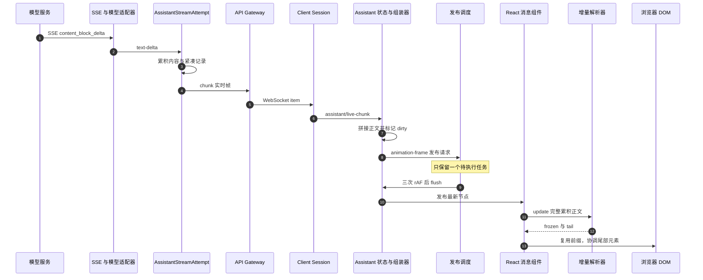

## 3. 贯穿教程的长文本与分片方案

完整原文放在附录 A，定义为 `M`。它包含：

- 主标题、八个章节标题和多段中文正文。
- 粗体、引用块、行内代码。
- TypeScript、Mermaid、PlantUML 三个围栏代码块。
- 一张远程图片、一个三列表格。
- 文末引用定义、脚注和数学公式。

为了观察语法变化，我们故意把它拆在不完整的位置。以下切片可以准确重建 18 个 delta：

```js
const offsets = [
  0, 151, 360, 723, 973, 1203, 1442,
  1655, 1819, 2086, 2312, 2589, 2809,
  2846, 3092, 3333, 3496, 3817, 3915
];

const deltas = offsets.slice(1).map(
  (end, index) => M.slice(offsets[index], end)
);

// D1 = deltas[0]，D18 = deltas[17]
// Mi 表示前 i 个 delta 拼接得到的正文。
const prefixAfter = count => deltas.slice(0, count).join("");
```

附录原文按 LF 换行，末尾保留一个换行。修改原文、换行格式或空格后，不能继续使用原来的偏移数字。

| delta | 新增长度 | 累积长度 | 特意观察的边界 |
|---|---:|---:|---|
| D1 | 151 | 151 | 第一段停在 `**页面` |
| D2 | 209 | 360 | `展示**` 到达，粗体闭合 |
| D3 | 363 | 723 | 普通段落和引用块 |
| D4 | 250 | 973 | TS 围栏打开、接口声明 |
| D5 | 230 | 1203 | 函数停在 `await set` |
| D6 | 239 | 1442 | 函数补全、围栏闭合 |
| D7 | 213 | 1655 | 图片地址停在 `/pay` |
| D8 | 164 | 1819 | 图片地址与右括号补全 |
| D9 | 267 | 2086 | Mermaid 节点标签未完成 |
| D10 | 226 | 2312 | Mermaid 围栏闭合 |
| D11 | 277 | 2589 | PlantUML 接收者未完成 |
| D12 | 220 | 2809 | PlantUML 围栏闭合 |
| D13 | 37 | 2846 | 表格分隔行未完成 |
| D14 | 246 | 3092 | paragraph 转成 table |
| D15 | 241 | 3333 | 引用、脚注标记、未完成公式 |
| D16 | 163 | 3496 | 公式闭合但仍流式展示 |
| D17 | 321 | 3817 | 最后两个正文段落 |
| D18 | 98 | 3915 | 文末引用和脚注定义 |

示例切片比真实模型 delta 更大，是为了阅读方便，不表示供应商会按这些位置切分，也不表示 DSH 有这种分片规则。

## 4. 字节与 SSE：先确保收到完整事件

### 4.1 输入是什么

Host 从模型 HTTP 响应体拿到字节流，不能假设一个网络包就是一个模型事件。一个中文字的字节、一条 JSON、一条 SSE 事件都可能跨包。

D5 的正文是：

```text
async function reviewOrder(orderId: string): Promise<ReviewResult> {
  const order = await loadOrder(orderId);
  const payment = await loadPayment(orderId);
  if (!payment.confirmed) return { orderId, action: "wait" };
  await set
```

SSE 的 JSON 字符串会转义其中的换行和引号：

```text
event: content_block_delta
data: {"type":"content_block_delta","index":0,"delta":{"type":"text_delta","text":"async function reviewOrder(orderId: string): Promise<ReviewResult> {\n  const order = await loadOrder(orderId);\n  const payment = await loadPayment(orderId);\n  if (!payment.confirmed) return { orderId, action: \"wait\" };\n  await set"}}

```

### 4.2 处理顺序


`TextDecoderStream` 负责字符边界，`EventSourceParserStream` 负责 SSE 事件边界。随后 JSON 解析和对象校验才会发生。未结束的 SSE 尾部不会当作完整事件。

完整响应还包括：

```text
message_start
content_block_start
content_block_delta × 18
content_block_stop
message_delta
message_stop
```

### 4.3 输出与优化

输出是完整供应商事件：

```js
{
  type: "content_block_delta",
  index: 0,
  delta: {
    type: "text_delta",
    text: D5
  }
}
```

这一层不知道 Markdown。半个图片地址、半个表格分隔行都只是普通事件字符串。事件和心跳评论会刷新活动监测，不必等完整正文才能产生下游输入。

源码：[S1 · SSE 解析][S1]。

## 5. 模型适配：供应商事件变成 StreamChunk

### 5.1 对应 API 与事件形状

`translate(events, model)` 读取已解码的供应商事件，使用异步生成器依次产出标准 `StreamChunk`。

| 供应商数据 | 标准 chunk |
|---|---|
| text 块开始 | `block-start` |
| `text_delta` | `text-delta` |
| `thinking_delta` | `reasoning-delta` |
| `input_json_delta` | `tool-call-delta` |
| 内容块结束 | `block-end` |
| 最终用量 | `usage` |
| 结束原因 | `finish` |

正文数据顺序为：

```js
{ type: "block-start", index: 0, blockType: "text" }
{ type: "text-delta", index: 0, text: D1 }
{ type: "text-delta", index: 0, text: D2 }
// D3 到 D17 同结构
{ type: "text-delta", index: 0, text: D18 }
{
  type: "block-end",
  index: 0,
  block: { type: "text", text: M }
}
```

最后还会有：

```js
// 用量是构造值，不代表真实 token 计数。
{
  type: "usage",
  usage: { inputTokens: 100, outputTokens: 2000, totalTokens: 2100 }
}

// 节选：实际 finish 还携带 replayState。
{ type: "finish", reason: { kind: "stop" } }
```

### 5.2 这一层的状态为什么存在

适配器按供应商块索引保存正在增长的内容，并映射为标准内容块顺序。因此 `block-end` 可以产出完整正文 `M`。工具参数先保存原始 JSON 字符串，不能要求每个 `input_json_delta` 单独是合法 JSON。

此处没有把一个 Markdown 段落映射成一个 `StreamChunk` 内容块，也没有识别 Mermaid 或图片。

**方法：先统一协议，再让后面的 Host、Session 和 UI 处理同一种标准数据。**

源码：[S2 · 模型适配][S2]。

## 6. Host：一个 chunk 同时用于实时显示、正文组装和记录

### 6.1 AssistantStreamAttempt 的职责

Host 为一次模型生成建立一个 `AssistantStreamAttempt`。它有 attempt 身份、帧索引、内容组装器、紧凑记录累积器和终止状态。

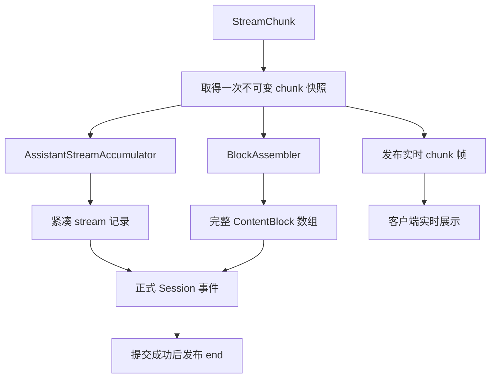

关键方法为 `start()`、`push(chunk)`、`settle(eventType, append)` 和 `abandon()`。这些都是 Harness 内部类的方法。

### 6.2 start、chunk 与 end

构造开始帧：

```json
{
  "type": "start",
  "attemptId": "session-A:1",
  "revision": 1,
  "turn": 1,
  "step": 1
}
```

Host 的 start 尚不含 `startedAfterSeq`；Session 层向浏览器提供开始帧或重连基线时，再结合持久化游标补充这项信息。

D5 的帧：

```js
{
  type: "chunk",
  attemptId: "session-A:1",
  revision: 7,
  index: 5,
  time: 1700000000080,
  chunk: { type: "text-delta", index: 0, text: D5 }
}
```

这次 attempt 的帧位置为：

| chunk 帧 index | 内容 |
|---:|---|
| 0 | block-start |
| 1—18 | D1—D18 |
| 19 | block-end |
| 20 | usage |
| 21 | finish |

因此终止帧的 `index` 为 22，表示已有 22 个 chunk，而不是正文块数量。

### 6.3 紧凑记录如何减少重复字段

假设 D1—D18 的时间差都是 20 毫秒，连续正文可以保存为：

```js
{
  type: "text-chunks",
  time0: 1700000000000,
  index: 0,
  dt: Array(17).fill(20),
  texts: deltas
}
```

`texts[0]` 对应 `time0`，后续时间通过相邻时间差恢复。18 个 delta 对应 17 个时间差。

开始块、结束块、usage、finish 等事件以单个原始 chunk 记录保存。紧凑记录是完整 stream 的一部分，不是只保存一段拼接后的正文。

### 6.4 正式提交与终止的顺序

正式事件提交成功，得到 `seq`，随后才发布 `end`。如果提交失败，attempt 会尝试以 abandoned 状态结束，而不能假装正文已经正式提交。

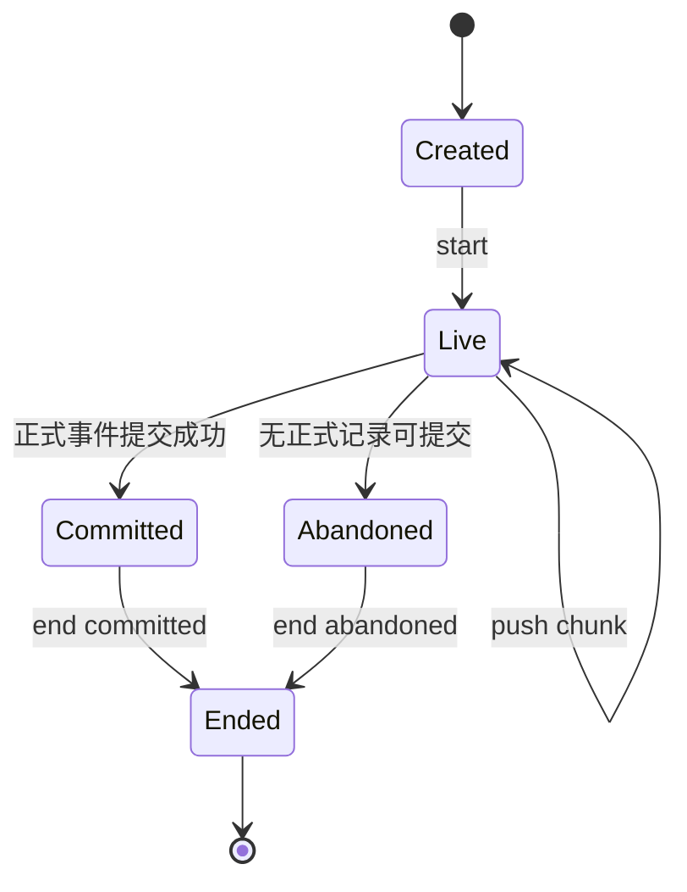

这是对内部生命周期的教学表达，图中的英文状态不是额外新增的公开枚举。

源码：[S3 · Host attempt][S3]、[S4 · 紧凑流记录][S4]、[S5 · 正式消息提交][S5]。

## 7. WebSocket 与 Session：排序、缺口、重连和正式收敛

### 7.1 WebSocket 发送什么

API Gateway 在物理 WebSocket 上复用多个逻辑流，路径为 `/api/remote.mux`。本例下行形状为：

```js
{
  type: "item",
  streamId: "stream-A",
  value: {
    type: "assistant-stream",
    frame: {
      type: "chunk",
      attemptId: "session-A:1",
      revision: 7,
      index: 5,
      time: 1700000000080,
      chunk: { type: "text-delta", index: 0, text: D5 }
    }
  }
}
```

这是构造数据表达式，序列化后 `D5` 会成为实际字符串。

三层边界分别是：

```text
item：WebSocket 逻辑流包装
assistant-stream：Session 下行帧
chunk：一次 Assistant 实时增量帧
```

客户端内部还会把 assistant 帧适配成 journal `notification`，再转换成 Session 发布变化。**notification 是客户端适配中的形状，不应误画成上述网络消息的外层。**

### 7.2 两种连续性检查

Session 传输适配检查 `revision`，Assistant 展示协调器检查匹配 attempt 的连续 chunk `index`。匹配 attempt 的 index 出现缺口会请求重新取得基线；没有可识别 start 的未知 attempt 后缀可能被忽略，等待正式消息或下一次已知 attempt。

客户端建立的临时事件数据节选：

```js
{
  type: "assistant/live-chunk",
  data: {
    attemptId: "session-A:1",
    turn: 1,
    step: 1,
    chunk: { type: "text-delta", index: 0, text: D5 }
  }
}
```

临时事件还携带 `time` 和小数 `seq`。后者用于排在持久化事件间隙内，不是数据库又提交了一条正式消息。

### 7.3 D5 后重连，如何恢复 1203 字符

重连基线可以包含：

```js
{
  revision: 7,
  activeAttempt: {
    attemptId: "session-A:1",
    startedAfterSeq: 42,
    turn: 1,
    step: 1,
    nextIndex: 6,
    stream: [
      {
        type: "chunk",
        time: 1699999999980,
        chunk: { type: "block-start", index: 0, blockType: "text" }
      },
      {
        type: "text-chunks",
        time0: 1700000000000,
        index: 0,
        dt: [20, 20, 20, 20],
        texts: deltas.slice(0, 5)
      }
    ]
  }
}
```

恢复流程：

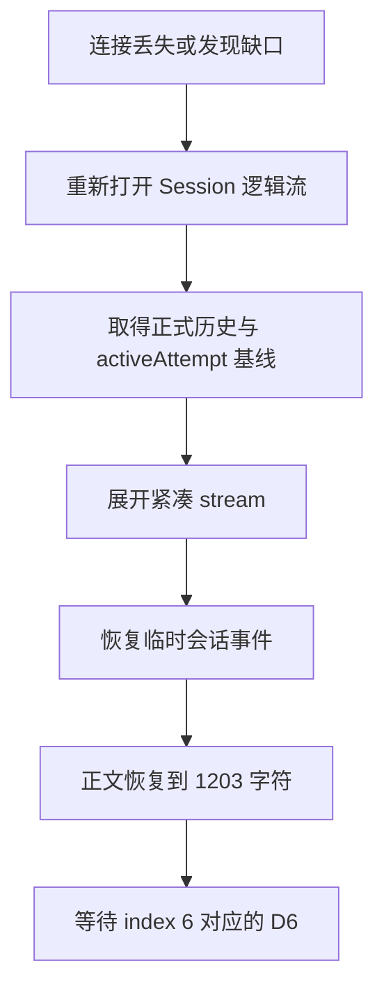

基线是进程内实时状态。Host 已不再保留该活动 attempt 时，不能要求重连一定恢复其瞬时状态；正式历史和活动基线承担不同职责。

### 7.4 为什么正式消息不能简单追加第二份正文

正式 `assistant/message` 与实时帧通过不同事件形状进入客户端。如果直接把它再当作一条新消息，用户会看到重复正文。协调器会暂存匹配的正式 settlement，等待对应 end 指明提交序号，再完成发布协调。

成功 attempt 的临时行可能保留到拥有它的 step 结束；中断、失败或 abandoned 的处理不同。不要把它概括成“收到 end，立即删除全部临时数据”。

源码：[S6 · WebSocket 协议][S6]、[S7 · 逻辑流客户端][S7]、[S8 · Session 传输适配][S8]、[S9 · 客户端协调][S9]、[S10 · 重连基线][S10]。

## 8. Assistant 状态：每条 delta 都累积，但还没有 Markdown AST

### 8.1 状态输入与输出

`assistantDefinition` 按 turn 与 step 组织消息状态。收到 D5 后：

```js
// AssistantState 节选
{
  turn: 1,
  step: 1,
  blocks: [
    { kind: "text", text: prefixAfter(5) }
  ],
  visibleBlocks: 1,
  final: undefined
}
```

正文长度是 1203。收到 D18 后：

```js
blocks = [{ kind: "text", text: M }];
visibleBlocks = 1;
```

即使正文有三个代码块、一张图片和一个表格，模型正文块数量仍然为 1。

### 8.2 修改什么，复用什么

处理方式可以理解为：

```ts
// 教学伪代码
const nextBlocks = [...current.blocks];
const old = nextBlocks[chunk.index];

nextBlocks[chunk.index] = {
  kind: "text",
  text: old.text + chunk.text
};
```

数组有一次浅复制，对应正文块被替换，其他块对象可以复用。推理和工具调用维护各自内容，工具参数保留原始参数字符串。

usage 更新状态，但不单独请求一次正文发布；finish 同样不请求正文发布。正式消息到来时用最终内容完成状态收敛。

### 8.3 方法论：状态更新与昂贵工作分开

收到 delta 时做的是字符串和块状态处理。Markdown 解析发生在后来 React 正文更新时。不能把每条 delta 的到达直接等同于一次全文解析。

源码：[S11 · Assistant 组装][S11]。

## 9. 高频 delta：在哪里合并成一轮 Markdown 更新

### 9.1 三次 requestAnimationFrame 的实际含义

这个版本在第一次 `animation-frame` 发布请求时，建立一个由三次 `requestAnimationFrame` 串联的任务。任务尚在时，后来的发布请求不再新增任务。

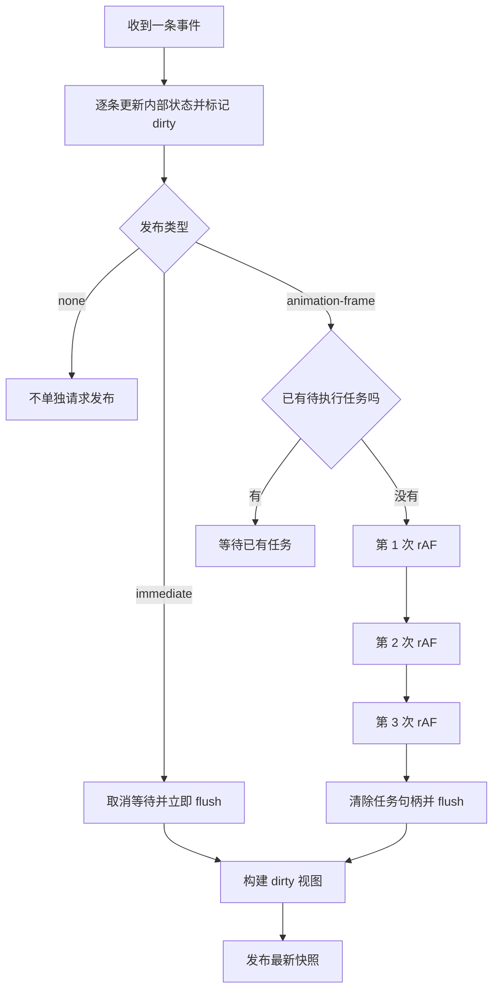

教学伪代码：

```ts
function requestPublication(mode) {
  if (mode === "none") return;
  if (mode === "immediate") {
    cancelPendingFrame();
    publishLatestState();
    return;
  }
  if (pendingFrame !== undefined) return;
  pendingFrame = scheduleThreeFrames(() => {
    pendingFrame = undefined;
    publishLatestState();
  });
}
```

这不是“每三条 delta 发布一次”。后续 delta 也不会把等待重新从头开始，所以不能把它理解成普通的尾随 debounce。实际时间受刷新率、调用时点、后台页面节流等影响，不应把三次 rAF 写成固定 50 毫秒。

### 9.2 D4、D5、D6 同窗口到达

假设三条均在同一次等待内到达：

| 事件 | 内部状态 | 界面处理 |
|---|---|---|
| D4 | 973 字符 | 安排发布 |
| D5 | 1203 字符 | 等待已有发布 |
| D6 | 1442 字符 | 等待已有发布 |
| flush | 1442 字符 | 发布最新节点，Markdown 更新一轮 |

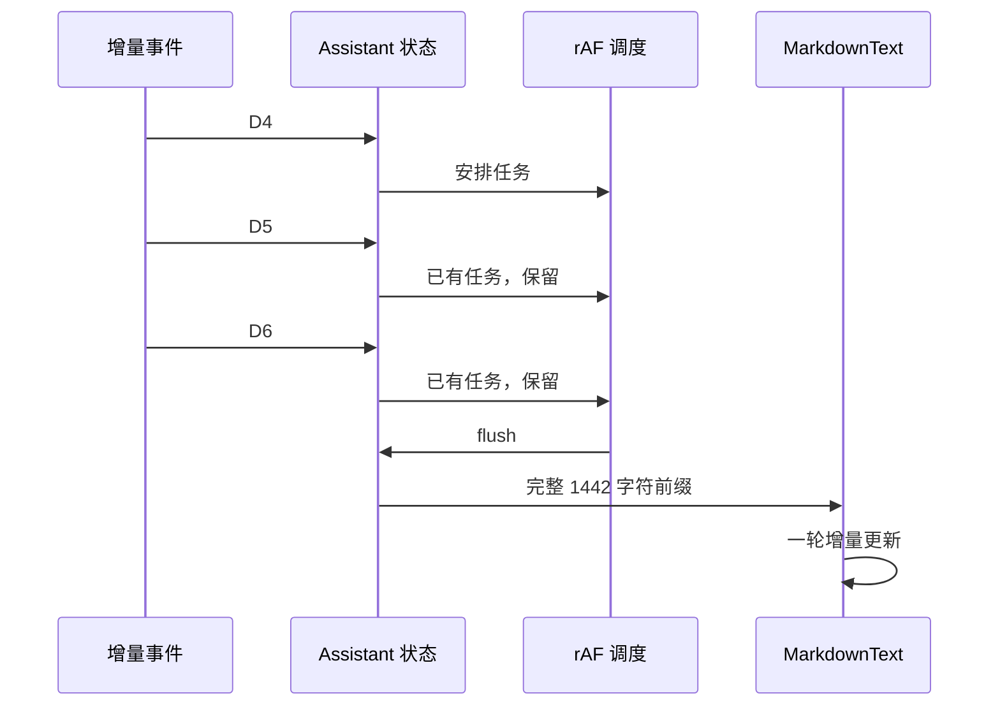

### 9.3 “一次解析”的准确边界

合并的是一轮界面发布和 Markdown 更新，不保证底层解析函数恰好调用一次。代码围栏特殊路径可能解析多个小切片；完成时还会全文解析。相同正文重复进入 `StreamingRenderer.render()` 时，则直接返回缓存。

React 自身可能重复调用渲染过程，应用也可能有其他更新。这里描述的是这套显式调度怎样减少由正文 delta 引起的更新，而不是对 React 执行次数作绝对承诺。

没有 `requestAnimationFrame` 的环境会走立即 flush 的回退路径。

源码：[S12 · 发布调度][S12]、[S13 · dirty 组装器][S13]。

## 10. ChatSnapshot：消息节点组织与 Markdown 解析是两层

### 10.1 一个 Assistant 节点仍承载整篇正文

```js
// Chat 节点节选，nodeKey 由会话引擎生成
{
  key: nodeKey,
  kind: "assistant-step",
  target: "chat",
  visibility: "visible",
  data: {
    status: "running",
    turn: 1,
    step: 1,
    blocks: [{ kind: "text", text: prefixAfter(5) }]
  }
}
```

`ChatSnapshot` 提供节点存储、显示顺序、位置、导航、时间线等视图：

```js
snapshot.order;
// 例如 [userNodeKey, assistantNodeKey]

snapshot.nodes.get(assistantNodeKey).data.blocks[0].text;
// 当前累积正文
```

它不是把所有节点重新序列化成 JSON 发送给 React，而是前端内存存储与订阅。

### 10.2 内容变化与结构变化

以下因素会影响结构判断：节点是否新增、kind、anchorSeq、visibility、location 身份是否变化。

正文从 1203 增长到 1442 字符，但结构字段不变时，可以沿用原来的消息顺序。发生结构变化，才重新计算可见顺序和相应位置索引；内容变化主要 touch 受影响节点、轮次和导航。

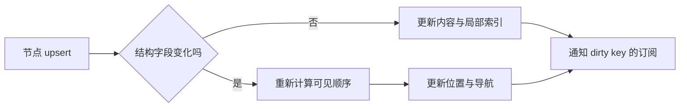

代码块和图片产生的是消息内部元素，不能直接推导成消息列表新增一个顶层会话节点。

源码：[S14 · ChatSnapshotBuilder][S14]。

## 11. React：从一个消息节点到 MarkdownText

### 11.1 组件调用链

```text
ChatNodeSeat(nodeKey)
  → AssistantNodeView(node)
    → AssistantMarkdown(blocks, streaming)
      → MarkdownText(text, streaming, labels, ...)
```

`ChatNodeSeat` 订阅自己的节点。`AssistantNodeView` 根据 `data.status === "running"` 决定 streaming。正文、推理、模型图片内容块等分别走对应展示组件。

注意：模型 `image` 内容块的图片槽位与正文 Markdown 内的 `` 不是同一个分发入口。

### 11.2 输入是完整当前正文

```tsx
<MarkdownText
  key={blockIndex}
  text={currentBlock.text}
  streaming={true}
  labels={stableLabels}
/>
```

接收参数的变化可以是：

```js
{ text: prefixAfter(5),  streaming: true }
{ text: prefixAfter(8),  streaming: true }
{ text: prefixAfter(18), streaming: true }
```

绝不是只把 D8 的 `ment-flow.png)` 当作一篇独立 Markdown 去渲染。

### 11.3 为什么稳定引用重要

`memo` 只能在参数合适时减少重复调用。正文变化时，Markdown 组件仍需更新。真正减少前缀工作的，是组件实例内的增量状态和缓存。

该实现对 `labels` 的身份变化会重建流式 renderer，因此父组件为标签参数做 memo。正文块 key、AST 块 key、代码组件 key 各自在不同层维持身份。按不断变化的正文内容生成 key，会导致代码高亮会话等缓存丢失。

源码：[S15 · 节点组件][S15]、[S16 · AssistantNodeView][S16]、[S17 · AssistantMarkdown][S17]。

## 12. 冻结机制：第三方解析 API 与自定义增量 API

### 12.1 冻结是谁实现的

| 层 | API | 负责的工作 |
|---|---|---|
| 第三方 `mdast-util-from-markdown` | `fromMarkdown(text, options)` | 把本次输入的 Markdown 解析成 mdast |
| Harness 语法入口 | `parseGfm(text)` | 配置 GFM、CJK 和本地图片恢复 |
| Harness 增量包装 | `new IncrementalMarkdownParser(parseGfm)` | 保存流式解析状态 |
| Harness 增量更新 | `parser.update(accumulatedText)` | 冻结前缀，重新解析尾部 |
| Harness 元素缓存 | `StreamingRenderer.render(text)` | 复用冻结块的 React 元素 |

`gfm()` 和 `gfmFromMarkdown()` 提供 GFM 语法能力，不提供这套跨更新冻结策略。冻结也不是调用 JavaScript 的 `Object.freeze()`。

### 12.2 UML 类图：谁拥有哪些状态

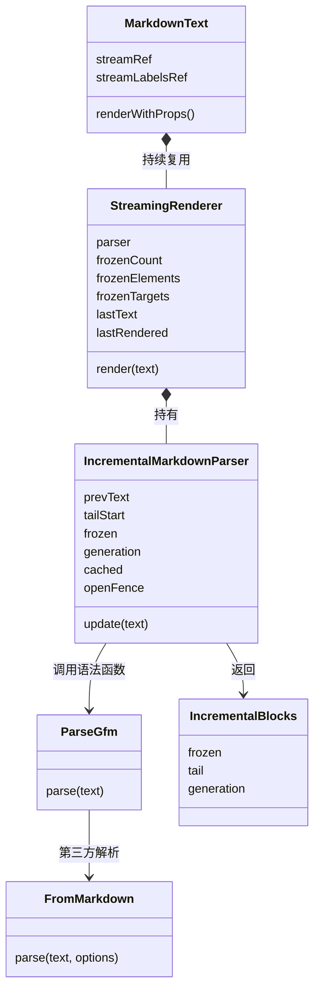

图中 `ParseGfm` 和 `FromMarkdown` 用方框表达函数职责，不表示它们在源码中真是 class；`renderWithProps()` 也是 React 组件行为的教学标签。其他状态名对应实际源码成员。

### 12.3 update 的决策流程

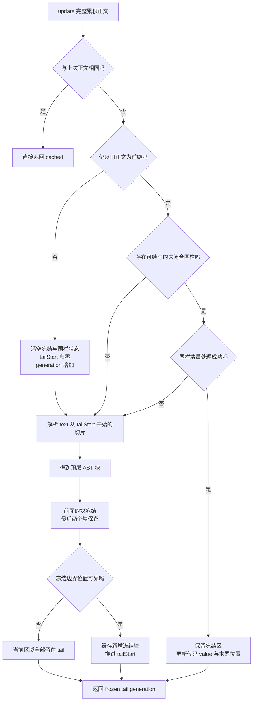

### 12.4 判断冻结的核心规则

普通路径的逻辑是：

```ts
// 教学伪代码，省略围栏快速路径和保护细节
const parseStart = state.tailStart;
const current = parseGfm(text.slice(parseStart)).children;
const keepFrom = Math.max(0, current.length - 2);

if (keepFrom > 0) {
  const end = current[keepFrom - 1].position?.end.offset;
  if (end !== undefined) {
    for (const item of current.slice(0, keepFrom)) {
      state.frozen.push({
        node: item,
        key: parseStart + item.position.start.offset
      });
    }
    state.tailStart = parseStart + end;
  }
}
```

决定因素是**尾部解析结果中的顶层块数量**。末尾块容易继续增长或改变类型，倒数第二块保留为安全余量。算法没有逐块证明所有语义已经永久确定，因此不能把它描述成通用的、绝对正确的全文语义冻结器。

| 当前结构 | 冻结区 | 不稳定尾部 |
|---|---|---|
| 标题、段落 A | 空 | 标题、段落 A |
| 标题、段落 A、段落 B | 标题 | 段落 A、段落 B |
| 再加入段落 C | 标题、段落 A | 段落 B、段落 C |
| 再加入代码块 | 标题、段落 A、段落 B | 段落 C、代码块 |

一个整个列表算一个顶层块，一个整个表格也算一个。不能按列表项或表格单元格数套用最后两个块的规则。

### 12.5 冻结具体保存什么

冻结条目：

```ts
interface PositionedBlock {
  node: RootContent;
  key: number;
}
```

返回结果：

```ts
interface IncrementalBlocks {
  frozen: readonly PositionedBlock[];
  tail: readonly PositionedBlock[];
  generation: number;
}
```

这里的类型节选为教学表达，实际源码有对应只读字段。

`node.position` 是相对于本次解析切片的位置；`key` 加上切片起点后成为整个原文中的绝对位置。不能把切片内 `offset: 0` 误当作整个正文开头。

### 12.6 tailStart 为什么取冻结块的结束位置

假设冻结结束在 offset 100，下一段 AST 起始是 offset 105，中间存在空行或缩进。

```text
原文：
[已冻结段落：到 100][空行或缩进：100—105][下一段：从 105]

下一次解析：text.slice(100)
```

从 100 开始会保留原始空白上下文；直接从下一块 start 开始可能丢掉块前空白。源码使用最后冻结块的 `position.end.offset`，并加上本次切片的 base。

### 12.7 为什么输入“未冻结文本”，而不是“未解析文本”

第一次：

```markdown
# 标题

第一段。

第二段正在
```

标题冻结，两个段落留在 tail。再追加 `生成。` 后，底层解析器接收：

```markdown


第一段。

第二段正在生成。
```

第一段已经解析过，却仍然会重新解析，因为它还在安全余量中。只有已冻结区域不再进入普通尾部解析。

| 接收方 | 输入 |
|---|---|
| `parser.update(text)` | 当前完整累积正文 |
| `parseGfm()` / `fromMarkdown()` 普通路径 | 未冻结尾部，包含旧文字和新增文字 |
| 未闭合围栏特殊路径 | 围栏尾部的小切片，附带用于解析的合成围栏前缀 |

### 12.8 代码闭合与段落结束都不是独立冻结信号

代码围栏闭合后仍可能位于最后两个顶层块中，此时整个代码块尚未进入 frozen。它必须随着后续块出现，离开不稳定尾部后，才走普通顶层冻结。

同样，出现 `\n\n` 并不表示此前所有内容立即冻结。解析器先根据语法得到 AST，再按顶层块位置决定边界。

### 12.9 正文替换怎样处理

正文不再以之前的正文为前缀时：

```text
prevText 被重置
tailStart 归零
frozen 清空
openFence 清空
generation 增加
```

渲染器看到 generation 变化后，也清空冻结元素、引用与脚注相关缓存。这个策略保证追加路径的缓存不会被错误用到编辑、重试或整体替换后的正文上。

源码：[S18 · 增量解析器][S18]、[S19 · MarkdownText][S19]、[S20 · 语法入口][S20]。

## 13. 未闭合代码围栏：块级冻结之外，还有内容前缀缓存

### 13.1 为什么块级规则仍不够

如果模型输出一个 1000 行代码块，但一直没有关闭围栏，整个 code 块会一直留在尾部。只靠“最后两个顶层块”就可能反复处理整段代码。

源码为解析器已经确认的末尾未闭合围栏保存 `OpenFenceState`：围栏字符、长度、已保留内容前缀、尚需处理的原文起点、代码条目位置和末尾坐标等。

### 13.2 快速路径怎么工作

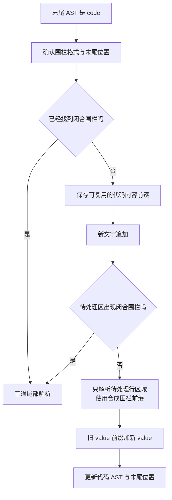

Markdown 围栏内容缓存会保留最后一个完整行和当前未完成行，让它们继续经过语法解析，从而维护尾部换行语义。无法确认安全路径时回退普通解析。

### 13.3 与 Shiki 的缓存不是同一回事

```text
Markdown 围栏缓存：
原始 Markdown → code AST 的 value

Shiki 行缓存：
代码 value → 有颜色和样式的 token
```

前者不负责颜色，后者不负责判断 Markdown 是否已经离开代码围栏。两者可以同时减少重复工作。

源码：[S18 · 围栏前缀缓存][S18]。

## 14. 从 AST 到 React 元素：冻结为什么还需要第二层缓存

### 14.1 只缓存 AST 会遗漏什么成本

即使前缀 AST 不再解析，如果每次都遍历全部 AST、重新创建每个 React 元素，正文越长仍会增加转换成本。

`StreamingRenderer` 因此保存：

```text
frozenElements       已冻结块的元素
frozenCount          已经处理过多少冻结块
frozenTargets        冻结区中的引用定义
frozenFootnoteOrder  脚注顺序信息
lastText             上一次正文
lastRendered         上一次结果
```

### 14.2 新冻结块与旧冻结块分开处理

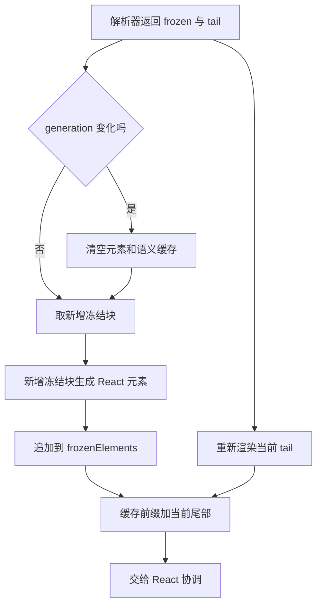

一个块从 tail 进入 frozen 时，可能再经过一次元素生成，随后成为缓存的一部分。因为 key 使用同一原文起点，React 可以维持其组件身份，而不是因“分类变了”就重新挂载。

### 14.3 直接 mdast 渲染

该 Harness 版本直接按 mdast 类型分发到 JSX/React 元素，没有采用 react-markdown 的完整 `mdast → hast → React` 中间转换链。

| AST 类型 | 输出 |
|---|---|
| `heading` | h1—h6 |
| `paragraph` | p |
| `strong` | strong |
| `inlineCode` | code，完成后可结合文件或链接语义 |
| `code` | CodeBlock；空围栏使用 pre/code |
| `blockquote` | blockquote |
| `list` | ul/ol 与列表项 |
| `table` | 表格容器和 table |
| `image` | MarkdownImage |
| `math` / `inlineMath` | 数学组件，主要在完成解析后出现 |
| `html` | 原样文本，不作为原始 HTML 执行 |
| `definition` | 不直接占据正文展示元素，用于解析引用 |
| `footnoteDefinition` | 用于文末脚注展示 |

三列示例表格走普通填充容器。该渲染器对四列及以上且不在引用块中的表格有专门的宽表处理，这属于布局优化，与 AST 冻结是不同层。

源码：[S19 · 元素缓存][S19]、[S21 · mdast 渲染][S21]。

## 15. 长文本回放：冻结、图片和表格怎样一步步变化

下表假设 18 个增量前缀都分别进入解析器，便于观察每次边界。真实发布可能跳过其中一些中间前缀，因而不一定出现完全相同的每一行中间状态。

| delta | 累积长度 | 冻结块数 | 尾部顶层块与绝对 key |
|---|---:|---:|---|
| D1 | 151 | 0 | `heading @ 0`、`paragraph @ 24` |
| D2 | 360 | 1 | `paragraph @ 24`、`paragraph @ 195` |
| D3 | 723 | 5 | `paragraph @ 538`、`blockquote @ 686` |
| D4 | 973 | 8 | `paragraph @ 736`、`code / ts @ 884` |
| D5 | 1203 | 8 | `paragraph @ 736`、`code / ts @ 884` |
| D6 | 1442 | 9 | `code / ts @ 884`、`paragraph @ 1295` |
| D7 | 1655 | 12 | `paragraph @ 1455`、`paragraph @ 1612` |
| D8 | 1819 | 13 | `paragraph @ 1612`、`paragraph @ 1671` |
| D9 | 2086 | 16 | `paragraph @ 1838`、`code / mermaid @ 1998` |
| D10 | 2312 | 17 | `code / mermaid @ 1998`、`paragraph @ 2156` |
| D11 | 2589 | 20 | `paragraph @ 2327`、`code / plantuml @ 2494` |
| D12 | 2809 | 21 | `code / plantuml @ 2494`、`paragraph @ 2659` |
| D13 | 2846 | 23 | `heading @ 2809`、`paragraph @ 2821` |
| D14 | 3092 | 24 | `table @ 2821`、`paragraph @ 2954` |
| D15 | 3333 | 28 | `paragraph @ 3284`、`paragraph @ 3303` |
| D16 | 3496 | 29 | `paragraph @ 3303`、`paragraph @ 3351` |
| D17 | 3817 | 32 | `paragraph @ 3509`、`paragraph @ 3668` |
| D18 | 3915 | 34 | `definition @ 3817`、`footnoteDefinition @ 3868` |

### 15.1 粗体的中间状态

D1 停在 `**页面`，第一段还没有闭合 strong。D2 补上 `展示**` 后：

```js
{
  type: "strong",
  children: [{ type: "text", value: "页面展示" }]
}
```

第一段的顶层 key 为 24。段落内部结构变化，并不要求整个段落在消息列表里获得新身份。

### 15.2 TypeScript 代码块保持同一个位置

D4、D5、D6 中，代码块的绝对 key 始终是 884。

```js
// D5 解析结果节选
{
  generation: 0,
  frozen: /* 前 8 个顶层块 */,
  tail: [
    { key: 736, node: /* 代码前的 paragraph */ },
    {
      key: 884,
      node: {
        type: "code",
        lang: "ts",
        value: /* 当前代码，末尾是 await set */
      }
    }
  ]
}
```

D6 完成代码围栏后，冻结数量为 9，tail 是 key 884 的代码块和 key 1295 的后续段落。代码块已经闭合，但还没有冻结。

### 15.3 图片地址未完成时，没有完整 image 节点

D7 停在：

```text
![支付与订单处理流程](https://example.com/assets/pay
```

这是 key 1612 的尾部段落。GFM 可能在不完整文本里识别某些普通链接结构，但还没有完整的 Markdown 图片。

D8 补全后：

```js
{
  type: "paragraph",
  children: [
    {
      type: "image",
      alt: "支付与订单处理流程",
      url: "https://example.com/assets/payment-flow.png"
    }
  ]
}
```

顶层 key 1612 保持不变。图片节点位于段落内部。

### 15.4 同一个 key 从 paragraph 变成 table

D13 中表格分隔行只有：

```text
|---|---
```

key 2821 的节点仍为 paragraph。D14 补上第三列分隔符和内容行后变成 table：

```js
{
  type: "table",
  align: [null, null, null],
  children: [
    { type: "tableRow", children: /* 表头 */ },
    { type: "tableRow", children: /* 数据行 */ }
  ]
}
```

保留不稳定尾部的目的就是允许这种结构转换。底层 DOM 从段落结构变成表格结构时，本身需要相应更新；稳定 key 不表示不同 HTML 标签永远复用同一个 DOM 节点。

### 15.5 文末定义为何可能要等最终完整解析

D15 出现 `[处理规范][guide]` 和 `[^audit]`，定义却在 D18。等 D18 到达时，早先包含引用的段落已被冻结。仅渲染新尾部不能自动回头重建冻结段落的语义。

最终完整解析会重新识别链接与脚注。冻结优化允许这个已知流式偏差，在完成阶段收敛。

### 15.6 公式与冻结并不矛盾

流式语法不含数学扩展，因此 key 3303 的公式在 D15、D16 被当作普通 paragraph，之后也可能冻结。完成阶段切换全文数学解析，它才变为 math。

冻结是流式期间的一种复用策略，不是声明 AST 在整条消息生命周期内永远不可变化。

## 16. 代码高亮：完整行、末行与语法状态

### 16.1 输入和输出

代码 AST 的 value 不包含外层 Markdown 围栏。渲染入口传给 `CodeBlock` 时补一个合成换行，代码组件展示时移除这个合成尾换行，避免误吃代码中的真实空行。

```js
// 参数表达式
{
  code: codeNode.value + "\n",
  lang: "ts",
  streaming: true
}
```

`StreamingHighlightSession.updateFrame(code, lang)` 产生：

```js
// 结构示意，token 数量和样式由语法实际确定
{
  generation: currentGeneration,
  appended: [ /* 新增完整行的 HighlightSpan[] */ ],
  tail: [ /* 当前末行的 HighlightSpan[] */ ]
}
```

`HighlightSpan` 包含 `text` 和 React 风格的 `style` 对象。

### 16.2 D5 到 D6 的末行变化

D5：

```ts
  await set
```

D6 补上：

```text
ReviewEvidence(order.id, payment.id);
```

新完整行成为：

```ts
  await setReviewEvidence(order.id, payment.id);
```

末行可以重新分词，已经完成的前面行保留 tokens 和进入下一行所需的 TextMate grammar state。

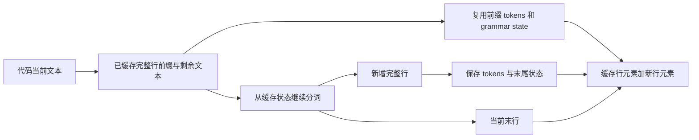

### 16.3 其他优化

| 机制 | 减少的工作 |
|---|---|
| 共享 Shiki highlighter | 避免每个代码块重新初始化引擎 |
| 启动只加载 TS、shell、JSON | 减少初始语法模块成本 |
| 其他允许语言动态导入 | 没出现的语言不提前加载 |
| 首次进入视口才激活 | 屏外代码暂不做高亮 |
| 已完成行按 32 行缓存 | 减少重复创建行元素 |
| 相同代码、语言完成后保留树 | 减少流式到完成的展示切换 |

“进入视口才激活”不是整个聊天列表的虚拟化。语言未识别或语法尚未加载时，以等宽文本回退；语法加载后可以重新高亮。

一个持续增长、很长却没有换行的代码末行仍可能反复分词，行级缓存不能消除它的成本。

源码：[S22 · 高亮器][S22]、[S23 · CodeBlock][S23]、[S24 · 视口激活][S24]。

## 17. 图片、Mermaid 与 UML：识别语法不等于加载资源或绘图

### 17.1 图片为什么需要另一条请求

Markdown 中的图片节点只包含地址与描述：

```js
{
  type: "image",
  alt: "支付与订单处理流程",
  url: "https://example.com/assets/payment-flow.png"
}
```

它进入 `MarkdownImage`，再由图片加载组件产生 img。关键 DOM 属性包括 `loading="lazy"`、`decoding="async"` 和 `referrerPolicy="no-referrer"`。

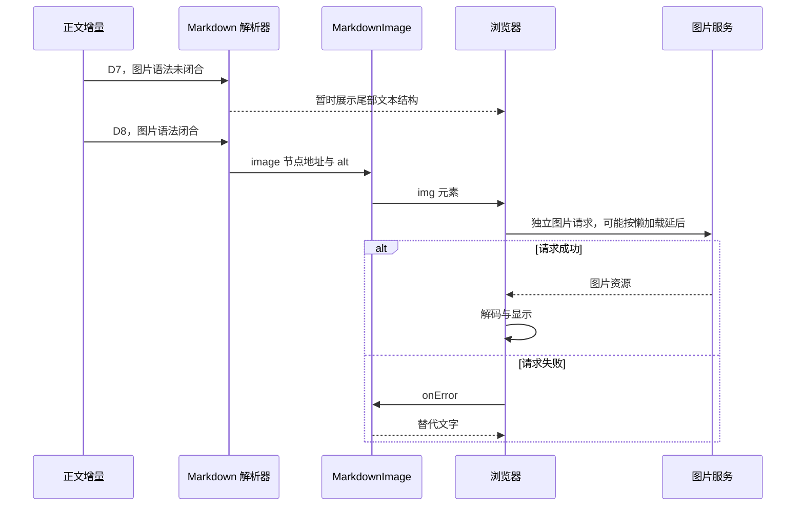

有可用的图片预览委托时，还可以出现按钮与 lightbox。地址不支持时直接回退 alt；请求失败后再切换为失败回退。正文结束与图片加载成功没有必然同步关系。

本地文件路径需要通过本地资源解析能力转换。流式阶段不会使用完成后的全部文件词汇；本例远程 HTTPS 图片不涉及这些本地适配条件。

### 17.2 Mermaid 在该聊天版本里是什么

```js
{
  type: "code",
  lang: "mermaid",
  value: "flowchart TD\n  A[收到客户反馈] --> B{支付是否确认}\n..."
}
```

当前聊天渲染器把它交给通用 `CodeBlock`，没有进一步调用 Mermaid 图形引擎。`mermaid` 也不在本版本高亮允许映射中，因此使用纯文本代码回退。

```text
当前已实现：
Mermaid 围栏 → code AST → CodeBlock → 源码文字

若要新增图形功能，需要额外实现：
code AST → Mermaid 解析与布局 → SVG → 图形组件
```

文档网站有 Mermaid 查看器，负责增强网站里已渲染的 SVG；它不代表聊天正文也有同样能力。

### 17.3 UML、Mermaid、PlantUML 的关系

| 名称 | 含义 |
|---|---|
| UML | 建模语言与图形体系，例如类图、时序图、状态图 |
| Mermaid | 文本图形工具，可以表达流程图及某些 UML 风格图 |
| PlantUML | 另一种文本图形工具，本样例用它描述时序图 |

教程里的 UML 类图、时序图与状态图用 Mermaid 表达，方便支持 Mermaid 的 Markdown 阅读器显示。附录长文里的 PlantUML 是模型正文样本，当前聊天版本会显示源码。

**阅读器能把教程里的图画出来，与被分析的 DSH 聊天组件是否支持画图，是两个问题。** 不支持 Mermaid 的阅读器仍可读取图形源码。

### 17.4 如果自己增加图形组件

以下是迁移建议，不是 DSH 已实现行为：

- 在 code AST 分发处识别图形语言。
- 流式阶段保留源码或最后一次成功图形，避免每个字符都调用布局引擎。
- 围栏闭合或正文完成时安排图形渲染。
- 管理异步结果的版本，避免旧结果覆盖新源码。
- 渲染失败时保留可读源码。

图形渲染不会因为 AST 冻结自动变成增量布局；它需要自己的缓存和调度。

源码：[S21 · 图片与代码分发][S21]、[S22 · 高亮语言映射][S22]、[S25 · 网站 Mermaid 查看器][S25]。

## 18. 完成阶段：正式消息、终止帧与全文语义

### 18.1 正式记录的输入输出

```js
// 正式事件节选，省略时间、surfaceOp、消息 source 等字段
{
  type: "assistant/message",
  seq: 43,
  data: {
    turn: 1,
    step: 1,
    message: {
      id: "message-A",
      role: "assistant",
      content: [{ type: "text", text: M }]
    },
    stream: compactStream
  }
}
```

提交后对应终止帧：

```json
{
  "type": "end",
  "attemptId": "session-A:1",
  "revision": 24,
  "index": 22,
  "outcome": {
    "kind": "committed",
    "eventType": "assistant/message",
    "seq": 43
  }
}
```

revision 24 的构造过程为：start 使用 1，22 个 chunk 使用 2—23，end 使用 24。该数字只适用于本例的第一次 attempt 和上述 chunk 数量。

### 18.2 streaming 切换

```js
// 全部 delta 已到达，但尚未完成正式展示收敛
{ text: M, streaming: true }

// 正式状态 settled
{ text: M, streaming: false }
```

最终 `renderSettled()` 对整个文本调用 `parseGfmWithMath()`，收集全文引用与脚注目标，再生成正文和脚注区域。

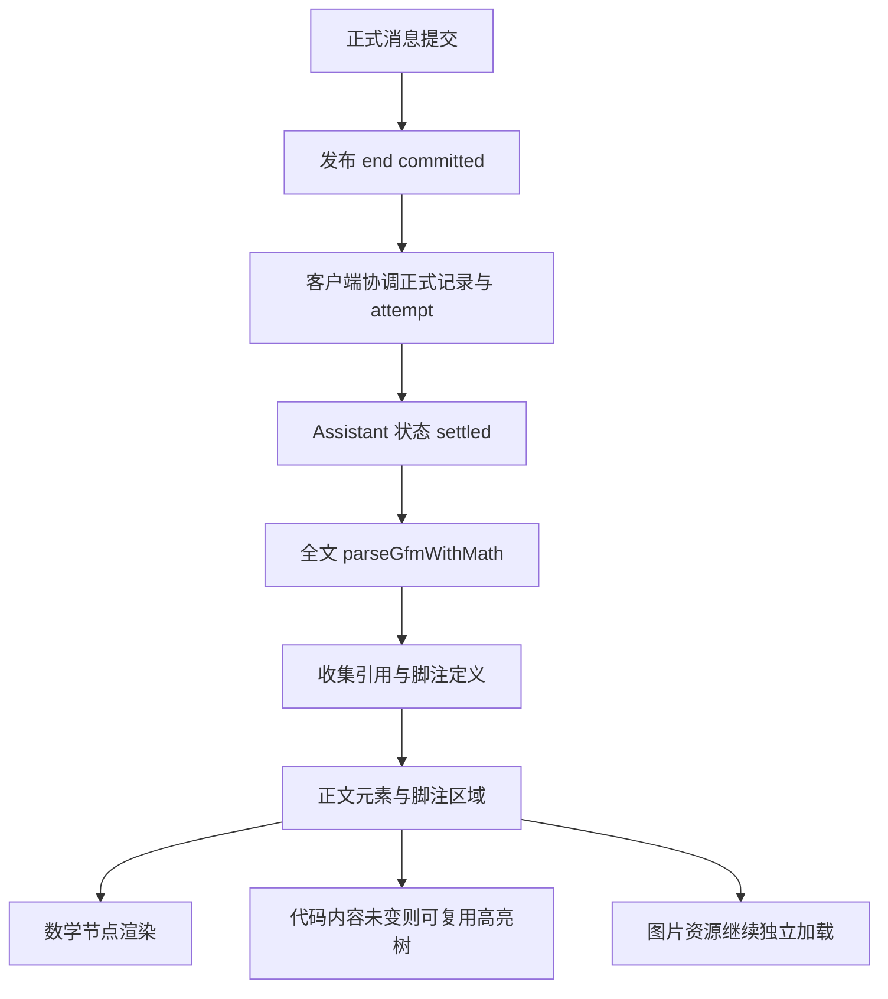

### 18.3 本例具体修正了什么

| 内容 | 流式阶段 | 完成阶段 |
|---|---|---|
| `[处理规范][guide]` | 定义到达前可能是文本，冻结后暂时保持 | 建立指向文末定义地址的链接 |
| `[^audit]` | 定义尚未到达时可能是字面标记 | 建立脚注引用并显示脚注内容 |
| `$$...$$` | paragraph 文本 | math AST，交给数学渲染 |
| `src/order-review.ts` | 普通行内代码 | 若完成后的词汇解析认为是真实文件，可赋予文件动作 |
| Mermaid、PlantUML | 代码源码 | 仍是代码源码，不自动生成 SVG |
| 图片 | 可能尚在加载 | 不因正文 settled 就自动成功 |

该实现对 `math` 语言围栏也有完成后的数学分发分支；本例使用 `$$` 块公式，二者不要混淆。

源码：[S5 · 正式提交][S5]、[S9 · 客户端协调][S9]、[S19 · 完成渲染][S19]、[S20 · 数学语法][S20]、[S21 · 数学与文件分发][S21]。

## 19. 性能方法论：把频率、范围与复用分别优化

### 19.1 优化链路的三个维度

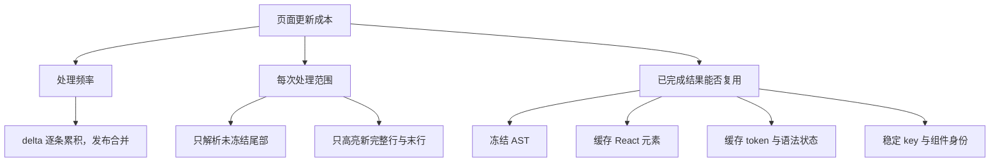

只减少解析频率，长正文仍可能每次全文扫描；只减少解析范围，后面仍可能全文转换元素；只用 `memo`，不断变化的正文仍要处理。需要把这些维度连起来观察。

### 19.2 数据事实与展示策略分开

实时片段边界、原始时间、正式事件是事实。页面可以合并更新、延后代码高亮或显示尚未解析的引用，但不能因此丢掉正文、伪造提交成功或改变事件归属。

这与允许丢弃旧值的统计监控不同。正文是必须保留的内容流，不能为了降频直接丢掉任意 delta。

### 19.3 稳定区和变化区的边界来自哪里

| 边界 | 依据 |
|---|---|
| SSE 事件 | 协议分隔符和解析器状态 |
| Assistant 帧 | attempt 身份、连续 index、revision |
| 消息上下文 | turn 与 step |
| Markdown 冻结 | AST 顶层块和 position offset |
| 代码行缓存 | 完整行换行与语法状态 |
| 正式收敛 | 持久化提交与终止协调 |

各层使用自己的边界，不能把“一条 SSE 到达”直接推导成“一个 Markdown 段落完成”。

### 19.4 缓存失效是缓存设计的一部分

| 场景 | 对应处理 |
|---|---|
| 正文相同 | 返回上次解析或渲染结果 |
| 追加正文 | 保留前缀，更新尾部 |
| 正文替换 | 清空解析与元素缓存，增加 generation |
| 流式 labels 身份变化 | 重建 StreamingRenderer |
| 代码解析语言改变 | 重置相应语法缓存 |
| 流式结束 | 全文语义收敛，代码可按内容复用 |

迁移到自己的项目时，若增加新的插件、主题或自定义组件配置，需要自行确定缓存失效规则，不应宣称当前 DSH 会自动处理所有新增配置。

### 19.5 性能边界与复杂度

设正文最终长度为 `N`，发布次数为 `P`，某次未冻结尾部长度为 `T_i`。

如果每次解析完整前缀，解析量可用 `sum(N_i)` 表达；在细碎增长的情况下，它可能接近二次增长。尾部策略减少为处理各次未冻结区域及围栏特殊切片，但还存在：

- `startsWith(previousText)` 的前缀比较。
- 正文字符串拼接及字符串表示的实现成本。
- 块数组浅复制和 frozen 结果数组的生成。
- 持续增长且没有新顶层边界的长段落。
- 未换行的长代码末行。
- 完成时一次全文解析与语义处理。

这些成本取决于输入形状和 JavaScript 引擎。不能只因为用了 frozen 就宣布每个 delta 都是 O(1)，也不能把解析回放的次数直接当成浏览器性能数字。

## 20. 迁移到 react-markdown：哪里能保留，哪里必须改

这节是设计建议，不是本仓库已经实施的改动。对照的是 react-markdown `lib/index.js` 提交 [`d56c266ba801d0e2487028d8c8d60aac06ceb5ff`][S26]。

### 20.1 原版入口

原版同步组件建立 processor 和 VFile，再执行 parse、runSync 和最终元素处理。架构为：

```text
children 完整文本
 → remark-parse
 → mdast
 → remark 插件
 → remark-rehype
 → hast
 → rehype 插件
 → URL 与元素处理
 → React 元素
```

`components` 决定标签如何渲染，不能直接决定 Markdown 解析范围。普通 remark transformer 拿到 AST 时，前面的 parse 已完成。

### 20.2 可以增加的结构

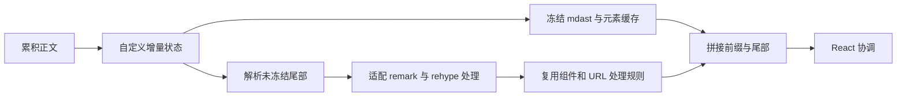

可以设计一个新组件：

```tsx
// 拟新增的 API，不是 react-markdown 原有 API
<StreamingMarkdown
  text={accumulatedText}
  streaming={true}
  remarkPlugins={[remarkGfm]}
  components={components}
/>
```

职责建议拆成：

```text
增量状态管理：append 检查、tailStart、frozen、generation
语法解析：文本切片转 mdast
语义转换：插件处理和 mdast 转 hast
元素渲染：保留组件映射、URL 处理、元素限制
完成收敛：全文重新建立跨块关系
```

### 20.3 两种实现路径

| 路径 | 做法 | 主要代价 |
|---|---|---|
| 定向修改 react-markdown | 拆开 parse、transform、render，接入增量管理层 | 维护 fork，审计插件对全文语义的依赖 |
| 自己组合 unified 与渲染库 | 使用底层生态，自己控制 AST 生命周期 | 重新集成 react-markdown 的行为和边界 |

也可以先在外层按稳定源文本块包裹多个 memo 化的 ReactMarkdown 实例。这是有限优化：为了识别边界仍需解析，稳定块第一次还可能再次解析；独立块处理会破坏引用、脚注编号等全文上下文。不能把按空行 split 当成通用实现。

### 20.4 为什么普通插件不够

普通 remark AST transformer 的位置是：

```text
全文 parse 已经完成
 → 插件拿到 AST
 → 插件裁剪或转换 AST
```

它能减少后续处理，不能撤销已经发生的全文解析。进一步替换底层 parser 在架构上可行，但还要设计持久实例、缓存与重置，并非只加一个普通 transformer 就完成。

### 20.5 插件兼容是主要工程难点

| 依赖 | 增量处理的难点 |
|---|---|
| 引用链接 | 定义可能在冻结边界另一侧 |
| 脚注 | 编号和文末区域涉及全文 |
| 自动目录与标题编号 | 插件可能需要所有标题 |
| 修改 AST 的插件 | 需要避免转换过程污染可复用原始树 |
| 原始 HTML 处理 | 块之间可能有上下文，不能随意拆分 |
| 异步图形或代码插件 | 需要版本控制和取消过期结果 |
| URL / 标签过滤与自定义组件 | 需要保留原组件契约和失效规则 |

建议先规定支持的语法和插件集合，再决定冻结规则与完成阶段的收敛策略。不要先承诺与所有插件语义完全兼容。

源码与 API：[S26 · react-markdown 入口][S26]、[S27 · react-markdown 文档][S27]、[S28 · fromMarkdown 文档][S28]。

## 21. 如何实际观察处理量

### 21.1 分层记录，避免把所有成本叫“渲染”

以下为观测建议，不是当前 DSH 已暴露的统一指标 API：

| 位置 | 建议观察 |
|---|---|
| 网络解码 | 到达事件数量、事件大小、解码时间 |
| Assistant 状态 | delta 数量、累积正文长度 |
| 发布调度 | 请求发布次数、实际 flush 次数 |
| Markdown 更新 | 更新次数、tailStart、尾部长度、generation |
| 底层解析 | 调用次数、每次输入长度、AST 块数、耗时 |
| 冻结元素 | 新冻结数量、已缓存数量 |
| 代码高亮 | 新完整行数、末行长度、语法加载情况 |
| React / DOM | commit 与组件挂载、更新、布局和绘制 |

可在实际集成时使用浏览器 Performance、React Profiler 和函数计时。解析器计时不能代表布局或图片解码耗时。

### 21.2 一条有意义的观测记录

```js
// 拟定的教学指标对象，不是生产抓包
{
  receivedDeltas: 18,
  publishedMarkdownUpdates: 6,
  totalTextLength: 3915,
  frozenBlocks: 34,
  tailBlocks: 2,
  generation: 0
}
```

这里的 6 次发布是假设，18 次回放中实际逐前缀调用了解析器，不应把它误写成真实 UI 发布测量。

### 21.3 如何解释异常

| 现象 | 优先检查 |
|---|---|
| 每个 delta 都导致更新 | 调度是否有效，是否不断触发 immediate |
| 前面块一直重解析 | parser 实例是否重建，文本是否不断替换 |
| generation 不断增长 | 当前 text 是否仍以旧 text 为前缀 |
| 代码组件反复挂载 | key 是否稳定，父层是否替换实例 |
| 冻结数量不增长 | 是否一直是一个长段落或一个未结束列表 |
| 图片不出现 | 图片语法、地址解析、资源请求与 onError |
| Mermaid 没有图形 | 是否真的接入图形引擎，而非只有 code 组件 |
| 最终引用仍错误 | 是否执行全文解析，是否恢复完整语义上下文 |

## 22. 常见追问与准确回答

### 22.1 是 Markdown 插件自己冻结的吗

不是。第三方库解析 AST；Harness 的 `IncrementalMarkdownParser` 保存 AST、推进 tailStart；`StreamingRenderer` 保存 React 元素。

### 22.2 只给底层解析器新增字符吗

普通路径传的是未冻结尾部，包括已经解析过的旧文字。`update()` 自己接收完整累积正文。

### 22.3 多个 delta 很快，能合并一次解析吗

可以合并一轮发布与 Markdown 更新。逐 delta 状态处理仍然发生。代码围栏快速路径等可能在一轮更新里调用底层解析多次。

### 22.4 为什么不只保留最后一个块

源码保留第二个块作为安全余量，减少对解析前沿的精细推理。它是这个实现的规则，不是 Markdown 标准规定所有渲染器都必须保留两个块。

### 22.5 冻结块永远不改变吗

在当前追加 generation 中，普通增量路径复用它；正文替换会重置，完成时全文语义会重新解析。不能把它理解成终身不可修改。

### 22.6 AST key 能保证 DOM 永远不替换吗

不能。稳定 key 有助于保持同一位置的身份；如果节点类型从 p 变成 table，React 仍需要按类型变化更新 DOM。

### 22.7 前端使用 EventSource 吗

这里分析的 Session 下行用 WebSocket；模型 SSE 在 Host 解析。`eventsource-parser` 与浏览器 EventSource 是不同概念。

### 22.8 没有冻结，React diff 能自动解决吗

React 协调 DOM 发生在解析和元素生成之后。它不能自动省掉已经进行的全文 Markdown parse 或高亮工作。

### 22.9 这等于背压吗

界面发布合并降低消费者的更新频率，但没有因此阻止模型继续发送，也没有减少必须保存的正文。它不能单独解决无限流、内存增长或生产者速度持续超过系统容量的问题。

### 22.10 整个项目是否只有这些优化

不是。教程覆盖这条正文展示链路。滚动跟随、可见区域、会话历史加载、工具结果展示等还有自己的策略，不能把未追踪的机制归入这次解析回放结论。

## 附录 A：完整长文本 M

下面围栏中的正文是切片与回放使用的原文。复制时保留 LF 换行和末尾换行。图片 URL 为占位地址，不是已经验证可加载的资源。

````markdown
# AI 客服工单系统：从流式回答到页面展示

我们准备为客服人员生成一份处理说明。回答需要先说明客户遇到的问题，再给出调查步骤、接口代码和系统结构。客服看到的不是一次性出现的完整文章，而是模型持续生成的内容。客户端应该尽快展示已经到达的文字，同时避免每收到几个字就把整篇文章重新解析。这里的 **页面展示** 包括标题、段落、强调、列表、图片以及代码块，它们必须随着正文增长逐步形成。

假设客户反馈支付成功后订单仍显示待付款，客服需要核对支付流水、订单状态和回调记录。调查期间不能直接重复扣款，也不能仅凭截图修改订单。系统会把当前证据、处理建议和后续操作整理成多段 Markdown，方便客服理解每个步骤的目的。文章中的代码只是说明接口形状，图片地址是演示占位地址；是否能加载图片，要由浏览器实际请求的结果决定。

## 一、先明确数据边界

模型生成的回复可能是一整个正文内容块，但正文内部可以包含很多 Markdown 段落。内容块索引标识模型协议里的正文位置，不能用来判断第几个段落。网络分包也不等于 Markdown 边界：一个片段可能只有半个标题，另一个片段可能同时包含上一段的结尾和下一段代码围栏的开始。因此，传输层只能保存文字顺序，展示层才负责理解语法。

我们还需要区分服务器记录和前端视图。服务器保存可追溯的正式消息以及流式片段记录，前端维护当前累积正文和展示状态。前端为了减少重绘，可以合并相邻片段的界面发布，但不能丢掉正文字符，也不能把合并后的发布时间误认为模型生成每个片段的时间。断线重连时，应根据会话基线恢复已有前缀，再继续接收后续内容。

> 处理原则：先核对事实，再执行操作；展示可以合并，内容必须保持完整。

## 二、接口处理示例

下面的接口示例先读取订单，再核对支付流水，最后返回人工复核建议。它用于说明状态流转，不代表页面会执行代码。代码围栏刚打开时，客户端就可以识别代码块；后续新增的完整行能够逐步进行语法高亮，当前没有结束的最后一行仍可能随着新字符改变。只有当闭合围栏到达后，解析器才知道后面的文字已经离开代码区域。

```ts
interface ReviewResult {
  orderId: string;
  action: "wait" | "manual-review";
}

async function reviewOrder(orderId: string): Promise<ReviewResult> {
  const order = await loadOrder(orderId);
  const payment = await loadPayment(orderId);
  if (!payment.confirmed) return { orderId, action: "wait" };
  await setReviewEvidence(order.id, payment.id);
  return { orderId, action: "manual-review" };
}
```

客服阅读代码时，复制按钮和语言标签属于代码组件的界面功能，代码文本本身仍来自模型回复。高亮器可以缓存已经完成的行和语法状态，不必在每次追加文字时重新处理整个代码块。如果语言暂时没有加载，先显示等宽纯文本也能保证内容可读，随后再补上颜色。文章继续生成时，已经稳定的前文应当保持原来的组件身份。

## 三、支付流程图片

图片可以帮助客服把支付请求、支付平台和业务订单的关系联系起来。Markdown 正文传输的是图片描述和地址，不是图片文件的二进制内容。只有图片语法闭合、解析器识别出图片节点后，页面才能根据地址创建图片元素。图片文件由浏览器另外请求，加载速度取决于图片服务和网络情况，不能用文字流已经结束来判断图片一定加载成功。


在这个例子中，图片地址只是占位符。实际项目应该使用能访问的图片资源，并为图片提供有意义的替代文字。如果地址不被接受，或者图片请求失败，页面应当显示对应的文字回退。对于本地文件图片，还需要把文件路径解析成能够访问的资源地址，这与普通远程 HTTPS 图片的处理条件不同，不能把两种情况混为一谈。

## 四、Mermaid 流程描述

我们用 Mermaid 源码描述客服审核流程：收到问题后先核对支付状态，支付未确认时等待结果，支付确认后检查订单，仍不一致时进入人工复核。图形描述语言同样放在代码围栏里，但识别出代码块不等于已经把源码转换成图形。是否出现流程图，取决于聊天组件有没有接入相应的图形渲染器，而不是只取决于语言标签写成了 mermaid。

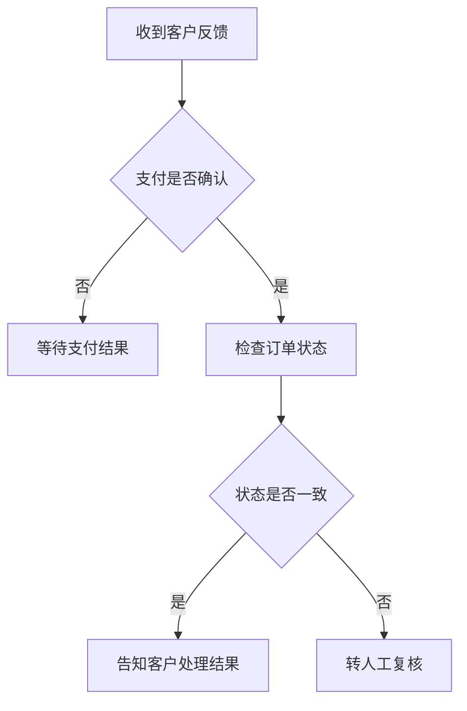

如果当前聊天渲染器只支持通用代码块，那么客服看到的会是上面的 Mermaid 源码。要展示真正的流程图，还需要额外解析源码并生成 SVG，同时处理尚未闭合的图形语法。把流程图提前导出为图片后，通过普通 Markdown 图片引用展示，是另一条独立的路径；它不代表聊天组件具备了 Mermaid 源码渲染能力。

## 五、UML 时序描述

时序图强调不同参与者之间的调用顺序。客服界面负责提交问题，服务端负责查询订单和支付证据，审核服务负责返回建议。下面使用 PlantUML 语法表达这些交互，以便区分 UML 作为建模方式和 PlantUML 作为具体文本语言。对于流式回复，参与者声明、消息箭头和结束标记都可能被拆到不同片段，专门的图形引擎需要处理这种不完整输入。

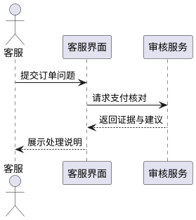

在只有通用 Markdown 渲染器的情况下，这段内容也是一个代码块，不会自动变成时序图。即使代码高亮器知道某种图形语言，它也只是给文本增加颜色，不负责生成布局、连线和图形节点。将来接入图形功能时，需要明确从代码节点分发到图形组件的位置，以及失败时如何保留原始源码，让用户仍能读取模型返回的内容。

## 六、阶段对照表

| 阶段 | 输入 | 输出 |
|---|---|---|
| 传输 | SSE 文字事件 | 标准正文增量 |
| 会话 | 增量与正式消息 | 累积内容块 |
| 解析 | 当前 Markdown | 语法树 |
| 渲染 | 语法树节点 | 页面元素 |

表格分隔行尚未完整到达时，前面的表头可能仍被当作普通段落。等到分隔行形成有效语法，解析器会把同一段源文本重新解释为表格。这个例子说明，尾部不仅会增加字符，也可能改变节点类型。为了避免错误冻结，增量解析需要保留不稳定的末尾区域，而不是看到换行就认为前面的所有内容都已经确定。

## 七、引用、公式与后续操作

客服完成核对后，可以参考[处理规范][guide]记录审核意见，并检查 `src/order-review.ts` 中的返回结构。对于流式生成，引用定义可能出现在文章最后；如果前面的段落已经冻结，暂时显示引用源码是可能的。最终完整解析会重新建立全文引用关系，不能把流式中间状态直接当作最终语义结果。证据保留要求也在文末脚注中说明。[^audit]

我们用一个简单公式表示总处理时间：

$$
T = T_{network} + T_{parse} + T_{render}
$$

这个公式是为了说明传输、解析和渲染都影响用户体验，不是对实际耗时的测量。生成过程中公式仍以文本显示，可以避免半个公式不断触发数学渲染错误。正文完成后，再使用带数学扩展的语法完整解析，把公式交给数学组件。与此同时，图片仍可能在加载，代码语言模块也可能刚完成加载，这些资源有自己的生命周期。

## 八、完成后的检查

最终应当检查文章内容是否完整、代码围栏是否闭合、表格是否形成、图片替代文字是否有意义，以及引用是否能够解析。对性能的判断需要观察每次发布处理了多少尾部内容、冻结块是否被重复渲染、代码已完成行是否被重复高亮。不能仅凭使用了增量解析器就声称所有更新都是常数时间，因为累积字符串、数组复制和前缀比较仍然会随文本长度增长。

这份说明把多种 Markdown 内容放在同一条回复中，目的是观察同一个正文内容块如何形成多个页面元素。传输层不需要提前拆出图片、代码和段落；语法解析完成之后，展示层才决定每个节点交给什么组件。客服最终看到的是整篇处理说明，而服务器保存的是正式消息与可追溯的流记录，两者围绕同一份正文建立关联。

[guide]: https://example.com/support/review-guide

[^audit]: 审核记录应包含订单标识、证据来源和处理意见，具体保存要求以项目规则为准。
````

## 附录 B：最终顶层 AST 与绝对 key

这是完成时使用带数学扩展的语法解析得到的结果。普通流式语法中 key 3303 的节点类型是 paragraph；完成后为 math。

| 标识 | 绝对 key | 顶层类型 | 内容 |
|---|---:|---|---|
| B1 | 0 | `heading` | AI 客服工单系统：从流式回答到页面展示 |
| B2 | 24 | `paragraph` | 我们准备为客服人员生成一份处理说明。回答需要先说明客户遇到的问题，再 |
| B3 | 195 | `paragraph` | 假设客户反馈支付成功后订单仍显示待付款，客服需要核对支付流水、订单状 |
| B4 | 360 | `heading` | 一、先明确数据边界 |
| B5 | 374 | `paragraph` | 模型生成的回复可能是一整个正文内容块，但正文内部可以包含很多 Mar |
| B6 | 538 | `paragraph` | 我们还需要区分服务器记录和前端视图。服务器保存可追溯的正式消息以及流 |
| B7 | 686 | `blockquote` | 处理原则引用块 |
| B8 | 723 | `heading` | 二、接口处理示例 |
| B9 | 736 | `paragraph` | 下面的接口示例先读取订单，再核对支付流水，最后返回人工复核建议。它用 |
| B10 | 884 | `code` | ts |
| B11 | 1295 | `paragraph` | 客服阅读代码时，复制按钮和语言标签属于代码组件的界面功能，代码文本本 |
| B12 | 1442 | `heading` | 三、支付流程图片 |
| B13 | 1455 | `paragraph` | 图片可以帮助客服把支付请求、支付平台和业务订单的关系联系起来。Mar |
| B14 | 1612 | `paragraph` | 图片段落 |
| B15 | 1671 | `paragraph` | 在这个例子中，图片地址只是占位符。实际项目应该使用能访问的图片资源， |
| B16 | 1819 | `heading` | 四、Mermaid 流程描述 |
| B17 | 1838 | `paragraph` | 我们用 Mermaid 源码描述客服审核流程：收到问题后先核对支付状 |
| B18 | 1998 | `code` | mermaid |
| B19 | 2156 | `paragraph` | 如果当前聊天渲染器只支持通用代码块，那么客服看到的会是上面的 Mer |
| B20 | 2312 | `heading` | 五、UML 时序描述 |
| B21 | 2327 | `paragraph` | 时序图强调不同参与者之间的调用顺序。客服界面负责提交问题，服务端负责 |
| B22 | 2494 | `code` | plantuml |
| B23 | 2659 | `paragraph` | 在只有通用 Markdown 渲染器的情况下，这段内容也是一个代码块 |
| B24 | 2809 | `heading` | 六、阶段对照表 |
| B25 | 2821 | `table` | 阶段对照表 |
| B26 | 2954 | `paragraph` | 表格分隔行尚未完整到达时，前面的表头可能仍被当作普通段落。等到分隔行 |
| B27 | 3092 | `heading` | 七、引用、公式与后续操作 |
| B28 | 3109 | `paragraph` | 客服完成核对后，可以参考记录审核意见，并检查 src/order-r |
| B29 | 3284 | `paragraph` | 我们用一个简单公式表示总处理时间： |
| B30 | 3303 | `math` | T = T_{network} + T_{parse} + T_{r |
| B31 | 3351 | `paragraph` | 这个公式是为了说明传输、解析和渲染都影响用户体验，不是对实际耗时的测 |
| B32 | 3496 | `heading` | 八、完成后的检查 |
| B33 | 3509 | `paragraph` | 最终应当检查文章内容是否完整、代码围栏是否闭合、表格是否形成、图片替 |
| B34 | 3668 | `paragraph` | 这份说明把多种 Markdown 内容放在同一条回复中，目的是观察同 |
| B35 | 3817 | `definition` | guide 引用定义 |
| B36 | 3868 | `footnoteDefinition` | audit 脚注定义 |

## 附录 C：核心 API 与状态所有权

| API 或对象 | 所有权 | 作用 | 能否直接当作第三方插件功能 |
|---|---|---|---|
| `TextDecoderStream` | 平台 API | 增量字符解码 | 平台能力 |
| `EventSourceParserStream` | eventsource-parser | SSE 事件边界 | 第三方流解析能力 |
| `translate()` | Harness 模型适配器 | 标准 StreamChunk | 项目内部能力 |
| `AssistantStreamAttempt` | Harness Host | 实时帧、内容与正式提交 | 项目内部能力 |
| `AssistantStreamAccumulator` | Harness LLM 包 | 紧凑 stream 记录 | 项目内部能力 |
| `ClientAssistantStream` | Harness 客户端 | 临时与正式消息协调 | 项目内部能力 |
| `ConversationNodeAssembler` | Harness UI Conversation | dirty 状态与视图组装 | 项目内部能力 |
| `ChatSnapshotBuilder` | Harness UI Chat | 节点、顺序与索引 | 项目内部能力 |
| `fromMarkdown()` | mdast-util-from-markdown | 文本转 mdast | 第三方解析 API |
| `parseGfm()` | Harness UI primitives | 配置语法入口 | 项目内部函数 |
| `IncrementalMarkdownParser.update()` | Harness UI primitives | 冻结 AST、更新尾部 | 自定义增量机制 |
| `StreamingRenderer.render()` | Harness UI primitives | 冻结元素和语义缓存 | 自定义渲染机制 |
| `StreamingHighlightSession.updateFrame()` | Harness UI primitives | 代码行增量高亮 | 项目包装 Shiki 的机制 |
| `parseGfmWithMath()` | Harness UI primitives | 完成时全文语法 | 项目内部函数 |

## 附录 D：源码阅读地图

Harness 链接全部固定到 `639ed015397290b3745d163aafe02ffee4aa3f84`，不会随 main 分支变化。react-markdown 的入口链接也固定了所核对的源码提交；其文档链接是官方仓库文档。

| 索引 | 源码 | 主要阅读内容 |
|---|---|---|
| S1 | [SSE 解析][S1] | `packages/llm/llm-deepseek/src/sse.ts` |
| S2 | [模型适配][S2] | `packages/llm/llm-deepseek/src/translate.ts` |
| S3 | [Host attempt][S3] | `packages/core/agent-loop/src/assistant-stream.ts` |
| S4 | [紧凑流记录][S4] | `packages/llm/llm/src/assistant-stream.ts` |
| S5 | [正式消息提交][S5] | `packages/core/agent-loop/src/agent.ts` |
| S6 | [WebSocket 协议][S6] | `packages/api/gateway/src/stream-protocol.ts` |
| S7 | [逻辑流客户端][S7] | `packages/api/gateway/src/client/stream-client.ts` |
| S8 | [Session 传输适配][S8] | `packages/api/session-controller/src/client/transport.ts` |
| S9 | [客户端协调][S9] | `packages/api/session-controller/src/client/sessions/assistant-stream.ts` |
| S10 | [重连基线][S10] | `packages/api/session-controller/src/assistant-stream.ts` |
| S11 | [Assistant 组装][S11] | `packages/client/ui-chat/src/client/conversation-nodes/assistant.ts` |
| S12 | [发布调度][S12] | `packages/client/ui-conversation/src/client/conversation/assembly.ts` |
| S13 | [dirty 组装器][S13] | `packages/client/ui-conversation/src/client/conversation/assembler.ts` |
| S14 | [ChatSnapshotBuilder][S14] | `packages/client/ui-chat/src/client/conversation-nodes/chat-snapshot-builder.ts` |
| S15 | [节点组件][S15] | `packages/client/ui-chat/src/client/chat/ChatNodeSeat.tsx` |
| S16 | [AssistantNodeView][S16] | `packages/client/ui-chat/src/client/chat/AssistantNodeView.tsx` |
| S17 | [AssistantMarkdown][S17] | `packages/client/ui-chat/src/client/chat/AssistantMarkdown.tsx` |
| S18 | [增量解析器][S18] | `packages/client/ui-primitives/src/markdown/incremental.ts` |
| S19 | [MarkdownText][S19] | `packages/client/ui-primitives/src/markdown/MarkdownText.tsx` |
| S20 | [语法入口][S20] | `packages/client/ui-primitives/src/markdown/parse.ts` |
| S21 | [mdast 渲染][S21] | `packages/client/ui-primitives/src/markdown/render.tsx` |
| S22 | [高亮器][S22] | `packages/client/ui-primitives/src/markdown/highlight.ts` |
| S23 | [CodeBlock][S23] | `packages/client/ui-primitives/src/markdown/CodeBlock.tsx` |
| S24 | [视口激活][S24] | `packages/client/ui-primitives/src/markdown/useViewportHighlighting.ts` |
| S25 | [网站 Mermaid 查看器][S25] | `website/.vitepress/theme/mermaid-viewer.ts` |
| S26 | [react-markdown 入口][S26] | 官方 API 或架构说明 |
| S27 | [react-markdown 文档][S27] | 官方 API 或架构说明 |
| S28 | [fromMarkdown 文档][S28] | 官方 API 或架构说明 |
| S29 | [Mermaid 使用文档][S29] | 官方 API 或架构说明 |

[S1]: https://github.com/deepseek-ai/deepseek-harness/blob/639ed015397290b3745d163aafe02ffee4aa3f84/packages/llm/llm-deepseek/src/sse.ts
[S2]: https://github.com/deepseek-ai/deepseek-harness/blob/639ed015397290b3745d163aafe02ffee4aa3f84/packages/llm/llm-deepseek/src/translate.ts
[S3]: https://github.com/deepseek-ai/deepseek-harness/blob/639ed015397290b3745d163aafe02ffee4aa3f84/packages/core/agent-loop/src/assistant-stream.ts
[S4]: https://github.com/deepseek-ai/deepseek-harness/blob/639ed015397290b3745d163aafe02ffee4aa3f84/packages/llm/llm/src/assistant-stream.ts
[S5]: https://github.com/deepseek-ai/deepseek-harness/blob/639ed015397290b3745d163aafe02ffee4aa3f84/packages/core/agent-loop/src/agent.ts
[S6]: https://github.com/deepseek-ai/deepseek-harness/blob/639ed015397290b3745d163aafe02ffee4aa3f84/packages/api/gateway/src/stream-protocol.ts
[S7]: https://github.com/deepseek-ai/deepseek-harness/blob/639ed015397290b3745d163aafe02ffee4aa3f84/packages/api/gateway/src/client/stream-client.ts
[S8]: https://github.com/deepseek-ai/deepseek-harness/blob/639ed015397290b3745d163aafe02ffee4aa3f84/packages/api/session-controller/src/client/transport.ts
[S9]: https://github.com/deepseek-ai/deepseek-harness/blob/639ed015397290b3745d163aafe02ffee4aa3f84/packages/api/session-controller/src/client/sessions/assistant-stream.ts
[S10]: https://github.com/deepseek-ai/deepseek-harness/blob/639ed015397290b3745d163aafe02ffee4aa3f84/packages/api/session-controller/src/assistant-stream.ts
[S11]: https://github.com/deepseek-ai/deepseek-harness/blob/639ed015397290b3745d163aafe02ffee4aa3f84/packages/client/ui-chat/src/client/conversation-nodes/assistant.ts
[S12]: https://github.com/deepseek-ai/deepseek-harness/blob/639ed015397290b3745d163aafe02ffee4aa3f84/packages/client/ui-conversation/src/client/conversation/assembly.ts
[S13]: https://github.com/deepseek-ai/deepseek-harness/blob/639ed015397290b3745d163aafe02ffee4aa3f84/packages/client/ui-conversation/src/client/conversation/assembler.ts
[S14]: https://github.com/deepseek-ai/deepseek-harness/blob/639ed015397290b3745d163aafe02ffee4aa3f84/packages/client/ui-chat/src/client/conversation-nodes/chat-snapshot-builder.ts
[S15]: https://github.com/deepseek-ai/deepseek-harness/blob/639ed015397290b3745d163aafe02ffee4aa3f84/packages/client/ui-chat/src/client/chat/ChatNodeSeat.tsx
[S16]: https://github.com/deepseek-ai/deepseek-harness/blob/639ed015397290b3745d163aafe02ffee4aa3f84/packages/client/ui-chat/src/client/chat/AssistantNodeView.tsx
[S17]: https://github.com/deepseek-ai/deepseek-harness/blob/639ed015397290b3745d163aafe02ffee4aa3f84/packages/client/ui-chat/src/client/chat/AssistantMarkdown.tsx
[S18]: https://github.com/deepseek-ai/deepseek-harness/blob/639ed015397290b3745d163aafe02ffee4aa3f84/packages/client/ui-primitives/src/markdown/incremental.ts
[S19]: https://github.com/deepseek-ai/deepseek-harness/blob/639ed015397290b3745d163aafe02ffee4aa3f84/packages/client/ui-primitives/src/markdown/MarkdownText.tsx
[S20]: https://github.com/deepseek-ai/deepseek-harness/blob/639ed015397290b3745d163aafe02ffee4aa3f84/packages/client/ui-primitives/src/markdown/parse.ts
[S21]: https://github.com/deepseek-ai/deepseek-harness/blob/639ed015397290b3745d163aafe02ffee4aa3f84/packages/client/ui-primitives/src/markdown/render.tsx
[S22]: https://github.com/deepseek-ai/deepseek-harness/blob/639ed015397290b3745d163aafe02ffee4aa3f84/packages/client/ui-primitives/src/markdown/highlight.ts
[S23]: https://github.com/deepseek-ai/deepseek-harness/blob/639ed015397290b3745d163aafe02ffee4aa3f84/packages/client/ui-primitives/src/markdown/CodeBlock.tsx
[S24]: https://github.com/deepseek-ai/deepseek-harness/blob/639ed015397290b3745d163aafe02ffee4aa3f84/packages/client/ui-primitives/src/markdown/useViewportHighlighting.ts
[S25]: https://github.com/deepseek-ai/deepseek-harness/blob/639ed015397290b3745d163aafe02ffee4aa3f84/website/.vitepress/theme/mermaid-viewer.ts
[S26]: https://github.com/remarkjs/react-markdown/blob/d56c266ba801d0e2487028d8c8d60aac06ceb5ff/lib/index.js
[S27]: https://github.com/remarkjs/react-markdown
[S28]: https://github.com/syntax-tree/mdast-util-from-markdown
[S29]: https://mermaid.js.org/config/usage.html

Mermaid 图形语法由 Mermaid 11.12.2 解析校验。图形使用标准流程图、时序图、类图和状态图；是否显示为图像取决于 Markdown 阅读器。语法校验不等于已经逐图验证所有阅读器里的布局。
