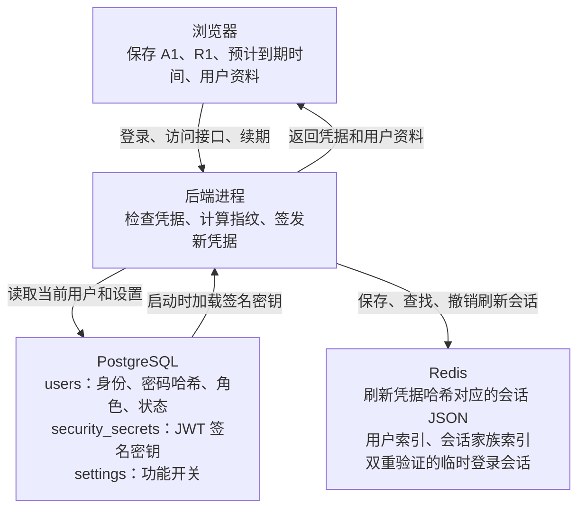
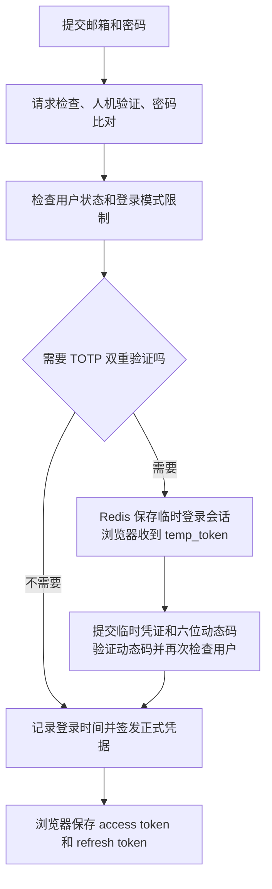
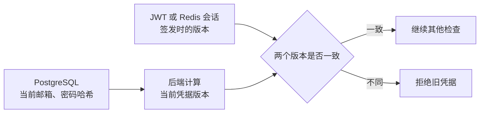
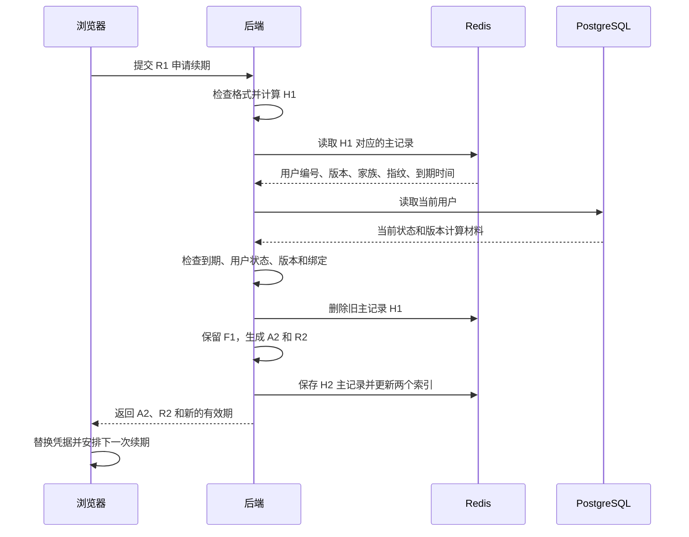

# Sub2API 登录流程解析

> 基于 `Wei-Shaw/sub2api` commit `3a6fd1c9db07203ca308aaba69e502bc1f35b307`，2026-10-09 核对。出处收在文末脚注。

你在 Sub2API 输入邮箱和密码，登录成功后关闭页面，第二天重新打开，系统还认得你。这期间密码没有再次输入，浏览器却能继续查询余额、管理 API Key，有时还能在登录凭据到期后自动续上。

这件事靠三部分共同完成：**PostgreSQL 保存用户身份和系统签名密钥，Redis 保存刷新会话，浏览器保存两张用途不同的凭据。** 登录时确认身份，访问接口时检查身份，续期时换发凭据，退出时清理会话；它们分别操作不同的数据。

下面沿着邮箱密码登录这条主线，把双重验证、接口鉴权、续期和退出连起来。第三方 OAuth 和 Passkey 的身份验证入口另有流程；本文的 Token 存储地图以正常签发 access token 和 refresh token 的路径为准。

可以先[打开登录数据流动画](./demos/index.html)：启动、密码登录、双重验证、接口鉴权、续期、退出和改密，逐步看数据存在哪里、怎样取出，以及取出后怎么用。动画使用示意凭据，支持暂停、跳步和展开字段；资源随页面保存，可离线打开。

## 先看数据分别住在哪里

假设用户编号是 42。用户在电脑上登录一次，服务器为这次登录分配会话编号 F1，再发给浏览器访问凭据 A1 和刷新凭据 R1。

用这组名字看全局地图：



这里最容易混淆的是：数据库里的用户、Redis 里的刷新会话、浏览器里的 Token，是三份不同用途的数据。它们的对应关系如下。[^1][^2][^3][^4]

| 数据 | PostgreSQL | Redis | 浏览器 |
|---|---|---|---|
| 用户身份与密码哈希 | 用户表长期保存 | 刷新会话只引用用户编号 | 保存展示用的用户资料，不保存密码哈希 |
| JWT 签名密钥 | 系统密钥表保存 | 刷新会话不保存 | 不返回浏览器 |
| access token 原值 | 不为每张凭据建记录 | 刷新会话不保存 | 保存完整 JWT 字符串 |
| refresh token 原值 | 不保存 | 保存哈希对应的会话，不保存原值 | 保存完整随机字符串 |
| 会话编号 | 用户表没有对应会话列 | 会话 JSON 和家族索引中保存 | 包含在 JWT 的 `sid` 字段中 |
| 凭据版本 | 用户表没有独立版本列 | 会话 JSON 中保存签发时版本 | JWT 中保存签发时版本 |

浏览器带来的用户资料只用于恢复界面。真正的身份和权限，要经过服务端检查。

**Redis 在这条链路里承担刷新会话存储。丢失刷新主记录后，浏览器即使还拿着 R1，也不能靠它续期。**[^2]

## 密码通过后还可能有一道动态码验证

用户点击登录，浏览器把邮箱、密码，以及按配置需要的人机验证凭证提交给登录接口。入口有服务端限流，然后才进入登录处理。[^5]

服务端先检查请求格式和人机验证，再按邮箱查询用户。用户不存在与密码不匹配，都返回凭据错误；数据库读取故障则返回服务不可用。密码通过 bcrypt 与已保存的密码哈希比对，通过后还要确认用户处于可用状态。[^6]

可以把它看成两次不同的确认：密码回答“你能证明自己是谁吗”，账号状态回答“这个身份现在还允许登录吗”。密码正确，账号被禁用，仍然不能登录。

如果系统开启了双重验证，而且这位用户已经启用 TOTP，流程会先停在中间：



密码通过后返回的是“还需要双重验证”的结果，其中包含临时凭证和脱敏邮箱。浏览器拿临时凭证与六位动态码完成第二次请求，通过后才收到正式登录凭据。临时会话保存在 Redis，有效期为 5 分钟，成功完成第二步后会尝试删除。[^6][^7]

临时凭证的作用是告诉服务器：“这是刚刚通过密码检查、还在等待动态码的那次登录。”它不能当作正常接口的 access token。

读源码时还有一个容易误判的细节：密码校验服务内部已经生成过一张 JWT，但处理器没有把它直接返回给浏览器。处理器继续判断双重验证，最终通过统一的响应路径重新签发正式凭据。**内部出现了 Token 生成调用，不代表浏览器已经获得完整登录权限。**[^6]

## 正式登录时为什么发两张凭据

登录完成后，服务器通常返回一对凭据：

| 凭据 | 浏览器什么时候使用 | 服务端主要检查什么 |
|---|---|---|
| access token | 查询用户资料、余额、管理页面接口 | JWT 签名、有效期、当前用户状态和版本 |
| refresh token | 换发下一对凭据 | Redis 中的刷新会话以及当前用户状态和版本 |

可以把 access token 理解成有到期时间的通行证，把 refresh token 理解成续办通行证的凭条。通行证用于日常进出，凭条用于申请下一张通行证；两者走的检查路径不同。

### access token 带着身份信息和服务器签名

服务器把用户编号、邮箱、角色、凭据版本、会话编号、绑定指纹和时间信息装进 JWT，再用系统签名密钥签名。该版本签发使用 HS256。[^8]

| JWT 字段 | 含义 |
|---|---|
| `user_id` | 用户编号 |
| `email` | 签发时的邮箱 |
| `role` | 签发时的角色 |
| `token_version` | 签发时的凭据版本 |
| `sid` | 本次登录的会话编号，与刷新会话的家族编号对应 |
| `bnd` | IP 与 User-Agent 计算出的绑定指纹，缺失时可省略 |
| `iat` | 签发时间 |
| `nbf` | 最早允许使用的时间 |
| `exp` | 到期时间 |

JWT 的载荷可以解码查看。签名用来让服务器验证内容是否被篡改，载荷本身没有因此变成加密数据，所以这里不放用户密码或签名密钥。

系统密钥表保存的是服务器的“盖章工具”。服务器启动时确保数据库中存在 JWT 签名密钥：没有记录时采用配置值，或生成随机密钥并保存；已有记录时使用持久化值，再加载到运行配置中。配置与数据库值冲突时，该版本优先使用数据库值，以维持实例间一致。[^3]

因此，这把密钥属于整个系统，跨登录、跨续期保留。服务器不会因为某位用户续期，就给整个系统换一把密钥。

### refresh token 是一段随机字符串

刷新凭据采用带前缀的随机字符串形式。服务器生成 32 字节随机数据，编码后加上前缀，再对完整原值计算 SHA-256 哈希。

浏览器拿到原值，Redis 根据哈希查找会话。刷新凭据本身没有 JWT 那样可解码的用户信息。服务器需要借助 Redis，才能知道它属于谁、在哪次登录中产生、是否还允许使用。[^8]

**access token 靠签名证明内容来自服务器，refresh token 靠服务器保存的会话记录取得续期资格。**

正常登录响应还包含凭据类型、访问凭据有效期和用户资料。若凭据对生成失败，处理器有兼容回退路径，可能只返回 access token。因此，“登录成功”不总等于“成功建立了可自动续期的会话”。同时，登录入口限流采用 Redis 故障时拒绝请求的策略，不能据此推断 Redis 完全不可用时仍能正常登录。[^5][^6]

## Redis 为什么保存一份主记录和两个集合

继续用用户 42、会话 F1、刷新凭据 R1 举例。把 R1 的 SHA-256 哈希记为 H1。

Redis 中的三种记录分别回答三个问题：[^2]

| 示例 key | Redis 类型 | 保存内容 | 回答的问题 |
|---|---|---|---|
| `refresh_token:H1` | String | 一段会话 JSON | 这张刷新凭据还能使用吗 |
| `user_refresh_tokens:42` | Set | 用户名下刷新凭据的哈希 | 要撤销用户的刷新会话，该找哪些记录 |
| `token_family:F1` | Set | 这次登录会话链中的哈希 | 要撤销这次登录，该找哪些记录 |

主记录 JSON 保存用户编号、签发时版本、家族编号、绑定指纹、创建时间和到期时间。哈希在 key 中；Redis 的 TTL 是 key 的过期属性，独立于 JSON 里的到期时间。[^2]

如果用户又在手机上登录，服务器会建立另一条会话，例如 F2。用户集合可以索引电脑和手机的刷新凭据，而两个家族集合各自索引一条登录链。于是服务器既能按用户清理，也能只清理某次登录。

续期后，F1 不变，刷新凭据换成 R2，对应哈希 H2。旧主记录删除，新主记录建立，但旧哈希通常仍留在两个索引集合里。集合表示可供清理的索引，不能直接当作当前有效凭据的名单。

**判断能否续期，要读取刷新主记录；哈希还在 Set 里，不代表旧凭据仍然有效。**[^2]

有效期也要分两层看：主记录各有自己的 TTL；两个集合在添加新成员时，对整个集合 key 重新设置 TTL，集合成员没有各自独立的 TTL。

另外，写主记录失败会让刷新凭据生成失败；添加两个集合的失败只记录日志，不阻断签发。由此可见，主记录与索引并非一个整体事务，索引不完整可能影响后续批量清理。[^8]

## 浏览器保存凭据后怎样继续访问接口

正常获得凭据对后，前端把这四项数据写入 localStorage：[^4]

| 存储项 | 保存内容 | 用途 |
|---|---|---|
| `auth_token` | 完整 access token | 给接口请求附加身份凭据 |
| `refresh_token` | 完整 refresh token | 申请续期 |
| `token_expires_at` | 预计到期时间，毫秒时间戳 | 安排前端续期定时器 |
| `auth_user` | 用户资料 JSON | 恢复当前用户界面 |

前端用服务器返回的有效期，加上浏览器当前时间，计算预计到期时间。这个值负责“什么时候尝试续期”；JWT 里的到期时间负责“服务器还接不接受这张凭据”。手动修改浏览器存储的时间，不能延长 JWT 的服务端有效期。

页面重新打开时，前端读取保存的凭据和用户资料恢复界面，并向服务端请求最新用户信息。localStorage 中的字符串没有自己的 TTL，不会仅因 Token 到期就自动消失。[^4]

发送普通请求时，请求拦截器读取 access token，把它放进 Authorization 请求头。服务端的鉴权中间件依次完成这些检查：[^9]

1. 请求头是否携带格式正确的 Bearer 凭据。
2. JWT 签名是否合法，是否到期或尚未生效。
3. 根据用户编号读取当前用户，用户是否存在、是否处于可用状态。
4. 凭据里的版本是否与当前用户版本一致。
5. 开启会话绑定时，当前请求指纹是否匹配。

通过后，服务端把用户编号、当前角色、邮箱和会话编号放入请求上下文，再进入业务处理。

**Sub2API 的普通 JWT 鉴权会读取当前用户。JWT 里的角色是签发时快照，后续权限判断使用的请求上下文角色来自当前用户。**[^9]

这也解释了两个现象：用户被禁用后，下一次鉴权会失败；JWT 还没到期，修改密码也可能让它失效。

## 用户表没有版本列为什么改密还能使旧凭据失效

如果只看服务层的用户对象，你会看到凭据版本这个字段，还会看到改密时对它自增。很容易据此想象：数据库里有一列，每次修改密码就把它加一。

但这个版本的用户表没有独立的凭据版本列。**持久化的是计算版本所需的材料，当前版本在后端根据用户数据计算。**[^1][^10]

主要计算材料是规范化后的邮箱和密码哈希。服务器把材料组合后做 SHA-256，从结果中取数字指纹，用来形成凭据版本。实际实现还处理内存对象的版本值，以及版本是否已经计算过的标记。



签发时，服务器把当时的版本写进 JWT 和 Redis 刷新会话。下次接口鉴权或续期，再根据当前用户重新计算，进行比较。

修改密码时，数据库更新密码哈希。计算材料变了，当前版本随之变化，旧 JWT 和旧刷新会话保存的还是先前版本，比较时就会失败。重新读出的用户会计算并标记当前版本，避免把已经计算过的值重复加工。[^10]

因此，不能把“内存对象的版本自增”单独解释成“数据库版本已经更新”。在这条改密路径里，真正跨进程、跨请求生效的变化是密码哈希被持久化。

## 到期前后浏览器怎样换发下一对凭据

假设电脑上的登录已经建立，浏览器保存 A1 和 R1。前端会在访问凭据预计到期前 120 秒安排主动续期；如果已经接近或超过这个时间点，就立即尝试。[^11]

还有一条补救路径：普通接口返回 401 时，如果浏览器有刷新凭据，且请求不是登录、注册或刷新入口，请求拦截器尝试续期，然后用新 access token 重试原请求一次。这里触发条件是 401，不能把所有续期尝试都理解为“访问凭据刚刚到期”。[^12]

刷新接口接收的是 refresh token。它没有要求先通过普通 JWT 鉴权，所以 access token 到期以后，只要刷新会话仍有效，就还有续期机会。[^5]

后端的正常处理顺序是：[^13]



续期保持同一个家族编号，表明这是同一次登录延续下来的会话。访问凭据和刷新凭据都会重新生成，创建时间和到期时间按本次签发重新计算。默认配置是访问凭据回退到 24 小时、刷新凭据 30 天；部署可以覆盖。持续成功续期会延后新刷新凭据的到期时间，不能把默认 30 天理解为首次登录之后绝对不能超过的总时长。[^14]

**正常续期会换发两张新凭据，浏览器必须同时接住新的 access token 和 refresh token。** 只替换前者、继续保存 R1，下一次续期就可能找不到旧主记录。

不过，“旧刷新凭据正常轮换后失效”也有实现边界：

- 读取旧记录、删除旧记录、生成新记录是分开的操作，没有形成一次原子消费。
- 删除旧记录失败时，代码记日志后继续签发，不能保证每种故障下旧凭据都已失效。
- 删除成功而新凭据签发失败时，旧凭据可能已经不可用，浏览器又没有拿到新凭据。
- 旧记录查不到时，代码返回无效凭据并记录可能复用的日志，没有在这个分支自动定位并撤销整个家族。

这些都是该版本的实际边界。顺着操作顺序看，还能推导出：两个请求若都在删除前读到旧记录，就可能各自通过检查。**会话家族和轮换机制的存在，并不等于服务端已经实现严格的并发一次性消费。**[^13]

## 多个标签页一起续期怎样协调

你开了两个 Sub2API 标签页，它们共享同一份 localStorage，也可能同时发现 access token 到期。

如果两个页面各自拿 R1 续期，一个页面先完成轮换，另一个页面还拿旧凭据请求，就可能收到失败。此时用户的会话未必过期，新的凭据可能已经由另一个页面拿到，只是还没写进存储。

前端针对这个情况做了三层协调：[^15]

1. **同一页面合并请求。** 正在续期时，后来调用者共享同一个 Promise，等待同一份结果。
2. **不同标签页尽量排队。** 浏览器支持 Web Locks 时，使用同一把刷新锁串行处理。
3. **重新查看共享存储。** 若其他页面已换发凭据，采用它保存的结果；请求失败时也会在有限等待窗口内检查是否已有新凭据。

续期结果写入时，前端先保存访问凭据与预计到期时间，最后保存新刷新凭据，让其他页面可以把刷新凭据的变化当作新结果已写入的标志。它还检查会话是否在请求期间被退出或换成其他用户，避免旧响应覆盖新会话。

**前端协调能减少浏览器内部的重复续期，服务端的并发约束仍要由服务端实现。** 不支持 Web Locks 的浏览器会走协调能力较弱的回退路径，其他客户端也不受这把浏览器锁约束。

当普通请求触发的续期遇到网络故障、限流或服务端错误时，拦截器会保留当前存储并返回续期暂不可用；明确的凭据拒绝则可能清理登录状态并跳转登录页。因此，刷新接口一次失败，不能一概解释成会话被注销。[^12]

## 开启网络绑定后换个网络可能需要重新登录

服务器可以把登录时的客户端 IP 与 User-Agent 计算成指纹，写进 JWT 和 Redis 刷新会话。系统设置控制是否执行比对，该版本默认关闭。[^16]

开启后，普通接口和续期都可能检查当前请求与原来指纹是否一致。指纹不匹配时，服务器拒绝请求，并尝试撤销这一会话家族的刷新凭据。旧凭据没有绑定指纹时有兼容放行路径，续期时再补上。

这解释了为什么手机从 Wi-Fi 切到移动网络，可能需要重新登录：密码没有变化，但这次请求的网络指纹已经不符合原来会话的条件。

这里的“浏览器指纹”具体指 IP 和 User-Agent 的组合，不应理解成设备硬件、Canvas 或其他完整设备指纹系统。

**数据库保存的是绑定开关，JWT 和 Redis 保存的是某次会话的具体指纹。** 开关与会话数据分处不同位置。

## 退出登录后哪部分资格真的消失了

用户点击退出，前端尝试提交当前 refresh token，让服务器撤销它；随后清理浏览器中的凭据、用户资料和刷新定时器。网络请求失败也会执行本地清理，用户不必因为服务端暂时不可达而留在本地登录状态。[^17]

服务器正常撤销的是该刷新凭据对应的 Redis 主记录。普通退出不修改用户密码，不轮换系统签名密钥，也不会同步把两个索引集合全部清空。

那么，已经签发的 A2 呢？它本身不会被改写。普通鉴权也没有通过“对应的刷新主记录还在不在”来决定 access token 是否有效。

**退出后的浏览器不再持有日常请求凭据；但另行保留的 access token，在到期或其他鉴权条件失效前，仍可能通过检查。**[^9][^17]

把几种容易混在一起的操作并排看，就能判断其影响：

| 操作 | 刷新会话发生什么 | 已签发 access token 发生什么 |
|---|---|---|
| 普通退出 | 正常撤销当前刷新主记录；本地清理 | 不因删除刷新记录而立即失效 |
| 撤销所有会话 | 按用户索引尝试删除刷新主记录和用户集合 | 该路径没有持久化新的凭据版本，不能单独保证立即失效 |
| 修改密码 | 旧会话版本与当前版本不一致，续期被拒绝 | 下次鉴权因版本不一致被拒绝 |
| 禁用用户 | 续期检查发现账号不可用，并尝试撤销家族 | 下次鉴权因账号不可用被拒绝 |
| 凭据到期 | 刷新主记录受 TTL 和程序到期检查约束 | JWT 到期检查拒绝使用 |

“撤销所有会话”在这个版本里也要看实际动作：它清理刷新会话，没有把用户的邮箱或密码哈希改成新材料；清理失败还可能只记录日志。所以不能仅凭接口名称或成功提示，断言所有已发 JWT 已经立即失效。[^18]

## 把登录后的数据变化连起来

回到用户 42 的电脑会话。正常串行成功路径中，登录、续期、退出对应的变化如下：

| 位置 | 登录得到 A1 和 R1 | 续期得到 A2 和 R2 | 正常退出 |
|---|---|---|---|
| PostgreSQL 用户表 | 读取身份，尝试记录登录和活跃时间 | 读取当前用户，不新增 Token 记录 | 用户仍存在 |
| PostgreSQL 系统密钥表 | 使用启动时加载的签名密钥 | 使用同一把签名密钥 | 密钥仍存在 |
| Redis 主记录 | 新建 H1 会话 | 删除 H1，新建 H2 | 删除 H2 |
| Redis 用户集合 | 加入 H1 | 加入 H2，H1 通常仍在 | 普通退出不顺带清空 |
| Redis 家族集合 | F1 中加入 H1 | F1 中加入 H2，家族编号不变 | 普通退出不顺带清空 |
| 浏览器 | 保存凭据对、预计到期时间和用户资料 | 替换凭据对与预计到期时间 | 清理本地登录数据和定时器 |

登录时间的写入是尽力记录，写入失败会记日志；它与 Token 签发也不能理解为一个跨 PostgreSQL 和 Redis 的整体事务。[^19]

现在几条看起来反直觉的结论都有来处：密码通过后可能还要动态码，是因为登录尚停在临时会话；Redis 中保留旧哈希不代表旧凭据有效，是因为续期认的是主记录；改密能使旧凭据失效，是因为版本依赖当前密码哈希；退出不保证 JWT 立即失效，是因为普通鉴权没有读取刷新主记录。

**理解 Sub2API 登录流程，关键是沿着每一次请求，分别问清楚服务器检查了什么、读取了哪里、又改变了哪份数据。**

## 附录 数据存放示例

以下名称和内容用于说明结构，A1、R1、H1、F1 都是示意值，不是可用凭据。

### HTTP 入口

| 方法与接口 | 请求主要携带什么 | 是否先经过普通 JWT 鉴权 |
|---|---|---|
| `POST /api/v1/auth/login` | 邮箱、密码和按配置需要的人机验证凭证 | 否 |
| `POST /api/v1/auth/login/2fa` | 临时凭证与六位动态码 | 否 |
| `GET /api/v1/auth/me` | 请求头中的 access token | 是 |
| `POST /api/v1/auth/refresh` | 请求体中的 refresh token | 否 |
| `POST /api/v1/auth/logout` | 可选的 refresh token | 否 |
| `POST /api/v1/auth/revoke-all-sessions` | 请求头中的 access token | 是 |

不先经过普通 JWT 鉴权的接口仍各有自己的凭据、限流或模式检查，不能把“公开路由”理解成任意请求都会成功。[^5]

### PostgreSQL 的登录相关数据

```text
users
  id                    = 42
  email                 = user@example.com
  password_hash         = bcrypt 密码哈希
  role                  = user
  status                = active
  totp_enabled          = false
  totp_secret_encrypted = 加密的 TOTP 密钥或空值
  last_login_at         = 最近成功登录时间
  last_active_at        = 最近活跃时间

security_secrets
  key                   = jwt_secret
  value                 = 系统 JWT 签名密钥

settings
  key                   = session_binding_enabled
  value                 = true / false 的字符串

users 没有这些独立列：
  access_token、refresh_token、family_id、token_version、token_expires_at
```

### Redis 刷新会话主记录

```text
刷新凭据原值：R1（实际形如 rt_ 后接随机十六进制字符串）
哈希：H1 = SHA256(R1)

key：refresh_token:H1
类型：String
TTL：按 refresh token 配置设置，默认 30 天
value：下面的 JSON
```

```json
{
  "user_id": 42,
  "token_version": 123456789,
  "family_id": "F1",
  "binding_hash": "示意的IP与User-Agent组合指纹",
  "created_at": "2026-10-09T10:00:00+08:00",
  "expires_at": "2026-11-08T10:00:00+08:00"
}
```

哈希不在 JSON 字段中，TTL 也不在 JSON 字段中。绑定指纹为空时，该字段可以省略。

### Redis 索引与双重验证临时会话

```text
user_refresh_tokens:42
  类型：Set
  成员：H1、H2、另一设备的刷新凭据哈希

token_family:F1
  类型：Set
  成员：这次登录链中的 H1、H2

totp:login:<temp_token>
  类型：String
  内容：待完成双重验证的临时会话 JSON
  TTL：5 分钟
```

### 浏览器 localStorage

```text
auth_token       = A1，完整 JWT 字符串
refresh_token    = R1，完整刷新凭据原值
token_expires_at = 浏览器计算的预计到期时间，毫秒时间戳
auth_user        = 用户资料 JSON

会话编号与版本在 auth_token 的 JWT 载荷内：
sid              = F1
token_version    = 签发时版本

浏览器没有因此额外建立 family_id 或 token_version 存储项。
```

## 出处

以下链接均固定到同一提交，行号指向这次核对的源码版本。

[^1]: [用户表定义](https://github.com/Wei-Shaw/sub2api/blob/3a6fd1c9db07203ca308aaba69e502bc1f35b307/backend/ent/schema/user.go#L39-L116)，`backend/ent/schema/user.go:39-116`：身份、密码哈希、角色、状态、TOTP 和登录活跃时间；全文没有独立的 Token 存储列或凭据版本列。
[^2]: [Redis 会话实现](https://github.com/Wei-Shaw/sub2api/blob/3a6fd1c9db07203ca308aaba69e502bc1f35b307/backend/internal/repository/refresh_token_cache.go#L13-L158)，`backend/internal/repository/refresh_token_cache.go:13-158`：主记录 String、两个 Set、TTL、单条和批量删除；[会话数据定义](https://github.com/Wei-Shaw/sub2api/blob/3a6fd1c9db07203ca308aaba69e502bc1f35b307/backend/internal/service/refresh_token_cache.go#L13-L21)，`backend/internal/service/refresh_token_cache.go:13-21`：会话 JSON 字段。
[^3]: [系统密钥表迁移](https://github.com/Wei-Shaw/sub2api/blob/3a6fd1c9db07203ca308aaba69e502bc1f35b307/backend/migrations/053_add_security_secrets.sql#L1-L10)，`backend/migrations/053_add_security_secrets.sql:1-10`；[密钥启动加载](https://github.com/Wei-Shaw/sub2api/blob/3a6fd1c9db07203ca308aaba69e502bc1f35b307/backend/internal/repository/security_secret_bootstrap.go#L21-L128)，`backend/internal/repository/security_secret_bootstrap.go:21-128`：配置值首次保存、已有值优先、随机生成和读取持久化密钥。
[^4]: [前端登录状态保存与恢复](https://github.com/Wei-Shaw/sub2api/blob/3a6fd1c9db07203ca308aaba69e502bc1f35b307/frontend/src/stores/auth.ts#L105-L140)，`frontend/src/stores/auth.ts:105-140`：从浏览器存储恢复并请求当前用户；同文件 `:298-329` 保存凭据和用户、安排续期，`:462-478` 清理状态。
[^5]: [认证路由](https://github.com/Wei-Shaw/sub2api/blob/3a6fd1c9db07203ca308aaba69e502bc1f35b307/backend/internal/server/routes/auth.go#L26-L58)，`backend/internal/server/routes/auth.go:26-58`：公开登录、双重验证、刷新与退出入口，登录和刷新限流采用 fail-close；`:250-262` 为需要 JWT 的当前用户与撤销所有会话入口。
[^6]: [登录处理器](https://github.com/Wei-Shaw/sub2api/blob/3a6fd1c9db07203ca308aaba69e502bc1f35b307/backend/internal/handler/auth_handler.go#L237-L284)，`backend/internal/handler/auth_handler.go:237-284`：请求、人机验证、模式限制与双重验证分支；`:114-147` 正式响应与只返回 access token 的兼容回退；`:301-420` 完成双重验证。[密码校验服务](https://github.com/Wei-Shaw/sub2api/blob/3a6fd1c9db07203ca308aaba69e502bc1f35b307/backend/internal/service/auth_service.go#L534-L565)，`backend/internal/service/auth_service.go:534-565` 与 `:1462-1474`：查询用户、bcrypt 比对、状态检查与内部 JWT 生成。
[^7]: [TOTP 临时会话](https://github.com/Wei-Shaw/sub2api/blob/3a6fd1c9db07203ca308aaba69e502bc1f35b307/backend/internal/service/totp_service.go#L443-L476)，`backend/internal/service/totp_service.go:443-476`，有效期常量在 `:90-94`；[Redis 临时会话存储](https://github.com/Wei-Shaw/sub2api/blob/3a6fd1c9db07203ca308aaba69e502bc1f35b307/backend/internal/repository/totp_cache.go#L72-L110)，`backend/internal/repository/totp_cache.go:72-110`，key 前缀在 `:14-19`。
[^8]: [JWT 构建与凭据对生成](https://github.com/Wei-Shaw/sub2api/blob/3a6fd1c9db07203ca308aaba69e502bc1f35b307/backend/internal/service/auth_service.go#L1420-L1460)，`backend/internal/service/auth_service.go:59-70`、`:1420-1460`、`:1689-1775`：JWT 字段、HS256 签名、家族编号、随机刷新凭据、主记录和索引写入；哈希计算在 `:1914-1917`。
[^9]: [普通接口 JWT 鉴权](https://github.com/Wei-Shaw/sub2api/blob/3a6fd1c9db07203ca308aaba69e502bc1f35b307/backend/internal/server/middleware/jwt_auth.go#L38-L115)，`backend/internal/server/middleware/jwt_auth.go:38-115`：签名验证后的当前用户读取、状态、版本、绑定检查和当前角色注入；[JWT 验证](https://github.com/Wei-Shaw/sub2api/blob/3a6fd1c9db07203ca308aaba69e502bc1f35b307/backend/internal/service/auth_service.go#L1347-L1388)，`backend/internal/service/auth_service.go:1347-1388`：算法限制、签名、到期与生效时间验证。
[^10]: [凭据版本计算](https://github.com/Wei-Shaw/sub2api/blob/3a6fd1c9db07203ca308aaba69e502bc1f35b307/backend/internal/service/auth_service.go#L1919-L1931)，`backend/internal/service/auth_service.go:1919-1931`；[用户改密与版本规范化](https://github.com/Wei-Shaw/sub2api/blob/3a6fd1c9db07203ca308aaba69e502bc1f35b307/backend/internal/service/user_service.go#L1020-L1068)，`backend/internal/service/user_service.go:1020-1068`：仅持久化密码哈希，以及读取后的版本计算标记。
[^11]: [主动续期定时器](https://github.com/Wei-Shaw/sub2api/blob/3a6fd1c9db07203ca308aaba69e502bc1f35b307/frontend/src/stores/auth.ts#L171-L227)，`frontend/src/stores/auth.ts:171-227`；提前 120 秒的常量在 `:23`。
[^12]: [接口请求与 401 续期处理](https://github.com/Wei-Shaw/sub2api/blob/3a6fd1c9db07203ca308aaba69e502bc1f35b307/frontend/src/api/client.ts#L43-L50)，`frontend/src/api/client.ts:43-50` 附加访问凭据；`:156-244` 刷新、一次重试、会话变化防护、暂时不可用与清理跳转分支。
[^13]: [刷新凭据对](https://github.com/Wei-Shaw/sub2api/blob/3a6fd1c9db07203ca308aaba69e502bc1f35b307/backend/internal/service/auth_service.go#L1777-L1862)，`backend/internal/service/auth_service.go:1777-1862`：读取、到期、用户、版本、指纹、删除及重新签发。原子消费缺失及并发窗口的结论由这些分离操作推导；旧记录不存在时只返回无效凭据。刷新响应见 [刷新处理器](https://github.com/Wei-Shaw/sub2api/blob/3a6fd1c9db07203ca308aaba69e502bc1f35b307/backend/internal/handler/auth_handler.go#L683-L710)，`backend/internal/handler/auth_handler.go:683-710`。
[^14]: [默认有效期配置](https://github.com/Wei-Shaw/sub2api/blob/3a6fd1c9db07203ca308aaba69e502bc1f35b307/backend/internal/config/config.go#L2317-L2322)，`backend/internal/config/config.go:2317-2322`：访问分钟配置默认 0，回退到 24 小时，刷新默认 30 天；[每次签发重新计算时间](https://github.com/Wei-Shaw/sub2api/blob/3a6fd1c9db07203ca308aaba69e502bc1f35b307/backend/internal/service/auth_service.go#L1745-L1755)，`backend/internal/service/auth_service.go:1421-1428`、`:1745-1755`。
[^15]: [前端多标签页刷新协调](https://github.com/Wei-Shaw/sub2api/blob/3a6fd1c9db07203ca308aaba69e502bc1f35b307/frontend/src/api/tokenRefresh.ts#L50-L229)，`frontend/src/api/tokenRefresh.ts:50-229`：共享存储结果检查、最后写刷新凭据、会话变化检查、等待其他页面结果、Web Locks 和页面内共享 Promise。
[^16]: [会话指纹计算](https://github.com/Wei-Shaw/sub2api/blob/3a6fd1c9db07203ca308aaba69e502bc1f35b307/backend/internal/service/session_binding.go#L16-L36)，`backend/internal/service/session_binding.go:16-36`；[绑定检查与家族撤销](https://github.com/Wei-Shaw/sub2api/blob/3a6fd1c9db07203ca308aaba69e502bc1f35b307/backend/internal/server/middleware/session_binding.go#L62-L104)，`backend/internal/server/middleware/session_binding.go:62-104`；[开关读取与默认值](https://github.com/Wei-Shaw/sub2api/blob/3a6fd1c9db07203ca308aaba69e502bc1f35b307/backend/internal/service/setting_features.go#L240-L250)，`backend/internal/service/setting_features.go:240-250`。
[^17]: [后端普通退出](https://github.com/Wei-Shaw/sub2api/blob/3a6fd1c9db07203ca308aaba69e502bc1f35b307/backend/internal/handler/auth_handler.go#L722-L742)，`backend/internal/handler/auth_handler.go:722-742`；[刷新凭据撤销](https://github.com/Wei-Shaw/sub2api/blob/3a6fd1c9db07203ca308aaba69e502bc1f35b307/backend/internal/service/auth_service.go#L1864-L1875)，`backend/internal/service/auth_service.go:1864-1875`；[前端退出请求](https://github.com/Wei-Shaw/sub2api/blob/3a6fd1c9db07203ca308aaba69e502bc1f35b307/frontend/src/api/auth.ts#L204-L217)，`frontend/src/api/auth.ts:204-217`；[前端退出后最终清理](https://github.com/Wei-Shaw/sub2api/blob/3a6fd1c9db07203ca308aaba69e502bc1f35b307/frontend/src/stores/auth.ts#L416-L427)，`frontend/src/stores/auth.ts:416-427`。
[^18]: [撤销所有会话实际动作](https://github.com/Wei-Shaw/sub2api/blob/3a6fd1c9db07203ca308aaba69e502bc1f35b307/backend/internal/service/auth_service.go#L1886-L1911)，`backend/internal/service/auth_service.go:1886-1911`：按用户清理刷新会话，未持久化新版本，清理错误只记录日志；[批量删除的集合范围](https://github.com/Wei-Shaw/sub2api/blob/3a6fd1c9db07203ca308aaba69e502bc1f35b307/backend/internal/repository/refresh_token_cache.go#L82-L138)，`backend/internal/repository/refresh_token_cache.go:82-138`。
[^19]: [成功登录记录入口](https://github.com/Wei-Shaw/sub2api/blob/3a6fd1c9db07203ca308aaba69e502bc1f35b307/backend/internal/service/auth_oauth_email_flow.go#L492-L500)，`backend/internal/service/auth_oauth_email_flow.go:492-500`：补齐邮箱身份并调用登录时间记录；[登录时间记录](https://github.com/Wei-Shaw/sub2api/blob/3a6fd1c9db07203ca308aaba69e502bc1f35b307/backend/internal/service/auth_service.go#L1019-L1030)，`backend/internal/service/auth_service.go:1019-1030`：更新登录和活跃时间，错误只记录日志。
